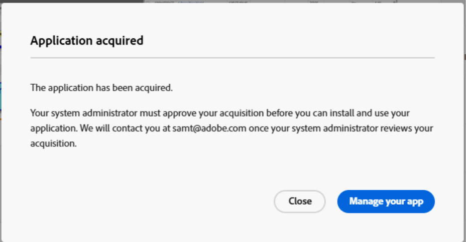
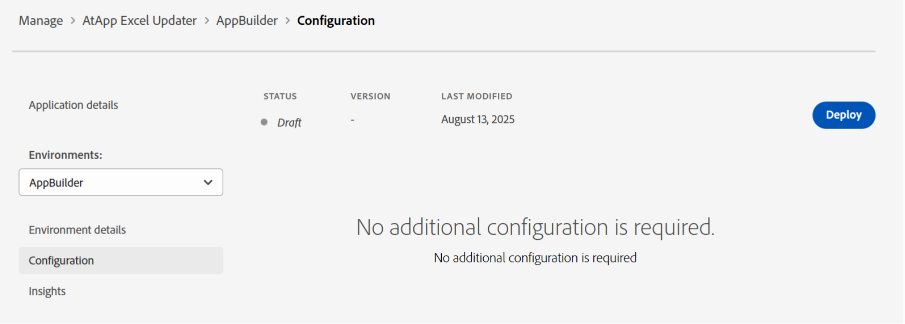

# Abrufen und Installieren von Apps aus Adobe Exchange

Sie können jetzt von Partnern erstellte Apps für Workfront direkt von Adobe Exchange aus installieren. Diese Funktion verbindet Kunden mit einem wachsenden Ökosystem von Adobe-Partnern, die maßgeschneiderte Tools bereitstellen, die die Produktivität verbessern, den Betrieb optimieren und die Workfront-Funktionalität erweitern. Über Adobe Exchange können Kunden Apps entdecken und installieren, die sich mithilfe von Benutzeroberflächenerweiterungen nahtlos in Workfront integrieren lassen.

Adobe Exchange ist der zentrale Marktplatz für Anwendungen, Erweiterungen und Integrationen von Drittanbietern in Adobe Experience Cloud, einschließlich Adobe Workfront. Für Workfront-Kunden ist dies das erste Ziel, um Apps zu entdecken und zu installieren, die die Funktionalität verbessern, Workflows optimieren und mit externen Systemen integrieren.

## Adobe Partner-Apps

Das Workfront Partner Network ist ein wachsendes Ökosystem von Technologiepartnern - unabhängigen Softwareanbietern (ISVs), die skalierbare, sichere und erweiterbare Apps mit Adobe App Builder und Workfront-Benutzeroberflächenerweiterungen erstellen.

Workfront-Partner nutzen Workfront UI Extensions, ein leistungsstarkes Framework, mit dem Apps direkt in die Workfront-Oberfläche eingebettet werden können. Nach der Installation von Adobe Exchange können Workfront-Administratoren diese Apps zu Layout-Vorlagen hinzufügen, sodass sie für Benutzende in ihren täglichen Workflows sichtbar und zugänglich sind. Durch diese nahtlose Integration wird sichergestellt, dass Anwender mit von Partnern erstellten Tools wie Dashboards, Validierungs-Flüssen oder Kampagnen-Trackern interagieren können, ohne die Workfront-Umgebung verlassen zu müssen.

### atApp

#### Echtzeit-Ergebnisse direkt in Adobe Workfront

Wir arbeiten mit Adobe Workfront-Kunden zusammen, um alltägliche Engpässe in wiederholbare Lösungen mit vorhersehbaren Ergebnissen zu verwandeln. Unsere wachsende Bibliothek an Lösungen unterstützt Sie dabei, Genauigkeit, Geschwindigkeit und Verantwortlichkeit mithilfe von Live-Daten von dort aus zu steigern, wo Menschen arbeiten. Man kann Führungspersönlichkeiten helfen, zu erkennen, was gerade passiert, und zu planen, was als Nächstes passieren soll. Erkunden Sie die derzeit verfügbaren und installierbaren AtAppStore Adobe Exchange-Apps, wählen Sie dann die Apps aus, die Ihren aktuellen Prioritäten entsprechen, und skalieren Sie dann entsprechend Ihren wachsenden Anforderungen.

* [Excel Updater](https://exchange.adobe.com/apps/ec/abtt1rq7o9/atapp-excel-updater): Excel Updater bietet Ihnen einen kostengünstigen Weg, um Daten in Workfront zu integrieren, ohne die API erlernen, Code schreiben oder einen Server einrichten zu müssen, und ist sowohl für einmaliges als auch wiederkehrendes Laden von Daten ideal.

* [Neuberechnungshelfer](https://exchange.adobe.com/apps/ec/abv755903t/atapp-recalc-helper): Die Neuberechnungshelferlösung bietet Ihnen eine schnelle Möglichkeit, die berechneten Ausdrücke, Projektzeitleisten oder Projektfinanzen für benutzerdefinierte Formulare für alle Elemente, die mit einem ausgewählten Filter übereinstimmen, einfach innerhalb von Workfront neu zu berechnen.

* UberTimesheet: Die UberTimesheet-Lösung kann die Akzeptanz von Workfront durch Ihre Benutzer verbessern und erweitern, indem sie es einfach und bequem für jeden macht, die Zeit im Nachhinein über den Browser, das Tablet oder das Smartphone zu verfolgen.

### WorkFocus

Workfocus bietet fortschrittliche Automatisierungs- und Integrationslösungen für Workfront. Ihre Apps konzentrieren sich auf:

* Optimierung von Timelines

* Automatisieren von Fusion-Workflows

* Aktivieren der instanzenübergreifenden Zusammenarbeit

Workfocus-Apps sind für den nativen Betrieb innerhalb von Workfront konzipiert und nutzen Benutzeroberflächenerweiterungen, um Benutzern leistungsstarke Tools zur Produktivitätssteigerung und zur Verringerung des manuellen Aufwands bereitzustellen.

## Voraussetzungen und Berechtigungen

**App Builder-Bereitstellung**

* Kunden müssen App Builder in ihrer Adobe Admin Console bereitgestellt haben. Dies ist eine Voraussetzung für die Installation von Apps über Adobe Exchange.

**Organisationsadministratoren oder -entwickler**

* Kann nach Apps suchen, auf **GET** klicken und mit der Installation fortfahren.

* Wenn die App bereits von einer Person in der Organisation erworben wurde, wird möglicherweise stattdessen **Installation starten** oder **Verwalten** angezeigt.

**Benutzer ohne Administratorrechte**

* Kann die Akquise starten, wird aber zur Anmeldung aufgefordert und kann Einschränkungen unterliegen, wenn für die App das Einverständnis des Administrators oder eine spezielle Lizenzierung erforderlich ist.

## Abrufen und Installieren von Apps aus Adobe Exchange

Adobe-Kunden können Apps direkt über den Adobe Exchange Marketplace durchsuchen, durchsuchen und installieren, um sie in Workfront zu verwenden.

Apps, die mit Adobe App Builder erstellt wurden, werden in Adobe Exchange als _App Builder_ Programme aufgeführt. Jede App-Liste enthält Dokumentation, Screenshots und Nutzungsanweisungen, die Kunden dabei helfen, den Wert der App zu verstehen.

Um Apps für Workfront anzuzeigen, navigieren Sie zu Adobe Exchange und suchen Sie nach Workfront-kompatiblen Apps. Sie können auch Listeneinträge für Workfront App Builder-Apps filtern:

1. Klicken Sie im linken **auf** Experience Cloud.
1. Suchen Sie im linken Bedienfeld nach **Produkt** und wählen Sie dann **Workfront**.
1. Erweitern Sie **App Type** und wählen Sie **App Builder**.

### Apps erwerben

Apps erfordern möglicherweise den Kauf von Adobe Exchange oder erlauben die Installation, erfordern jedoch eine Lizenzierung durch den App-Entwickler.

So erwerben Sie eine App

1. Klicken Sie auf den Namen der App.
1. Klicken Sie auf die Schaltfläche in der oberen rechten Ecke der App-Liste.
1. Klicken Sie auf **Ja,**, und akzeptieren Sie dann die Endbenutzer-Lizenzvereinbarung.
   

### Aktionen für Systemadministratoren

Wenn ein(e) Benutzende(r) eine App von Adobe Exchange erhält, wird möglicherweise die folgende Meldung angezeigt: _Ihr Systemadministrator muss Ihre Akquise genehmigen, bevor Sie Ihre Anwendung installieren und verwenden können._

Das bedeutet, dass die App eine Genehmigung auf Administratorebene erfordert, bevor die Installation fortgesetzt werden kann. Systemadministratoren können die Anfrage aus den folgenden Bereichen finden:

**Benachrichtigungen**

Systemadministratoren werden in der Regel per E-Mail benachrichtigt, wenn ein Benutzer in ihrer Organisation eine App erwirbt.

**Admin Console**

Systemadministratoren können sich unter [https://adminconsole.adobe.com/](https://adminconsole.adobe.com/) bei der Admin Console anmelden und zu Produkte > App-Integrationen navigieren, um alle erworbenen oder angeforderten Apps anzuzeigen.

Sobald ein Systemadministrator Zugriff auf die Anfragen hat, kann er den Antrag überprüfen und genehmigen. Einige Apps fordern den Administrator möglicherweise auf, dem Datenzugriff zuzustimmen und die App Produktprofilen oder bestimmten Benutzern zuzuweisen.

Nach der Genehmigung wird die App zur Installation verfügbar.

## Installieren von Apps

Sobald eine App erworben wurde, kann sie direkt in Workfront installiert werden. Admins können installierte Apps über die Workfront-Benutzeroberfläche verwalten, um sicherzustellen, dass sie ordnungsgemäß konfiguriert und für Benutzende zugänglich sind.

1. Suchen Sie die App, die Sie installieren möchten, und öffnen Sie das Menü Aktionen auf der rechten Seite des Bildschirms.
1. Klicken Sie auf App-Details anzeigen.
1. Wählen Sie auf der linken Seite des Bildschirms eine Umgebung aus oder fügen Sie eine neue hinzu.
1. Klicken Sie **Bereitstellen**.
   
1. Weisen Sie Installations- oder Verwendungsrechte zu (falls erforderlich).

   Wenn Ihr Unternehmen den App-Zugriff über Produktprofile oder Benutzergruppen steuert, weisen Sie die App dem entsprechenden Profil oder der entsprechenden Gruppe zu, damit Benutzer mit der Installation und Verwendung fortfahren können.

## Zu Layoutvorlage hinzufügen

Nach der Bereitstellung ist die Partner-App in der Workfront-Layout-Vorlage verfügbar. Sie können die App zur primären oder sekundären Navigation hinzufügen, um sie in Workfront zu verwenden.

Um die App zur Layout-Vorlage hinzuzufügen, öffnen Sie die Layout-Vorlage und navigieren Sie zum Hauptmenü oder zum sekundären Menübereich. Fügen Sie die App mithilfe des Symbols Hinzufügen hinzu.

## App-Support kontaktieren

Von Adobe Exchange installierte Erweiterungen werden von den App-Inhabern unterstützt. Unter „Programme verwalten“ können Sie auf **Support anfordern** klicken, um Hilfe zu allen Problemen zu erhalten.