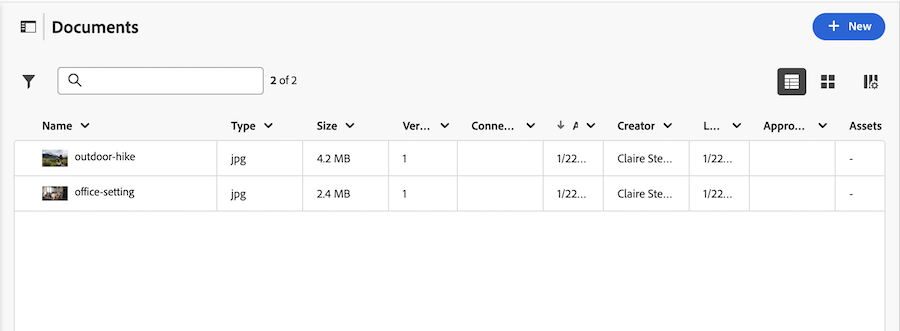

# Hinzufügen von Dokumenten zu Adobe Workfront aus Ihrem Dateisystem

Workfront verfügt derzeit über zwei Versionen des Dokumentbereichs: den alten Dokumentbereich und den neuen Dokumentbereich. Welche Version Ihr Unternehmen verwendet, hängt davon ab, ob sich Ihr Unternehmen auf ältere Workfront-Speicher oder Unternehmensspeicher stützt. Weitere Informationen zu diesen Speichertypen finden Sie unter [Übersicht über Adobe Enterprise-Speicher](/help/quicksilver/review-and-approve-work/esm-overview.md).

Das Hinzufügen von Dokumenten zu Workfront unterscheidet sich je nachdem, welche Version des Dokumentbereichs Ihr Unternehmen verwendet.

* [Hinzufügen von Dokumenten zu aus Ihrem Dateisystem im Bereich für veraltete Dokumente](#add-documents-from-your-file-system-in-the-legacy-documents-area)
* [Hinzufügen von Dokumenten zu Workfront im Bereich „Neue Dokumente“](#add-documents-to-workfront-in-the-new-documents-area)

## Zugriffsanforderungen

+++ Erweitern, um die Zugriffsanforderungen für die in diesem Artikel beschriebene Funktionalität anzuzeigen.

<table style="table-layout:auto"> 
 <col> 
 <col> 
 <tbody> 
  <tr> 
   <td role="rowheader">Adobe Workfront-Paket</td> 
   <td> 
 Beliebig
 </td> 
  </tr> 
  <tr> 
   <td role="rowheader">Adobe Workfront-Lizenzen*</td> 
   <td> 
   
Mitwirkende oder höher
 
   
Anfragende oder höher
 </td> 
  </tr> 
  <tr> 
   <td role="rowheader">Konfigurationen der Zugriffsebene</td> 
   <td> 
Legacy Workfront-Speicher: Zugriff auf Dokumente bearbeiten
 
   
Unternehmensspeicher: Der Bearbeitungszugriff auf Dokumente ist standardmäßig aktiviert und kann nicht geändert werden

   </td> 
  </tr> 
 </tbody> 
</table>

Weitere Informationen finden Sie unter [Zugriffsanforderungen](/help/quicksilver/administration-and-setup/add-users/access-levels-and-object-permissions/access-level-requirements-in-documentation.md) in der Dokumentation zu Workfront.

+++

## Hinzufügen von Dokumenten aus Ihrem Dateisystem im Bereich für veraltete Dokumente

Wenn sich Ihr Unternehmen im alten Workfront-Speicher befindet, wird der Bereich für ältere Dokumente angezeigt, wenn Sie auf Dokumente in Workfront zugreifen. Weitere Informationen zu Workfront Storage finden Sie unter [Unterschiede zwischen Adobe Enterprise Storage und Legacy Workfront Storage](/help/quicksilver/review-and-approve-work/esm-overview.md#differences-between-adobe-enterprise-storage-and-legacy-workfront-storage).

Sie können in Adobe Workfront Dokumente zu Projekten, Aufgaben oder Problemen in den folgenden Bereichen hinzufügen:

* Der Bereich für globale Dokumente
* Der Bereich Dokumente für ein Workfront-Objekt
* Eine verbundene Karte auf einer Workfront-Karte

Sie können auch neue Versionen von Dokumenten hochladen und Links zu Dokumenten von Cloud-Drittanbietern wie Google Drive, Dropbox und Microsoft OneDrive hinzufügen. Informationen zum Hinzufügen neuer Versionen von Dokumenten finden Sie unter [Hochladen einer neuen Version eines Dokuments](../../documents/managing-documents/upload-new-document-version.md). Informationen zum Hinzufügen von Dokumenten von Cloud-Anbietern von Drittanbietern finden Sie unter [Verknüpfen von Dokumenten aus externen Programmen](../../documents/adding-documents-to-workfront/link-documents-from-external-apps.md).

Es gibt keine Einschränkungen hinsichtlich der Dateitypen und -größen, die Sie in Workfront hochladen können. Um jedoch erfolgreich zu sein, muss der Upload innerhalb von fünf Minuten abgeschlossen sein und Sie müssen über ausreichend Speicherplatz verfügen.

Informationen zum Hochladen neuer Versionen eines Dokuments in Workfront finden Sie unter [Hochladen einer neuen Version eines Dokuments](../../documents/managing-documents/upload-new-document-version.md).

### Hinzufügen von Dokumenten zu Workfront im Bereich für veraltete Dokumente

Sie können Workfront neue Dokumente aus dem Dateisystem auf Ihrer Workstation hinzufügen. Sie können auch Dokumente von Drittanbieterprogrammen wie Google Drive und SharePoint verknüpfen.

>[!IMPORTANT]
>
>* Sie können bis zu 150 Dokumente gleichzeitig hochladen.
>* Die Dateigröße ist nicht beschränkt.
>* Dokument-Downloads sind auf 4 GB beschränkt.

Hinzufügen eines Dokuments:

1. Navigieren Sie zum Projekt, zur Aufgabe oder zum Problem, dem bzw. dem Sie ein neues Dokument hinzufügen möchten.
1. Klicken Sie auf **Registerkarte** Dokumente“ und dann auf das **Neu hinzufügen** Dropdown-Menü.

   

1. Führen Sie je nach dem hinzuzufügenden Dokumenttyp einen der folgenden Schritte aus:

   <table style="table-layout:auto"> 
    <col> 
    <col> 
    <tbody> 
     <tr> 
      <td role="rowheader">Hochladen von Dokumenten aus Ihrem Dateisystem auf Ihre Workstation</td> 
      <td> 
       <ol> 
        <li value="1">Wählen Sie <strong> Dropdown-Menü </strong>Neu hinzufügen“ <strong>Dokument.</strong></li> 
        <li value="2"> 
Navigieren Sie zu dem Dokument, das Sie aus dem Dateisystem auf Ihrer Workstation hinzufügen möchten, und wählen Sie es aus. 
 
Sie können mehrere Dokumente auswählen, indem Sie die Umschalttaste gedrückt halten, während Sie zusätzliche Dateien auswählen.
 </li> 
        <li value="3">Klicken Sie auf <strong>Öffnen</strong>.</li> 
       </ol> 
       
<b>HINWEIS</b>: Sie können Dateien auch direkt aus Ihrem Datei-Manager per Drag-and-Drop in die Dokumentliste ziehen.</td> 
     </tr> 
     <tr> 
      <td role="rowheader">Hochladen von Dokumenten aus einer Drittanbieteranwendung wie Google Drive oder SharePoint</td> 
      <td> 
       <ol> 
        <li value="1"> 
Wählen Sie <strong> Dropdown-Menü </strong>Neu hinzufügen“ die Option <strong>Von &lt;Name_der_Drittanbieteranwendung&gt;</strong> aus.
 
Um beispielsweise ein Dokument von Google Drive hochzuladen, klicken Sie auf <strong>Von Google Drive</strong>.
 </li> 
        <li value="2"> 
Befolgen Sie die Anweisungen, um das Dokument im Drittanbieterprogramm auszuwählen. 
 
Weitere Informationen zu verknüpften Dokumenten finden Sie unter <a href="../../documents/adding-documents-to-workfront/link-documents-from-external-apps.md" class="MCXref xref">Verknüpfen von Dokumenten aus externen Anwendungen</a>.
 </li> 
       </ol> </td> 
     </tr> 
     <tr> 
      <td role="rowheader">Dokument von einem anderen Workfront-Benutzer anfordern</td> 
      <td> 
       <ol> 
        <li value="1">Wählen Sie <strong> Dropdown-Menü </strong>Neu hinzufügen“ die Option <strong>Dokument anfordern</strong>.</li> 
        <li value="2">Geben <strong> in das Feld „Von wem wird </strong> angefordert?“ den Namen des Benutzers ein, von dem aus Sie das Dokument anfordern.</li> 
        <li value="3">Geben <strong> in das Feld „Geben Sie an, was Sie </strong> möchten“ den Namen des Dokuments ein.</li> 
        <li value="4"> 
Klicken Sie <strong>Anfrage senden</strong>.
 
Ihre Anfrage wird auf der Registerkarte Dokumente angezeigt.
 
Weitere Informationen zum Anfordern von Dokumenten finden Sie unter <a href="../../documents/adding-documents-to-workfront/request-a-document.md" class="MCXref xref">Dokument anfordern</a>.
 </li> 
       </ol> </td> 
     </tr> 
    </tbody> 
   </table>

## Hinzufügen von Dokumenten zu Workfront im Bereich „Neue Dokumente“

Sie können mit dem Enterprise-Speichermodell Dokumente zu Projekten, Aufgaben oder Problemen hinzufügen. Weitere Informationen zu Massenspeicher für Unternehmen finden Sie unter [Übersicht über Speicher für Unternehmen in Adobe](/help/quicksilver/review-and-approve-work/esm-overview.md).

Die Funktion wird derzeit im Bereich „Neue Dokumente“ nicht unterstützt:

* Hochladen von Dokumenten in den Bereich für globale Dokumente
* Hinzufügen von Links zu Dokumenten von Cloud-Anbietern von Drittanbietern wie Google Drive, Dropbox und Microsoft OneDrive
* Dokumente werden angefordert
* Kopieren eines Links in einen Ordner
* Dokumente auschecken
* Einfügen von Bildern aus der Zwischenablage
* Hinzufügen intelligenter Ordner

### Hinzufügen von Dokumenten zu Workfront im Bereich „Neue Dokumente“

Wenn Ihr Unternehmen Enterprise-Speicher verwendet, wird der Bereich „Neue Dokumente“ angezeigt, wenn Sie auf Dokumente in Workfront zugreifen. Weitere Informationen zu Massenspeicher für Unternehmen finden Sie unter [Übersicht über Speicher für Unternehmen in Adobe](/help/quicksilver/review-and-approve-work/esm-overview.md).

<!--
>[!IMPORTANT]
>
>* You can upload up to 150 documents at one time.
>* There is no limit on the file size. 
>* Document downloads are limited to 4GB.
-->

Hinzufügen eines Dokuments:

1. Navigieren Sie zum Projekt, zur Aufgabe oder zum Problem, dem bzw. dem Sie ein neues Dokument hinzufügen möchten.
1. Klicken Sie auf **Dokumente** im linken Bereich.
1. Klicken Sie **Neu** auf der rechten Seite der Seite oder ziehen Sie die Datei per Drag-and-Drop in den angezeigten Ablagebereich. Sie können mehrere Dokumente gleichzeitig hinzufügen.

   

Informationen zum Hochladen neuer Versionen eines Dokuments in Workfront finden Sie unter [Hochladen einer neuen Version eines Dokuments](../../documents/managing-documents/upload-new-document-version.md).

## Dokumentensicherheit für Unternehmensspeicher

Workfront verhindert wie folgt, dass Viren und andere schädliche Inhalte über Dokumente auf die Website gelangen:

**So erkennt Workfront beschädigte Dateien**

Das Scannen von Dokumenten wird automatisch für Objekte aktiviert, die das Unternehmensspeichermodell verwenden.

Alle Dateien mit weniger als 500 MB werden beim Hochladen gescannt. Dateien über 500 MB werden nicht gescannt. Wenn Workfront ein beschädigtes Dokument erkennt, wird es automatisch entfernt.

**Dateinamenbeschränkungen**

Da diese Integration mit Adobe Enterprise Storage erstellt wird, müssen beim Verwalten von Projekten und Dokumenten einige erzwungene Struktur- und Benennungskonventionen beachtet werden.

* Objektnamen müssen eindeutig sein und können nicht dupliziert werden
* Der Adobe Enterprise-Speicher erfordert eindeutige Namen für Peer-Objekte mit demselben übergeordneten Element in der Hierarchiestruktur
* Dokumente können nicht denselben Namen haben, wenn sie zum selben Projekt gehören
* Dokumentnamen dürfen keines der folgenden Sonderzeichen enthalten: `\ / : * ? " | < >`
* Dokumentnamen sind auf maximal 255 Zeichen beschränkt

Unter Berücksichtigung dieser Einschränkungen benennt Workfront Objekte oder Dokumente automatisch nach Bedarf um, um Konflikte zu vermeiden.

## Dokumentensicherheit für alten Workfront-Speicher

Workfront Site verhindert auf folgende Weise, dass Viren und andere schädliche Inhalte über Dokumente auf die Site gelangen:

**So erkennt Workfront beschädigte Dateien**

Die Dokumentüberprüfung ist für Ihr Unternehmen nur auf Anfrage aktiviert.

Wenn die Dokumentüberprüfung aktiviert ist, werden Dateien mit einer Größe von unter 25 MB beim Hochladen überprüft. Dateien über 25 MB werden nicht gescannt.

Wenn Workfront ein beschädigtes Dokument entdeckt, wird eine Meldung angezeigt, die angibt, dass die Datei beschädigt ist. Sie erhalten auch eine E-Mail-Benachrichtigung, wenn Workfront potenziell schadhaften Inhalt entdeckt und die Datei entfernt werden soll.

Beschädigte Dateien werden innerhalb von 24 Stunden nach Erkennung entfernt, es sei denn, Sie entfernen sie manuell. Wenn Sie eine beschädigte Datei löschen, verfolgt Workfront diese Aktion als Aktualisierung. Wenn Sie Workfront erlauben, es zu entfernen, werden keine Aktualisierungen aufgezeichnet.

**Dateinamenbeschränkungen**

Dateien, die in Workfront hochgeladen werden, dürfen bestimmte Zeichen in Dateinamen nicht enthalten. Wenn eine Datei eines der folgenden Zeichen im Dateinamen enthält, werden die Zeichen beim Hochladen der Datei aus dem Dateinamen entfernt: `! # % * \ | ' " / ? < > { } [ ]`.
