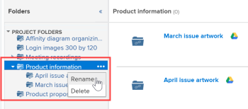

# Verknüpfen von Dokumenten aus externen Anwendungen

<!-- Audited: 01/2024 -->

Sie können Dokumente und Ordner aus den folgenden Quellen mit Adobe Workfront verknüpfen:

<table style="table-layout:auto"> 
 <col> 
 <col> 
 <tbody> 
  <tr> 
   <td role="rowheader">Bestehende Cloud-Dokumentanbieter</td> 
   <td>Dazu gehören die folgenden: 
    <ul> 
     <li>Feld</li> 
     <li>Dropbox</li> 
     <li>Dropbox Business</li> 
     <li>WebDAM</li> 
     <li>Microsoft OneDrive</li> 
     <li>Microsoft SharePoint</li> 
     <li>Google Drive</li> 
     <li>Quip</li>
    </ul></td> 
  </tr> 
  <tr> 
   <td role="rowheader">Workfront-Korrekturabzug </td> 
   <td>Sie können Korrekturabzüge, die ursprünglich in Workfront Proof erstellt wurden, in Workfront verfügbar machen.</td> 
  </tr> 
  <tr data-mc-conditions="QuicksilverOrClassic.Quicksilver"> 
   <td role="rowheader">Experience Manager Assets Essentials </td> 
   <td>Sie können von Experience Manager Assets Essentials aus Dokumente mit Workfront verknüpfen. Weitere Informationen finden Sie unter <a href="../../documents/adobe-workfront-for-experience-manager-assets-essentials/workfront-for-aem-asset-essentials.md" class="MCXref xref"> von Adobe Workfront für Experience Manager Assets Essentials</a>.</td> 
  </tr>

<tr> 
   <td role="rowheader">Andere Dokumentenanbieter (über benutzerdefinierte Dokumentenintegrationen)</td> 
   <td> 
Diese Integrationen können im Bereich Setup konfiguriert werden.
 </td>
  </tr> 
 </tbody> 
</table>

Bevor Sie Dokumente oder Ordner verknüpfen, muss Ihr Workfront-Administrator diese Funktion für jeden Dokumentanbieter oder für eine benutzerdefinierte Dokumentintegration aktivieren, wie in [Konfigurieren von Dokumentintegrationen](../../administration-and-setup/configure-integrations/configure-document-integrations.md) beschrieben.

Dokumente, die mit einem externen Cloud-Anbieter verknüpft sind, können auf die gleiche Weise geprüft und genehmigt werden wie Dokumente, die direkt in Workfront hochgeladen werden.

>[!NOTE]
>
>Diese Funktion ist im Bereich Neue Dokumente nicht verfügbar. 
>Wenn Ihr Unternehmen Enterprise-Speicher verwendet, wird der Bereich „Neue Dokumente“ angezeigt, wenn Sie auf Dokumente in Workfront zugreifen. Weitere Informationen zu Massenspeicher für Unternehmen finden Sie unter [Übersicht über Speicher für Unternehmen in Adobe](/help/quicksilver/review-and-approve-work/esm-overview.md).

## Zugriffsanforderungen

+++ Erweitern, um die Zugriffsanforderungen für die in diesem Artikel beschriebene Funktionalität anzuzeigen.

<table style="table-layout:auto"> 
 <col> 
 <col> 
 <tbody> 
  <tr> 
   <td role="rowheader">Adobe Workfront-Paket</td>
   <td> 
Beliebig
 </td>
  </tr> 
  <tr> 
   <td role="rowheader">Adobe Workfront-Lizenz</td>
   <td>
Mitwirkende oder höher

    
Anfragende oder höher
 </td>
  </tr> 
  <tr> 
   <td role="rowheader">Konfigurationen der Zugriffsebene</td> 
   <td> 
Zugriffrecht „Bearbeiten“ für Dokumente
 </td> 
  </tr> 
 </tbody> 
</table>

Weitere Informationen finden Sie unter [Zugriffsanforderungen](/help/quicksilver/administration-and-setup/add-users/access-levels-and-object-permissions/access-level-requirements-in-documentation.md) in der Dokumentation zu Workfront.

+++

## Dokumentenspeicher

Dokumente, die über eine externe Anwendung mit Workfront verknüpft sind, werden beim externen Cloud-Anbieter und nicht in Workfront gespeichert.

Es gelten die folgenden Ausnahmen:

* Wenn vom Dokumenten-Service bereitgestellt, können Miniaturansichten und Vorschaubilder auf Workfront-Servern gespeichert werden.
* Wenn Sie Proofing in Workfront verwenden, wird das Dokument kopiert und zu den Proofing-Servern hinzugefügt.

## Dateigrößenbeschränkungen

Cloud-Drittanbieter:

* Einzeldatei: 5 GB oder weniger
* Mehrere Dateien: 1 GB oder weniger (insgesamt alle Dateien)

## Verknüpfen eines Dokuments aus einer externen Anwendung mit Workfront

Sie können vorhandene Dokumente mit einem externen Cloud-Anbieter verknüpfen. This includes any shared documents.

### Voraussetzungen {#prerequisites}

Bevor Sie Dokumente oder Ordner verknüpfen, muss Ihr Workfront-Administrator diese Funktion für jeden Dokumentanbieter oder für eine benutzerdefinierte Dokumentintegration aktivieren, wie in [Konfigurieren von Dokumentintegrationen](../../administration-and-setup/configure-integrations/configure-document-integrations.md) beschrieben.

### Link an external document to Workfront {#link-an-external-document-to-workfront}

You can link documents to Workfront from an external application such as Google and Microsoft OneDrive.

>[!IMPORTANT]
>
>Dropbox stores documents based on the file path. Because of this, if a file linked from Dropbox is moved, renamed, or deleted, it becomes inaccessible in Workfront.

1. Go to the **Documents** area in Workfront where you want the document.
1. Click **Add New**, then click the external document provider where you want to link documents to Workfront.

   For example, to link documents from Dropbox, click **From Dropbox**.

   External providers that you have already authorized appear at the top of the list.

1. (Conditional) If you are prompted to log into the external service, type your login credentials for the service in the box that appears, then click **Sign in**.
1. (Conditional) If you are prompted to authorize the external application, click the **Authorize** button.

   You need to do this only once.

1. In the search box of the **Link External Files and Folders** box that appears, type the name of the item you want to search for, then press **Enter** to see all results from the external application, regardless of which folder they are storied in.

   ODER

   Browse to and select the documents you want to link.

   Though you can select multiple documents, only documents that are selected in the current view are linked. For example, if you select a document, then go into a folder, the document you originally selected is not linked.

1. (Conditional) If you are a Workfront DAM customer, click the **Thumbnail** icon to display files as thumbnail images.

   >[!NOTE]
   >
   >Workfront DAM customers can view thumbnails when linking documents from Workfront DAM. Thumbnails might also be displayed for Workfront DAM customers for other services such as Dropbox and Box. However, viewing thumbnails for services other than Workfront DAM within Workfront is not supported, and thumbnails are never displayed when linking documents from SharePoint or Google Drive.

1. Click **Link**.

   In Workfront, the cloud provider&#39;s icon appears next to the documents.

   >[!NOTE]
   >
   >* If the download URL that is used to link the document exceeds 2048 characters, the file cannot link.
   >* For documents that are linked to Box, the link to the document in Box does not display until you refresh the page.

### Hinzufügen einer neuen Version eines verknüpften Dokuments {#add-a-new-version-of-a-linked-document}

Sie können eine neue Version eines Dokuments hinzufügen, das über eine externe Anwendung mit Workfront verknüpft ist.

1. Wechseln Sie zum Bereich **Dokumente**, in dem das Dokument verknüpft ist, und wählen Sie dann das verknüpfte Dokument aus.

   >[!IMPORTANT]
   >
   >Das Dokument muss sich außerhalb eines verknüpften Ordners befinden, um eine neue Version zu erstellen.

1. Klicken Sie **Neu hinzufügen** > **Version** und klicken Sie dann auf den externen Dokumentanbieter.

   Um beispielsweise eine neue Version eines Dokuments aus Dropbox zu verknüpfen, klicken Sie auf **Aus Dropbox**.

   Externe Anbieter, die Sie bereits autorisiert haben, werden oben in der Liste angezeigt.

1. (Bedingt) Wenn Sie aufgefordert werden, sich beim externen Dienst anzumelden, geben Sie Ihre Anmeldedaten für den Dienst in das Feld ein, das angezeigt wird. Klicken Sie dann **Anmelden**.
1. (Bedingt) Wenn Sie aufgefordert werden, die externe Anwendung zu autorisieren, klicken Sie auf **Autorisieren**.

   Du musst das nur einmal machen.

1. Geben Sie in das Suchfeld des Feldes **Verknüpfen externer Dateien und Ordner** den Namen des Elements ein, nach dem Sie suchen möchten, und drücken Sie dann die **Eingabetaste**, um alle Ergebnisse aus der externen Anwendung anzuzeigen, unabhängig davon, in welchem Ordner sie gespeichert sind.

   ODER

   Navigieren Sie zu den Dokumenten, die Sie verknüpfen möchten, und wählen Sie sie aus.

   Sie können mehrere Dokumente auswählen. Es werden jedoch nur die Dokumente verknüpft, die in der aktuellen Ansicht ausgewählt sind. Wenn Sie beispielsweise ein Dokument auswählen und dann in einen Ordner wechseln, ist das ursprünglich ausgewählte Dokument nicht verknüpft.

1. (Bedingt) Wenn Sie Workfront DAM-Kunde sind, klicken Sie auf das Symbol **Miniatur**, um Dateien als Miniaturbilder anzuzeigen.

   >[!NOTE]
   >
   >Workfront DAM-Kunden können beim Verknüpfen von Dokumenten aus Workfront DAM Miniaturansichten anzeigen. Miniaturansichten können auch für Workfront DAM-Kunden für andere Services wie Dropbox und Box angezeigt werden. Das Anzeigen von Miniaturen für andere Services als Workfront DAM innerhalb von Workfront wird jedoch nicht unterstützt, und Miniaturen werden beim Verknüpfen von Dokumenten über SharePoint oder Google Drive nie angezeigt.

1. Klicken Sie auf **Link**.

   In Workfront wird das Symbol des Cloud-Anbieters neben den Dokumenten angezeigt, was darauf hinweist, dass sie mit dem externen Cloud-Anbieter verknüpft sind.

   >[!NOTE]
   >
   >Bei Dokumenten, die mit dem Feld verknüpft sind, wird der Link zum Dokument im Feld erst angezeigt, wenn Sie die Seite aktualisieren.

Informationen zum Hinzufügen einer neuen Version eines Dokuments, das Sie von Ihrem Dateisystem in Workfront hochgeladen haben, finden Sie unter [Hinzufügen von Dokumenten zu Adobe Workfront](../../documents/adding-documents-to-workfront/add-documents-from-file-system.md#add-documents-to-workfront) in [Hinzufügen von Dokumenten zu Adobe Workfront von Ihrem Dateisystem](../../documents/adding-documents-to-workfront/add-documents-from-file-system.md).

### Workfront Proof-Dokumente verknüpfen {#link-workfront-proof-documents}

Sie können Testsendungen mit Workfront verknüpfen, das ursprünglich in Workfront Proof existierte. Wenn Sie einen Korrekturabzug über Workfront Proof verknüpfen, sind alle Kommentare und anderen mit dem Korrekturabzug verknüpften Metadaten in Workfront verfügbar.

You can link only those proofs for which you have View access in Workfront Proof.

1. Go to the **Documents** area in Workfront where you want the document.
1. Click **Add New**, then click **From Workfront Proof**.

   >[!NOTE]
   >
   >The options in this menu may vary depending on what third party providers are configured in your environment.

1. In the **Link proofs from Workfront Proof** box that appears, begin typing the name of the proof you want to make available in Workfront.

   The list is filtered as you type.

1. Select up to 10 proofs to link.

   Any proof name that is dimmed is not available to link, because the proof is already associated with a document in Workfront.

1. Klicken Sie auf **Link**.

   The most current version of the proof is linked to Workfront. When you open the proof, all versions are available in the proofing viewer.

### Create a Google document from within Workfront {#create-a-google-document-from-within-workfront}

You can create a new Google document from within Workfront. You cannot create new documents from within Workfront for other cloud providers.

1. Go to the **Documents** area in Workfront where you want the document.
1. Click **Add New** > **Google File**, then select the type of Google document you want to create.
1. If the **Add Google Drive Account** box appears, click **Authorize Google Drive**.

   A Google document is added to the **Documents** tab.

   >[!NOTE]
   >
   > My Drive and Shared with Me display two different results. If you are unable to locate a file in My Drive, check in the Shared with Me folder.

## Upload and link a document from Workfront to an external cloud provider

You can upload and link a document from Workfront to an external cloud provider. This moves storage of the document from Workfront to the external cloud provider. When the document is changed in the external application, it updates automatically in Workfront.

>[!NOTE]
>
>Sending an asset to an external document provider creates a new version of the asset.

Users without Workfront access can see the document in the external application if they have access to the application.

1. Select a document that is uploaded in Workfront.
1. Click **More** >**Send to**, then select the cloud provider that you want to store the linked document.

   You can also use the More menu  on the Document Details page to do this.

1. Select the folder in the provider&#39;s application where you want to store the document.

   This can be any folder in the provider&#39;s application, including a shared folder.

1. Klicken Sie auf **Speichern**.

   The external provider&#39;s logo appears next to the document name to indicate that the document is now linked to Workfront and stored by the external cloud provider.

   

## Link folders

When you link a folder between Workfront and an external cloud provider, the folder and all of its contents are linked. If users without Workfront access add, remove, and modify files from the external document application, their changes are synchronized to Workfront.

### Folder access rights {#folder-access-rights}

When synchronizing folder content from an external document application, Workfront uses the credentials of the user who originally linked the folder. This results in the following user experience:

* If users do not have access to view files and folders in the external application, but do have access to view the linked folder via Workfront, they can view only the names of the files and folders in Workfront, not their contents.
* When someone accesses content inside a linked folder in Workfront (such as a subfolder in a linked folder) that was linked to Workfront by another user, the content synchronizes to Workfront using the Workfront login credentials of the user who originally linked the folder, not the credentials of the user accessing the content.

>[!IMPORTANT]
>
>* If the user who originally linked the folder is removed from the Workfront system, users are no longer able to access content on the linked folder via Workfront. In this case, the folder must be relinked by an active Workfront user who has rights to the folder in the external application.
>* If the user who linked a folder no longer has access to the external application, Workfront can no longer access the contents of the folder. This may happen, for example, if the user who originally linked the folder leaves the company. To ensure continued access, a user with access to the folder must re-link the folder.

### Link one or more external folders {#link-one-or-more-external-folders}

1. Go to the area in Workfront where you want the folder, then click  **Documents**  in the left panel .

1. Click **Add New**, then click the external document provider from which you want to link a folder to Workfront.
1. (Conditional) If you have not yet authorized the external service, specify your login credentials for the external provider, then click **Sign in**.

   Externe Anbieter, die Sie bereits autorisiert haben, werden oben in der Liste angezeigt.

1. Im **Verknüpfen externer Dateien und Ordner** werden die Ordner angezeigt, die Sie verknüpfen möchten.

   ODER

   Geben Sie den Namen des Ordners ein, nach dem Sie suchen möchten, und drücken Sie dann die **Eingabetaste**.

   Sie können mehrere Ordner auswählen. Es werden jedoch nur die Ordner verknüpft, die in der aktuellen Ansicht ausgewählt sind. Wenn Sie beispielsweise einen Ordner auswählen und dann zu einem Ordner wechseln, ist der ursprünglich ausgewählte Ordner nicht verknüpft.

   >[!NOTE]
   >
   >Beim Verknüpfen von Ordnern über Google Drive können Sie nur Ordner verknüpfen, die sich auf Ihrem persönlichen Laufwerk (My Drive) und in Team Drive befinden. Sie können keine Ordner aus dem Bereich „Für mich freigegeben“ verknüpfen.

1. Klicken Sie auf **Link**.

   In Workfront wird das Logo des Cloud-Anbieters neben dem Ordner angezeigt, was darauf hinweist, dass es mit dem externen Cloud-Anbieter verknüpft ist.

1. (Optional) Um den Ordner so umzubenennen, dass sich der Ordnername in Workfront vom Ordnernamen in der externen Dokumentanwendung unterscheidet, wählen Sie den Ordner im Abschnitt **Ordner** aus, klicken Sie auf das Menü Mehr , das neben dem Ordnernamen angezeigt wird, und klicken Sie dann auf **Umbenennen**.

   

Dadurch wird der Ordner in der externen Anwendung nicht umbenannt.

### Hinzufügen von Unterordnern zu einem verknüpften Ordner  {#add-subfolders-to-a-linked-folder}

Sie können einen neuen Ordner innerhalb eines vorhandenen verknüpften Ordners erstellen. Sie können auch einen anderen Ordner in einen vorhandenen verknüpften Ordner ziehen.

1. Um einen neuen Ordner in einem vorhandenen verknüpften Ordner zu erstellen, gehen Sie zum vorhandenen Ordner und erstellen Sie dann den neuen Ordner wie in [Erstellen von &#x200B;](../../documents/organizing-documents/create-documents-folder.md)&quot; beschrieben.

   ODER

   Um einen vorhandenen Ordner in einen vorhandenen verknüpften Ordner zu ziehen, gehen Sie zum Bereich Dokumente , in dem Sie den Unterordner haben möchten, und ziehen Sie ihn dann in den verknüpften Ordner.

   

   >[!NOTE]
   >
   >Die folgenden Einschränkungen gelten für das Ziehen eines vorhandenen Workfront-Ordners in einen verknüpften Ordner:
   >
   >* Der Ordner, den Sie ziehen, kann noch nicht verknüpft sein und darf keinen Inhalt enthalten, der bereits verknüpft ist.
   >* Der Ordner (einschließlich seines Inhalts), den Sie ziehen, darf 50 MB nicht überschreiten.

## Hinzufügen eines Dokuments zu einem verknüpften Ordner

Wenn Sie ein Dokument über Workfront zu einem verknüpften Ordner hinzufügen, wird es automatisch als verknüpftes Dokument hinzugefügt.

1. Wählen Sie den verknüpften Ordner aus, in dem das Dokument gespeichert werden soll, klicken Sie auf **Neu hinzufügen > Dokument**, navigieren Sie dann zu dem Dokument und fügen Sie es dem Ordner hinzu.

   ODER

   Ziehen Sie das **Dokument** Bereich „Dokumente“, in dem Sie es haben möchten, in einen verknüpften Ordner.

   Eine neue Version Ihres Dokuments wird automatisch in der externen Anwendung erstellt und mit Workfront verknüpft.

>[!NOTE]
>
> * Die Dokumentoptionen sind nicht verfügbar, während das Dokument verschoben wird.
>
> * Nachdem ein Dokument nach Experience Manager Assets verschoben wurde, ist in der Dokumentliste in Workfront nicht mehr sichtbar.
>
> * Alle Aktionen oder Bearbeitungen, die Sie an einem Dokument vornehmen, während es verschoben wird, werden nicht im Dokument in Experience Manager Assets angezeigt und gehen daher verloren.

## Löschen eines verknüpften Dokuments oder Ordners

Wenn Sie ein verknüpftes Dokument oder einen verknüpften Ordner aus der externen Anwendung löschen, bleibt das Dokument oder der Ordner im Workfront-System, bis Sie es bzw. ihn auch aus Workfront löschen.

1. Wählen Sie das verknüpfte Dokument oder den verknüpften Ordner aus und klicken Sie dann auf **Löschen**.
1. Klicken Sie im angezeigten Bestätigungsfeld auf **Ja, Verknüpfung aufheben**.

   Der Link des Dokuments zur Workfront-Site wurde aufgehoben. Sie ist in der externen Anwendung nicht betroffen.

## Über das Umbenennen verknüpfter Dokumente und Ordner

Wenn Sie ein verknüpftes Dokument oder einen verknüpften Ordner umbenennen, ist die Änderung nur in der Anwendung sichtbar, in der Sie sie vornehmen. Wenn Sie beispielsweise ein verknüpftes Dokument in Workfront umbenennen, ist der neue Name nur in Workfront sichtbar.

Wenn der Name in Workfront und in der externen Anwendung übereinstimmen soll, müssen Sie ihn an beiden Stellen umbenennen.

>[!IMPORTANT]
>
>Benennen Sie ein mit Dropbox verknüpftes Dokument in Workfront nicht um. Dadurch wird die Datei in Workfront unzugänglich. Benennen Sie stattdessen die Datei in Dropbox um und synchronisieren Sie dann die Datei erneut.
