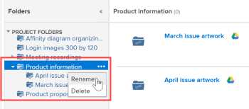

# Verknüpfen von Dokumenten aus externen Anwendungen

<!-- Audited: 01/2024 -->

Sie können Dokumente und Ordner aus den folgenden Quellen mit Adobe Workfront verknüpfen:

<table style="table-layout:auto"> 
 <col> 
 <col> 
 <tbody> 
  <tr> 
   <td role="rowheader">Bestehende Cloud-Dokumentanbieter</td> 
   <td>Dazu gehören die folgenden: 
    <ul> 
     <li>Feld</li> 
     <li>Dropbox</li> 
     <li>Dropbox Business</li> 
     <li>WebDAM</li> 
     <li>Microsoft OneDrive</li> 
     <li>Microsoft SharePoint</li> 
     <li>Google Drive</li> 
     <li>Quip</li>
    </ul></td> 
  </tr> 
  <tr> 
   <td role="rowheader">Workfront-Korrekturabzug </td> 
   <td>Sie können Korrekturabzüge, die ursprünglich in Workfront Proof erstellt wurden, in Workfront verfügbar machen.</td> 
  </tr> 
  <tr data-mc-conditions="QuicksilverOrClassic.Quicksilver"> 
   <td role="rowheader">Experience Manager Assets Essentials </td> 
   <td>Sie können von Experience Manager Assets Essentials aus Dokumente mit Workfront verknüpfen. Weitere Informationen finden Sie unter <a href="../../documents/adobe-workfront-for-experience-manager-assets-essentials/workfront-for-aem-asset-essentials.md" class="MCXref xref"> von Adobe Workfront für Experience Manager Assets Essentials</a>.</td> 
  </tr>

<tr> 
   <td role="rowheader">Andere Dokumentenanbieter (über benutzerdefinierte Dokumentenintegrationen)</td> 
   <td> 
Diese Integrationen können im Bereich Setup konfiguriert werden.
 </td>
  </tr> 
 </tbody> 
</table>

Bevor Sie Dokumente oder Ordner verknüpfen, muss Ihr Workfront-Administrator diese Funktion für jeden Dokumentanbieter oder für eine benutzerdefinierte Dokumentintegration aktivieren, wie in [Konfigurieren von Dokumentintegrationen](../../administration-and-setup/configure-integrations/configure-document-integrations.md) beschrieben.

Dokumente, die mit einem externen Cloud-Anbieter verknüpft sind, können auf die gleiche Weise geprüft und genehmigt werden wie Dokumente, die direkt in Workfront hochgeladen werden.

## Zugriffsanforderungen

+++ Erweitern Sie , um die Zugriffsanforderungen für die -Funktion in diesem Artikel anzuzeigen.

Sie müssen über folgenden Zugriff verfügen, um die Schritte in diesem Artikel ausführen zu können:

<table style="table-layout:auto"> 
 <col> 
 <col> 
 <tbody> 
  <tr> 
   <td role="rowheader">Adobe Workfront-Plan</td>
   <td> 
 Beliebig
 </td>
  </tr> 
  <tr> 
   <td role="rowheader">Adobe Workfront-Lizenz</td>
   <td>
Neu: Mitwirkender oder höher

    
oder

    
Aktuell: Anforderung oder höher
 </td>
  </tr> 
  <tr> 
   <td role="rowheader">Konfigurationen der Zugriffsebene</td> 
   <td> 
Zugriff auf Dokumente bearbeiten
 </td> 
  </tr> 
 </tbody> 
</table>

Weitere Informationen zu den Informationen in dieser Tabelle finden Sie unter [Zugriffsanforderungen in der Dokumentation zu Workfront](/help/quicksilver/administration-and-setup/add-users/access-levels-and-object-permissions/access-level-requirements-in-documentation.md).

+++

## Dokumentenspeicher

Dokumente, die über eine externe Anwendung mit Workfront verknüpft sind, werden beim externen Cloud-Anbieter und nicht in Workfront gespeichert.

Es gelten die folgenden Ausnahmen:

* Wenn vom Dokumenten-Service bereitgestellt, können Miniaturansichten und Vorschaubilder auf Workfront-Servern gespeichert werden.
* Wenn Sie Proofing in Workfront verwenden, wird das Dokument kopiert und zu den Proofing-Servern hinzugefügt.

## Dateigrößenbeschränkungen

Cloud-Drittanbieter:

* Einzeldatei: 5 GB oder weniger
* Mehrere Dateien: 1 GB oder weniger (insgesamt alle Dateien)

## Verknüpfen eines Dokuments aus einer externen Anwendung mit Workfront

Sie können vorhandene Dokumente mit einem externen Cloud-Anbieter verknüpfen. Dazu gehören alle freigegebenen Dokumente.

### Voraussetzungen {#prerequisites}

Bevor Sie Dokumente oder Ordner verknüpfen, muss Ihr Workfront-Administrator diese Funktion für jeden Dokumentanbieter oder für eine benutzerdefinierte Dokumentintegration aktivieren, wie in [Konfigurieren von Dokumentintegrationen](../../administration-and-setup/configure-integrations/configure-document-integrations.md) beschrieben.

### Verknüpfen eines externen Dokuments mit Workfront {#link-an-external-document-to-workfront}

Sie können Dokumente von einer externen Anwendung wie Google und Microsoft OneDrive mit Workfront verknüpfen.

>[!IMPORTANT]
>
>Dropbox speichert Dokumente basierend auf dem Dateipfad. Wenn eine über Dropbox verknüpfte Datei verschoben, umbenannt oder gelöscht wird, ist der Zugriff in Workfront daher nicht mehr möglich.

1. Wechseln Sie zum **Dokumente** in Workfront, in dem Sie das Dokument benötigen.
1. Klicken Sie **Neu hinzufügen** und dann auf den externen Dokumentanbieter, in dem Sie Dokumente mit Workfront verknüpfen möchten.

   Um beispielsweise Dokumente aus Dropbox zu verknüpfen, klicken Sie auf **Aus Dropbox**.

   Externe Anbieter, die Sie bereits autorisiert haben, werden oben in der Liste angezeigt.

1. (Bedingt) Wenn Sie aufgefordert werden, sich beim externen Dienst anzumelden, geben Sie Ihre Anmeldedaten für den Dienst in das Feld ein, das angezeigt wird. Klicken Sie dann **Anmelden**.
1. (Bedingt) Wenn Sie aufgefordert werden, die externe Anwendung zu autorisieren, klicken Sie auf die Schaltfläche **Autorisieren**.

   Du musst das nur einmal machen.

1. Geben Sie in das Suchfeld des Feldes **Verknüpfen externer Dateien und Ordner** den Namen des Elements ein, nach dem Sie suchen möchten, und drücken Sie dann die **Eingabetaste**, um alle Ergebnisse aus der externen Anwendung anzuzeigen, unabhängig davon, in welchem Ordner sie gespeichert sind.

   Oder

   Navigieren Sie zu den Dokumenten, die Sie verknüpfen möchten, und wählen Sie sie aus.

   Sie können zwar mehrere Dokumente auswählen, es werden jedoch nur die in der aktuellen Ansicht ausgewählten Dokumente verknüpft. Wenn Sie beispielsweise ein Dokument auswählen und dann in einen Ordner wechseln, ist das ursprünglich ausgewählte Dokument nicht verknüpft.

1. (Bedingt) Wenn Sie Workfront DAM-Kunde sind, klicken Sie auf das Symbol **Miniatur**, um Dateien als Miniaturbilder anzuzeigen.

   >[!NOTE]
   >
   >Workfront DAM-Kunden können beim Verknüpfen von Dokumenten aus Workfront DAM Miniaturansichten anzeigen. Miniaturansichten können auch für Workfront DAM-Kunden für andere Services wie Dropbox und Box angezeigt werden. Das Anzeigen von Miniaturen für andere Services als Workfront DAM innerhalb von Workfront wird jedoch nicht unterstützt, und Miniaturen werden beim Verknüpfen von Dokumenten über SharePoint oder Google Drive nie angezeigt.

1. Klicken Sie auf **Link**.

   In Workfront wird das Symbol des Cloud-Anbieters neben den Dokumenten angezeigt.

   >[!NOTE]
   >
   >* Wenn die Download-URL, die zum Verknüpfen des Dokuments verwendet wird, 2048 Zeichen überschreitet, kann die Datei nicht verknüpft werden.
   >* Bei Dokumenten, die mit dem Feld verknüpft sind, wird der Link zum Dokument im Feld erst angezeigt, wenn Sie die Seite aktualisieren.

### Hinzufügen einer neuen Version eines verknüpften Dokuments {#add-a-new-version-of-a-linked-document}

Sie können eine neue Version eines Dokuments hinzufügen, das über eine externe Anwendung mit Workfront verknüpft ist.

1. Wechseln Sie zum Bereich **Dokumente**, in dem das Dokument verknüpft ist, und wählen Sie dann das verknüpfte Dokument aus.

   >[!IMPORTANT]
   >
   >Das Dokument muss sich außerhalb eines verknüpften Ordners befinden, um eine neue Version zu erstellen.

1. Klicken Sie **Neu hinzufügen** > **Version** und klicken Sie dann auf den externen Dokumentanbieter.

   Um beispielsweise eine neue Version eines Dokuments aus Dropbox zu verknüpfen, klicken Sie auf **Aus Dropbox**.

   Externe Anbieter, die Sie bereits autorisiert haben, werden oben in der Liste angezeigt.

1. (Bedingt) Wenn Sie aufgefordert werden, sich beim externen Dienst anzumelden, geben Sie Ihre Anmeldedaten für den Dienst in das Feld ein, das angezeigt wird. Klicken Sie dann **Anmelden**.
1. (Bedingt) Wenn Sie aufgefordert werden, die externe Anwendung zu autorisieren, klicken Sie auf **Autorisieren**.

   Du musst das nur einmal machen.

1. Geben Sie in das Suchfeld des Feldes **Verknüpfen externer Dateien und Ordner** den Namen des Elements ein, nach dem Sie suchen möchten, und drücken Sie dann die **Eingabetaste**, um alle Ergebnisse aus der externen Anwendung anzuzeigen, unabhängig davon, in welchem Ordner sie gespeichert sind.

   Oder

   Navigieren Sie zu den Dokumenten, die Sie verknüpfen möchten, und wählen Sie sie aus.

   Sie können mehrere Dokumente auswählen. Es werden jedoch nur die Dokumente verknüpft, die in der aktuellen Ansicht ausgewählt sind. Wenn Sie beispielsweise ein Dokument auswählen und dann in einen Ordner wechseln, ist das ursprünglich ausgewählte Dokument nicht verknüpft.

1. (Bedingt) Wenn Sie Workfront DAM-Kunde sind, klicken Sie auf das Symbol **Miniatur**, um Dateien als Miniaturbilder anzuzeigen.

   >[!NOTE]
   >
   >Workfront DAM-Kunden können beim Verknüpfen von Dokumenten aus Workfront DAM Miniaturansichten anzeigen. Miniaturansichten können auch für Workfront DAM-Kunden für andere Services wie Dropbox und Box angezeigt werden. Das Anzeigen von Miniaturen für andere Services als Workfront DAM innerhalb von Workfront wird jedoch nicht unterstützt, und Miniaturen werden beim Verknüpfen von Dokumenten über SharePoint oder Google Drive nie angezeigt.

1. Klicken Sie auf **Link**.

   In Workfront wird das Symbol des Cloud-Anbieters neben den Dokumenten angezeigt, was darauf hinweist, dass sie mit dem externen Cloud-Anbieter verknüpft sind.

   >[!NOTE]
   >
   >Bei Dokumenten, die mit dem Feld verknüpft sind, wird der Link zum Dokument im Feld erst angezeigt, wenn Sie die Seite aktualisieren.

Informationen zum Hinzufügen einer neuen Version eines Dokuments, das Sie von Ihrem Dateisystem in Workfront hochgeladen haben, finden Sie unter [Hinzufügen von Dokumenten zu Adobe Workfront](../../documents/adding-documents-to-workfront/add-documents-from-file-system.md#add-documents-to-workfront) in [Hinzufügen von Dokumenten zu Adobe Workfront von Ihrem Dateisystem](../../documents/adding-documents-to-workfront/add-documents-from-file-system.md).

### Workfront Proof-Dokumente verknüpfen {#link-workfront-proof-documents}

Sie können Testsendungen mit Workfront verknüpfen, das ursprünglich in Workfront Proof existierte. Wenn Sie einen Korrekturabzug über Workfront Proof verknüpfen, sind alle Kommentare und anderen mit dem Korrekturabzug verknüpften Metadaten in Workfront verfügbar.

Sie können nur die Korrekturabzüge verknüpfen, für die Sie Lesezugriff in Workfront Proof haben.

1. Wechseln Sie zum **Dokumente** in Workfront, in dem Sie das Dokument benötigen.
1. Klicken Sie **Neu hinzufügen** und dann auf **Von Workfront Proof**.

   >[!NOTE]
   >
   >Die Optionen in diesem Menü können je nachdem, welche Drittanbieter in Ihrer Umgebung konfiguriert sind, variieren.

1. Geben Sie im **Korrekturabzüge aus Workfront Proof verknüpfen** den Namen des Korrekturabzugs ein, den Sie in Workfront verfügbar machen möchten.

   Die Liste wird bei der Eingabe gefiltert.

1. Wählen Sie bis zu 10 Testsendungen aus, die verknüpft werden sollen.

   Ein abgeblendeter Korrekturabzugsname ist nicht für die Verknüpfung verfügbar, da der Korrekturabzug bereits mit einem Dokument in Workfront verknüpft ist.

1. Klicken Sie auf **Link**.

   Die aktuelle Version des Korrekturabzugs ist mit Workfront verknüpft. Wenn Sie den Korrekturabzug öffnen, sind alle Versionen in der Korrekturabzugsansicht verfügbar.

### Erstellen eines Google-Dokuments in Workfront {#create-a-google-document-from-within-workfront}

Sie können in Workfront ein neues Google-Dokument erstellen. Sie können keine neuen Dokumente in Workfront für andere Cloud-Anbieter erstellen.

1. Wechseln Sie zum **Dokumente** in Workfront, in dem Sie das Dokument benötigen.
1. Klicken Sie **Neu hinzufügen** > **Google-Datei** und wählen Sie dann den Typ des Google-Dokuments aus, das Sie erstellen möchten.
1. Wenn das Feld **Google-Laufwerkkonto hinzufügen** angezeigt wird, klicken Sie auf **Google-Laufwerk autorisieren**.

   Ein Google-Dokument wird der Registerkarte **Dokumente** hinzugefügt.

   >[!NOTE]
   >
   > Mein Laufwerk und „Für mich freigegeben“ zeigen zwei verschiedene Ergebnisse an. Wenn Sie eine Datei auf „Mein Laufwerk“ nicht finden können, checken Sie den Ordner „Für mich freigegeben“ ein.

## Hochladen und Verknüpfen eines Dokuments aus Workfront mit einem externen Cloud-Anbieter

Sie können ein Dokument aus Workfront hochladen und mit einem externen Cloud-Anbieter verknüpfen. Dadurch wird die Speicherung des Dokuments von Workfront zum externen Cloud-Anbieter verschoben. Wenn das Dokument in der externen Anwendung geändert wird, wird es automatisch in Workfront aktualisiert.

>[!NOTE]
>
>Durch das Senden eines Assets an einen externen Dokumentanbieter wird eine neue Version des Assets erstellt.

Benutzende ohne Workfront-Zugriff können das Dokument in der externen Anwendung sehen, wenn sie Zugriff auf die Anwendung haben.

1. Wählen Sie ein Dokument aus, das in Workfront hochgeladen wird.
1. Klicken Sie auf **Mehr** > **Senden an** und wählen Sie dann den Cloud-Anbieter aus, bei dem Sie das verknüpfte Dokument speichern möchten.

   Sie können dazu auch das Menü Mehr  auf der Seite Dokumentdetails verwenden.

1. Wählen Sie den Ordner im Programm des Anbieters aus, in dem Sie das Dokument speichern möchten.

   Dies kann ein beliebiger Ordner im Programm des Anbieters sein, einschließlich eines freigegebenen Ordners.

1. Klicken Sie auf **Speichern**.

   Das Logo des externen Anbieters wird neben dem Dokumentnamen angezeigt, um anzugeben, dass das Dokument jetzt mit Workfront verknüpft und vom externen Cloud-Anbieter gespeichert ist.

   

## Ordner verknüpfen

Wenn Sie einen Ordner zwischen Workfront und einem externen Cloud-Anbieter verknüpfen, werden der Ordner und alle zugehörigen Inhalte verknüpft. Wenn Benutzende ohne Workfront-Zugriff Dateien aus der externen Dokumentanwendung hinzufügen, entfernen und ändern, werden ihre Änderungen mit Workfront synchronisiert.

### Zugriffsrechte für Ordner {#folder-access-rights}

Beim Synchronisieren von Ordnerinhalten aus einer externen Dokumentanwendung verwendet Workfront die Anmeldeinformationen des Benutzers, der den Ordner ursprünglich verknüpft hat. Dies führt zum folgenden Benutzererlebnis:

* Wenn Benutzende keinen Zugriff auf die Anzeige von Dateien und Ordnern in der externen Anwendung haben, aber Zugriff auf die Anzeige des verknüpften Ordners über Workfront haben, können sie nur die Namen der Dateien und Ordner in Workfront und nicht deren Inhalte anzeigen.
* Wenn jemand auf Inhalte in einem verknüpften Ordner in Workfront zugreift (z. B. einen Unterordner in einem verknüpften Ordner), der von einem anderen Benutzer mit Workfront verknüpft wurde, werden die Inhalte mit Workfront synchronisiert, indem die Workfront-Anmeldedaten des Benutzers verwendet werden, der den Ordner ursprünglich verknüpft hat, nicht die Anmeldedaten des Benutzers, der auf den Inhalt zugreift.

>[!IMPORTANT]
>
>* Wenn der Benutzer, der den Ordner ursprünglich verknüpft hat, aus dem Workfront-System entfernt wird, können Benutzer nicht mehr über Workfront auf den Inhalt des verknüpften Ordners zugreifen. In diesem Fall muss der Ordner von einem aktiven Workfront-Benutzer neu verknüpft werden, der über Rechte für den Ordner in der externen Anwendung verfügt.
>* Wenn die Person, die einen Ordner verknüpft hat, keinen Zugriff mehr auf die externe Anwendung hat, kann Workfront nicht mehr auf den Inhalt des Ordners zugreifen. Dies kann beispielsweise vorkommen, wenn der Benutzer, der den Ordner ursprünglich verknüpft hat, das Unternehmen verlässt. Um den kontinuierlichen Zugriff sicherzustellen, muss ein Benutzer mit Zugriff auf den Ordner den Ordner erneut verknüpfen.

### Externe Ordner verknüpfen {#link-one-or-more-external-folders}

1. Wechseln Sie zu dem Bereich in Workfront, in dem Sie den Ordner haben möchten, und klicken Sie **Dokumente**  im linken Bedienfeld .

1. Klicken Sie **Neu hinzufügen** und anschließend auf den externen Dokumentanbieter, von dem aus Sie einen Ordner mit Workfront verknüpfen möchten.
1. (Bedingt) Wenn Sie den externen Service noch nicht autorisiert haben, geben Sie Ihre Anmeldedaten für den externen Anbieter an und klicken Sie dann auf **Anmelden**.

   Externe Anbieter, die Sie bereits autorisiert haben, werden oben in der Liste angezeigt.

1. Im **Verknüpfen externer Dateien und Ordner** werden die Ordner angezeigt, die Sie verknüpfen möchten.

   Oder

   Geben Sie den Namen des Ordners ein, nach dem Sie suchen möchten, und drücken Sie dann die **Eingabetaste**.

   Sie können mehrere Ordner auswählen. Es werden jedoch nur die Ordner verknüpft, die in der aktuellen Ansicht ausgewählt sind. Wenn Sie beispielsweise einen Ordner auswählen und dann zu einem Ordner wechseln, ist der ursprünglich ausgewählte Ordner nicht verknüpft.

   >[!NOTE]
   >
   >Beim Verknüpfen von Ordnern über Google Drive können Sie nur Ordner verknüpfen, die sich auf Ihrem persönlichen Laufwerk (My Drive) und in Team Drive befinden. Sie können keine Ordner aus dem Bereich „Für mich freigegeben“ verknüpfen.

1. Klicken Sie auf **Link**.

   In Workfront wird das Logo des Cloud-Anbieters neben dem Ordner angezeigt, was darauf hinweist, dass es mit dem externen Cloud-Anbieter verknüpft ist.

1. (Optional) Um den Ordner so umzubenennen, dass sich der Ordnername in Workfront vom Ordnernamen in der externen Dokumentanwendung unterscheidet, wählen Sie den Ordner im Abschnitt **Ordner** aus, klicken Sie auf das Menü Mehr , das neben dem Ordnernamen angezeigt wird, und klicken Sie dann auf **Umbenennen**.

   

Dadurch wird der Ordner in der externen Anwendung nicht umbenannt.

### Hinzufügen von Unterordnern zu einem verknüpften Ordner  {#add-subfolders-to-a-linked-folder}

Sie können einen neuen Ordner innerhalb eines vorhandenen verknüpften Ordners erstellen. Sie können auch einen anderen Ordner in einen vorhandenen verknüpften Ordner ziehen.

1. Um einen neuen Ordner in einem vorhandenen verknüpften Ordner zu erstellen, gehen Sie zum vorhandenen Ordner und erstellen Sie dann den neuen Ordner wie in [Erstellen von &#x200B;](../../documents/organizing-documents/create-documents-folder.md)&quot; beschrieben.

   Oder

   Um einen vorhandenen Ordner in einen vorhandenen verknüpften Ordner zu ziehen, gehen Sie zum Bereich Dokumente , in dem Sie den Unterordner haben möchten, und ziehen Sie ihn dann in den verknüpften Ordner.

   

   >[!NOTE]
   >
   >Die folgenden Einschränkungen gelten für das Ziehen eines vorhandenen Workfront-Ordners in einen verknüpften Ordner:
   >
   >* Der Ordner, den Sie ziehen, kann noch nicht verknüpft sein und darf keinen Inhalt enthalten, der bereits verknüpft ist.
   >* Der Ordner (einschließlich seines Inhalts), den Sie ziehen, darf 50 MB nicht überschreiten.

## Hinzufügen eines Dokuments zu einem verknüpften Ordner

Wenn Sie ein Dokument über Workfront zu einem verknüpften Ordner hinzufügen, wird es automatisch als verknüpftes Dokument hinzugefügt.

1. Wählen Sie den verknüpften Ordner aus, in dem das Dokument gespeichert werden soll, klicken Sie auf **Neu hinzufügen > Dokument**, navigieren Sie dann zu dem Dokument und fügen Sie es dem Ordner hinzu.

   Oder

   Ziehen Sie das **Dokument** Bereich „Dokumente“, in dem Sie es haben möchten, in einen verknüpften Ordner.

   Eine neue Version Ihres Dokuments wird automatisch in der externen Anwendung erstellt und mit Workfront verknüpft.

>[!NOTE]
>
> * Die Dokumentoptionen sind nicht verfügbar, während das Dokument verschoben wird.
>
> * Nachdem ein Dokument nach Experience Manager Assets verschoben wurde, ist in der Dokumentliste in Workfront nicht mehr sichtbar.
>
> * Alle Aktionen oder Bearbeitungen, die Sie an einem Dokument vornehmen, während es verschoben wird, werden nicht im Dokument in Experience Manager Assets angezeigt und gehen daher verloren.

## Löschen eines verknüpften Dokuments oder Ordners

Wenn Sie ein verknüpftes Dokument oder einen verknüpften Ordner aus der externen Anwendung löschen, bleibt das Dokument oder der Ordner im Workfront-System, bis Sie es bzw. ihn auch aus Workfront löschen.

1. Wählen Sie das verknüpfte Dokument oder den verknüpften Ordner aus und klicken Sie dann auf **Löschen**.
1. Klicken Sie im angezeigten Bestätigungsfeld auf **Ja, Verknüpfung aufheben**.

   Der Link des Dokuments zur Workfront-Site wurde aufgehoben. Sie ist in der externen Anwendung nicht betroffen.

## Über das Umbenennen verknüpfter Dokumente und Ordner

Wenn Sie ein verknüpftes Dokument oder einen verknüpften Ordner umbenennen, ist die Änderung nur in der Anwendung sichtbar, in der Sie sie vornehmen. Wenn Sie beispielsweise ein verknüpftes Dokument in Workfront umbenennen, ist der neue Name nur in Workfront sichtbar.

Wenn der Name in Workfront und in der externen Anwendung übereinstimmen soll, müssen Sie ihn an beiden Stellen umbenennen.

>[!IMPORTANT]
>
>Benennen Sie ein mit Dropbox verknüpftes Dokument in Workfront nicht um. Dadurch wird die Datei in Workfront unzugänglich. Benennen Sie stattdessen die Datei in Dropbox um und synchronisieren Sie dann die Datei erneut.
