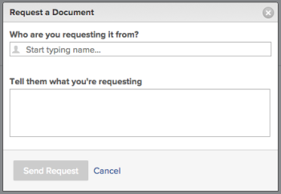

# Dokument anfordern

Sie können ein Dokument für jedes Objekt anfordern, das Dokumente unterstützt.

>[!NOTE]
>
>Diese Funktion ist im neuen Dokumentbereich nicht verfügbar. 
>Wenn Ihr Unternehmen den Adobe-Cloud-Speicher verwendet, sehen Sie den neuen Dokumentbereich, wenn Sie auf Dokumente in Workfront zugreifen. Weitere Informationen zu Adobe Cloud-Speicher finden Sie unter [Übersicht über Adobe Cloud-Speicher](/help/quicksilver/review-and-approve-work/esm-overview.md).

## Zugriffsanforderungen

+++ Erweitern, um die Zugriffsanforderungen für die in diesem Artikel beschriebene Funktionalität anzuzeigen.

<table style="table-layout:auto"> 
 <col> 
 <col> 
 <tbody> 
  <tr> 
   <td role="rowheader">Adobe Workfront-Paket</td> 
   <td> 
Beliebig
 </td> 
  </tr> 
  <tr> 
   <td role="rowheader">Adobe Workfront-Lizenzen*</td> 
   <td> 
   
Mitwirkende oder höher

   
Anfragende oder höher
 </td> 
  </tr> 
  <tr> 
   <td role="rowheader">Konfigurationen der Zugriffsebene</td> 
   <td> 
Zugriffrecht „Bearbeiten“ für Dokumente
 </td> 
  </tr> 
 </tbody> 
</table>

Weitere Informationen finden Sie unter [Zugriffsanforderungen](/help/quicksilver/administration-and-setup/add-users/access-levels-and-object-permissions/access-level-requirements-in-documentation.md) in der Dokumentation zu Workfront.

+++

## Dokument anfordern

1. Wechseln Sie zu dem Bereich, in dem sich das angeforderte Dokument befinden soll.
1. Klicken Sie auf die **Dokumente**. 
1. Klicken Sie auf **Dropdown-Menü** Neu hinzufügen“.

1. Klicken Sie **Dokument anfordern**.

   Das Dialogfeld Dokument anfordern wird angezeigt.

   

1. Beginnen Sie mit der Eingabe des Namens des Benutzers, von dem Sie das Dokument anfordern, und wählen Sie es aus, wenn es in der Dropdown-Liste angezeigt wird. In der Dropdown-Liste werden nur lizenzierte Adobe Workfront-Benutzer als Optionen angezeigt.

   >[!NOTE]
   >
   >Wenn Sie in Ihrem Konto die [Übersicht über ältere Lizenzen](../../administration-and-setup/add-users/access-levels-and-object-permissions/wf-licenses.md) aktiviert haben, können Sie eine Anfrage an eine beliebige E-Mail-Adresse senden. In der Einstellung [Systemsicherheitseinstellungen konfigurieren](../../administration-and-setup/manage-workfront/security/configure-security-preferences.md) wird festgelegt, ob diese externen E-Mail-Benutzer ein Kennwort erstellen müssen, bevor sie mit Workfront interagieren. 

1. Beschreiben Sie den Grund, warum Sie das Dokument anfordern.
1. Klicken Sie **Anfrage senden**.

   Wenn Sie eine Anfrage an einen Benutzer stellen, wird im Bereich Dokumente ein Platzhalter hinzugefügt. Sie können den Benutzer an diesen Platzhalter erinnern oder die Anforderung abbrechen. Der/die Benutzende erhält eine Workfront-Benachrichtigung und eine E-Mail über die Anfrage.

   Der/die Benutzende erhält eine E-Mail-Benachrichtigung, wenn diese Einstellung aktiviert ist, sowie eine In-App-Benachrichtigung. Weitere Informationen zu E-Mail-Benachrichtigungen finden Sie unter [Eigene E-Mail-Benachrichtigungen ändern](../../workfront-basics/using-notifications/activate-or-deactivate-your-own-event-notifications.md).

   Sie können auf den Link in der E-Mail-Benachrichtigung klicken und dann das Dokument hochladen. Oder Sie klicken auf die In-App-Benachrichtigung. Jede Option leitet Sie zur Benutzerprofilseite weiter, auf der Sie das angeforderte Dokument hochladen können.

1. Nach dem Hochladen des Dokuments kann die Person, die es angefordert hat, auf das Dokument in ihrem persönlichen Bereich **Dokumente** zugreifen.

   Sie können auf Ihren **Bereich** Dokumente“ zugreifen, indem Sie auf Ihr Benutzerprofilbild oben rechts auf einer beliebigen Workfront-Seite klicken, auf Ihren Namen klicken und dann auf die Registerkarte **Dokumente** klicken.
