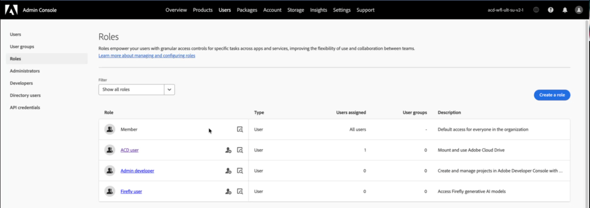

# Einrichten und Verwalten von Adobe Cloud Drive für Ihr Unternehmen

Als Admin können Sie Adobe Cloud Drive einrichten, um Benutzenden über die Suche in macOS und den Datei-Explorer unter Windows direkten Desktop-Zugriff auf ihre Projektdateien im Adobe Cloud-Speicher zu gewähren. In diesem Artikel wird beschrieben, wie Sie den Zugriff in der Adobe Admin Console aktivieren, die Anwendung auf Benutzergeräten bereitstellen und den Zugriff laufend verwalten.

Adobe Cloud Drive ist eine Desktop-Anwendung für Unternehmen, die Workfront-Dokumente auf dem Adobe Cloud-Speicher als virtuelles Laufwerk auf den Mac- und Windows-Computern der Benutzer bereitstellt. Nach der Installation sehen die Benutzer ihre Workfront-Projektordner im Finder oder Datei-Explorer und können Projektdateien mit einem beliebigen Desktop-Programm öffnen, bearbeiten und speichern, ohne Dateien manuell herunterladen oder über einen Browser verwenden zu müssen.

Um Adobe Cloud Drive verwenden zu können, muss Ihr Unternehmen zum Workflow-Ultimate-Paket gehören, wobei Adobe Cloud Storage aktiviert sein muss.

Weitere Informationen zu Adobe Cloud Drive finden Sie in den folgenden Artikeln:

* [Übersicht über Adobe Cloud Drive](/help/quicksilver/documents/adobe-cloud-drive/adobe-cloud-drive-overview.md)
* [Installieren von Adobe Cloud Drive](/help/quicksilver/documents/adobe-cloud-drive/install-adobe-cloud-drive.md)
* [Verwenden von Adobe Cloud Drive](/help/quicksilver/documents/adobe-cloud-drive/use-adobe-cloud-drive.md)

## Zugriffsanforderungen

+++ Erweitern, um die Zugriffsanforderungen für die in diesem Artikel beschriebene Funktionalität anzuzeigen.

<table style="table-layout:auto"> 
 <col> 
 <col> 
 <tbody> 
  <tr> 
   <td role="rowheader">Adobe Workfront-Version</td> 
   <td>Workflow-Ultimate mit aktiviertem Adobe-Cloud-Speicher</td> 
  </tr> 
  <tr> 
   <td role="rowheader">Adobe-Administratorrechte</td> 
   <td>Sie müssen Systemadministrator für Workfront in der Adobe Admin Console sein</td> 
  </tr> 
 </tbody> 
</table>

Weitere Informationen finden Sie unter [Zugriffsanforderungen](/help/quicksilver/administration-and-setup/add-users/access-levels-and-object-permissions/access-level-requirements-in-documentation.md) in der Dokumentation zu Workfront.

+++

## Zuweisen von Zugriff auf Adobe Cloud Drive in Adobe Admin Console

Adobe Cloud Drive ist im Workflow-Ultimate-Paket enthalten, wenn die Adobe-Cloud-Datenspeicherung aktiviert ist. Es wird nicht als eigenständiges Produkt im Abschnitt **Produkte** der Admin Console angezeigt. Stattdessen wird sie über den Abschnitt **Rollen** unter &quot;**&quot;**.

Wenn Sie zu **Benutzer** > **Rollen** gehen, sehen Sie zwei Rollen, die mit dem Workfront-Produkt verknüpft sind:

| Rolle | Automatisch zugewiesen zu | Relevanz für Adobe Cloud Drive |
| --- | --- | --- |
| **Mitglied** | Alle Benutzer in der Organisation | Enthält den Adobe Cloud Drive-Funktionsschalter auf Organisationsebene. Standardmäßig an. |
| **ACD-Benutzer** | Standardmäßig niemand | Gewährt individuellen Zugriff, wenn der Schalter auf Organisationsebene deaktiviert ist. |

### Zugriffssteuerungen

**Kontrolle 1: Funktionskontrolle auf Organisationsebene (in der Rolle „Mitglied„)**

Die **Mitglied**-Rolle wird automatisch jedem Benutzer in Ihrer Organisation zugewiesen. In dieser Rolle gibt es einen **Adobe Cloud Drive**-Funktionsschalter. Wenn dieser Schalter aktiviert ist, kann jeder Anwender mit einer Workflow-Ultimate-Lizenz auf Adobe Cloud Drive zugreifen. Wenn es ausgeschaltet ist, kann kein Benutzer unabhängig von seiner Lizenz auf Adobe Cloud Drive zugreifen.

Der Schalter ist standardmäßig aktiviert, wenn Adobe Adobe Cloud Drive für Ihr Unternehmen aktiviert.

**Control 2: ACD-Benutzerrolle**

Die Rolle **ACD-Benutzer** ist nur relevant, wenn der Schalter auf Organisationsebene deaktiviert ist. Wenn Sie den Schalter auf Organisationsebene deaktivieren, um einen gesteuerten Pilotversuch durchzuführen, können Sie bestimmten Benutzern weiterhin Zugriff gewähren, indem Sie sie der Rolle **ACD-Benutzer** hinzufügen. Benutzende mit dieser Rolle können auf Adobe Cloud Drive zugreifen, auch wenn der Schalter auf Organisationsebene deaktiviert ist. Wenn der Schalter auf Organisationsebene aktiviert ist, hat die Rolle **ACD-Benutzer** keine Auswirkung.

**Zugrunde liegende Anforderung: Workflow-Ultimate-Lizenz**

Adobe Cloud Drive ist nur im Workflow-Ultimate-Paket verfügbar. Rollenoptionen sind in keinem anderen Paket verfügbar.

Die Lizenz im Workflow-Ultimate-Paket kann jeder Lizenztyp sein: Standard, Light oder Contributor. Informationen zu Lizenzen finden Sie unter [Lizenzen - Übersicht](/help/quicksilver/administration-and-setup/add-users/how-access-levels-work/licenses-overview.md).

Die folgende Tabelle zeigt, wie diese Steuerelemente interagieren:

| Schalter auf Organisationsebene | Benutzer in ACD-Benutzerrolle | Workflow-Ultimate-Lizenz | Zugriff auf Ergebnis |
| --- | --- | --- | --- |
| Ein | Nicht erforderlich | Ja | Gewährt |
| Aus | Ja | Ja | Gewährt |
| Aus | Nein | Ja | Verweigert |
| Entweder | Entweder | Nein | Verweigert |

<!-- Sarah said to delete the second line. Commenting it out within the table messed up the display for the rest of the table, so keeping the line here until I can delete it. | On | Not required | No | Denied | -->

## Voraussetzungen

Überprüfen Sie Folgendes, bevor Sie beginnen:

* Den Benutzern, die Sie bereitstellen möchten, werden Workfront Workflow-Lizenzen zugewiesen.
* Sie haben die [Netzwerkanforderungen](#network-requirements) mit Ihrem IT-Team geprüft.
* Sie haben eine Mitteilung entworfen, die Sie an Benutzer senden können, die erklären, was Adobe Cloud Drive anzeigt (nur Workfront-Projekt-Assets) und wie es installiert werden kann.

  >[!NOTE]
  >
  >Ein Benutzer, der Zugriff aktiviert hat, aber keinen Zugriff auf Workfront-Projekte hat, sieht nach der Anmeldung ein leeres bereitgestelltes Laufwerk. Dies ist zu erwarten. Der Zugriff auf Workfront-Projekte wird in Workfront separat verwaltet. Weitere Informationen finden Sie unter [Freigeben eines Projekts](/help/quicksilver/workfront-basics/grant-and-request-access-to-objects/share-a-project.md).
  >
  >Außerdem müssen sich die Berechtigungen für Creative Cloud in derselben IMS-Organisation wie Workfront befinden, damit Projekte auf dem Laufwerk angezeigt werden.

## Konfigurieren des Zugriffs auf die Adobe Admin Console

Der Zugriff auf das Adobe Cloud Drive wird in der Adobe Admin Console konfiguriert. Wählen Sie die Option aus, die Ihrer Rollout-Strategie entspricht.

### Option A: Aktivieren des Zugriffs für Ihr gesamtes Unternehmen

Wenn Adobe Adobe Cloud Drive für Ihr Unternehmen aktiviert, ist der Funktionsumschalter auf Organisationsebene standardmäßig aktiviert, und alle Benutzenden haben sofort Zugriff. Verwenden Sie dieses Verfahren, um vor der Bereitstellung der Anwendung zu bestätigen, dass der Schalter eingeschaltet ist.

1. Melden Sie sich bei [adminconsole.adobe.com) &#x200B;](https://adminconsole.adobe.com/).
1. Klicken Sie **der oberen** auf „Benutzer“.
1. Klicken **im linken** auf „Rollen“.
1. Klicken Sie **der Liste &quot;**&quot; auf „Mitglied“.
1. Bestätigen Sie **dass** Adobe Cloud Drive **im sich** öffnenden Bedienfeld auf der rechten Seite unter **Berechtigungen** angezeigt wird und eingeschaltet ist.

   

   >[!NOTE]
   >
   >Wenn Adobe Cloud Drive nicht unter den **Berechtigungen** der Rolle **Mitglied** angezeigt wird, ist Adobe Cloud Drive möglicherweise noch nicht für Ihr Unternehmen aktiviert. Wenden Sie sich zur Bestätigung an den Adobe-Support.

1. Klicken Sie **Speichern**, wenn Sie Änderungen vorgenommen haben.

### Option B: Aktivieren des Zugriffs für eine bestimmte Benutzergruppe

Verwenden Sie diese Option, wenn Sie den Zugriff auf eine definierte Benutzergruppe beschränken möchten, z. B. während eines Pilotversuchs vor einem umfassenderen Rollout. Dazu müssen Sie den Schalter auf Organisationsebene deaktivieren und dann Ihre Pilotbenutzer der Rolle **ACD-Benutzer** hinzufügen.

>[!IMPORTANT]
>
>Durch Deaktivieren des Switches auf Organisationsebene wird der Zugriff auf Adobe Cloud Drive für alle Benutzenden in Ihrer Organisation sofort entfernt, einschließlich der derzeit angemeldeten Benutzenden. Sie müssen die Funktion auf Organisationsebene deaktivieren und die Pilotbenutzer in derselben Sitzung hinzufügen.

So deaktivieren Sie die Funktion auf Organisationsebene:

1. Melden Sie sich bei [adminconsole.adobe.com) &#x200B;](https://adminconsole.adobe.com/).
1. Klicken Sie **der oberen** auf „Benutzer“ und dann **linken Bereich auf** Rollen“.
1. Klicken Sie **der Liste &quot;**&quot; auf „Mitglied“.
1. Suchen Sie im **Mitglied**-Bedienfeld **Adobe Cloud Drive** unter **Berechtigungen** und deaktivieren Sie es.
1. Klicken Sie auf **Speichern**.

So fügen Sie Pilotbenutzer zur Rolle ACD-Benutzer hinzu:

1. Klicken Sie im linken Bedienfeld auf **Rollen**, um zur Rollenliste zurückzukehren.
1. Klicken Sie **der Liste „Rollen** auf ACD-Benutzer.

   

1. Klicken Sie **Benutzer hinzufügen**.
1. Geben Sie die E-Mail-Adresse jedes Pilotenbenutzers ein.
1. Klicken Sie auf **Speichern**.

   Benutzende, die der Rolle **ACD-Benutzer** hinzugefügt wurden, erhalten sofort Zugriff. Benutzende, die sich nicht in dieser Rolle befinden, haben weiterhin keinen Zugriff, bis Sie sie der Rolle hinzufügen oder den Switch auf Organisationsebene wieder aktivieren.

   >[!TIP]
   >
   >Um den Zugriff im Laufe der Zeit zu erweitern, kehren Sie zur Rolle **ACD-Benutzer** zurück und fügen Sie bei Bedarf Benutzer hinzu. Wenn Sie für einen vollständigen Rollout bereit sind, schalten Sie den Schalter auf Organisationsebene in der Rolle **Mitglied** wieder ein. Sobald der Schalter auf Organisationsebene aktiviert ist, hat die Rolle **ACD-Benutzer** keine Auswirkung und muss nicht mehr gepflegt werden.

## Bereitstellen des Adobe Cloud Drive-Programms

Durch die Konfiguration des Zugriffs in der Adobe Admin Console wird eine Berechtigung festgelegt. Beim Bereitstellen der Anwendung wird sie auf dem Gerät des Benutzers installiert. Dies sind zwei separate, erforderliche Schritte.

Adobe Cloud Drive ist eine eigenständige Anwendung. Es wird nicht über das Creative Cloud-Desktop-Programm verteilt und wird nicht im Creative Cloud Package Manager angezeigt. Das Benutzerprofil für Adobe Cloud Drive ist jedoch an die Creative Cloud-App-Berechtigung gebunden. Das bedeutet, dass Creative Cloud-Apps in derselben IMS-Organisation wie Workfront berechtigt sein müssen, damit ein Benutzer auf Workfront-Projekte in der Festplatte zugreifen kann.

Wählen Sie die Bereitstellungsmethode aus, die den Geräteverwaltungspraktiken Ihres Unternehmens entspricht.

### Methode A: IT-verwaltete Bereitstellung über Admin Console-Pakete

Verwenden Sie diese Methode, wenn Ihr Unternehmen zentralisierte Bereitstellungs-Tools wie Microsoft Intune, SCCM, Jamf Pro oder Apple Remote Desktop verwendet. Dies ist der standardmäßige Enterprise-Bereitstellungs-Workflow von Adobe. Er folgt demselben Paketerstellungsprozess, der für andere Adobe-Programme verwendet wird.

So erstellen Sie das Paket in der Adobe Admin Console:

1. Melden Sie sich bei [adminconsole.adobe.com) &#x200B;](https://adminconsole.adobe.com/).
1. Klicken Sie **der oberen Navigationsleiste auf** Pakete“.
1. Klicken Sie **linken Bereich auf** Vorgenerierte Pakete“.
1. Klicken Sie auf **Registerkarte** Vorlagen“.

   Adobe Cloud Drive wird zweimal in der Vorlagenliste angezeigt: einmal für macOS und einmal für Windows.

   

1. Suchen Sie die Zeile **Adobe Cloud Drive** , die Ihrer Zielplattform entspricht, und klicken Sie dann auf das Detailsymbol in dieser Zeile.

   In einem Seitenbereich werden die Paketmetadaten angezeigt.

   

1. Klicken Sie **Anpassen**.

   Der Assistent zur Paketanpassung wird mit vier Schritten geöffnet: **Konfigurieren**, **Apps auswählen**, **Optionen** und **Finalize**.

1. Wählen **im Schritt** die Architektur für Ihre Zielcomputer aus, bestätigen Sie dann die Spracheinstellung und klicken Sie auf **Weiter**.

   * **macOS:** Wählen Sie **macOS (Intel)** oder **macOS (Apple Silicon)**.
   * **Windows:** Wählen Sie **Windows (64-Bit)** oder **Windows (ARM)**.

   

1. Bestätigen **im Schritt &quot;** auswählen“, dass Adobe Cloud Drive mit der gewünschten Version ausgewählt ist.

   Adobe Cloud Drive ist mit der neuesten verfügbaren Version vorausgewählt. Um eine ältere Version zu verwenden, klicken Sie auf **Andere Versionen** und wählen Sie **Ältere Versionen** aus.

   

1. Klicken Sie auf **Weiter**.
1. Klicken Sie im Schritt **Optionen** auf **Weiter** ohne Optionen auszuwählen.

   Diese Einstellungen gelten für Creative Cloud-Desktop-Programme und nicht für Adobe Cloud Drive.

   

1. Geben **im Schritt &quot;** abschließen“ einen Namen für das Paket ein und wählen Sie **Einfaches Paket**.
1. Überprüfen Sie die Zusammenfassung und klicken Sie auf **Paket erstellen**.

   

   Der Assistent wird geschlossen. Das neue Paket wird oben in der Paketliste mit dem Status **Wird vorbereitet** angezeigt, während es erstellt wird. Sobald er fertig ist, ändert sich der Status in **Aktuell** und ein Download-Link wird angezeigt.

   

1. Klicken Sie **Herunterladen** und speichern Sie die Paketdatei an dem gewünschten Speicherort.

### Methode B: Direkter Self-Service-Download von Software Distribution

Verwenden Sie diese Methode für kleinere Organisationen, für selbstverwaltete Geräte oder wenn Sie einzelne Benutzer anweisen, die Anwendung selbst zu installieren.

Bevor Sie beginnen, bestätigen Sie Folgendes:

* Der Zugriff ist für die -Benutzenden in der Adobe Admin Console aktiviert.
* Die Benutzer wurden über die Software-Verteilungs-URL und die Anmeldeanweisungen benachrichtigt.
* Die Netzwerkkonnektivität zu den erforderlichen Endpunkten wurde überprüft. Weitere Informationen finden Sie unter [Netzwerkanforderungen](#network-requirements) in diesem Artikel.

So installieren Sie Adobe Cloud Drive selbst:

1. Vergewissern Sie sich, dass der Zugriff für den Benutzer in der Adobe Admin Console aktiviert ist.
1. Leiten Sie den Benutzer an [experience.adobe.com/#/downloads](https://experience.adobe.com/#/downloads).

   >[!NOTE]
   >
   >Benutzende müssen in der Adobe Admin Console Zugriff auf Adobe Cloud Drive aktiviert haben, um das Installationsprogramm für Adobe Cloud Drive sehen zu können. Benutzende ohne Zugriff sehen das Installationsprogramm nicht aufgeführt.

1. Der Benutzer meldet sich mit seiner Enterprise ID oder Federated ID an. Das Adobe Cloud Drive-Installationsprogramm wird auf der Registerkarte **Workfront** der Software Distribution angezeigt.
1. Der Benutzer lädt das Installationsprogramm für seine Plattform herunter und befolgt die Installationsschritte unter [Installieren von Adobe Cloud Drive](/help/quicksilver/documents/adobe-cloud-drive/install-adobe-cloud-drive.md).

   

Führen Sie diese Überprüfung nach der Bereitstellung auf einem Testgerät aus:

1. Starten Sie Adobe Cloud Drive über den Ordner **Programme** (macOS) oder das **Start**-Menü (Windows).
1. Melden Sie sich mit einem Benutzerkonto an, für das in der Adobe Admin Console der Zugriff auf Adobe Cloud Drive aktiviert ist.
1. Vergewissern Sie sich, dass Workfront-Projektordner im bereitgestellten Laufwerk im Finder oder im Datei-Explorer angezeigt werden.

   >[!NOTE]
   >
   >Ein Benutzer, der sich erfolgreich anmeldet, aber keine Ordner sieht, hat keinen Zugriff auf Workfront-Projekte. Fügen Sie den Benutzer einem Projekt in Workfront hinzu, um das Laufwerk zu füllen.

1. Navigieren Sie zu einem Projektordner und erstellen Sie eine kleine Testdatei.
1. Öffnen Sie Workfront in einem Browser und überprüfen Sie, ob die Testdatei im entsprechenden Projekt angezeigt wird.
1. Löschen Sie die Testdatei nach der Überprüfung.

## Verwalten des fortlaufenden Benutzerzugriffs auf Adobe Cloud Drive

Sobald Ihr Unternehmen Adobe Cloud Drive verwendet, führen Sie diese Schritte aus, um neue Benutzende hinzuzufügen oder Benutzende zu entfernen, die den Zugriff nicht mehr benötigen.

### Neuen Benutzer hinzufügen

Wenn der Schalter auf Organisationsebene aktiviert ist, ist keine Adobe Admin Console-Aktion erforderlich. Bitten Sie den Benutzer, Adobe Cloud Drive herunterzuladen und zu installieren. Wenn ein lizenzierter Benutzer immer noch nicht auf Adobe Cloud Drive zugreifen kann, wenden Sie sich an den Adobe Support, um zu bestätigen, dass sein Konto korrekt migriert wurde.

Wenn der Schalter auf Organisationsebene ausgeschaltet ist:

1. Melden Sie sich bei [adminconsole.adobe.com) &#x200B;](https://adminconsole.adobe.com/).
1. Klicken Sie **der oberen** auf „Benutzer“ und dann **linken Bereich auf** Rollen“.
1. Klicken Sie **der Liste „Rollen** auf ACD-Benutzer.
1. Klicken Sie **Benutzer hinzufügen**, geben Sie die E-Mail-Adresse des Benutzers ein und klicken Sie auf **Speichern**.

### Benutzer entfernen

Wenn der Schalter auf Organisationsebene aktiviert ist, hat jeder lizenzierte Benutzer Zugriff auf Adobe Cloud Drive. Um den Zugriff für eine bestimmte Benutzerin oder einen bestimmten Benutzer zu entfernen, ohne die Workfront-Lizenz zu entfernen, deaktivieren Sie den Schalter auf Organisationsebene, und fügen Sie alle anderen Benutzerinnen und Benutzer der Rolle **ACD-**&quot; hinzu, mit Ausnahme der Person, die Sie blockieren möchten.

Wenn der Schalter auf Organisationsebene deaktiviert ist und der Benutzer die Rolle **ACD-Benutzer** innehat:

1. Melden Sie sich bei [adminconsole.adobe.com) &#x200B;](https://adminconsole.adobe.com/).
1. Klicken Sie **der oberen** auf „Benutzer“ und dann **linken Bereich auf** Rollen“.
1. Klicken Sie **der Liste „Rollen** auf ACD-Benutzer.
1. Wählen Sie den Benutzer aus und klicken Sie auf **Entfernen**.

Der Benutzer verliert sofort den Zugriff auf das bereitgestellte Laufwerk. In Workfront gespeicherte Dateien werden nicht gelöscht. Der lokale Cache des Benutzers bleibt auf seinem Gerät, bis er die Anwendung deinstalliert.

>[!IMPORTANT]
>
>Wenn Sie einen Benutzer aus der Rolle **ACD-Benutzer** entfernen, wird er nicht aus Workfront oder einem Workfront-Projekt entfernt. Workfront-Projektzugriff separat verwalten

## Verwalten des Workfront-Projektzugriffs

Adobe Cloud Drive zeigt Benutzern die Workfront-Projekte an, auf die sie Zugriff haben. Der Projektzugriff wird in Workfront verwaltet, nicht in Adobe Admin Console. Ein Benutzer, der Zugriff auf Adobe Cloud Drive hat, aber zu keinem Workfront-Projekt gehört, sieht nach der Anmeldung ein leeres bereitgestelltes Laufwerk. Dies ist das zu erwartende Verhalten.

Informationen zum Verwalten des Projektzugriffs finden Sie unter [Verwalten von Projekten](/help/quicksilver/manage-work/projects/manage-projects/manage-projects-overview.md) und [Freigeben eines Projekts](/help/quicksilver/workfront-basics/grant-and-request-access-to-objects/share-a-project.md).

## Netzwerkanforderungen

Adobe Cloud Drive erfordert ausgehenden HTTPS-Zugriff (Port 443) auf eine Reihe von Adobe-Endpunkten. Es sind keine Regeln für eingehende Firewalls erforderlich. Die Liste der Endpunkte finden Sie unter [Adobe Network Endpoints](https://helpx.adobe.com/in/enterprise/kb/network-endpoints.html).

Adobe Cloud Drive liest die Proxy-Konfiguration auf Systemebene unter macOS und Windows. Authentifizierte Proxys werden unterstützt.

## Sicherheitsüberlegungen

### Authentifizierung

Adobe Cloud Drive authentifiziert Benutzer über Adobe IMS (Identity Management-System). Benutzer melden sich mit ihrer Enterprise ID oder Federated ID an. Wenn Ihr Unternehmen SSO verwendet, das in der Adobe Admin Console konfiguriert ist, authentifizieren sich die Benutzer über Ihren Identitätsanbieter und benötigen keine separaten Adobe-Anmeldeinformationen.

>[!NOTE]
>
>Adobe Cloud Drive unterstützt keine persönlichen Adobe-IDs (einzeln erstellte, nicht verwaltete Konten) in Unternehmensbereitstellungen. Benutzende müssen sich mit einer Enterprise ID oder Federated ID im Verzeichnis Ihres Unternehmens anmelden.

### Daten im Transit und im Ruhezustand

* Die gesamte Kommunikation zwischen Adobe Cloud Drive und Adobe-Services erfolgt über TLS 1.2 oder höher.
* Im Adobe-Cloud-Speicher gespeicherte Dateien werden im Ruhezustand verschlüsselt.
* Lokal zwischengespeicherte Dateien verwenden Datenträgerverschlüsselung auf Betriebssystemebene, wenn FileVault (macOS) oder BitLocker (Windows) auf dem Gerät aktiviert ist.

### Dateizugriffssteuerung

Der Dateizugriff erfolgt über Workfront-Projektberechtigungen. Benutzende sehen nur Projekte, für die sie über Berechtigungen verfügen, und interagieren nur mit ihnen, wenn ihre Workfront-Zugriffsebene dies zulässt.

Der Stammordner der einzelnen Workfront-Projekte ist in der Desktopansicht schreibgeschützt. Benutzer können einen Projektstammordner nicht im Finder oder Datei-Explorer umbenennen, verschieben oder löschen. Abhängig von ihren Workfront-Berechtigungen können sie Ordner, Unterordner und Dateien in jeder Tiefe in einem Projektordner erstellen.

## Beheben häufiger Probleme

Schritte zur Fehlerbehebung bei Endbenutzern finden Sie unter [Fehlerbehebung in Adobe Cloud Drive](/help/quicksilver/documents/adobe-cloud-drive/troubleshoot-adobe-cloud-drive.md). Die unten aufgeführten Probleme beziehen sich ausschließlich auf Administratoren.

### Der Benutzer kann das Adobe Cloud Drive-Installationsprogramm nicht in Software Distribution finden

**Ursache:** Der Zugriff auf das Adobe Cloud Drive ist für den Benutzer in der Adobe Admin Console nicht aktiviert.

**Auflösung:**

1. Melden Sie sich bei [adminconsole.adobe.com](https://adminconsole.adobe.com/) an und klicken Sie auf **Benutzer**.
1. Suchen Sie nach dem Benutzer und klicken Sie auf dessen Namen.
1. Klicken Sie auf die **Rollen** und überprüfen Sie, ob Adobe Cloud Drive aktiviert ist.

**Ursache:** Alle Creative Cloud-Apps werden in einer anderen IMS-Organisation als Workfront bereitgestellt.

**Lösung:** Derzeit keine Lösung verfügbar.

### Benutzer hat die Anwendung installiert und angemeldet, sieht jedoch keine Ordner im Laufwerk

**Ursache:** Der Benutzer hat keine Berechtigungen für Workfront-Projekte.

**Auflösung:**

1. Bestätigen Sie in Workfront, dass der Benutzer über Berechtigungen für mindestens ein Projekt verfügt.
1. Ist dies nicht der Fall, geben Sie ein Projekt für den Benutzer frei.
1. Bitten Sie den Benutzer, bis zu fünf Minuten zu warten, bis der Projektordner angezeigt wird.
1. Wenn der Ordner nach fünf Minuten immer noch nicht angezeigt wird, bitten Sie den Benutzer, Adobe Cloud Drive zu beenden und neu zu starten.

### Benutzer kann sich nicht bei Adobe Cloud Drive anmelden

**Ursache:** Das Adobe Admin Console-Konto des Benutzers ist inaktiv oder seine Identität ist nicht korrekt konfiguriert.

**Auflösung:**

1. Klicken Sie in der Adobe Admin Console auf **Benutzer** und suchen Sie nach dem Benutzer.
1. Bestätigen Sie, dass der Kontostatus des Benutzers **Aktiv** ist.
1. Bestätigen Sie, dass die E-Mail-Domain des Benutzers eine beanspruchte Domain in Ihrem Admin Console-Verzeichnis ist.
1. Wenn Ihr Unternehmen SSO verwendet, bestätigen Sie, dass das Konto des Benutzers bei Ihrem Identitätsanbieter aktiv ist.
1. Bitten Sie den Benutzer, die Anmeldung erneut zu versuchen.

### Dateien werden nach dem Speichern durch den Benutzer nicht synchronisiert

**Ursache:** Die Datei wurde nicht explizit gespeichert, oder es liegt ein Problem mit der Netzwerkverbindung vor.

**Auflösung:**

1. Erkundigen Sie sich beim Benutzer, dass er die Datei mit **Datei** > **Speichern** in der Anwendung gespeichert hat. Das Schließen einer Anwendung oder das automatische Speichern führt nicht zur Synchronisierung des Triggers.
1. Vergewissern Sie sich, dass der Benutzer über einen Internetzugang verfügt und `*.adobe.com` und `*.workfront.com` erreichen kann.
1. Bitten Sie den Benutzer, das Symbol &quot;Adobe Cloud Drive“ in der Menüleiste (macOS) oder in der Taskleiste (Windows) auf eine Fehleranzeige zu überprüfen.
1. Wenn ein Fehler auftritt, bitten Sie den Benutzer, Adobe Cloud Drive zu beenden, neu zu starten und die Datei erneut zu speichern.
1. Wenn das Problem weiterhin besteht, erfassen Sie das Anwendungsprotokoll:

   * **macOS:** `~/Library/Logs/Adobe/AdobeCloudDrive/`
   * **Windows:** `C:\Users\<username>\AppData\Local\Temp\Adobe\AdobeCloudDrive\`

### Eine konfliktbehaftete Kopie einer Datei erschien im Projektordner

**Ursache:** Zwei Benutzer haben Änderungen in derselben Datei gespeichert, bevor eine der Versionen mit der Cloud synchronisiert wurde. Adobe Cloud Drive behält beide Versionen automatisch bei.

Die widersprüchliche Kopie verwendet dieses Namensformat: `filename (Conflicted copy from device_name on date_time).extension`
Beispiel: `project_brief (Conflicted copy from jsmith's MacBook Pro on 2026-06-15-10-45-19).docx`

**Auflösung:**

1. Fragen Sie beide Benutzer, welche Version maßgebend ist.
1. Kopieren Sie alle erforderlichen Inhalte aus der konfliktbehafteten Kopie in die primäre Datei.
1. Löschen Sie die konfliktbehaftete Kopie nach der Abstimmung der beiden Versionen.

   >[!NOTE]
   >
   >Adobe Cloud Drive verwendet keine Dateisperrung. Um Konflikte zu vermeiden, wenn mehrere Benutzende dieselbe Datei bearbeiten, koordinieren Sie die Bearbeitung über Workfront-Aufgabenzuweisungen oder Genehmigungs-Workflows, bevor mehrere Benutzende über den Desktop auf dieselbe Datei zugreifen.

### Benutzende können keinen Ordner oder keine Datei im Projekt erstellen

**Ursache A:** Der Benutzer versucht, einen Ordner oder eine Datei auf der Stammebene des Projekts zu erstellen. Projektstammordner sind derzeit in Adobe Cloud Drive schreibgeschützt. Stammordner stellen Workfront-Projekte dar, die in Workfront erstellt und verwaltet werden.

**Auflösung:**

1. Bitten Sie den Benutzer, zu einem vorhandenen Unterordner innerhalb des Projekts zu navigieren und dort die Datei oder den Ordner zu erstellen.
1. Wenn der/die Benutzende einen neuen Ordner der obersten Ebene im Projekt benötigt, bitten Sie ihn/sie, ihn zuerst in Workfront zu erstellen. Sie wird dann in Adobe Cloud Drive angezeigt.

**Ursache B:** Der Benutzer verfügt nicht über Bearbeitungsberechtigungen für das Workfront-Projekt.

**Auflösung:**

1. Überprüfen Sie in Workfront die Benutzerberechtigungen für das Projekt (**Anzeigen**, **Beitragen** oder **Verwalten**).
1. Aktualisieren Sie die Berechtigungen der Benutzenden auf **Beitragen** oder **Verwalten**, wenn sie Dateien erstellen oder bearbeiten müssen.
