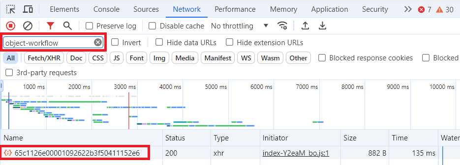
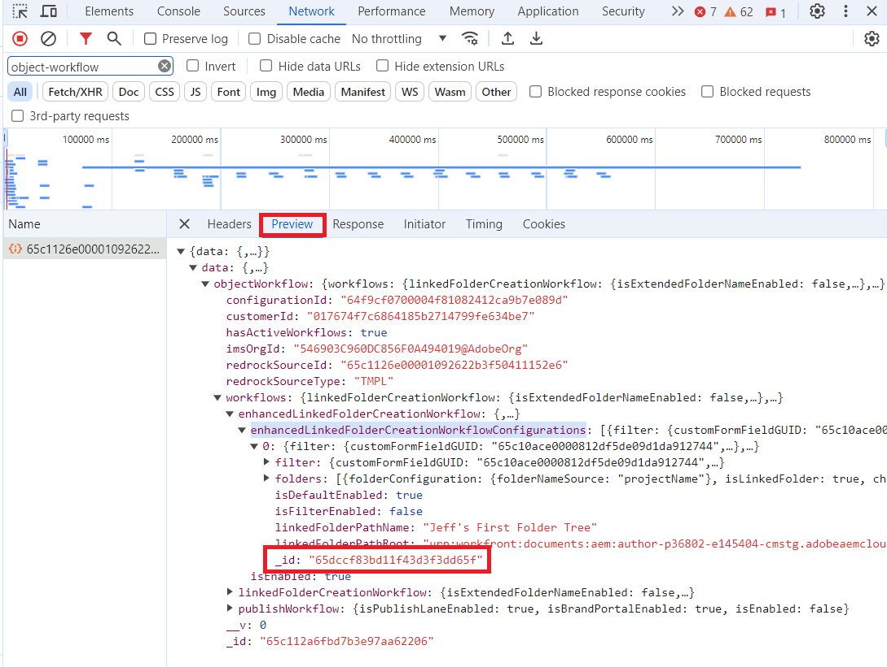

# Verwenden Sie Workfront Fusion, um ein Workfront-Problem in ein Projekt mit Adobe Experience Manager-Workflows zu konvertieren.

Wenn Sie ein Projekt mit Workfront Fusion erstellen und Adobe Experience Manager-Workflows in das Projekt einbeziehen möchten, müssen Sie eine bestimmte Konfiguration des Fusion-Moduls verwenden, die in diesem Artikel beschrieben wird.

>[!NOTE]
>
>Workflows sind nur in einer Adobe Experience Manager as a Cloud Service-Integration verfügbar. Sie sind nicht in Integrationen mit Adobe Experience Manager Assets Essentials verfügbar.


## Zugriffsanforderungen

Sie müssen über Folgendes verfügen:

<table>
  <tr>
   <td><strong>Adobe Workfront-Plan*</strong>
   </td>
   <td>Alle
   </td>
  </tr>
  <tr>
   <td><strong>Adobe Workfront-Lizenzen*</strong>
   </td>
   <td>Anforderung oder höher
   </td>
  </tr>
  <tr>
   <td><strong>Produkt</strong>
   </td>
   <td><b>Adobe Experience Manager<b>:
   <ul>
   <li>
   <p>Sie müssen über as a Cloud Service oder Assets Essentials von Experience Manager Assets verfügen und dem Produkt als Benutzer in der Admin Console hinzugefügt werden.</p>
   </li
   ><li>
   <p>Sie müssen über Schreibzugriff auf das Repository in Adobe Experience Manager verfügen.</p>
   </li>
   </ul>
  <b>Workfront Fusion</b>:<p>Neu:</p>
   <ul>
   <li>
   <p>[!UICONTROL Select] oder [!UICONTROL Prime] [!DNL Workfront] Plan: Ihr Unternehmen muss [!DNL Adobe Workfront Fusion].</p>
   </li>
   <li> 
   <p>[!UICONTROL Ultimate] [!DNL Workfront] Plan: [!DNL Workfront Fusion] ist enthalten.</p>
   </li>
   </ul>
   <p>Oder</p>
   <p>Aktuell: Ihr Unternehmen muss Einkäufe tätigen [!DNL Adobe Workfront Fusion].</p>
   </td>
  </tr>
  <tr>
   <td><strong>Konfigurationen auf Zugriffsebene*</strong>
   </td>
   <td>Zugriff auf Dokumente bearbeiten
<p>
<strong>Hinweis: </strong>Wenn Sie immer noch keinen Zugriff haben, fragen Sie Ihren Workfront-Administrator, ob er zusätzliche Zugriffsbeschränkungen für Ihre Zugriffsebene festlegt. Informationen dazu, wie ein Workfront-Administrator Ihre Zugriffsebene ändern kann, finden Sie unter <strong>Benutzerdefinierte Zugriffsebenen erstellen oder ändern</strong>.
   </td>
  </tr>
</table>

## Voraussetzungen

Bevor Sie beginnen

* Ihr Workfront-Administrator muss Workflows in einer Adobe Experience Manager-Integration konfigurieren. Weitere Informationen finden Sie unter [Konfigurieren der as a Cloud Service Integration von Experience Manager Assets](../../administration-and-setup/configure-integrations/configure-aacs-integration.md#set-up-workflows-optional).
* Sie müssen über eine Projektvorlage verfügen, die mit einem Workflow für durch die Adobe Experience Manager-Integration verknüpfte Ordner konfiguriert wurde.
* Sie müssen eine OAuth-Anwendung in Workfront erstellt haben, um die Verbindung für dieses Modul zu konfigurieren.

  Anweisungen finden Sie unter [OAuth-Anwendung erstellen](#create-an-oauth-application) in diesem Artikel.

## Modulkonfiguration

Wenn Sie in Workfront Fusion ein Projekt erstellen möchten, das Adobe Experience Manager-Workflows enthält, müssen Sie das Modul Workfront > Misc Action verwenden.

1. Fügen Sie die **Workfront** > **Verschiedene Aktionen** zu Ihrem Szenario.
1. Im **Verbindung** Wählen Sie die Workfront-Verbindung aus, die eine Verbindung zu dem Konto herstellt, das dieses Modul verwenden soll.

   Anweisungen zum Erstellen einer Verbindung finden Sie unter [Verbinden [!DNL Workfront] nach [!DNL Workfront Fusion]](/help/quicksilver/workfront-fusion/apps-and-their-modules/workfront-modules.md#connect-workfront-to-workfront-fusion) im Artikel Workfront-Module.

   Anweisungen zum Erstellen der Client-ID und des Client-Geheimnisses finden Sie unter [OAuth-Anwendung erstellen](#create-an-oauth-application) in diesem Artikel.

1. Im **Record Type** Feld auswählen `Issue`.
1. Im **Aktion** Feld auswählen `convertToProject`.
1. Im **ID** eingeben oder die Kennung des Problems zuordnen, das Sie in ein Projekt konvertieren.
1. Aktivieren **Erweiterte Einstellungen anzeigen**.
1. Scrollen Sie zum unteren Rand des Moduls und suchen Sie nach der **Projekt (Erweiterte Sammlung)** -Feld.
1. Fügen Sie den folgenden Text in die **Projekt (Erweiterte Sammlung)** -Feld.

   ```
   {
       "aemNativeFolderTreeIDs": ["Folder Tree ID here"],
       "aemNativeFolderWorkflowEnabled": "true",
       "name": "New project name here",
       "templateID": "Template ID here"
   }
   ```

1. Ersetzen `Folder tree ID here` mit den Ordner-IDs.

   Informationen zum Suchen von Ordnerbaum-IDs finden Sie unter [Ordnerbaum-IDs suchen](#locate-folder-tree-ids) in diesem Artikel.

   Um mehr als eine Ordnerstruktur zu verwenden, trennen Sie IDs durch Kommas:

   `"aemNativeFolderTreeIDs": ["Folder tree ID here","Second folder tree ID here"],`
1. Ersetzen `New project name here` mit dem Namen, den das neue Projekt haben wird.
1. Ersetzen `Template ID here` mit der Kennung der Vorlage, die Sie für das neue Projekt verwenden.

   Sie können die Vorlagen-ID einem vorherigen Modul zuordnen (z. B. Workfront > Suchmodul) oder sie in der URL der Vorlagenseite in Workfront suchen.

1. Klicks **OK** , um die Modulkonfiguration zu speichern.

## Ordnerbaum-IDs suchen

Suchen der Ordnerbaum-IDs:

>[!NOTE]
>
>Diese Anweisungen verwenden den Chrome-Browser.

1. Öffnen Sie in Workfront die Vorlage, die Sie für dieses Projekt verwenden möchten. Diese Vorlage muss die Adobe Experience Manager-Konfiguration enthalten, die Sie für das Projekt verwenden möchten.
1. Öffnen Sie die Entwicklertools für Ihren Browser.
1. Öffnen Sie die **Netzwerk** in den Entwickler-Tools.
1. Im **Filter** eingeben. `object-workflow`.
1. Klicken Sie in der Spalte Name auf die alphanumerische ID, die angezeigt wird.

   

1. Klicken Sie auf **Vorschau** rechts neben der alphanumerischen ID.
1. Öffnen Sie die folgenden reduzierten Abschnitte:
   1. `data`
   1. `objectWorkflow`
   1. `workflows`
   1. `enhancedLinkedFolderCreationWorkflow`
   1. `enhancedLinkedFolderCreationWorkflowConfigurations`

   Jeder Ordnerbaum wird durch eine Zahl dargestellt. 0 (null) steht für den ersten Ordner in der Liste, 1 für den zweiten usw. Wenn die Vorlage nur eine Ordnerstruktur enthält, ist sie die Nummer 0.

1. Öffnen Sie die Ordnerstruktur, die Sie für das neue Projekt verwenden möchten. Beachten Sie die `_id` Feldwert. Wenn Sie mehr als einen Ordnerbaum verwenden möchten, notieren Sie sich alle `_id` Feldwerte für die Ordnerbäume, die Sie verwenden möchten.

   

   Dies sind die `aemNativeFolderTreeIDs`  -Werte, die Sie in **Projekt (Erweiterte Sammlung)** im Feld **Workfront** > **Verschiedene Aktionen** Fusionsmodul.

## OAuth-Anwendung erstellen

Sie müssen in Workfront eine OAuth-Anwendung für die Verbindung dieses Moduls einrichten. Sie müssen dies nur einmal für eine bestimmte Workfront-Verbindung in Fusion tun.

1. Beginnen Sie in Workfront mit der Erstellung einer OAuth-Anwendung, wie unter [Erstellen einer OAuth2-Anwendung mit Benutzeranmeldeinformationen (Autorisierungscode-Fluss)](/help/quicksilver/administration-and-setup/configure-integrations/create-oauth-application.md#create-an-oauth2-application-using-user-credentials-authorization-code-flow) im Artikel OAuth2-Anwendungen erstellen für [!DNL Workfront] Integrationen.
1. Kopieren Sie die Client-ID und das Client-Geheimnis an einen sicheren Speicherort.
1. Im **Umleitungs-URIs** Geben Sie Folgendes ein:

   ```
   http://app.workfrontfusion.com/oauth/cb/workfront-workfront
   ```

1. Klicken Sie auf **Speichern**.

Sie verwenden diese Client-ID und das Client-Geheimnis bei der Konfiguration der Verbindung des Moduls in Fusion.

Anweisungen zum Erstellen einer Verbindung finden Sie unter [Verbinden [!DNL Workfront] nach [!DNL Workfront Fusion]](/help/quicksilver/workfront-fusion/apps-and-their-modules/workfront-modules.md#connect-workfront-to-workfront-fusion) im Artikel Workfront-Module.

