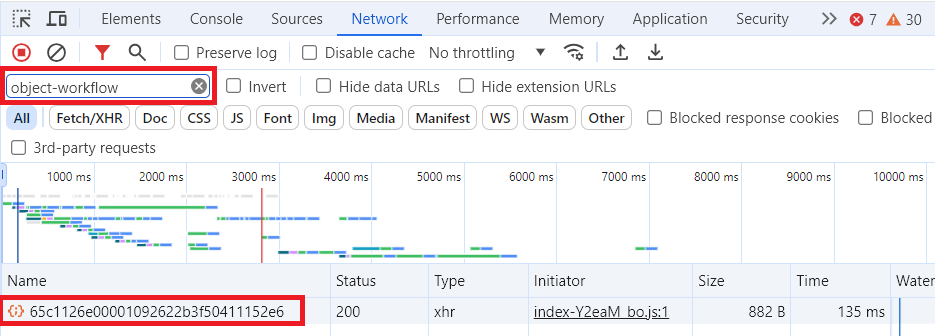

# Verwenden Sie Workfront Fusion, um ein Workfront-Problem in ein Projekt mit Adobe Experience Manager-Workflows zu konvertieren

If you are creating a project through Workfront Fusion and want to include Adobe Experience Manager workflows on the project, you must use a specific Fusion module configuration, described in this article.

>[!NOTE]
>
>Workflows are available only in an Adobe Experience Manager as a Cloud Service integration. They are not available in integrations with Adobe Experience Manager Assets Essentials.<br>
>Diese Funktion ist im Bereich Neue Dokumente nicht verfügbar.


## Zugriffsanforderungen

+++ Erweitern, um die Zugriffsanforderungen für die in diesem Artikel beschriebene Funktionalität anzuzeigen.

<table>
  <tr>
    <td><strong>Adobe Workfront-Paket</strong></td>
   <td> <p>Ein beliebiges Adobe Workfront Workflow- und Adobe Workfront Automation and Integration-Paket</p><p>Workfront Ultimate</p><p>Workfront Prime- und Select-Pakete bei zusätzlichem Kauf von Workfront Fusion.</p> </td> 
  </tr>
  <tr>
   <td><strong>Adobe Workfront-Lizenzen</strong></td>
   <td><p>Mitwirkende oder höher</p><p>Anfragende oder höher</p></td>
  </tr>
  <tr>
   <td><strong>Produkt</strong></td>
   <td>
     <p><b>Adobe Experience Manager:</b></p>
     <ul>
       <li>
         <p>You must have Experience Manager Assets as a Cloud Service or Assets Essentials, and you must be added to the product as a user in the Admin Console.</p>
       </li>
       <li>
        <p>You must have write access to the repository in Adobe Experience Manager.</p>
       </li>
     </ul>
     <p><b>Workfront Fusion:</b></p>
     <ul>
       <li>
        <p>Wenn Ihre Organisation über ein Workfront Select- oder Prime-Paket ohne Workfront Automation and Integration verfügt, muss Ihre Organisation Adobe Workfront Fusion erwerben.</li></ul>
       </li>
     </ul>
   </td>
  </tr>
  <tr>
   <td><strong>Konfigurationen der Zugriffsebene</strong>
   </td>
   <td><p>Zugriffrecht „Bearbeiten“ für Dokumente</p>
   </td>
  </tr>
</table>

+++

## Voraussetzungen

Bevor Sie beginnen,

* Your Workfront administrator must configure workflows in an Adobe Experience Manager integration. For more information, see [Configure the Experience Manager Assets as a Cloud Service integration](../../administration-and-setup/configure-integrations/configure-aacs-integration.md#set-up-workflows-optional).
* You must have a project template configured with an Adobe Experience Manager integration linked folder workflow.
* You must have created an OAuth application in Workfront to configure the connection for this module.

  For instructions, see [Create an OAuth application](#create-an-oauth-application) in this article.

## Module configuration

In Workfront Fusion, if you want to create a project that includes Adobe Experience Manager workflows, you must use the Workfront > Misc Action module.

1. Add the **Workfront** > **Misc Action** module to your scenario.
1. In the **Connection** field, select the Workfront connection that connects to the account this module will use.

   For instructions on creating a connection, see [Connect [!DNL Workfront] to [!DNL Workfront Fusion]](https://experienceleague.adobe.com/de/docs/workfront-fusion/using/references/apps-and-their-modules/adobe-connectors/workfront-modules#connect-workfront-to-workfront-fusion) in the article Workfront modules.

   For instructions on creating the Client ID and Client Secret you will need to create a connection, see [Create an OAuth application](#create-an-oauth-application) in this article.

1. Wählen Sie **Feld** Datensatztyp“ `Issue` aus.
1. In the **Action** field, select `convertToProject`.
1. In the **ID** field, enter or map the ID of the issue that you are converting to a project.
1. Enable **Show advanced settings**.
1. Scroll to the bottom of the module and locate the **Project (Advanced Collection)** field.
1. Paste the following text into the **Project (Advanced Collection)** field.

   ```
   {
       "aemNativeFolderTreeIDs": ["Folder Tree ID here"],
       "aemNativeFolderWorkflowEnabled": "true",
       "name": "New project name here",
       "templateID": "Template ID here"
   }
   ```

1. Replace `Folder tree ID here` with the folder IDs.

   To locate folder tree IDs, see [Locate folder tree IDs](#locate-folder-tree-ids) in this article.

   To use more than one folder tree, separate IDs with a comma:

   `"aemNativeFolderTreeIDs": ["Folder tree ID here","Second folder tree ID here"],`
1. Replace `New project name here` with the name that the new project will have.
1. Replace `Template ID here` with the ID of the template that you are using for the new project.

   You can map the template ID from a previous module (such as a Workfront > Search module) or locate it in the URL of the template&#39;s page in Workfront.

1. Click **OK** to save the module configuration.

## Locate folder tree IDs

To locate the folder tree IDs:

>[!NOTE]
>
>These instructions use the Chrome browser.

1. In Workfront, open the template that you want to use for this project. This template must include the Adobe Experience Manager configuration that you want to use for the project.
1. Open the developer tools for your browser.
1. Open the **Network** tab in the developer tools.
1. In the **Filter** box, enter `object-workflow`.
1. In the Name column, click on the alphanumeric ID that appears.

   

1. Click the **Preview** tab to the right of the alphanumeric ID.
1. Open the following collapsed sections:
   1. `data`
   1. `objectWorkflow`
   1. `workflows`
   1. `enhancedLinkedFolderCreationWorkflow`
   1. `enhancedLinkedFolderCreationWorkflowConfigurations`

   Jede Ordnerstruktur wird durch eine Zahl dargestellt. 0 (Null) steht für den ersten Ordner in der Liste, 1 steht für den zweiten Ordner usw. Wenn die Vorlage nur eine Ordnerstruktur enthält, ist dies die Zahl 0.

1. Öffnen Sie die Ordnerstruktur, die Sie für das neue Projekt verwenden möchten. Notieren Sie sich den Wert des `_id`. Wenn Sie mehr als eine Ordnerstruktur verwenden möchten, notieren Sie sich alle `_id` Feldwerte für die Ordnerbäume, die Sie verwenden möchten.

   

   Dies sind die `aemNativeFolderTreeIDs` Werte, die Sie in das Feld **Projekt (Erweiterte Sammlung)** im Modul **Workfront** > **Misc Actions** eingeben.

## Erstellen einer OAuth-Anwendung

Für die Verbindung dieses Moduls müssen Sie in Workfront eine OAuth-Anwendung einrichten. Sie müssen dies nur einmal für eine bestimmte Workfront-Verbindung in Fusion tun.

1. Beginnen Sie in Workfront mit der Erstellung einer OAuth-Anwendung, wie beschrieben unter [Erstellen einer OAuth2-Anwendung mit Benutzeranmeldeinformationen (Autorisierungs-Code-Fluss)](/help/quicksilver/administration-and-setup/configure-integrations/create-oauth-application.md#create-an-oauth2-application-using-user-credentials-authorization-code-flow) im Artikel Erstellen von OAuth2-Anwendungen für [!DNL Workfront] Integrationen.
1. Kopieren Sie die Client-ID und den geheimen Client-Schlüssel an einen sicheren Speicherort.
1. Geben Sie **Feld** Umleitungs-URIs“ Folgendes ein:

   ```
   http://app.workfrontfusion.com/oauth/cb/workfront-workfront
   ```

1. Klicken Sie auf **Speichern**.

Diese Client-ID und dieses Client-Geheimnis werden beim Konfigurieren der Verbindung des Moduls in Fusion verwendet.

Anweisungen zum Erstellen einer Verbindung finden Sie unter [Verbinden [!DNL Workfront] mit [!DNL Workfront Fusion]](https://experienceleague.adobe.com/de/docs/workfront-fusion/using/references/apps-and-their-modules/adobe-connectors/workfront-modules#connect-workfront-to-workfront-fusion) im Artikel Workfront-Module.
