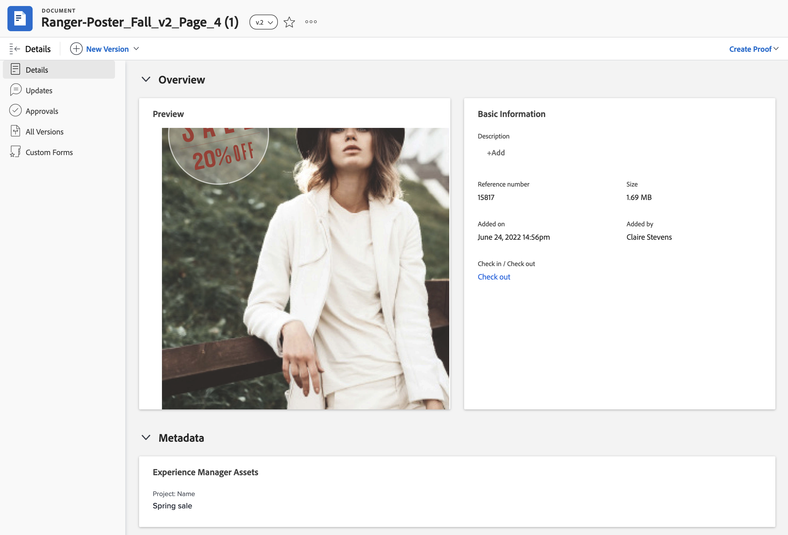

# Zugeordnete Metadaten für Experience Manager Assets oder Assets Essentials anzeigen

Im Bedienfeld Dokumentdetails und Zusammenfassung für Dokumente wird eine Echtzeitansicht der zugeordneten Metadaten angezeigt. Metadatenfelder werden zuerst zugeordnet, wenn Sie ein Asset von Workfront an Experience Manager Assets oder Assets Essentials senden. Wenn Ihr Workfront-Administrator die Synchronisierung von Objektmetadaten aktiviert hat, bleiben die Felder immer auf dem neuesten Stand, wenn sie in beiden Anwendungen geändert werden.

## Zugriffsanforderungen

Sie müssen über Folgendes verfügen:

<table>
  <tr>
   <td><strong>Adobe Workfront-Plan*</strong>
   </td>
   <td>Alle
   </td>
  </tr>
  <tr>
   <td><strong>Adobe Workfront-Lizenzen*</strong>
   </td>
   <td>Anforderung oder höher
   </td>
  </tr>
  <tr>
   <td><strong>Produkt</strong>
   </td>
   <td>Sie müssen über as a Cloud Service oder Assets Essentials von Experience Manager Assets verfügen und dem Produkt als Benutzer in der Admin Console hinzugefügt werden.
   </td>
  </tr>
  <tr>
   <td><strong>Konfigurationen auf Zugriffsebene*</strong>
   </td>
   <td>Zugriff auf Dokumente bearbeiten

<strong>Hinweis: </strong>Wenn Sie immer noch keinen Zugriff haben, fragen Sie Ihren Workfront-Administrator, ob er zusätzliche Zugriffsbeschränkungen für Ihre Zugriffsebene festlegt. Informationen dazu, wie ein Workfront-Administrator Ihre Zugriffsebene ändern kann, finden Sie unter <strong>Benutzerdefinierte Zugriffsebenen erstellen oder ändern</strong>.
   </td>
  </tr>
  <tr>
   <td><strong>Objektberechtigungen</strong>
   </td>
   <td>Zugriff anzeigen oder höher

Weitere Informationen zum Anfordern von zusätzlichem Zugriff finden Sie unter <strong>Anfordern des Zugriffs auf Objekte </strong>.
   </td>
  </tr>
</table>

*Wenden Sie sich an Ihren Workfront-Administrator, um zu erfahren, welchen Plan, welchen Lizenztyp oder welchen Zugriff Sie haben.

## Voraussetzungen

Bevor Sie beginnen

* Ihr Workfront-Administrator muss eine Experience Manager-Integration konfigurieren. Weitere Informationen finden Sie unter [Konfigurieren der Experience Manager Assets as a Cloud Service-Integration](/help/quicksilver/administration-and-setup/configure-integrations/configure-aacs-integration.md) oder [Konfigurieren der Experience Manager Assets Essentials-Integration](/help/quicksilver/documents/adobe-workfront-for-experience-manager-assets-essentials/setup-asset-essentials.md).

## Dokumentdetails

So öffnen Sie das Metadatenbedienfeld in den Dokumentdetails:

1. Wechseln Sie zum Projekt, zur Aufgabe oder zum Problem, das/das das Dokument enthält, und wählen Sie dann **Dokumente** aus.
1. Bewegen Sie den Mauszeiger über das gewünschte Dokument und wählen Sie dann **Dokumentdetails** aus.
1. Suchen und erweitern Sie den Abschnitt **Metadaten** .
   >[!NOTE]
   >
   >Die Felder in diesem Abschnitt können nicht bearbeitet werden. Sie sind schreibgeschützt.

## Zusammenfassung für Dokumente

So öffnen Sie das Metadatenbedienfeld im Bereich &quot;Zusammenfassung&quot;:

1. Wechseln Sie zum Projekt, zur Aufgabe oder zum Problem, das/das das Dokument enthält, und wählen Sie dann **Dokumente** aus.
1. Suchen Sie das gewünschte Dokument.
1. Klicken Sie auf das Symbol **Zusammenfassung**  und erweitern Sie dann den Abschnitt **Metadaten** .
   >[!NOTE]
   >
   >Die Felder in diesem Abschnitt können nicht bearbeitet werden. Sie sind schreibgeschützt.

