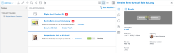

# Verknüpftes Asset aus Experience Manager Assets oder Assets Essentials anzeigen oder herunterladen

Sie können ein Asset in Adobe Workfront anzeigen oder herunterladen, das über Experience Manager Assets oder Assets Essentials verknüpft ist.

## Zugriffsanforderungen

Sie müssen über Folgendes verfügen:

<table style="table-layout:auto"> 
 <col> 
 <col> 
 <tbody> 
  <tr> 
   <td role="rowheader">Adobe Workfront-Plan*</td> 
   <td> 
 Alle
 </td> 
  </tr> 
  <tr> 
   <td role="rowheader">Adobe Workfront-Lizenzen*</td> 
   <td> 
Anforderung oder höher
 </td> 
  </tr> 
  <tr> 
   <td role="rowheader">Produkt</td> 
   <td>Sie müssen über Experience Manager as a Cloud Service oder Assets Essentials verfügen und dem Produkt als Benutzer in der Admin Console hinzugefügt werden.</td> 
  </tr> 
  <tr> 
   <td role="rowheader">Konfigurationen auf Zugriffsebene*</td> 
   <td> 
Zugriff auf Dokumente bearbeiten
 
Hinweis: Wenn Sie immer noch keinen Zugriff haben, fragen Sie Ihren Workfront-Administrator, ob er zusätzliche Zugriffsbeschränkungen für Ihre Zugriffsebene festlegt. Informationen dazu, wie ein Workfront-Administrator Ihre Zugriffsebene ändern kann, finden Sie unter <a href="../../administration-and-setup/add-users/configure-and-grant-access/create-modify-access-levels.md" class="MCXref xref">Benutzerdefinierte Zugriffsebenen erstellen oder ändern</a>.
 </td> 
  </tr> 
  <tr> 
   <td role="rowheader">Objektberechtigungen</td> 
   <td> 
Zugriff anzeigen oder höher
 
Weitere Informationen zum Anfordern von zusätzlichem Zugriff finden Sie unter <a href="../../workfront-basics/grant-and-request-access-to-objects/request-access.md" class="MCXref xref">Anfordern des Zugriffs auf Objekte </a>.
 </td> 
  </tr> 
 </tbody> 
</table>

&#42;Wenden Sie sich an Ihren Workfront-Administrator, um zu erfahren, welchen Plan, welchen Lizenztyp oder welchen Zugriff Sie haben.

## Voraussetzungen

Bevor Sie beginnen

* Ihr Workfront-Administrator muss eine Experience Manager-Integration konfigurieren. Weitere Informationen finden Sie unter [Konfigurieren der Experience Manager Assets as a Cloud Service-Integration](/help/quicksilver/administration-and-setup/configure-integrations/configure-aacs-integration.md) oder [Konfigurieren der Experience Manager Assets Essentials-Integration](/help/quicksilver/documents/adobe-workfront-for-experience-manager-assets-essentials/setup-asset-essentials.md).

## Verknüpftes Asset anzeigen oder herunterladen

1. Suchen Sie das Dokument, das Sie anzeigen oder herunterladen möchten.
1. Wählen Sie in der Dokumentliste das Dokument aus.
1. Bewegen Sie in der Dokumentzusammenfassung auf der rechten Seite den Mauszeiger über die Miniaturansicht oben und wählen Sie **Vorschau** oder **Download** aus.

   
