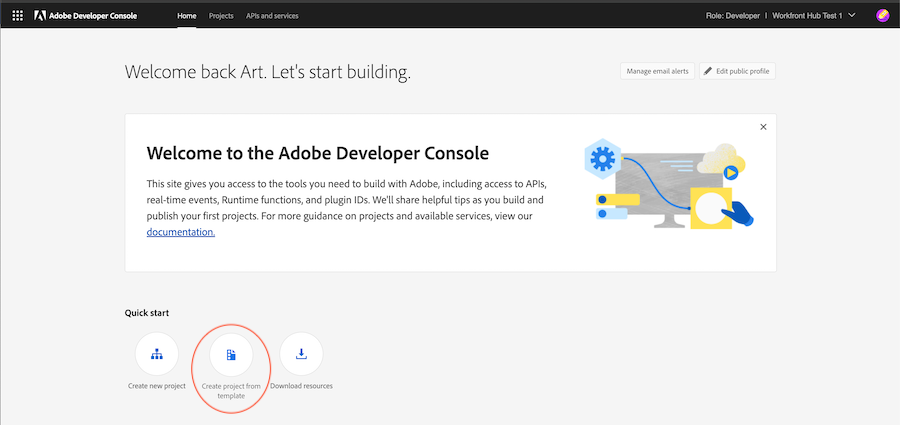

# AppBuilder in den Dokumentdetails zu Workfront

Sie können AppBuilder in den Dokumentdetails installieren.

## Voraussetzungen

Sie müssen über Folgendes verfügen:

* Ein IMS-aktiviertes Workfront-Konto
* Ein Entwicklungscomputer mit Knoten v18 und npm

## Entwickler zur Admin Console hinzufügen

>[!IMPORTANT]
>
>Stellen Sie sicher, dass Sie für alle folgenden Schritte die richtige IMS-Organisation ausgewählt haben. Wenn Sie mehreren Organisationen angehören, können Sie die falsche auswählen. Vergewissern Sie sich, dass Sie unter der richtigen Organisation agieren, die normalerweise oben rechts aufgeführt ist.


1. Navigieren Sie zu einer der folgenden Optionen:

* Staging: [https://stage.adminconsole.adobe.com/](https://stage.adminconsole.adobe.com/)
* Prod: [https://adminconsole.adobe.com/](https://adminconsole.adobe.com/)

1. Klicken Sie im Abschnitt Benutzer auf **Entwickler** > **Entwickler hinzufügen**.

   

   >[!NOTE]
   >
   >Wenn Ihnen keine Option zum Verwalten von Entwicklern angezeigt wird, verfügen Sie nicht über ein Produkt, das Dev-Zugriff ermöglicht. Workfront bietet keinen Entwicklerzugriff, AEM aber schon. Wenn Sie dies nicht sehen, müssen wir herausfinden, wie Workfront in die Liste der Apps aufgenommen werden kann, die Entwicklern ermöglichen.

1. Fügen Sie die E-Mail des Benutzers hinzu. Es sollte nach vorhandenen Benutzern suchen, die bereits in der Admin Console hinzugefügt wurden.

1. Fügen Sie dem Entwicklerprofil die erforderlichen Produkte hinzu und klicken Sie auf **Speichern**.


## Zugriff auf AppBuilder

Unternehmen müssen mit ihren Kundenbetreuern zusammenarbeiten, um AppBuilder zu erwerben. Der genaue Prozess dafür wird nicht verstanden, weil wir dies nicht für den POC tun mussten.

Wenn Sie die AppBuilder-Integration testen möchten, können Sie hier eine kostenlose Testversion für Ihre IMS-Organisation anfordern:
[https://developer.adobe.com/app-builder/trial/#](https://developer.adobe.com/app-builder/trial/#)

Ich habe den Eindruck, dass, obwohl es sich um eine kostenlose 30-Tage-Studie handelt, sie den Prozess nach dieser Zeit nicht mehr deaktivieren werden.

Wenn AppBuilder ordnungsgemäß konfiguriert ist, sollte &quot;Projekt aus Vorlage erstellen&quot;als Teil der Erstellung eines neuen Projekts angezeigt werden (siehe nächsten Abschnitt).

## Neues Projekt in der Entwicklungskonsole erstellen

1. Klicks **Projekt aus Vorlage erstellen**.

   >[!IMPORTANT]
   >
   >Wenn diese Option nicht angezeigt wird, sind Sie in der Admin Console falsch konfiguriert und haben keinen Zugriff auf den App Builder-Katalog. Diese Option wird nur angezeigt, wenn Sie Zugriff auf AppBuilder haben.

   

1. Auswählen **App Builder**.

1. Geben Sie einen **Projekttitel** und **App-Name**. Beide Standardwerte sind vorhanden, es ist jedoch einfacher, das gewünschte Projekt später zu identifizieren, wenn Sie den Wert anpassen.

   >[!NOTE]
   >
   >Es gibt eine Option zum Hinzufügen zusätzlicher Arbeitsbereiche für diesen Schritt. Es wurde vorgeschlagen, für jeden Entwickler einen Arbeitsbereich zu erstellen. Dadurch werden Geheimnisse und Bereitstellungen voneinander getrennt, während Entwickler arbeiten. Sie sollten den Arbeitsbereich mit dem Namen des Entwicklers benennen, der ihn verwendet. Die AIO-CLI verfügt über Optionen zum Wechseln des Arbeitsbereichs, den wir später behandeln werden.


1. Urlaub **Laufzeiteinschluss** ausgewählt ist. Ich weiß nicht, warum, wirklich, aber ändere es nicht!

1. Klicken Sie auf **Speichern**.

## Adobe IO (aio) CLI

Adobe bietet eine Open-Source-CLI, die zur Erstellung der App Builder-Anwendungen verwendet werden kann. Die Dokumentation finden Sie hier: [https://github.com/adobe/aio-cli](https://github.com/adobe/aio-cli) sowie Adobe App Builder-Anweisungen [https://developer.adobe.com/app-builder/docs/getting_started/first_app/](https://developer.adobe.com/app-builder/docs/getting_started/first_app/).

1. Installation
   1. Um das Tool zu installieren (stellen Sie sicher, dass Sie sich zuerst auf Knoten v18 befinden), führen Sie Folgendes aus: `npm install -g @adobe/aio-cli `.

1. In Terminal authentifizieren
   1. Starten Sie Ihr Terminal und melden Sie sich mit dem Befehl bei AIO an: `aio login`.

1. Initialisieren der Anwendung
   1. Beginnen Sie mit der Einrichtung Ihrer App, indem Sie Folgendes ausführen: `aio app init example-app`.

1. Konfigurationsauswahl
   1. Fahren Sie fort, um Ihre Organisation und Ihr Projekt aus den bereitgestellten Optionen auszuwählen.\
      
      

1. Vorlagenauswahl und -einrichtung
   1. Alle verfügbaren Vorlagen durchsuchen und die **@adobe/aem-cf-editor-ui-ext-tpl** Vorlage für Ihr Projekt.
      
      

1. Erweiterung definieren
   1. Benennen Sie Ihre Erweiterung.
   1. Geben Sie eine beschreibende Zusammenfassung der Funktionen Ihrer Erweiterung.
   1. Wählen Sie eine Anfangsversionsnummer aus, mit der Sie beginnen möchten.
   1. Fertigstellen durch Auswahl von **Ich bin fertig**.
      

1. Navigieren Sie zu Ihrem Projektordner
   1. Zugriff auf den Ordner src
   1. Ordner umbenennen `aem-cf-editor-1` nach `workfront-doc-details-1`.

1. Konfigurationsdateien ändern
   1. Öffnen Sie app.config.yaml
   1. Aktualisieren der Zeile aus `aem/cf-editor/1` nach `workfront/doc-details/1`.
   1. Passen Sie den Einfügepfad von an. `src/aem-cf-editor-1/ext.config.yaml` nach `src/workfront-doc-details-1/ext.config.yaml`.

1. Bearbeiten der Erweiterungsregistrierungskomponente
   1. Öffnen `src/workfront-doc-details-1/web-src/src/components/ExtensionRegistration.js`.
   1. Fügen Sie im Abschnitt Methoden eine Funktion hinzu `secondaryNav` , die eine asynchrone Funktion enthält `getButtons`.
   1. `getButtons` sollte ein Objekt mit der folgenden Struktur empfangen:

      ```
          {
          docId: "String",  // Document ID
          docvId: "String", // Document version ID
          sharedContext: {
              hostname: "String",
              protocol: "String",
              auth: {
              imsOrgID: "String",    // Customer's IMS Org ID
              imsToken: "String",    // User's IMS token
              imsClientId: "String"
              }
          }
          }
      ```

1. Diese Funktion gibt ein Array von Schaltflächenobjekten zurück, die in der Navigation angezeigt werden:

   ```
       methods: {
       secondaryNav: {
           async getButtons({docId, docvId, sharedContext}) {
           return [
               { label: 'Registration', url: '/index.html' },
               { label: 'Review', url: '/index.html#review' }
           ];
           }
       }
       }
   ```

1. Konfigurieren von Anwendungs-Routing
   1. Öffnen Sie Ihre Datei &quot;App.js&quot;und konfigurieren Sie die Routen, um die neu entwickelten Funktionen einzuschließen. Sie müssen Routen für die Standardansicht und alle weiteren Ansichten wie die Überprüfungsseite einrichten. So können Sie diese Routen definieren:

      ```
          <Route index element={<ExtensionRegistration />} />
          <Route exact path="index.html" element={<ExtensionRegistration />} />
          <Route exact path="review" element={<Review />} />
      ```

1. Dokumentdetails aufrufen
   1. Implementieren der bereitgestellten Funktion `document.getDocumentDetails` in Ihrer Anwendung, um wichtige Dokumentspezifikationen abzurufen. Diese Funktion ruft ein Objekt ab, das `docId` und `docvId`, neben `sharedContext` Objekt mit `hostname`, `protocol`, und Authentifizierungsdetails. Stellen Sie sicher, dass Ihre Anwendung diese Daten ordnungsgemäß verarbeitet.

1. Integrieren des Datenabrufs in Ihre Komponenten
   1. Fügen Sie dem Komponentenordner Ihrer Anwendung eine neue Komponente hinzu. Richten Sie in dieser Komponente eine Verbindung zu Workfront ein, um Dokumentinformationen und Authentifizierungsdaten mithilfe der mit der Host-Anwendung eingerichteten Verbindung abzurufen. Im Folgenden finden Sie ein Beispiel dafür, wie Sie Ihre Komponente strukturieren können, um dies zu handhaben:

      ```
          import { useEffect, useState } from 'react';
          import { attach } from "@adobe/uix-guest";
          import { extensionId } from "./Constants";
      
          function Review() {
              const [conn, setConn] = useState();
      
              useEffect(() => {
              const iife = async () => {
                  // "attach" the guest application to the host. This creates a "tunnel" from the host app that allows data to be passed to the iframe running this app.
                  const connection = await attach({
                  id: extensionId,
                  });
                  setConn(connection);
              };
      
              iife();
              }, []);
      
              useEffect(() => {
                  if (conn) {
                      // Using the connection created above, grab the document details from the host tunnel.
                      conn?.host?.document?.getDocumentDetails().then(setDocDetails);
                      // Pull the auth tokens from the sharedContext (see host app for details)
                      setAuth(conn?.sharedContext?.get("auth"));
                      setHostname(conn?.sharedContext?.get("hostname"));
                      setProtocol(conn?.sharedContext?.get("protocol"));
                  }
              }, [conn]);
      
          return (<>Text</>);
          }
      
          export default Review;
      ```

## Konfiguration vorhandener AIO-Projekte

1. Konfigurationsdateien aktualisieren
   1. Öffnen `app.config.yaml`.
   1. Ändern Sie die Konfiguration, indem Sie den Verweis von `aem/cf-editor/1` nach `workfront/doc-details/1`. Durch diese Anpassung werden die Dateipfade an der aktuellen Projektstruktur ausgerichtet.

1. Überarbeiten der Erweiterungsregistrierungskomponente
   1. Suchen und öffnen Sie die Datei namens `ExtensionRegistration.js`.
   1. Fügen Sie im Abschnitt Methoden eine Funktion hinzu `secondaryNav` , die eine asynchrone Funktion enthält `getButtons`.
   1. `getButtons` sollte ein Objekt mit der folgenden Struktur empfangen:

      ```
          {
          docId: "String",  // Document ID
          docvId: "String", // Document version ID
          sharedContext: {
              hostname: "String",
              protocol: "String",
              auth: {
              imsOrgID: "String",    // Customer's IMS Org ID
              imsToken: "String",    // User's IMS token
              imsClientId: "String"
              }
          }
          }
      ```

1. Diese Funktion gibt ein Array von Schaltflächenobjekten zurück, die in der Navigation angezeigt werden:

   ```
       methods: {
       secondaryNav: {
           async getButtons({docId, docvId, sharedContext}) {
           return [
               { label: 'Registration', url: '/index.html' },
               { label: 'Review', url: '/index.html#review' }
           ];
           }
       }
       }
   ```

1. Konfigurieren von Anwendungs-Routing
   1. Öffnen Sie Ihre `App.js`die Routen zu speichern und zu konfigurieren, um die neu entwickelten Funktionen einzuschließen. Sie müssen Routen für die Standardansicht und alle weiteren Ansichten wie die Überprüfungsseite einrichten. So können Sie diese Routen definieren:

      ```
          <Route index element={<ExtensionRegistration />} />
          <Route exact path="index.html" element={<ExtensionRegistration />} />
          <Route exact path="review" element={<Review />} />
      ```

1. Dokumentdetails aufrufen
   1. Implementieren der bereitgestellten Funktion `document.getDocumentDetails` in Ihrer Anwendung, um wichtige Dokumentspezifikationen abzurufen. Diese Funktion ruft ein Objekt ab, das `docId` und `docvId`, neben `sharedContext` Objekt mit `hostname`, `protocol`, und Authentifizierungsdetails. Stellen Sie sicher, dass Ihre Anwendung diese Daten ordnungsgemäß verarbeitet.

1. Integrieren des Datenabrufs in Ihre Komponenten
   1. Fügen Sie dem Komponentenordner Ihrer Anwendung eine neue Komponente hinzu. Richten Sie in dieser Komponente eine Verbindung zu Workfront ein, um Dokumentinformationen und Authentifizierungsdaten mithilfe der mit der Host-Anwendung eingerichteten Verbindung abzurufen. Im Folgenden finden Sie ein Beispiel dafür, wie Sie Ihre Komponente strukturieren können, um dies zu handhaben:

      ```
          import { useEffect, useState } from 'react';
          import { attach } from "@adobe/uix-guest";
          import { extensionId } from "./Constants";
      
          function Review() {
              const [conn, setConn] = useState();
      
              useEffect(() => {
              const iife = async () => {
                  // "attach" the guest application to the host. This creates a "tunnel" from the host app that allows data to be passed to the iframe running this app.
                  const connection = await attach({
                  id: extensionId,
                  });
                  setConn(connection);
              };
      
              iife();
              }, []);
      
              useEffect(() => {
                  if (conn) {
                      // Using the connection created above, grab the document details from the host tunnel.
                      conn?.host?.document?.getDocumentDetails().then(setDocDetails);
                      // Pull the auth tokens from the sharedContext (see host app for details)
                      setAuth(conn?.sharedContext?.get("auth"));
                      setHostname(conn?.sharedContext?.get("hostname"));
                      setProtocol(conn?.sharedContext?.get("protocol"));
                  }
              }, [conn]);
      
          return (<>Text</>);
          }
      
          export default Review;
      ```

## Anwendungen veröffentlichen

>[!IMPORTANT]
>
>Stellen Sie sicher, dass Sie für jeden der folgenden Schritte die richtige IMS-Organisation ausgewählt haben.

Damit eine Gastanwendung in Workfront geladen werden kann, muss die Anwendung in den Produktionsarbeitsbereich verschoben und zur Genehmigung eingereicht werden.

1. Bereitstellen der Anwendung im Produktionsarbeitsbereich
   1. `aio app use -w Production `
   1. `aio app deploy `

1. Navigieren Sie zu [https://developer-stage.adobe.com/](https://developer-stage.adobe.com/) oder [https://developer.adobe.com/](https://developer.adobe.com/).
   1. Klicks **Konsole** in der oberen rechten Ecke.

1. Suchen Sie nach dem Projekt, das Sie zum Erstellen der AppBuilder-Anwendung verwendet haben.

1. Wählen Sie den Arbeitsbereich Produktion aus.
   

1. Senden Sie die Anwendung für die private Überprüfung (Sie erhalten Warnungen, dass wir die Veröffentlichung nicht auf dem App Exchange Marketplace durchführen, was gut ist).

1. Füllen Sie das Formular aus (Titel, Beschreibung, Symbol und Hinweis für den Validierer).
   

>[!IMPORTANT]
>
>Nach der Übermittlung muss ein Systemadministrator für die Organisation die Übermittlung genehmigen.

## Genehmigung der Übermittlung

1. Als Systemadministrator navigieren Sie zu [https://stage.exchange.adobe.com/](https://stage.exchange.adobe.com/) oder [https://exchange.adobe.com/](https://exchange.adobe.com/).

1. Klicks **Verwalten** > **Experience Cloud-Anwendungen**. Sie sollten die gesendeten Apps mit Optionen zur Genehmigung/Ablehnung sehen.
Nach der Genehmigung sollten die veröffentlichten Anwendungserweiterungen automatisch in Ihre Workfront-Umgebung geladen werden.

   

## Zusätzliche Hilfe

Adobe verfügt über eine hervorragende Dokumentation zu den ersten Schritten zum Erstellen von Apps für AppBuilder und deren Bereitstellung.

Hier sind einige hilfreiche Links:

* [https://developer.adobe.com/app-builder/docs/getting_started/first_app/#4-bootstrapping-new-app-using-the-cli](https://developer.adobe.com/app-builder/docs/getting_started/first_app/#4-bootstrapping-new-app-using-the-cli)

* [https://developer.adobe.com/uix/docs/guides/publication/](https://developer.adobe.com/uix/docs/guides/publication/)

* [https://developer.adobe.com/uix/docs/services/aem-cf-console-admin/extension-development/](https://developer.adobe.com/uix/docs/services/aem-cf-console-admin/extension-development/)

## Lokale Entwicklung

Bei der Entwicklung Ihrer App Builder-Anwendung für Workfront müssen Sie Ihre App möglicherweise in Workfront testen, ohne sie zu veröffentlichen. Glücklicherweise haben wir dafür eine Lösung.

In Ihrer App Builder-App können Sie `aio app run` für die lokale Entwicklung. Dadurch erhalten Sie eine URL, die normalerweise in etwa so aussieht: `https://localhost:9080`. Alternativ können Sie `aio app deploy` , um eine statische Adobe-Domäne zu erhalten. Notieren Sie sich diese URLs für die zukünftige Verwendung.

Navigieren Sie anschließend zur spezifischen Dokumentdetailseite, für die Sie in Ihrem Browser entwickeln möchten. Öffnen Sie die Entwicklertools und greifen Sie auf den lokalen Speicher für workfront.com oder workfront.adobe.com zu. Hier müssen Sie einen Eintrag hinzufügen. Verwendung `appBuilderDocDetailsOverride` als Schlüssel und die zuvor angegebene App Builder-URL als Wert angeben.

Nach dem erneuten Laden Ihrer Seite werden die Schaltflächen in Ihrer App Builder-Anwendung angezeigt. Durch Klicken auf diese Schaltflächen können Sie Ihre App in Aktion anzeigen.