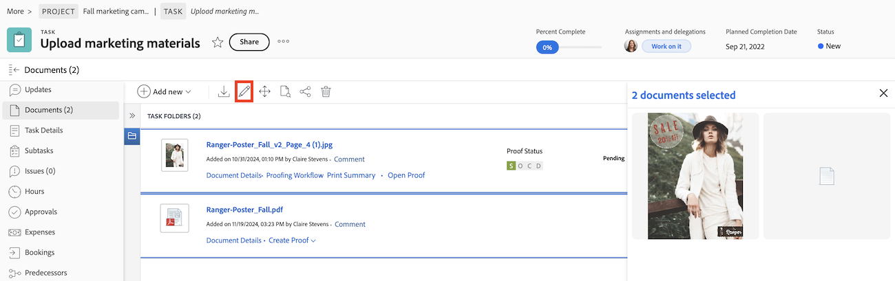

# Dokumente stapelweise bearbeiten

Sie können die Beschreibung bearbeiten, benutzerdefinierte Formulare hinzufügen und benutzerdefinierte Formulare in mehreren Dokumenten gleichzeitig bearbeiten.

## Überlegungen beim Bearbeiten benutzerdefinierter Formulare

Beachten Sie Folgendes, wenn Sie benutzerdefinierte Formulare für Dokumente stapelweise bearbeiten:

* Die Informationen, die Sie für alle ausgewählten Dokumente ändern, überschreiben die vorhandenen Informationen in den einzelnen Dokumenten.
* Wenn Sie Dokumente mit unterschiedlichen Werten für dasselbe Feld auswählen, zeigt das Feld die Kennzeichnung „Mehrere Werte“ an. Bei Feldern, die Kontrollkästchen, Optionsfelder und Umschalter sind, wird neben diesen ein Indikator für „Mehrere Werte“ angezeigt.
* Wenn Sie eine Option in einem Feld mit mehreren Optionen aktualisieren (z. B. in einem Feld, das als eine Reihe von Ein-/Ausschaltfeldern oder Kontrollkästchen angezeigt wird), müssen alle anderen Optionen zwischen den ausgewählten Dokumenten übereinstimmen.

>[!BEGINSHADEBOX]

**Beispiel**
Möglicherweise haben Sie ein benutzerdefiniertes Formular mit einem Kontrollkästchen mit drei Kontrollkästchen (Option 1, Option 2 und Option 3), wobei Option 1 für alle ausgewählten Dokumente deaktiviert ist und Option 2 und 3 für einige Dokumente aktiviert sind und für andere von Ihnen ausgewählte Dokumente deaktiviert ist. Wenn Sie Option 1 für alle Dokumente aktivieren möchten, müssen Sie auch die Optionen 2 und 3 für alle ausgewählten Projekte übereinstimmen lassen, bevor Sie Ihre Änderungen speichern können. Daher müssen Sie sie entweder auswählen oder ihre Auswahl aufheben, damit sie mit allen ausgewählten Projekten übereinstimmen. Wenn Sie keine der Optionen ändern, können Sie das Feld unverändert speichern, und die Dokumente behalten ihre aktuelle Auswahl für alle Optionen bei.

>[!ENDSHADEBOX]

## Zugriffsanforderungen

+++ Erweitern Sie , um die Zugriffsanforderungen für die -Funktion in diesem Artikel anzuzeigen.

<table style="table-layout:auto"> 
 <col> 
 <col> 
 <tbody> 
  <tr> 
   <td role="rowheader">Adobe Workfront-Paket</td> 
   <td> 
 Beliebig
 </td> 
  </tr> 
  <tr> 
   <td role="rowheader">Adobe Workfront-Lizenzen*</td> 
   <td>
Mitwirkender oder höher
 
   
Anfrage oder höher
 </td> 
  </tr> 
  <tr> 
   <td role="rowheader">Konfigurationen der Zugriffsebene</td> 
   <td> 
Zugriff auf Dokumente bearbeiten
</td> 
  </tr> 
  <tr> 
   <td role="rowheader">Objektberechtigungen</td> 
   <td> 
Zugriff auf das Dokument verwalten
</td> 
  </tr> 
 </tbody> 
</table>

Weitere Informationen zu den Informationen in dieser Tabelle finden Sie unter [Zugriffsanforderungen in der Dokumentation zu Workfront](/help/quicksilver/administration-and-setup/add-users/access-levels-and-object-permissions/access-level-requirements-in-documentation.md).

+++

## Dokumente stapelweise bearbeiten

So bearbeiten Sie Dokumente stapelweise:

1. Navigieren Sie vom Hauptmenü aus zur Registerkarte Dokumente eines Projekts oder zum Bereich Dokumente .
1. Drücken Sie die Strg- oder Befehlstaste auf der Tastatur, und wählen Sie die Dokumente aus, die Sie bearbeiten möchten.
1. Klicken Sie auf das Symbol Bearbeiten .
   
1. (Optional) Fügen Sie „Beschreibung **hinzu oder bearbeiten Sie**. Wenn die Beschreibung für jedes Dokument unterschiedlich ist, wird _Mehrere Werte_ im Beschreibungsfeld angezeigt. Sie können dieselbe Beschreibung für alle Dokumente hinzufügen, aber Sie können einzelne Dokumentbeschreibungen nicht gleichzeitig bearbeiten.
1. Nehmen Sie mit benutzerdefinierten Formularen die folgenden Änderungen vor:

   <table>
    <tr>
    <td><strong>Formulare hinzufügen</strong></td>
    <td>Im Feld <strong>Benutzerdefiniertes Formular hinzufügen</strong> können Sie zwischen angehängten Formularen und Formularen wählen, die hinzugefügt werden sollen. Anhänge befinden sich auf einigen der ausgewählten Dokumente, jedoch nicht auf allen. Ein Formular, das an alle ausgewählten Dokumente angehängt ist, wird automatisch im Bearbeitungsfenster angezeigt.  </td>
    </tr>
    <tr>
    <td><strong>Formulare bearbeiten</strong></td>
    <td>Bearbeiten Sie alle angehängten benutzerdefinierten Formulare. Die von Ihnen geänderten Informationen überschreiben die vorhandenen Informationen in den einzelnen Dokumenten. Felder mit unterschiedlichen Werten in allen Dokumenten werden als „Mehrere Werte“ angezeigt. </td>
    </tr>
    <tr>
    <td><strong>Formulare neu anordnen</strong></td>
    <td>Klicken Sie auf das benutzerdefinierte Formular und ziehen Sie es, um es neu anzuordnen.</td>
    </tr>
    </table>
1. Klicken Sie auf **Speichern**.

## Stapelweises Bearbeiten von Dokumenten in einem Dokumentbericht

1. Navigieren Sie zu einem vorhandenen Dokumentbericht.
oder
Erstellen Sie einen Dokumentbericht, wie in [Erstellen eines benutzerdefinierten Berichts](/help/quicksilver/reports-and-dashboards/reports/creating-and-managing-reports/create-custom-report.md) beschrieben.
1. Wählen Sie die Dokumente aus, die Sie bearbeiten möchten.
1. Klicken Sie auf das Symbol Bearbeiten .
   
1. (Optional) Fügen Sie „Beschreibung **hinzu oder bearbeiten Sie**. Wenn die Beschreibung für jedes Dokument unterschiedlich ist, wird _Mehrere Werte_ im Beschreibungsfeld angezeigt. Sie können dieselbe Beschreibung für alle Dokumente hinzufügen, aber Sie können einzelne Dokumentbeschreibungen nicht gleichzeitig bearbeiten.
1. Nehmen Sie mit benutzerdefinierten Formularen die folgenden Änderungen vor:

   <table>
    <tr>
    <td><strong>Formulare hinzufügen</strong></td>
    <td>Im Feld <strong>Benutzerdefiniertes Formular hinzufügen</strong> können Sie zwischen angehängten Formularen und Formularen wählen, die hinzugefügt werden sollen. Anhänge befinden sich auf einigen der ausgewählten Dokumente, jedoch nicht auf allen. Ein Formular, das an alle ausgewählten Dokumente angehängt ist, wird automatisch im Bearbeitungsfenster angezeigt.  </td>
    </tr>
    <tr>
    <td><strong>Formulare bearbeiten</strong></td>
    <td>Bearbeiten Sie alle angehängten benutzerdefinierten Formulare. Die von Ihnen geänderten Informationen überschreiben die vorhandenen Informationen in den einzelnen Dokumenten. Felder mit unterschiedlichen Werten in allen Dokumenten werden als „Mehrere Werte“ angezeigt. </td>
    </tr>
    <tr>
    <td><strong>Formulare neu anordnen</strong></td>
    <td>Klicken Sie auf das benutzerdefinierte Formular und ziehen Sie es, um es neu anzuordnen.</td>
    </tr>
    </table>
1. Klicken Sie auf **Speichern**.
