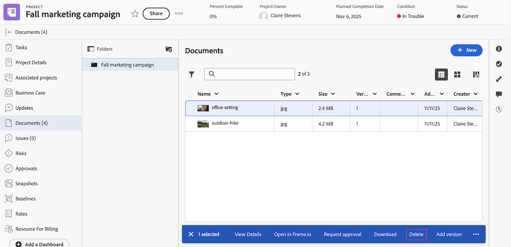

# Dokumente löschen

Sie können hochgeladene Dokumente löschen. Wenn Sie Verwaltungszugriff auf bestimmte Dokumente erhalten, können Sie diese auch löschen.

## Zugriffsanforderungen

+++ Erweitern, um die Zugriffsanforderungen für die in diesem Artikel beschriebene Funktionalität anzuzeigen.

<table style="table-layout:auto"> 
 <col> 
 <col> 
 <tbody> 
  <tr> 
   <td role="rowheader">Adobe Workfront-Paket</td> 
   <td>
Jedes Workfront-Paket zum Verwalten von Dokumenten unter Verwendung des alten Workfront-Speichers

Beliebiges Workflow-Paket zum Verwalten von Dokumenten mit Adobe Enterprise Storage
 </td> 
  </tr> 
  <tr> 
   <td role="rowheader">Adobe Workfront-Lizenzen</td> 
   <td> 
   
Standard

   
Work oder höher
 </td> 
  </tr> 
  <tr> 
   <td role="rowheader">Konfigurationen der Zugriffsebene</td> 
   <td> 
Zugriff auf Dokumente bearbeiten, wenn die Berechtigung Löschen aktiviert ist
 </td> 
  </tr> 
  <tr> 
   <td role="rowheader">Objektberechtigungen</td> 
   <td> 
Anzeigen des Zugriffs auf das Objekt, das das Dokument enthält, oder höher
 
Zugriff verwalten, wenn die Berechtigung Löschen für das Dokument aktiviert ist
 </td> 
  </tr> 
 </tbody> 
</table>

Weitere Details zu den Informationen in dieser Tabelle finden Sie unter [Zugriffsanforderungen in der Dokumentation zu Workfront](/help/quicksilver/administration-and-setup/add-users/access-levels-and-object-permissions/access-level-requirements-in-documentation.md).

+++

## Löschen eines Dokuments im Bereich für veraltete Dokumente

Wenn sich Ihr Unternehmen im alten Workfront-Speicher befindet, wird der Bereich für ältere Dokumente angezeigt, wenn Sie auf Dokumente in Workfront zugreifen. Weitere Informationen zum alten Workfront-Speicher finden Sie unter [Unterschiede zwischen dem alten Workfront-Speicher und dem Adobe Enterprise-Speicher](/help/quicksilver/review-and-approve-work/esm-overview.md).

Löschen eines Dokuments:

1. Gehen Sie zu dem Projekt, der Aufgabe oder dem Problem, das/das das Dokument enthält, und wählen **Dokumente** im linken Bereich aus.
1. Suchen Sie das Dokument, das Sie benötigen.

1. Klicken Sie auf das **Löschen**-Symbol  über dem Bereich Dokumente .

1. Klicken Sie im angezeigten Feld zur Bestätigung auf **Ja, Löschen**.

   Ein System- oder Gruppenadministrator kann ein Dokument innerhalb von 30 Tagen nach dem Löschen wiederherstellen, wie unter [Wiederherstellen gelöschter Elemente](../../administration-and-setup/manage-workfront/manage-deleted-items/restore-deleted-items.md) beschrieben.

   

## Löschen eines Dokuments im Bereich Neue Dokumente

Wenn Ihr Unternehmen Enterprise-Speicher verwendet, wird der Bereich „Neue Dokumente“ angezeigt, wenn Sie auf Dokumente in Workfront zugreifen. Weitere Informationen zu Massenspeicher für Unternehmen finden Sie unter [Übersicht über Speicher für Unternehmen in Adobe](/help/quicksilver/review-and-approve-work/esm-overview.md).

Löschen eines Dokuments:

1. Gehen Sie zu dem Projekt, der Aufgabe oder dem Problem, das/das das Dokument enthält, und wählen **Dokumente** im linken Bereich aus.

1. Find the document you need, then click **Delete**.

1. In the box that appears, click **Delete** to confirm.

   Ein System- oder Gruppenadministrator kann ein Dokument innerhalb von 30 Tagen nach dem Löschen wiederherstellen, wie unter [Wiederherstellen gelöschter Elemente](../../administration-and-setup/manage-workfront/manage-deleted-items/restore-deleted-items.md) beschrieben.

   