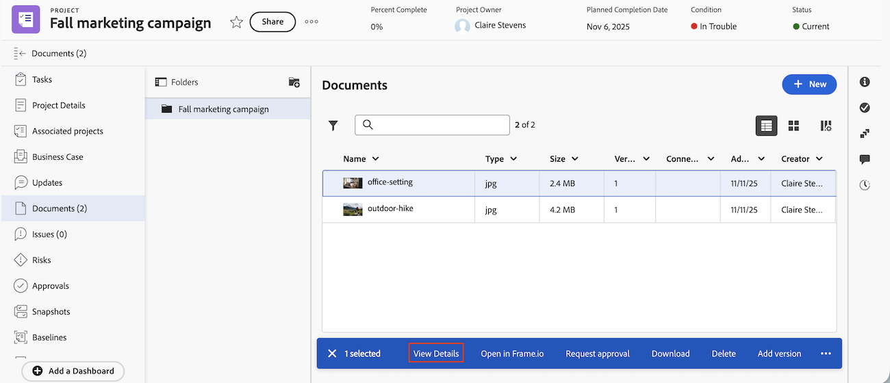

# Überblick über Dokumentdetails

Auf der Seite „Dokumentdetails“ können Sie die Eigenschaften eines Dokuments, das an ein Adobe Workfront-Objekt angehängt ist, anzeigen, darüber kommunizieren und verwalten.

## Bereich für veraltete Dokumente

Wenn sich Ihr Unternehmen im alten Workfront-Speicher befindet, wird der Bereich für ältere Dokumente angezeigt, wenn Sie auf Dokumente in Workfront zugreifen. Weitere Informationen zum alten Workfront-Speicher finden Sie unter [Unterschiede zwischen dem alten Workfront-Speicher und dem Adobe-Cloud-Speicher](/help/quicksilver/review-and-approve-work/esm-overview.md).

### Durchführen grundlegender Aktionen für Dokumente und Korrekturabzüge

Sie können die folgenden Aktionen für Dokumente und Korrekturabzüge auf der Seite Dokumentdetails ausführen:

* Erstellen eines einfachen oder erweiterten Korrekturabzugs
* Erstellen einer neuen Version
* Genehmigungsentscheidung treffen
* Dokument in der Vorschau anzeigen
* Dokumentbeschreibung bearbeiten
* Ein- oder Auschecken eines Dokuments

Darüber hinaus können Sie über das Symbol Mehr  neben dem Dokumentnamen die folgenden Aktionen ausführen:

* Freigeben
* Verschieben
* Löschen
* Herunterladen
* Senden

### Durchführen von für Korrekturabzüge spezifischen Aktionen

Wenn Sie sich im Korrekturabzugs-Workflow befinden, können Sie auf der Seite Dokumentdetails die folgenden Aktionen ausführen:

* Details zu Gesendet, Geöffnet, Kommentar, Entscheidung (SOCD) anzeigen
* Korrekturabzug öffnen
* Druckzusammenfassung öffnen
* Sperren oder Entsperren eines Korrekturabzugs
* Bearbeiten von benutzerdefinierten Proofing-Feldern

  Benutzerdefinierte Proofing-Felder müssen in Workfront Proof eingerichtet werden. Weitere Informationen finden Sie unter [Erstellen und Verwalten von benutzerdefinierten Feldern in Workfront Proof](../../workfront-proof/wp-acct-admin/account-settings/create-and-manage-custom-fields.md).

### Öffnen Sie die Seite Dokumentdetails im Bereich Legacy-Dokumente .

{{step1-to-documents}}

1. Bewegen Sie den Mauszeiger über das Dokument und klicken Sie dann auf **Dokumentdetails**.

   

## Bereich „Neue Dokumente“

Wenn Ihr Unternehmen Adobe Cloud Storage verwendet, wird der Bereich Neue Dokumente angezeigt, wenn Sie auf Dokumente in Workfront zugreifen. Weitere Informationen zu Adobe Cloud-Speicher finden Sie unter [Übersicht über Adobe Cloud-Speicher](/help/quicksilver/review-and-approve-work/esm-overview.md).

Sie können auf der Seite Dokumentdetails die folgenden Aktionen für Dokumente ausführen:

<table style="border: none; width: 80%; margin: 0 auto;">
<tr style="border: none;">
<td style="border: none; width: 50%; padding-right: 20px;">
<ul>
<li>In Frame.io öffnen.  Sie müssen über eine Frame.io Enterprise-Lizenz verfügen, um diese Funktion verwenden zu können.</li>
<li>Dokument löschen</li>
<li>Dokument bearbeiten</li>
</ul>
</td>
<td style="border: none; width: 50%; padding-left: 20px;">
<ul>
<li>Dokument verschieben</li>
<li>Senden eines Dokuments an Experience Manager Access</li>
<li>Freigeben eines Dokuments</li>
</ul>
</td>
</tr>
</table>

### Öffnen Sie das Bedienfeld Dokumentdetails im Bereich Neue Dokumente .

1. Gehen Sie zu dem Projekt, der Aufgabe oder dem Problem, das/das das Dokument enthält, und wählen **Dokumente** im linken Bereich aus.
1. Wählen Sie das Dokument aus und klicken Sie dann in **linken Seitenleiste auf** Details anzeigen“.

   

### Anzeigen der Druckzusammenfassung im neuen Dokumentbereich

Nachdem ein Dokument eine Genehmigung erhalten hat, können Sie die Seite Druckkommentare für Frame.io öffnen, um die Asset-Vorschau, Kommentare und Genehmigungsentscheidungen in einem druckbaren Format anzuzeigen.

1. Gehen Sie zu dem Projekt, der Aufgabe oder dem Problem, das/das das Dokument enthält, und wählen **Dokumente** im linken Bereich aus.
1. Wählen Sie das Dokument aus und klicken Sie dann in **linken Seitenleiste auf** Details anzeigen“.

   

1. Klicken **Abschnitt „Übersicht** auf **Druckzusammenfassung öffnen**.

>[!NOTE]
>
>Der Link Druckzusammenfassung wird erst angezeigt, nachdem dem Dokument eine Genehmigung hinzugefügt wurde.

