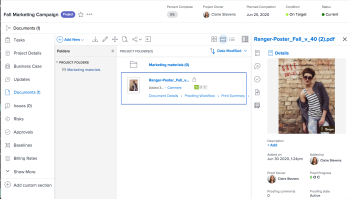
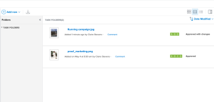

# Der Bereich Dokumente

Im Bereich Dokumente können Sie Metadaten für in Adobe Workfront hochgeladene Dokumente organisieren, verwalten und anzeigen. Sie können auch die Korrekturabzugsentscheidung sehen.

Dokumente, die einzelnen Aufgaben und Problemen hinzugefügt wurden, sind alle im Bereich Projekt > Dokumente verfügbar.

Es gibt zwei Arten von Dokumentbereichen. Die Funktionen sind für beide identisch:

* **Dokumentbereich in einem Programm, einem Portfolio, einem Projekt, einer Aufgabe oder einem Problem:** Listet alle Dokumente auf, auf die Sie für ein bestimmtes Projekt, eine bestimmte Aufgabe oder ein bestimmtes Problem Zugriff haben. Um auf diesen Bereich zuzugreifen, klicken Sie **Dokumente**  im linken Bereich, während Sie ein Projekt, eine Aufgabe oder ein Problem anzeigen.

* **Bereich „Globale Dokumente“** Listet alle Dokumente auf, auf die Sie in Workfront Zugriff haben. Um auf diesen Bereich zuzugreifen, klicken Sie auf **Dokumente**  im Hauptmenü .

Informationen zum Hochladen von Dokumenten in Workfront finden Sie unter [Hinzufügen von Dokumenten zu Adobe Workfront aus Ihrem Dateisystem](../../documents/adding-documents-to-workfront/add-documents-from-file-system.md).

Im Bereich Dokumente wird eine Anzahl der folgenden Elemente aufgezeichnet:

* Workfront-Ordner
* Aus dem Dateisystem hochgeladene Dateien
* Dateien, die von Integrationen zu Workfront hinzugefügt wurden
* Verknüpfte Experience Manager Assets

## Bedienfeld „Zusammenfassung“

Wenn Sie ein Dokument im Bereich Dokumente auswählen, können Sie die Zusammenfassung auf der rechten Seite verwenden, um Dokumentdetails anzuzeigen, Dokumentaktualisierungen und -genehmigungen zu verwalten, Dokumentversionen anzuzeigen und benutzerdefinierte Forms für das Dokument hinzuzufügen und zu bearbeiten.

Wenn für das Dokument ein Proofing eingerichtet wurde, enthält der Abschnitt Details Informationen wie das Fälligkeitsdatum des Proofings und den aktuellen Proofing-Fortschritt.

Sie können auf die Überschrift Details klicken, um den Bereich Vollständige Dokumentdetails aufzurufen, wenn Sie alle Informationen zu einem Dokument benötigen.

Weitere Informationen zur Zusammenfassung finden Sie unter [Zusammenfassung für Dokumente - Übersicht](../../documents/managing-documents/summary-for-documents.md).

## Korrekturabzug-Entscheidung

Sobald eine Korrekturabzugsentscheidung getroffen wurde, wird sie in der Dokumentliste angezeigt.

## Ordner

Für ein Projekt, eine Aufgabe oder ein Problem, in das bzw. das Dokumente hochgeladen werden, können Sie Ordner zum Organisieren der Dokumente einrichten. Weitere Informationen finden Sie unter [Erstellen von ](../../documents/organizing-documents/create-documents-folder.md).

Im Bereich Globale Dokumente können Sie zwei Arten von Ordnern einrichten, um die Dokumente zu organisieren, auf die Sie Zugriff haben:

* **Intelligente Ordner:** Zeigt nur die Dokumente an, die angezeigt werden sollen. Weitere Informationen finden Sie unter [Erstellen und Verwalten von Smart Folders](../../documents/organizing-documents/create-manage-smart-folders.md).

* **Meine Ordner** Dokumente nach Ihren Wünschen organisieren. Weitere Informationen finden Sie unter [Erstellen von ](../../documents/organizing-documents/create-documents-folder.md).

## Erweiterte Dokumentdetails

Die Seite Dokumentdetails enthält eine umfangreichere Version der Dokumentdetails in der Zusammenfassung auf der rechten Seite.
