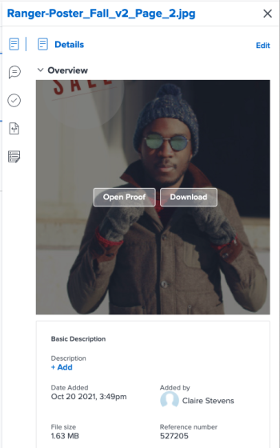

# Übersicht über Dokumente

<!--Audited: April, 2024-->

Im Bedienfeld Zusammenfassung können Sie wichtige Informationen direkt aus der Dokumentliste aufrufen und aktualisieren.

## Zugriffsanforderungen

Sie müssen über Folgendes verfügen:

<table style="table-layout:auto"> 
 <col> 
 </col> 
 <col> 
 </col> 
 <tbody> 
  <tr> 
   <td role="rowheader">Adobe Workfront-Abo</td> 
   <td> 
 Alle
 </td> 
  </tr> 
  <tr> 
   <td role="rowheader">Adobe Workfront-Lizenzen*</td> 
   <td> 
Neu: Mitarbeiter oder höher
 
   
Aktuell: Anforderung oder höher

   </td> 
  </tr> 
  <tr data-mc-conditions=""> 
   <td role="rowheader">Konfigurationen auf Zugriffsebene</td> 
   <td> 
Zugriff auf Dokumente bearbeiten
  </td> 
  </tr> 
  <tr data-mc-conditions=""> 
   <td role="rowheader">Objektberechtigungen</td> 
   <td> 
Zugriff auf das mit dem Dokument verknüpfte Objekt anzeigen
 </td> 
  </tr> 
 </tbody> 
</table>

*Wenden Sie sich an Ihren Workfront-Administrator, um zu erfahren, welchen Plan, welchen Lizenztyp oder welchen Zugriff Sie haben. Weitere Informationen finden Sie unter [Zugriffsanforderungen in der Workfront-Dokumentation](/help/quicksilver/administration-and-setup/add-users/access-levels-and-object-permissions/access-level-requirements-in-documentation.md).

## Öffnen Sie die Zusammenfassungsansicht

1. Markieren Sie im Bereich **Dokumente** ein Element in der Liste.
1. Klicken Sie auf das Symbol **Zusammenfassung öffnen** .

   Nachdem Sie die Zusammenfassung geöffnet haben, bleibt sie beim Klicken auf andere Dokumente geöffnet und bleibt geöffnet, bis Sie sie manuell schließen.

   

## Details

Im Bereich Details können Sie allgemeine Übersichtsinformationen anzeigen und mit benutzerdefinierten Formularen interagieren. Klicken Sie oben im Abschnitt auf **Details** , um zur vollständigen Seite mit den Dokumentdetails zu gelangen.

* [Überblick](#overview)
* [Benutzerdefinierte Formulare](#custom-forms)

### Übersicht {#overview}

Erweitern Sie den Bereich Übersicht , um eine Miniaturansicht anzuzeigen oder herunterzuladen, einen Testversand zu öffnen, die grundlegende Beschreibung zu aktualisieren, das Dokument auszuchecken und mehr.

### Benutzerdefinierte Formulare {#custom-forms}

Verwenden Sie den Abschnitt &quot;Benutzerdefinierter Forms&quot;, um mit dem Dokument verknüpfte benutzerdefinierte Formulare hinzuzufügen, zu bearbeiten oder anzuzeigen. Geben Sie den Namen des benutzerdefinierten Formulars ein, um es zum Dokument hinzuzufügen. Weitere Informationen finden Sie unter [Hinzufügen oder Bearbeiten eines benutzerdefinierten Formulars zu einem Dokument](../../documents/managing-documents/add-custom-form-documents.md).

## Updates

Im Abschnitt Updates können Sie die Aktualisierung lesen, die ein Benutzer am Dokument oder Testversand vorgenommen hat. Die Zusammenfassung zeigt die ersten beiden Kommentare. Weitere Informationen zu Aktualisierungen finden Sie unter [Kommentar zu einem Testversand](../../review-and-approve-work/proofing/reviewing-proofs-within-workfront/comment-on-a-proof/comment-on-proof.md).

Abschnitt 

## Genehmigungen

Verwenden Sie den Abschnitt Genehmigungen , um eine Dokumentgenehmigung anzufordern. Sie können auch jemanden an eine Validierung erinnern, die Validierung erneut einreichen und die vorherige Entscheidung abbrechen oder die Validierung löschen. Document Genehmigers können die Zusammenfassung verwenden, um eine Entscheidung zu treffen.

Testversandvalidierungen müssen im Testversand-Workflow hinzugefügt werden. Weitere Informationen zu Genehmigungen finden Sie unter

* [Genehmigung der Arbeit](../../review-and-approve-work/manage-approvals/approving-work.md)
* [Dokumentgenehmigungen anfordern](../../review-and-approve-work/manage-approvals/request-document-approvals.md)

## Versionen

Im Abschnitt Versionen können Sie die Anzahl der Versionen anzeigen, die für ein bestimmtes Dokument erstellt wurden. Klicken Sie auf das Menü **Mehr** , um

* Testversand öffnen
* Testversand oder Dokument herunterladen
* Anzeigen einer Vorschau eines vom Browser unterstützten Dokuments
* Navigieren Sie zu Dokumentdetails .
* Testversand oder Dokument löschen

