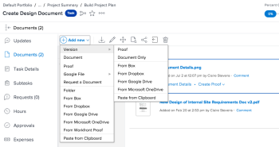
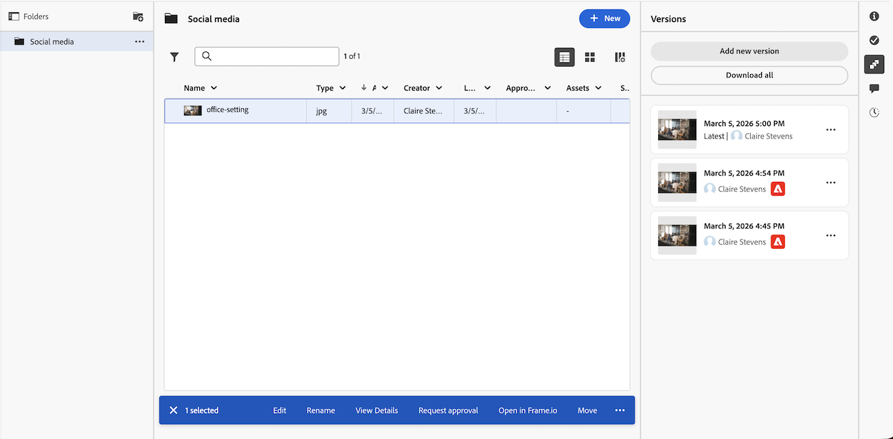

# Hochladen einer neuen Version eines Dokuments

Sie können eine neue Version eines Dokuments hinzufügen, das Sie zuvor in Adobe Workfront hochgeladen haben.

Wenn der Dateiname der neuen Version vom Dateinamen der vorherigen Version abweicht, zeigt Workfront das Dokument mit dem neueren Dateinamen an.

Wenn das Dokument einen Korrekturabzug enthält und Sie eine neue Version des Korrekturabzugs erstellen möchten, lesen Sie den Abschnitt [Hochladen eines Dokuments und Erstellen einer neuen Version eines Korrekturabzugs](../../review-and-approve-work/proofing/creating-proofs-within-workfront/generate-proof-for-a-document.md#uploading-a-document-and-creating-a-new-version-of-a-proof) im Artikel [Erstellen eines Korrekturabzugs für ein Dokument](../../review-and-approve-work/proofing/creating-proofs-within-workfront/generate-proof-for-a-document.md).

Informationen zum Hinzufügen einer neuen Version eines Dokuments, das über eine externe Anwendung mit Workfront verknüpft ist, finden Sie unter [Hinzufügen einer neuen Version eines verknüpften Dokuments](../../documents/adding-documents-to-workfront/link-documents-from-external-apps.md#add) in [Verknüpfen von Dokumenten aus externen Anwendungen](../../documents/adding-documents-to-workfront/link-documents-from-external-apps.md).

## Zugriffsanforderungen

+++ Erweitern, um die Zugriffsanforderungen für die in diesem Artikel beschriebene Funktionalität anzuzeigen.

<table style="table-layout:auto"> 
 <col> 
 </col> 
 <col> 
 </col> 
 <tbody> 
  <tr> 
   <td role="rowheader">Adobe Workfront-Paket</td> 
   <td> 
Jedes Workfront-Paket zum Verwalten von Dokumenten unter Verwendung des alten Workfront-Speichers

Beliebiges Workflow-Paket zum Verwalten von Dokumenten mit dem Adobe Cloud-Speicher
</td> 
  </tr> 
  <tr> 
   <td role="rowheader">Adobe Workfront-Lizenzen</td> 
   <td> 
   
Mitwirkende oder höher

   
Anfragende oder höher
 </td> 
  </tr> 
  <tr data-mc-conditions=""> 
   <td role="rowheader">Konfigurationen der Zugriffsebene*</td> 
   <td> 
Zugriffrecht „Bearbeiten“ für Dokumente
  </td> 
  </tr> 
  <tr data-mc-conditions=""> 
   <td role="rowheader">Objektberechtigungen</td> 
   <td> 
Bearbeitungszugriff auf das mit dem Dokument verknüpfte Objekt
 </td> 
  </tr> 
 </tbody> 
</table>

Weitere Details zu den Informationen in dieser Tabelle finden Sie unter [Zugriffsanforderungen in der Dokumentation zu Workfront](/help/quicksilver/administration-and-setup/add-users/access-levels-and-object-permissions/access-level-requirements-in-documentation.md).
+++

## Hochladen einer neuen Dokumentversion im Bereich „Alte Dokumente“

Wenn sich Ihr Unternehmen im alten Workfront-Speicher befindet, wird der Bereich für ältere Dokumente angezeigt, wenn Sie auf Dokumente in Workfront zugreifen. Weitere Informationen zum alten Workfront-Speicher finden Sie unter [Unterschiede zwischen dem alten Workfront-Speicher und dem Adobe-Cloud-Speicher](/help/quicksilver/review-and-approve-work/esm-overview.md).

### Verwenden von Drag-and-Drop, um eine neue Version hinzuzufügen

>[!NOTE]
>
>Drag-and-Drop funktioniert nicht mit Internet Explorer.

1. Navigieren Sie zum Bereich Dokumente , in den das Dokument hochgeladen wird.
1. Ziehen Sie die neue Version des Dokuments von Ihrem Desktop oder einer separaten Browser-Registerkarte auf die vorhandene Version in Workfront.

   

   Wenn Sie die neue Version ziehen, können Sie den Mauszeiger über einen Workfront-Dokumentordner bewegen, um ihn zu öffnen. Sie können dann nach oben und unten scrollen, indem Sie die Dateien an den oberen oder unteren Bildschirmrand ziehen.

1. Legen Sie die neue Version auf der Registerkarte „Dokumente **über der vorhandenen Datei**.

   Informationen zum Verwalten von Dokumentversionen finden Sie unter [Verwalten von Dokumentversionen](../../documents/managing-documents/manage-document-versions.md).

### Verwenden Sie das Menü Mehr , um eine neue Version hinzuzufügen

1. Wählen Sie das Dokument aus, dem Sie eine neue Version hinzufügen möchten.
1. Klicken Sie **Neu hinzufügen** > **Version**.

   

1. Wählen Sie den Typ des Dokuments aus, das Sie hochladen möchten, und befolgen Sie dann die Eingabeaufforderungen.

## Hochladen einer neuen Dokumentversion in den Bereich „Neue Dokumente“

Wenn Ihr Unternehmen Adobe Cloud Storage verwendet, wird der Bereich Neue Dokumente angezeigt, wenn Sie auf Dokumente in Workfront zugreifen. Weitere Informationen zu Adobe Cloud-Speicher finden Sie unter [Übersicht über Adobe Cloud-Speicher](/help/quicksilver/review-and-approve-work/esm-overview.md).

### Verwenden von Drag-and-Drop, um eine neue Version hinzuzufügen

>[!NOTE]
>
>Drag-and-Drop funktioniert nicht mit Internet Explorer.

1. Navigieren Sie zum Bereich Dokumente , in den das Dokument hochgeladen wird.
1. Ziehen Sie die neue Version des Dokuments auf die in Workfront vorhandene Version.

   

1. Legen Sie die neue Version auf der Registerkarte „Dokumente **über der vorhandenen Datei**.

   Informationen zum Verwalten von Dokumentversionen finden Sie unter [Verwalten von Dokumentversionen](../../documents/managing-documents/manage-document-versions.md).

### Verwenden Sie das Menü Mehr , um eine neue Version hinzuzufügen

1. Wählen Sie das Dokument aus, dem Sie eine neue Version hinzufügen möchten.
1. Öffnen Sie das Symbol Versionen anzeigen  auf der rechten Seite.
1. Klicken Sie **Neue Version hinzufügen**.

   

1. Suchen Sie Ihr Dokument und klicken Sie dann auf **Öffnen**.

