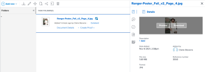

# Anzeigen oder Herunterladen eines verknüpften Assets mit dem erweiterten Connector

Sie können ein Asset in Adobe Workfront, das über Experience Manager Assets verknüpft ist, anzeigen oder herunterladen.

## Zugriffsanforderungen

+++ Erweitern, um die Zugriffsanforderungen für die in diesem Artikel beschriebene Funktionalität anzuzeigen.

<table style="table-layout:auto"> 
 <col> 
 <col> 
 <tbody> 
  <tr> 
   <td role="rowheader">Adobe Workfront-Paket</td> 
   <td> 
Beliebig
 </td> 
  </tr> 
  <tr> 
   <td role="rowheader">Adobe Workfront-Lizenz</td> 
   <td> 
   
Mitwirkende oder höher

   
Anfragende oder höher
 </td> 
  </tr> 
  <tr> 
   <td role="rowheader">Zusätzliche Produkte</td> 
   <td>Experience Manager Assets </td> 
  </tr> 
  <tr> 
   <td role="rowheader">Konfigurationen der Zugriffsebene*</td> 
   <td> 
Zugriffrecht „Bearbeiten“ für Dokumente
 s=„MCXref xref“&gt;Erstellen oder ändern Sie benutzerdefinierte Zugriffsebenen</a>.
 </td> 
  </tr> 
  <tr> 
   <td role="rowheader">Objektberechtigungen</td> 
   <td> 
Zugriff auf Dokumente anzeigen oder höher
</td> 
  </tr> 
 </tbody> 
</table>

Weitere Informationen finden Sie unter [Zugriffsanforderungen](/help/quicksilver/administration-and-setup/add-users/access-levels-and-object-permissions/access-level-requirements-in-documentation.md) in der Dokumentation zu Workfront.

+++

## Voraussetzungen

Bevor Sie beginnen, müssen Sie

* Installieren des erweiterten Connectors für Workfront for Experience Manager

## Anzeigen oder Herunterladen eines verknüpften Assets aus Experience Manager Assets

1. Suchen Sie das Dokument, das Sie anzeigen oder herunterladen möchten.
1. Wählen Sie in der Dokumentliste das Dokument aus.
1. Bewegen Sie in der Dokumentzusammenfassung rechts den Mauszeiger über die Miniaturansicht oben und wählen Sie **Vorschau** oder **Herunterladen**.

   
