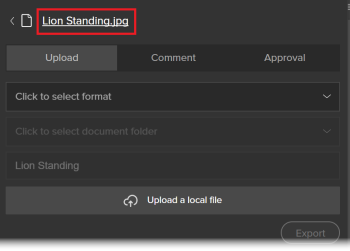

# Verwenden der Workfront-Erweiterung für Illustrator und InDesign

<!--Audited: 01/2024-->

>[!IMPORTANT]
>
>Wir ersetzen die Workfront-Erweiterung für Illustrator und InDesign durch [aktualisierte Creative Cloud-Plug-ins](/help/quicksilver/workfront-integrations-and-apps/adobe-workfront-for-creative-cloud/wf-cc-install-toc.md). Ab Ende 2022 wird diese Erweiterung nicht mehr unterstützt und ist unverändert verfügbar.

Sie können die Workfront-Erweiterung verwenden, um digitale Inhalte, die Sie in Adobe Illustrator Adobe InDesign speichern und erstellen, nach Workfront zu exportieren. Dadurch wird der Prozess der Dokumentüberprüfung und -validierung beschleunigt.

Die Workfront-Erweiterung wird für Adobe Creative Cloud 2017 und höher in den folgenden Programmen unterstützt:

* InDesign
* Illustrator
* Photoshop

  >[!NOTE]
  >
  >Es wird empfohlen, das neue Plug-in [Adobe Workfront for Photoshop](/help/quicksilver/workfront-integrations-and-apps/adobe-workfront-for-creative-cloud/wf-cc-install-ps.md) zu verwenden.

## Zugriffsanforderungen

+++ Erweitern Sie , um die Zugriffsanforderungen für die -Funktion in diesem Artikel anzuzeigen.

Sie müssen über folgenden Zugriff verfügen, um die Schritte in diesem Artikel ausführen zu können:

<table style="table-layout:auto"> 
 <col> 
 <col> 
 <tbody> 
  <tr> 
   <td role="rowheader">Adobe Workfront-Plan*</td> 
   <td> 
Aktuell: Pro oder höher

   Oder
   
Neu: Beliebiger Plan
 </td> 
  </tr> 
  <tr data-mc-conditions=""> 
   <td role="rowheader">Adobe Workfront-Lizenz*</td> 
   <td> 
Aktuell: Arbeit oder höher

   Oder
   
Neu: Standard
 </td> 
  </tr> 
  <tr> 
   <td role="rowheader">Produkt</td> 
   <td>Sie müssen zusätzlich zu einer Workfront-Lizenz über eine Adobe Creative Cloud-Lizenz verfügen.</td> 
  </tr> 
  <tr> 
   <td role="rowheader">Objektberechtigungen</td> 
   <td> 
Bearbeiten Sie den Zugriff auf das Objekt, mit dem Sie interagieren möchten.
  </td> 
  </tr> 
 </tbody> 
</table>

&#42;Wenden Sie sich an Ihren Workfront-Administrator, um herauszufinden, über welchen Plan, welchen Lizenztyp oder welchen Zugriff Sie verfügen. Weitere Informationen finden Sie unter [Zugriffsanforderungen in der Dokumentation zu Workfront](/help/quicksilver/administration-and-setup/add-users/access-levels-and-object-permissions/access-level-requirements-in-documentation.md).

+++

## Melden Sie sich über Illustrator oder InDesign bei der Workfront-Erweiterung an {#log-in-to-workfront-extension-from-illustrator-or-indesign}

Wenn Sie sich von einer der unterstützten Adobe-Anwendungen bei Workfront anmelden, werden Sie bei allen unterstützten Adobe-Anwendungen angemeldet.

1. Wechseln Sie zur Adobe-Anwendung, in der Sie die Workfront-Erweiterung verwenden möchten.

   Eine Liste der unterstützten Formate für jede unterstützte Anwendung finden Sie unter [Unterstützte exportierte Dateiformate](#supported-exported-file-formats) in diesem Artikel.

1. Klicken Sie auf **Fenster** > **Erweiterungen** > Workfront.

1. (Optional) Ziehen Sie das Workfront-Bedienfeld an die Position, an der es im Adobe-Programm angezeigt werden soll.
1. Befolgen Sie die Anweisungen, um sich bei Workfront anzumelden.

   >[!NOTE]
   >
   >* Workfront stellt mithilfe von OAuth 2.0 eine Verbindung zu Adobe Creative Cloud her, einem sicheren Standard, der von den meisten Web-basierten Integrationen für die Authentifizierung und Autorisierung von Benutzern verwendet wird.
   >* Wenn Sie aufgefordert werden, die [Domain oder den Host] Ihres Workfront-Kontos einzugeben, geben Sie sie in folgendem Format ein:`yourCompany'sDomain.my.workfront.com`. Die Domain Ihres Unternehmens ist normalerweise der Name Ihres Unternehmens.

   Eine Liste der Ihnen zugewiesenen Arbeitselemente wird angezeigt, wenn das Projekt einen aktuellen Status aufweist. Wenn keine Liste angezeigt wird, melden Sie sich bei Workfront an.

   Persönliche Aufgaben werden unter &quot;**Projekt“**.

## Hochladen einer Datei in ein Workfront-Projekt, eine Aufgabe oder ein Problem {#upload-a-file-to-a-workfront-project-task-or-issue}

Sie können eine Datei aus Ihrem Computerdateisystem hochladen oder eine Datei, die derzeit in einer Adobe Creative Cloud-Anwendung geöffnet ist, in ein Workfront-Projekt, eine Aufgabe oder ein Problem exportieren. 

Beachten Sie beim Hochladen oder Exportieren einer Datei aus Adobe Creative Cloud Folgendes:

* Ihre Zugriffsebene muss das Hochladen von Dokumenten auf Workfront zulassen. Weitere Informationen finden Sie unter [Zugriff auf Dokumente gewähren](../../administration-and-setup/add-users/configure-and-grant-access/grant-access-documents.md).
* Sie müssen über die Berechtigung zum Hochladen von Dokumenten in das Element verfügen, in dem Sie es haben möchten. Weitere Informationen finden Sie unter [Übersicht über Freigabeberechtigungen für Objekte](../../workfront-basics/grant-and-request-access-to-objects/sharing-permissions-on-objects-overview.md).
* Die Datei wird für das ausgewählte Workfront-Objekt in den Bereich Dokumente hochgeladen.
* Sie können ein Dokument nicht in den Bereich Dokumente im Hauptmenü  von einer Adobe Creative Cloud-Anwendung exportieren.

In den folgenden Abschnitten werden die folgenden Punkte erläutert:

* [Datei hochladen](#upload-a-file)
* [Exportieren einer aktuell in Illustrator oder InDesign geöffneten Datei](#export-a-file-currently-open-in-illustrator-or-indesign)
* [Hochladen einer neuen Dateiversion von Illustrator oder InDesign](#upload-a-new-version-of-a-file-from-illustrator-or-indesign)

### Datei hochladen {#upload-a-file}

Sie können Ihre Dateien in ein Projekt, eine Aufgabe oder ein Problem hochladen, ohne Ihr Adobe Creative Cloud-Programm verlassen zu müssen.

1. Wenn die Workfront-Erweiterung beim Öffnen der Adobe Creative Cloud-Anwendung nicht angezeigt wird, klicken Sie auf **Window** > **Extensions** > **Workfront**.

   Eine Liste der Ihnen zugewiesenen Arbeitselemente wird angezeigt, wenn sich das Projekt in einem aktuellen Status befindet. Wenn keine Liste angezeigt wird, melden Sie sich bei Workfront an.

   Persönliche Aufgaben werden unter &quot;**Projekt“**.

1. Klicken Sie auf den Namen des Projekts, der Aufgabe oder des Problems, in das bzw. das Sie die Datei hochladen möchten.

   Sie können danach suchen, indem Sie den Namen in das Feld **Suche** eingeben und **Projekt**, **Aufgabe** oder **Problem** aus dem Dropdown-Menü rechts neben dem Feld **Suchen** auswählen. Wenn der Name des Arbeitselements nicht in der Liste angezeigt wird, drücken Sie die **Eingabetaste**, um alle Workfront-Elemente zu suchen, auf die Sie Zugriff haben.

1. Klicken **auf** Auswählen“ in der rechten unteren Ecke der Workfront-Erweiterung.
1. Klicken Sie im Dropdown **Menü „Zum Auswählen des** klicken“ auf das Format, in dem Sie die Datei in Workfront speichern möchten.

   Eine Liste der unterstützten Formate für jede unterstützte Anwendung finden Sie unter [Unterstützte exportierte Dateiformate](#supported-exported-file-formats) in diesem Artikel.

1. (Bedingt) Wenn das Arbeitselement, in das Sie die Datei hochladen möchten, Dokumentordner enthält, wählen Sie einen Dokumentordner im Feld **Klicken, um einen Dokumentordner auszuwählen** aus und klicken Sie dann auf **Auswählen**.

1. Klicken Sie **Lokale Datei hochladen**.
1. Suchen Sie im Feld **Datei öffnen** die Datei in Ihrem Dateisystem und klicken Sie dann auf **Öffnen**.

1. (Optional) Geben Sie einen neuen Namen für die Datei ein.

   

1. Klicken Sie **Hochladen**.

   In Workfront wird das Dokument jetzt im Bereich Dokumente für das ausgewählte Projekt, die ausgewählte Aufgabe oder das ausgewählte Problem aufgeführt.

1. (Optional) Klicken Sie auf den Namen des Dokuments, um die zugehörige Dokumentdetailseite in Workfront zu öffnen.

   Workfront wird in einer neuen Browser-Registerkarte geöffnet.

### Exportieren einer aktuell in Illustrator oder InDesign geöffneten Datei {#export-a-file-currently-open-in-illustrator-or-indesign}

1. Öffnen Sie in einer unterstützten Adobe Creative Cloud-Anwendung eine Datei, die Sie nach Workfront exportieren möchten.
1. Wenn die Workfront-Erweiterung nicht angezeigt wird, klicken Sie auf **** > **Erweiterungen** > **Workfront**.

   Eine Liste der Ihnen zugewiesenen Arbeitselemente wird angezeigt, wenn sich das Projekt in einem aktuellen Status befindet. Wenn keine Liste angezeigt wird, melden Sie sich bei Workfront an.

   Persönliche Aufgaben werden unter &quot;**Projekt“**.

1. Klicken Sie auf den Namen des Projekts, der Aufgabe oder des Problems, in das bzw. das Sie die Datei exportieren möchten.

   Sie können danach suchen, indem Sie den Namen in das Feld **Suche** eingeben und **Projekt**, **Aufgabe** oder **Problem** aus dem Dropdown-Menü rechts neben dem Feld **Suchen** auswählen. Wenn der Name des Arbeitselements nicht in der Liste angezeigt wird, drücken Sie die **Eingabetaste**, um alle Workfront-Elemente zu suchen, auf die Sie Zugriff haben.

1. Klicken Sie im Dropdown **Menü „Zum Auswählen des** klicken“ auf das Format, in dem Sie die Datei in Workfront speichern möchten.

   Eine Liste der unterstützten Formate für jede unterstützte Anwendung finden Sie unter [Unterstützte exportierte Dateiformate](#supported-exported-file-formats) in diesem Artikel.

1. (Bedingt) Wenn das Arbeitselement, in das Sie die Datei hochladen möchten, Dokumentordner enthält, wählen Sie einen Dokumentordner im Feld **Klicken, um einen Dokumentordner auszuwählen** aus und klicken Sie dann auf **Auswählen**.
1. (Optional) Um das Dokument umzubenennen, klicken Sie auf den Dokumentnamen und geben Sie einen neuen Namen ein.

   

1. Klicken Sie **Exportieren**.

   Es wird eine Meldung angezeigt, die bestätigt, dass das Dokument erfolgreich nach Workfront exportiert wurde.

   In Workfront wird das Dokument im Bereich Dokumente des Objekts aufgeführt, das Sie in Workfront angegeben haben.

1. (Optional) Klicken Sie auf den Namen des Dokuments, um in Workfront darauf zuzugreifen.

   

   Workfront wird in einer neuen Browser-Registerkarte geöffnet.

### Hochladen einer neuen Dateiversion von Illustrator oder InDesign {#upload-a-new-version-of-a-file-from-illustrator-or-indesign}

1. Wenn Sie eine Datei, an der Sie arbeiten, in eine unterstützte Adobe-Anwendung als neue Dateiversion in Workfront exportieren möchten, öffnen Sie die Datei in der Adobe-Anwendung.
1. Wenn die Workfront-Erweiterung nicht angezeigt wird, klicken Sie auf **** > **Erweiterungen** > **Workfront**.

   Eine Liste der Ihnen zugewiesenen Arbeitselemente wird angezeigt, wenn das Projekt einen aktuellen Status aufweist. Wenn keine Liste angezeigt wird, melden Sie sich bei Workfront an.

   Persönliche Aufgaben werden unter &quot;**Projekt“**.

1. Klicken Sie auf den Namen des Projekts, der Aufgabe oder des Problems, in dem das vorhandene Dokument aufgeführt ist.

   Sie können danach suchen, indem Sie den Namen in das Feld **Suche** eingeben und **Projekt**, **Aufgabe** oder **Problem** aus dem Dropdown-Menü rechts neben dem Feld **Suchen** auswählen. Wenn der Name des Arbeitselements nicht in der Liste angezeigt wird, drücken Sie die **Eingabetaste**, um alle Workfront-Elemente zu suchen, auf die Sie Zugriff haben.

   Alle Dokumente, die in Projekte, Aufgaben oder Probleme hochgeladen wurden, werden in einer Liste angezeigt, unabhängig davon, ob sie von der Adobe-Anwendung hochgeladen wurden.

1. Klicken Sie im Dropdown **Menü „Zum Auswählen des** klicken“ auf das Format, in dem Sie die Datei in Workfront speichern möchten.

   Dies ist erforderlich, wenn Sie eine Datei exportieren, die in der Adobe-Anwendung geöffnet ist. Eine Liste der unterstützten Formate für jede unterstützte Anwendung finden Sie unter [Unterstützte exportierte Dateiformate](#supported-exported-file-formats) in diesem Artikel.

1. Wenn Sie eine in der Adobe-Anwendung geöffnete Datei als neue Version des ausgewählten Workfront-Dokuments exportieren, klicken Sie auf **Exportieren**.

   Oder

   Wenn Sie eine Datei aus Ihrem Computerdateisystem als neue Version des ausgewählten Workfront-Dokuments hochladen möchten, klicken Sie auf **Lokale Datei hochladen** suchen Sie die Datei in dem angezeigten Feld, klicken Sie auf **Öffnen** und klicken Sie dann auf **Hochladen**.

1. (Optional) Klicken Sie auf den Namen des Dokuments, um dessen neue Version in Workfront anzuzeigen.

   >[!NOTE]
   >
   >Der Name des Dokuments in Workfront wird standardmäßig ausgefüllt und kann nicht bearbeitet werden. Ebenso wenig ändert sich der Name der Datei, die Sie hochladen oder als neue Version exportieren.
   >
   >
   >

## Kommentar zu einem Workfront-Dokument von Illustrator oder InDesign {#comment-on-a-workfront-document-from-illustrator-or-indesign}

Sie können einem Workfront-Dokument innerhalb einer Adobe-Anwendung direkt Kommentare hinzufügen. In Workfront werden Ihre Kommentare im Bereich Dokumentaktualisierungen und im Bereich Aktualisierungen für das Workfront-Element angezeigt, in dem das Dokument gespeichert ist.

1. Öffnen Sie eine der unterstützten Adobe-Anwendungen.
1. Wenn die Workfront-Erweiterung nicht angezeigt wird, klicken Sie auf **** > **Erweiterungen** > **Workfront**.

   Eine Liste der Ihnen zugewiesenen Arbeitselemente wird angezeigt, wenn das Projekt einen aktuellen Status aufweist. Wenn keine Liste angezeigt wird, melden Sie sich bei Workfront an.

   Persönliche Aufgaben werden unter &quot;**Projekt“**.

1. Klicken Sie auf das Projekt, die Aufgabe oder das Problem, in dem/dem das vorhandene Dokument aufgeführt ist.

   Sie können danach suchen, indem Sie den Namen in das Feld **Suche** eingeben und **Projekt**, **Aufgabe** oder **Problem** aus dem Dropdown-Menü rechts neben dem Feld **Suchen** auswählen. Wenn der Name des Arbeitselements nicht in der Liste angezeigt wird, drücken Sie die **Eingabetaste**, um alle Workfront-Elemente zu suchen, auf die Sie Zugriff haben.

1. Klicken Sie auf den Namen des vorhandenen Dokuments und anschließend **Auswählen** in der rechten unteren Ecke der Workfront-Erweiterung.
1. Klicken Sie auf **Kommentar** und geben Sie dann Ihr Update in das Feld ein.

1. (Optional) Um andere Workfront-Benutzende oder -Teams in den Kommentar einzubeziehen, geben Sie zunächst den Namen eines/r Benutzenden oder eines Teams in das Feld **Personen oder Teams benachrichtigen** ein und klicken Sie dann auf den Namen, wenn er/sie in der Dropdown-Liste angezeigt wird.
1. (Optional) Um eine Genehmigung für das Dokument anzufordern, wählen Sie **Eine Genehmigungsanfrage stellen** aus.
1. Klicken Sie auf **Aktualisieren**.

   Eine Aktualisierung wird auf der Registerkarte Aktualisierungen des Dokuments veröffentlicht. Workfront-Benutzende, die Sie in den Kommentar einbeziehen, erhalten eine In-App-Benachrichtigung und möglicherweise auch eine E-Mail-Benachrichtigung, je nachdem, wie Workfront konfiguriert ist.

   Weitere Informationen zu Benachrichtigungen in Workfront finden Sie unter [Anzeigen und Verwalten von In-App-Benachrichtigungen](../../workfront-basics/using-notifications/view-and-manage-in-app-notifications.md).

   Weitere Informationen zum Empfang von E-Mail-Benachrichtigungen finden Sie unter [Adobe Workfront-Benachrichtigungen](../../workfront-basics/using-notifications/wf-notifications.md).

## Dokumentengenehmigung von Illustrator oder InDesign anfordern

Sie können eine Workfront-Dokumentgenehmigung direkt von einer Adobe-Anwendung aus anfordern.

Sie können eine Dokumentgenehmigung von den folgenden Entitäten anfordern:

* Ein Workfront-Benutzer
* Ein externer Benutzer ohne Workfront-Konto

Sie können wie folgt eine Genehmigung für ein Dokument von einem Adobe-Programm anfordern:

* Durch Anhängen einer genehmigenden Person an das Dokument.
* Indem Sie ein Dokument kommentieren, die Person benachrichtigen, wenn Sie einen Kommentar abgeben, und sie als genehmigende Person an das Dokument anhängen.

  Informationen zum Anfordern einer Genehmigung beim Kommentieren eines Dokuments finden Sie im Abschnitt [Kommentar zu einem Workfront-Dokument von Illustrator oder InDesign](#comment-on-a-workfront-document-from-illustrator-or-indesign) in diesem Artikel.

So fordern Sie eine Genehmigung für ein Dokument von einer Adobe-Anwendung an:

1. Öffnen Sie eine der unterstützten Adobe-Anwendungen.
1. Wenn die Workfront-Erweiterung nicht angezeigt wird, klicken Sie auf **** > **Erweiterungen** > **Workfront**.

   Eine Liste der Ihnen zugewiesenen Arbeitselemente wird angezeigt, wenn das Projekt einen aktuellen Status aufweist. Wenn keine Liste angezeigt wird, melden Sie sich bei Workfront an.

   Persönliche Aufgaben werden unter &quot;**Projekt“**.

1. Klicken Sie auf das Projekt, die Aufgabe oder das Problem, in dem das vorhandene Dokument aufgeführt ist, und klicken Sie dann auf den Namen des vorhandenen Dokuments.

   Sie können danach suchen, indem Sie den Namen in das Feld **Suche** eingeben und **Projekt**, **Aufgabe** oder **Problem** aus dem Dropdown-Menü rechts neben dem Feld **Suchen** auswählen. Wenn der Name des Arbeitselements nicht in der Liste angezeigt wird, drücken Sie die **Eingabetaste**, um alle Workfront-Elemente zu suchen, auf die Sie Zugriff haben.

1. Klicken Sie auf den Namen des vorhandenen Dokuments und anschließend **Auswählen** unten rechts in der Workfront-Erweiterung.
1. Klicken Sie auf die **Genehmigung**.
1. Um eine genehmigende Person hinzuzufügen, führen **im Feld „Beginnen Sie mit der Eingabe** Namens“ einen der folgenden Schritte aus:

   * Geben Sie den Namen einer genehmigenden Person ein und wählen Sie ihn aus, wenn er in der Liste angezeigt wird.

     

   * Geben Sie die E-Mail-Adresse eines externen Benutzers ein.

1. Klicken Sie **Genehmigung anfordern**.

   Workfront-Benutzende, die Sie in den Kommentar einbeziehen oder als genehmigende Person hinzufügen, erhalten eine In-App-Benachrichtigung und möglicherweise auch eine E-Mail-Benachrichtigung, je nachdem, wie Workfront konfiguriert ist.\
   Externe Benutzer erhalten eine E-Mail-Benachrichtigung, über die sie eine Entscheidung über die Genehmigung treffen können.

   Weitere Informationen zu Benachrichtigungen in Workfront finden Sie unter [Anzeigen und Verwalten von In-App-Benachrichtigungen](../../workfront-basics/using-notifications/view-and-manage-in-app-notifications.md). Informationen zum Empfang von E-Mail-Benachrichtigungen finden Sie unter [Adobe Workfront-Benachrichtigungen](../../workfront-basics/using-notifications/wf-notifications.md).

## Erstellen eines Korrekturabzugs von Illustrator oder InDesign {#generate-a-proof-from-illustrator-or-indesign}

Wenn Ihr Unternehmen automatisierte Workflow-Vorlagen verwendet, können Sie einen Korrekturabzug für ein Dokument erstellen, das Sie in einer Adobe-Anwendung erstellen, ohne die Anwendung verlassen zu müssen. Informationen zum Erstellen von Testsendungen finden Sie unter [Erstellen von Testsendungen](../../review-and-approve-work/proofing/creating-proofs-within-workfront/create-proofs-in-wf.md). Informationen zu automatisierten Workflow-Vorlagen finden Sie unter [Automatisierte Workflow-Vorlagen](../../review-and-approve-work/proofing/proofing-overview/automated-workflow.md#automate) in [Automatisierter Workflow - Übersicht](../../review-and-approve-work/proofing/proofing-overview/automated-workflow.md).

1. Öffnen Sie eine der unterstützten Adobe-Anwendungen.
1. Wenn die Workfront-Erweiterung nicht angezeigt wird, klicken Sie auf **** > **Erweiterungen** > Workfront.

   Eine Liste der Ihnen zugewiesenen Arbeitselemente wird angezeigt, wenn das Projekt einen aktuellen Status aufweist. Wenn keine Liste angezeigt wird, melden Sie sich bei Workfront an.

   Persönliche Aufgaben werden unter &quot;**Projekt“**.

1. Wenn das Dokument bereits in Workfront hochgeladen wurde, wählen Sie das Projekt, die Aufgabe oder das Problem in der Workfront-Erweiterung aus, in der das Dokument aufgeführt ist, und klicken Sie dann auf den Namen des Dokuments.

   Oder

   Laden Sie ein Adobe-Dokument in ein Workfront-Objekt hoch, wie im Abschnitt [Hochladen einer Datei in ein Workfront-Projekt, eine Aufgabe oder ein Problem](#upload-a-file-to-a-workfront-project-task-or-issue) in diesem Artikel beschrieben, und klicken Sie dann auf den Namen des Dokuments.

1. Klicken Sie im Dropdown **Menü „Zum Auswählen des** klicken“ auf das Format, in dem Sie die Datei in Workfront speichern möchten.

   Einige Formate sind nicht verfügbar, nachdem Sie die Proofing-Funktion im folgenden Schritt aktiviert haben. Weitere Informationen finden Sie unter [Unterstützte exportierte Dateiformate](#supported-exported-file-formats) in diesem Artikel.

1. Klicken Sie **Als neuen Korrekturabzug hochladen**, um ihn zu aktivieren.
1. Wählen Sie die **Workflow-Vorlage** die Benutzer bei der Überprüfung des Dokuments verwenden sollen.

   Ihr Workfront-Administrator richtet automatisierte Workflow-Vorlagen ein, wie unter [Erstellen und Verwalten automatisierter Workflow-Vorlagen](/help/quicksilver/administration-and-setup/manage-workfront/configure-proofing/create-manage-automated-workflow-templates.md) beschrieben. Wenden Sie sich bei Fragen an den Administrator.

   1. Fügen Sie zu jedem **in** Workflow-Vorlage mindestens einen neuen Empfänger hinzu.

      Sie können mit der Eingabe eines Namens beginnen und ihn auswählen, wenn Sie ihn in der angezeigten Dropdown-Liste sehen.

   1. Geben Sie **Rolle des Korrekturabzugs** und die Häufigkeit von **E-Mail-Warnhinweisen** für jeden hinzugefügten Empfänger an.

   1. (Optional) Wählen Sie im Abschnitt **E-Mail-Benachrichtigung** aus, ob eine E-Mail-Benachrichtigung mit einer optionalen benutzerdefinierten Nachricht zum Testversand an alle hinzugefügten Testversand-Empfänger gesendet werden soll.

1. Klicken Sie **Korrekturabzug erstellen**.

   Sie können den Fortschritt der Testversand-Erstellung sehen. Ein Warnhinweis wird angezeigt, wenn die Erstellung abgeschlossen ist. Sie können die Aufgabe öffnen, in der Sie den Korrekturabzug erstellt haben und er dort aufgeführt ist.

## Hochladen einer neuen Version eines Korrekturabzugs, ohne Illustrator oder InDesign verlassen zu müssen

1. Klicken Sie auf ein vorhandenes Dokument mit einem Korrekturabzug und dann auf **Auswählen** in der rechten unteren Ecke.
1. Klicken Sie **Als neue Korrekturabzugsversion hochladen**, um sie zu aktivieren.
1. (Optional) Wählen Sie die **Workflow-Vorlage** die Benutzer bei der Überprüfung der neuen Version verwenden sollen.

   Wenn Sie keine andere Vorlage auswählen, bleibt die für die frühere Version ausgewählte Vorlage aktiv. Wenn Sie die Vorlage für die frühere Version geändert haben, sind die Änderungen auch für die neue Version wirksam.

   Ihr Workfront-Administrator richtet automatisierte Workflow-Vorlagen ein, wie unter [Erstellen und Verwalten automatisierter Workflow-Vorlagen](/help/quicksilver/administration-and-setup/manage-workfront/configure-proofing/create-manage-automated-workflow-templates.md) beschrieben. Wenden Sie sich bei Fragen an den Administrator.

   1. Fügen Sie zu jedem **in** Workflow-Vorlage mindestens einen neuen Empfänger hinzu.

      Sie können mit der Eingabe eines Namens beginnen und ihn auswählen, wenn Sie ihn in der angezeigten Dropdown-Liste sehen.

   1. Geben Sie **Rolle des Korrekturabzugs** und die Häufigkeit von **E-Mail-Warnhinweisen** für jeden hinzugefügten Empfänger an.
   1. (Optional) Wählen Sie im Abschnitt **E-Mail-Benachrichtigung** aus, ob eine E-Mail-Benachrichtigung mit einer optionalen benutzerdefinierten Nachricht zum Testversand an alle hinzugefügten Testversand-Empfänger gesendet werden soll.

1. Klicken Sie **Neue Korrekturabzugsversion erstellen**.

   Sie können den Fortschritt der Testversand-Erstellung sehen. Ein Warnhinweis wird angezeigt, wenn die Erstellung abgeschlossen ist. Sie können die Aufgabe öffnen, in der Sie den Korrekturabzug erstellt haben und er dort aufgeführt ist.

## Melden Sie sich von der Workfront-Erweiterung ab

1. Klicken Sie im Adobe-Programm auf **Window** > **Extensions** > **Workfront**.

1. Klicken Sie auf **Mehr**- in der oberen rechten Ecke des Bedienfelds.

1. (Optional) Klicken Sie auf **Feedback**, um eine kurze Umfrage zu öffnen und Workfront Ihr Feedback zu Workfront for Adobe Creative Cloud zu senden.
1. Klicken Sie **Abmelden**.\
   Der Anmeldebildschirm wird angezeigt. Weitere Informationen zur Anmeldung finden Sie unter [Bei Workfront-Erweiterung von Illustrator oder InDesign anmelden](#log-in-to-workfront-extension-from-illustrator-or-indesign) in diesem Artikel.

## Unterstützte exportierte Dateiformate {#supported-exported-file-formats}

* [Unterstützte exportierte Dateiformate für Adobe InDesign](#supported-exported-file-formats-for-adobe-indesign)
* [Unterstützte exportierte Dateiformate für Adobe Illustrator](#supported-exported-file-formats-for-adobe-illustrator)

### Unterstützte exportierte Dateiformate für Adobe InDesign  {#supported-exported-file-formats-for-adobe-indesign}

Workfront unterstützt die folgenden Dateiformate zum Exportieren einer Datei von InDesign nach Workfront:

* EPS - Encapsulated PostScript
* EPUB - Feste elektronische Publikation
* EPUB - Reflowable elektronische Publikation &#42;
* HTML - HyperText Markup Language
* IDML - InDesign Markup Language &#42;
* JPG, JPEG - Joint Fotografic Experts Group
* PDF - Adobe Portable Document File
* PNG - Portable Network Graphics
* SWF - Flash Player &#42;
* XML - Extensible Markup Language &#42;

&#42; Dieses Dateiformat ist nicht verfügbar, wenn **Neuen Korrekturabzug hochladen** aktiviert ist (weitere Informationen zu dieser Option finden Sie unter [Erstellen eines Korrekturabzugs von Illustrator oder InDesign](#generate-a-proof-from-illustrator-or-indesign) in diesem Artikel). Wenn dieses Dateiformat bereits vor dem Aktivieren von **Neuen Korrekturabzug hochladen** ausgewählt ist, ändert das System das Dateiformat in PDF. Sie können ein anderes Format aus der Liste auswählen.

### Unterstützte exportierte Dateiformate für Adobe Illustrator  {#supported-exported-file-formats-for-adobe-illustrator}

Workfront unterstützt die folgenden Dateiformate für den Export einer Datei von Illustrator nach Workfront:

* DWG - AutoCAD-Zeichnung, AutoCAD Interchange-Datei &#42;
* JPG, JPEG - Joint Fotografic Experts Group
* PNG - Portable Network Graphics
* PSD - Photoshop-Dokument
* SWF - Flash Player &#42;
* TIFF - Dateiformat des getaggten Bildes

&#42; Dieses Dateiformat ist nicht verfügbar, wenn **Neuen Korrekturabzug hochladen** aktiviert ist (weitere Informationen zu dieser Option finden Sie unter [Erstellen eines Korrekturabzugs von Illustrator oder InDesign](#generate-a-proof-from-illustrator-or-indesign) in diesem Artikel). Wenn dieses Dateiformat bereits ausgewählt ist, bevor Sie **neuen Korrekturabzug hochladen** aktivieren, ändert das System das Dateiformat in PNG. Sie können ein anderes Format aus der Liste auswählen.
