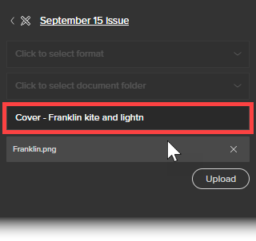
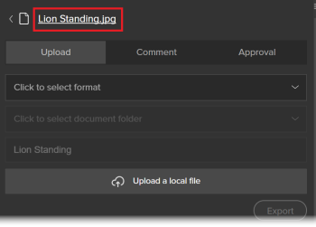
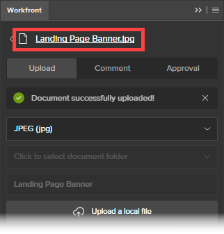

# Verwenden der Workfront-Erweiterung für Illustrator und InDesign

<!--Audited: 01/2024-->

>[!IMPORTANT]
>
>Wir ersetzen die Workfront-Erweiterung für Illustrator und InDesign durch [aktualisierte Creative Cloud-Plug-ins](/help/quicksilver/workfront-integrations-and-apps/adobe-workfront-for-creative-cloud/wf-cc-install-toc.md). Ab Ende 2022 wird diese Erweiterung nicht mehr unterstützt und ist nur noch ohne Mängelgewähr verfügbar.

Sie können die Workfront-Erweiterung verwenden, um digitale Inhalte, die Sie in Adobe Illustrator und Adobe InDesign speichern und erstellen, nach Workfront zu exportieren. Dadurch wird der Prozess der Dokumentüberprüfung und -genehmigung beschleunigt.

Die Workfront-Erweiterung wird für Adobe Creative Cloud 2017 und neuer in den folgenden Anwendungen unterstützt:

* InDesign
* Illustrator
* Photoshop

  >[!NOTE]
  >
  >Es wird empfohlen, das neue Plug-in [Adobe Workfront for Photoshop](/help/quicksilver/workfront-integrations-and-apps/adobe-workfront-for-creative-cloud/wf-cc-install-ps.md) zu verwenden.

## Zugriffsanforderungen

+++ Erweitern, um die Zugriffsanforderungen für die in diesem Artikel beschriebene Funktionalität anzuzeigen.

<table style="table-layout:auto"> 
 <col> 
 <col> 
 <tbody> 
  <tr> 
   <td role="rowheader">Adobe Workfront-Paket</td> 
   <td> 
Beliebig

 </td> 
  </tr> 
  <tr data-mc-conditions=""> 
   <td role="rowheader">Adobe Workfront-Lizenz</td> 
   <td> 
      
Standard
 
   
Work oder höher

</td> 
  </tr> 
  <tr> 
   <td role="rowheader">Zusätzliche Produkte</td> 
   <td>Sie müssen neben einer Workfront-Lizenz über eine Adobe Creative Cloud-Lizenz verfügen.</td> 
  </tr> 
  <tr> 
   <td role="rowheader">Objektberechtigungen</td> 
   <td> 
Bearbeiten Sie den Zugriff auf das Objekt, mit dem eine Interaktion erfolgen soll.
  </td> 
  </tr> 
 </tbody> 
</table>

Weitere Informationen finden Sie unter [Zugriffsanforderungen](/help/quicksilver/administration-and-setup/add-users/access-levels-and-object-permissions/access-level-requirements-in-documentation.md) in der Dokumentation zu Workfront.

+++

## Anmelden bei der Workfront-Erweiterung über Illustrator oder InDesign {#log-in-to-workfront-extension-from-illustrator-or-indesign}

Wenn Sie sich über eine der unterstützten Adobe-Anwendungen bei Workfront anmelden, werden Sie bei allen unterstützten Adobe-Anwendungen angemeldet.

1. Wechseln Sie zu der Adobe-Anwendung, in der Sie die Workfront-Erweiterung verwenden möchten.

   Eine Liste der unterstützten Formate für jede unterstützte Anwendung finden Sie unter [Unterstützte exportierte Dateiformate](#supported-exported-file-formats) in diesem Artikel.

1. Klicken Sie auf **Fenster** > **Erweiterungen** > „Workfront“.

1. (Optional) Ziehen Sie das Workfront-Panel an die Position, an der es in der Adobe-Anwendung angezeigt werden soll.
1. Befolgen Sie die Anweisungen, um sich bei Workfront anzumelden.

   >[!NOTE]
   >
   >* Workfront stellt eine Verbindung zu Adobe Creative Cloud mithilfe von OAuth 2.0 her, einem sicheren Standard, der von den meisten Web-basierten Integrationen für die Authentifizierung und Autorisierung von Benutzenden verwendet wird.
   >* Wenn Sie aufgefordert werden, [die Domain oder den Host] Ihres Workfront-Kontos einzugeben, geben Sie sie in folgendem Format ein: `yourCompany'sDomain.my.workfront.com`. Die Domain Ihres Unternehmens ist normalerweise der Name Ihres Unternehmens.

   Eine Liste der Ihnen zugewiesenen Arbeitselemente wird angezeigt, wenn das Projekt einen aktuellen Status aufweist. Wenn keine Liste angezeigt wird, melden Sie sich bei Workfront an.

   Persönliche Aufgaben werden unter **Kein Projekt** aufgeführt.

## Hochladen einer Datei in ein Projekt, eine Aufgabe oder ein Problem in Workfront {#upload-a-file-to-a-workfront-project-task-or-issue}

Sie können eine Datei aus Ihrem Computer-Dateisystem hochladen oder eine Datei, die derzeit in einer Adobe Creative Cloud-Anwendung geöffnet ist, in ein Projekt, eine Aufgabe oder ein Problem in Workfront exportieren. 

Beachten Sie beim Hochladen oder Exportieren einer Datei aus Adobe Creative Cloud Folgendes:

* Ihre Zugriffsebene muss das Hochladen von Dokumenten in Workfront zulassen. Weitere Informationen finden Sie unter [Gewähren des Zugriffs auf Dokumente](../../administration-and-setup/add-users/configure-and-grant-access/grant-access-documents.md).
* Sie müssen über die erforderlichen Berechtigungen verfügen, um Dokumente an den gewünschten Ort hochzuladen. Weitere Informationen finden Sie unter [Überblick über Freigabeberechtigungen für Objekte](../../workfront-basics/grant-and-request-access-to-objects/sharing-permissions-on-objects-overview.md).
* Die Datei wird in den Bereich „Dokumente“ für das ausgewählte Workfront-Objekt hochgeladen.
* Sie können ein Dokument nicht aus einer Adobe Creative Cloud-Anwendung in den Bereich „Dokumente“ im Hauptmenü () exportieren.

In den folgenden Abschnitten werden die folgenden Themen erläutert:

* [Hochladen einer Datei](#upload-a-file)
* [Exportieren einer derzeit in Illustrator oder InDesign geöffneten Datei](#export-a-file-currently-open-in-illustrator-or-indesign)
* [Hochladen einer neuen Dateiversion aus Illustrator oder InDesign](#upload-a-new-version-of-a-file-from-illustrator-or-indesign)

### Hochladen einer Datei {#upload-a-file}

Sie können Ihre Dateien in ein Projekt, eine Aufgabe oder ein Problem hochladen, ohne die Adobe Creative Cloud-Anwendung verlassen zu müssen.

1. Wenn die Workfront-Erweiterung beim Öffnen der Adobe Creative Cloud-Anwendung nicht angezeigt wird, klicken Sie auf **Fenster** > **Erweiterungen** > **Workfront**.

   Eine Liste der Ihnen zugewiesenen Arbeitselemente wird angezeigt, wenn sich das Projekt in einem aktuellen Status befindet. Wenn keine Liste angezeigt wird, melden Sie sich bei Workfront an.

   Persönliche Aufgaben werden unter **Kein Projekt** angezeigt.

1. Klicken Sie auf den Namen des Projekts, der Aufgabe oder des Problems, in die bzw. das Sie die Datei hochladen möchten.

   Sie können danach suchen, indem Sie den Namen in das Feld **Suchen** eingeben und **Projekt**, **Aufgabe** oder **Problem** im Dropdown-Menü rechts neben dem Feld **Suchen** auswählen. Wenn der Name des Arbeitselements nicht in der Liste angezeigt wird, drücken Sie die **Eingabetaste**, um alle Workfront-Elemente zu durchsuchen, auf die Sie Zugriff haben.

1. Klicken Sie in der unteren rechten Ecke der Workfront-Erweiterung auf **Auswählen**.
1. Klicken Sie im Dropdown-Menü **Zum Auswählen des Formats klicken** auf das Format, in dem Sie die Datei in Workfront speichern möchten.

   Eine Liste der unterstützten Formate für jede unterstützte Anwendung finden Sie unter [Unterstützte exportierte Dateiformate](#supported-exported-file-formats) in diesem Artikel.

1. (Bedingt) Wenn das Arbeitselement, in das Sie die Datei hochladen möchten, Dokumentordner enthält, wählen Sie einen Dokumentordner im Feld **Zum Auswählen eines Dokumentordners klicken** aus und klicken Sie dann auf **Auswählen**.

1. Klicken Sie auf **Lokale Datei hochladen**.
1. Suchen Sie im Feld **Datei öffnen** die Datei in Ihrem Dateisystem und klicken Sie dann auf **Öffnen**.

1. (Optional) Geben Sie einen neuen Namen für die Datei ein.

   

1. Klicken Sie auf **Hochladen**.

   In Workfront wird das Dokument jetzt im Bereich „Dokumente“ für das ausgewählte Projekt, die ausgewählte Aufgabe oder das ausgewählte Problem aufgeführt.

1. (Optional) Klicken Sie auf den Namen des Dokuments, um die zugehörige Seite „Dokumentdetails“ in Workfront zu öffnen.

   Workfront wird in einem neuen Browser-Tab geöffnet.

### Exportieren einer derzeit in Illustrator oder InDesign geöffneten Datei {#export-a-file-currently-open-in-illustrator-or-indesign}

1. Öffnen Sie in einer unterstützten Adobe Creative Cloud-Anwendung eine Datei, die Sie nach Workfront exportieren möchten.
1. Wenn die Workfront-Erweiterung nicht angezeigt wird, klicken Sie auf **Fenster** > **Erweiterungen** > **Workfront**.

   Eine Liste der Ihnen zugewiesenen Arbeitselemente wird angezeigt, wenn sich das Projekt in einem aktuellen Status befindet. Wenn keine Liste angezeigt wird, melden Sie sich bei Workfront an.

   Persönliche Aufgaben werden unter **Kein Projekt** aufgeführt.

1. Klicken Sie auf den Namen des Projekts, der Aufgabe oder des Problems, in die bzw. das Sie die Datei exportieren möchten.

   Sie können danach suchen, indem Sie den Namen in das Feld **Suchen** eingeben und **Projekt**, **Aufgabe** oder **Problem** im Dropdown-Menü rechts neben dem Feld **Suchen** auswählen. Wenn der Name des Arbeitselements nicht in der Liste angezeigt wird, drücken Sie die **Eingabetaste**, um alle Workfront-Elemente zu durchsuchen, auf die Sie Zugriff haben.

1. Klicken Sie im Dropdown-Menü **Zum Auswählen des Formats klicken** auf das Format, in dem Sie die Datei in Workfront speichern möchten.

   Eine Liste der unterstützten Formate für jede unterstützte Anwendung finden Sie unter [Unterstützte exportierte Dateiformate](#supported-exported-file-formats) in diesem Artikel.

1. (Bedingt) Wenn das Arbeitselement, in das Sie die Datei hochladen möchten, Dokumentordner enthält, wählen Sie einen Dokumentordner im Feld **Zum Auswählen eines Dokumentordners klicken** aus und klicken Sie dann auf **Auswählen**.
1. (Optional) Um das Dokument umzubenennen, klicken Sie auf den Dokumentnamen und geben Sie einen neuen Namen ein.

   

1. Klicken Sie auf **Exportieren**.

   Es wird eine Meldung angezeigt, die bestätigt, dass das Dokument erfolgreich nach Workfront exportiert wurde.

   In Workfront wird das Dokument im Bereich „Dokumente“ des Objekts aufgeführt, das Sie in Workfront angegeben haben.

1. (Optional) Klicken Sie auf den Namen des Dokuments, um in Workfront darauf zuzugreifen.

   

   Workfront wird in einem neuen Browser-Tab geöffnet.

### Hochladen einer neuen Dateiversion aus Illustrator oder InDesign {#upload-a-new-version-of-a-file-from-illustrator-or-indesign}

1. Wenn Sie eine Datei, an der Sie in einer unterstützten Adobe-Anwendung arbeiten, als neue Version einer Datei in Workfront exportieren möchten, öffnen Sie die Datei in der Adobe-Anwendung.
1. Wenn die Workfront-Erweiterung nicht angezeigt wird, klicken Sie auf **Fenster** > **Erweiterungen** > **Workfront**.

   Eine Liste der Ihnen zugewiesenen Arbeitselemente wird angezeigt, wenn das Projekt einen aktuellen Status aufweist. Wenn keine Liste angezeigt wird, melden Sie sich bei Workfront an.

   Persönliche Aufgaben werden unter **Kein Projekt** angezeigt.

1. Klicken Sie auf den Namen des Projekts, der Aufgabe oder des Problems, in dem bzw. der das vorhandene Dokument aufgeführt ist.

   Sie können danach suchen, indem Sie den Namen in das Feld **Suchen** eingeben und **Projekt**, **Aufgabe** oder **Problem** im Dropdown-Menü rechts neben dem Feld **Suchen** auswählen. Wenn der Name des Arbeitselements nicht in der Liste angezeigt wird, drücken Sie die **Eingabetaste**, um alle Workfront-Elemente zu durchsuchen, auf die Sie Zugriff haben.

   Alle Dokumente, die in Projekte, Aufgaben oder Probleme hochgeladen wurden, werden in einer Liste angezeigt, unabhängig davon, ob sie über die Adobe-Anwendung hochgeladen wurden.

1. Klicken Sie im Dropdown-Menü **Zum Auswählen des Formats klicken** auf das Format, in dem Sie die Datei in Workfront speichern möchten.

   Dies ist erforderlich, wenn Sie eine in der Adobe-Anwendung geöffnete Datei exportieren. Eine Liste der unterstützten Formate für jede unterstützte Anwendung finden Sie unter [Unterstützte exportierte Dateiformate](#supported-exported-file-formats) in diesem Artikel.

1. Wenn Sie eine in der Adobe-Anwendung geöffnete Datei als neue Version des ausgewählten Workfront-Dokuments exportieren, klicken Sie auf **Exportieren**.

   Oder

   Wenn Sie eine Datei aus Ihrem Computer-Dateisystem als neue Version des ausgewählten Workfront-Dokuments hochladen möchten, klicken Sie auf **Lokale Datei hochladen**, suchen Sie die Datei in dem angezeigten Feld, klicken Sie auf **Öffnen** und dann auf **Hochladen**.

1. (Optional) Klicken Sie auf den Namen des Dokuments, um dessen neue Version in Workfront anzuzeigen.

   >[!NOTE]
   >
   >Der Name des Dokuments in Workfront wird standardmäßig ausgefüllt und kann nicht bearbeitet werden. Ebenso wenig ändert sich der Name der Datei, die Sie hochladen oder als neue Version exportieren.
   >
   >
   >

## Kommentieren eines Workfront-Dokuments aus Illustrator oder InDesign {#comment-on-a-workfront-document-from-illustrator-or-indesign}

Sie können Kommentare direkt in einer Adobe-Anwendung zu einem Workfront-Dokument hinzufügen. In Workfront werden Ihre Kommentare im Bereich „Updates“ des Dokuments und im Bereich „Updates“ des Workfront-Elements angezeigt, in dem das Dokument gespeichert ist.

1. Öffnen Sie eine der unterstützten Adobe-Anwendungen.
1. Wenn die Workfront-Erweiterung nicht angezeigt wird, klicken Sie auf **Fenster** > **Erweiterungen** > **Workfront**.

   Eine Liste der Ihnen zugewiesenen Arbeitselemente wird angezeigt, wenn das Projekt einen aktuellen Status aufweist. Wenn keine Liste angezeigt wird, melden Sie sich bei Workfront an.

   Persönliche Aufgaben werden unter **Kein Projekt** angezeigt.

1. Klicken Sie auf das Projekt, die Aufgabe oder das Problem, in dem bzw. der das vorhandene Dokument aufgeführt ist.

   Sie können danach suchen, indem Sie den Namen in das Feld **Suchen** eingeben und **Projekt**, **Aufgabe** oder **Problem** im Dropdown-Menü rechts neben dem Feld **Suchen** auswählen. Wenn der Name des Arbeitselements nicht in der Liste angezeigt wird, drücken Sie die **Eingabetaste**, um alle Workfront-Elemente zu durchsuchen, auf die Sie Zugriff haben.

1. Klicken Sie auf den Namen des vorhandenen Dokuments und dann in der unteren rechten Ecke der Workfront-Erweiterung auf **Auswählen**.
1. Klicken Sie auf **Kommentar** und geben Sie dann Ihre Aktualisierung in das Feld ein.

1. (Optional) Um andere Workfront-Benutzende oder -Teams in den Kommentar einzubeziehen, geben Sie zunächst den Namen einer Benutzerin bzw. eines Benutzers oder eines Teams in das Feld **Personen oder Teams benachrichtigen** ein und klicken Sie dann auf den Namen, wenn er in der Dropdown-Liste angezeigt wird.
1. (Optional) Um eine Genehmigung für das Dokument anzufordern, wählen Sie **Eine Genehmigungsanfrage stellen** aus.
1. Klicken Sie auf **Aktualisieren**.

   Eine Aktualisierung wird auf der Registerkarte „Updates“ des Dokuments veröffentlicht. Benutzende von Workfront, die Sie in den Kommentar einbeziehen, erhalten eine In-App-Benachrichtigung und möglicherweise auch eine E-Mail-Benachrichtigung, je nachdem, wie Workfront konfiguriert ist.

   Weitere Informationen zu Benachrichtigungen in Workfront finden Sie unter [Anzeigen und Verwalten von In-App-Benachrichtigungen](../../workfront-basics/using-notifications/view-and-manage-in-app-notifications.md).

   Weitere Informationen zum Erhalt von E-Mail-Benachrichtigungen finden Sie unter [Adobe Workfront-Benachrichtigungen](../../workfront-basics/using-notifications/wf-notifications.md).

## Anfordern einer Dokumentgenehmigung von Illustrator oder InDesign

Sie können eine Workfront-Dokumentgenehmigung direkt von einer Adobe-Anwendung aus anfordern.

Sie können eine Dokumentgenehmigung von den folgenden Entitäten anfordern:

* Einer Benutzerin bzw. einem Benutzer von Workfront
* Einer externen Benutzerin bzw. einem externen Benutzer eines Workfront-Kontos

Sie können eine Genehmigung für ein Dokument wie folgt von einer Adobe-Anwendung aus anfordern:

* Durch Anhängen einer genehmigenden Person an das Dokument.
* Indem Sie ein Dokument kommentieren, die Person benachrichtigen, wenn Sie einen Kommentar abgeben, und sie als genehmigende Person an das Dokument anhängen.

  Informationen zum Anfordern einer Genehmigung beim Kommentieren eines Dokuments finden Sie im Abschnitt [Kommentar zu einem Workfront-Dokument aus Illustrator oder InDesign](#comment-on-a-workfront-document-from-illustrator-or-indesign) in diesem Artikel.

So fordern Sie eine Genehmigung für ein Dokument von einer Adobe-Anwendung aus an:

1. Öffnen Sie eine der unterstützten Adobe-Anwendungen.
1. Wenn die Workfront-Erweiterung nicht angezeigt wird, klicken Sie auf **Fenster** > **Erweiterungen** > **Workfront**.

   Eine Liste der Ihnen zugewiesenen Arbeitselemente wird angezeigt, wenn das Projekt einen aktuellen Status aufweist. Wenn keine Liste angezeigt wird, melden Sie sich bei Workfront an.

   Persönliche Aufgaben werden unter **Kein Projekt** angezeigt.

1. Klicken Sie auf das Projekt, die Aufgabe oder das Problem, in dem bzw. der das vorhandene Dokument aufgeführt ist, und klicken Sie dann auf den Namen des vorhandenen Dokuments.

   Sie können danach suchen, indem Sie den Namen in das Feld **Suchen** eingeben und **Projekt**, **Aufgabe** oder **Problem** im Dropdown-Menü rechts neben dem Feld **Suchen** auswählen. Wenn der Name des Arbeitselements nicht in der Liste angezeigt wird, drücken Sie die **Eingabetaste**, um alle Workfront-Elemente zu durchsuchen, auf die Sie Zugriff haben.

1. Klicken Sie auf den Namen des vorhandenen Dokuments und dann in der unteren rechten Ecke der Workfront-Erweiterung auf **Auswählen**.
1. Klicken Sie auf die Registerkarte **Genehmigung**.
1. Um eine genehmigende Person hinzuzufügen, führen Sie im Feld **Beginnen Sie mit der Eingabe eines Namens** einen der folgenden Schritte aus:

   * Geben Sie den Namen einer genehmigenden Person ein und wählen Sie ihn aus, wenn er in der Liste angezeigt wird.

     

   * Geben Sie die E-Mail-Adresse einer externen Benutzerin bzw. eines externen Benutzers ein.

1. Klicken Sie auf **Genehmigung anfordern**.

   Benutzende von Workfront, die Sie in den Kommentar einbeziehen oder als genehmigende Person hinzufügen, erhalten eine In-App-Benachrichtigung und möglicherweise auch eine E-Mail-Benachrichtigung, je nachdem, wie Workfront konfiguriert ist.\
   Externe Benutzende erhalten eine E-Mail-Benachrichtigung, über die sie eine Entscheidung über die Genehmigung treffen können.

   Weitere Informationen zu Benachrichtigungen in Workfront finden Sie unter [Anzeigen und Verwalten von In-App-Benachrichtigungen](../../workfront-basics/using-notifications/view-and-manage-in-app-notifications.md). Informationen zum Erhalt von E-Mail-Benachrichtigungen finden Sie unter [Adobe Workfront-Benachrichtigungen](../../workfront-basics/using-notifications/wf-notifications.md).

## Erstellen eines Korrekturabzugs aus Illustrator oder InDesign {#generate-a-proof-from-illustrator-or-indesign}

Wenn Ihre Organisation automatisierte Workflow-Vorlagen verwendet, können Sie einen Korrekturabzug für ein Dokument generieren, das Sie in einer Adobe-Anwendung erstellen, ohne die Anwendung verlassen zu müssen. Informationen zum Erstellen von Korrekturabzügen finden Sie unter [Erstellen von Korrekturabzügen](../../review-and-approve-work/proofing/creating-proofs-within-workfront/create-proofs-in-wf.md). Informationen zu automatisierten Workflow-Vorlagen finden Sie unter [Automatisierte Workflow-Vorlagen](../../review-and-approve-work/proofing/proofing-overview/automated-workflow.md#automate) in [Automatisierter Workflow – Überblick](../../review-and-approve-work/proofing/proofing-overview/automated-workflow.md).

1. Öffnen Sie eine der unterstützten Adobe-Anwendungen.
1. Wenn die Workfront-Erweiterung nicht angezeigt wird, klicken Sie auf **Fenster** > **Erweiterungen** > Workfront.

   Eine Liste der Ihnen zugewiesenen Arbeitselemente wird angezeigt, wenn das Projekt einen aktuellen Status aufweist. Wenn keine Liste angezeigt wird, melden Sie sich bei Workfront an.

   Persönliche Aufgaben werden unter **Kein Projekt** angezeigt.

1. Wenn das Dokument bereits in Workfront hochgeladen wurde, wählen Sie das Projekt, die Aufgabe oder das Problem in der Workfront-Erweiterung aus, in der das Dokument aufgeführt ist, und klicken Sie dann auf den Namen des Dokuments.

   Oder

   Laden Sie ein Adobe-Dokument in ein Workfront-Objekt hoch, wie im Abschnitt [Hochladen einer Datei in ein Projekt, eine Aufgabe oder ein Problem in Workfront](#upload-a-file-to-a-workfront-project-task-or-issue) in diesem Artikel beschrieben, und klicken Sie dann auf den Namen des Dokuments.

1. Klicken Sie im Dropdown-Menü **Zum Auswählen des Formats klicken** auf das Format, in dem Sie die Datei in Workfront speichern möchten.

   Einige Formate sind nicht verfügbar, nachdem Sie die Proofing-Funktion im folgenden Schritt aktiviert haben. Weitere Informationen finden Sie unter [Unterstützte exportierte Dateiformate](#supported-exported-file-formats) in diesem Artikel.

1. Klicken Sie auf **Als neuen Korrekturabzug hochladen**, um die Funktion zu aktivieren.
1. Wählen Sie die **Workflow-Vorlage** aus, die Benutzende bei der Überprüfung des Dokuments verwenden sollen.

   Die bzw. der Workfront-Admin richtet automatisierte Workflow-Vorlagen ein, wie unter [Erstellen und Verwalten automatisierter Workflow-Vorlagen](/help/quicksilver/administration-and-setup/manage-workfront/configure-proofing/create-manage-automated-workflow-templates.md) beschrieben. Wenden Sie sich bei Fragen an die bzw. den Admin.

   1. Fügen Sie zu jedem Schritt in der Workflow-Vorlage mindestens **eine neue Empfängerin bzw. einen neuen Empfänger** hinzu.

      Sie können mit der Eingabe eines Namens beginnen und diesen auswählen, wenn Sie ihn in der angezeigten Dropdown-Liste sehen.

   1. Geben Sie die **Korrekturabzugsrolle** und die Häufigkeit von **E-Mail-Benachrichtigungen** für jede hinzugefügte Empfängerin bzw. jeden hinzugefügten Empfänger an.

   1. (Optional) Wählen Sie im Abschnitt **E-Mail-Benachrichtigung** aus, ob eine E-Mail-Benachrichtigung mit einer optionalen benutzerdefinierten Nachricht zum Korrekturabzug an alle hinzugefügten Empfängerinnen bzw. Empfänger des Korrekturabzugs gesendet werden soll.

1. Klicken Sie auf **Korrekturabzug erstellen**.

   Sie können den Fortschritt der Erstellung des Korrekturabzugs sehen. Wenn die Erstellung abgeschlossen ist, wird ein Warnhinweis angezeigt. Sie können die Aufgabe öffnen, in der Sie den Korrekturabzug erstellt haben. Dieser ist dort aufgeführt.

## Hochladen einer neuen Version eines Korrekturabzugs, ohne Illustrator oder InDesign zu verlassen

1. Klicken Sie auf ein vorhandenes Dokument mit einem Korrekturabzug und dann in der unteren rechten Ecke auf **Auswählen**.
1. Klicken Sie auf **Als neue Korrekturabzugsversion hochladen**, um die Version zu aktivieren.
1. (Optional) Wählen Sie die **Workflow-Vorlage** aus, die Benutzende bei der Überprüfung der neuen Version verwenden sollen.

   Wenn Sie keine andere Vorlage auswählen, bleibt die für die frühere Version ausgewählte Vorlage aktiv. Wenn Sie die Vorlage für die frühere Version geändert haben, sind die Änderungen auch für die neue Version wirksam.

   Die bzw. der Workfront-Admin richtet automatisierte Workflow-Vorlagen ein, wie unter [Erstellen und Verwalten automatisierter Workflow-Vorlagen](/help/quicksilver/administration-and-setup/manage-workfront/configure-proofing/create-manage-automated-workflow-templates.md) beschrieben. Wenden Sie sich bei Fragen an die bzw. den Admin.

   1. Fügen Sie zu jedem Schritt in der Workflow-Vorlage mindestens **eine neue Empfängerin bzw. einen neuen Empfänger** hinzu.

      Sie können mit der Eingabe eines Namens beginnen und diesen auswählen, wenn Sie ihn in der angezeigten Dropdown-Liste sehen.

   1. Geben Sie die **Korrekturabzugsrolle** und die Häufigkeit von **E-Mail-Benachrichtigungen** für jede hinzugefügte Empfängerin bzw. jeden hinzugefügten Empfänger an.
   1. (Optional) Wählen Sie im Abschnitt **E-Mail-Benachrichtigung** aus, ob eine E-Mail-Benachrichtigung mit einer optionalen benutzerdefinierten Nachricht zum Korrekturabzug an alle hinzugefügten Empfängerinnen bzw. Empfänger des Korrekturabzugs gesendet werden soll.

1. Klicken Sie auf **Neue Korrekturabzugsversion erstellen**.

   Sie können den Fortschritt der Erstellung des Korrekturabzugs sehen. Wenn die Erstellung abgeschlossen ist, wird ein Warnhinweis angezeigt. Sie können die Aufgabe öffnen, in der Sie den Korrekturabzug erstellt haben. Dieser ist dort aufgeführt.

## Abmelden von der Workfront-Erweiterung

1. Klicken Sie in der Adobe-Anwendung auf **Fenster** > **Erweiterungen** > **Workfront**.

1. Klicken Sie auf das Menü **Mehr** () in der oberen rechten Ecke des Panels.

1. (Optional) Klicken Sie auf **Feedback**, um eine kurze Umfrage zu öffnen und Ihr Feedback zu Workfront for Adobe Creative Cloud an Workfront zu senden.
1. Klicken Sie auf **Abmelden**.\
   Der Login-Bildschirm wird angezeigt. Weitere Informationen zur Anmeldung finden Sie unter [Anmelden bei der Workfront-Erweiterung über Illustrator oder InDesign](#log-in-to-workfront-extension-from-illustrator-or-indesign) in diesem Artikel.

## Unterstützte exportierte Dateiformate {#supported-exported-file-formats}

* [Unterstützte exportierte Dateiformate für Adobe InDesign](#supported-exported-file-formats-for-adobe-indesign)
* [Unterstützte exportierte Dateiformate für Adobe Illustrator](#supported-exported-file-formats-for-adobe-illustrator)

### Unterstützte exportierte Dateiformate für Adobe InDesign  {#supported-exported-file-formats-for-adobe-indesign}

Workfront unterstützt die folgenden Dateiformate für den Export einer Datei von InDesign nach Workfront:

* EPS – Encapsulated PostScript
* EPUB – Elektronische Publikation mit festem Layout
* EPUB – Reflowable Electronic Publication &#42;
* HTML – HyperText Markup Language
* IDML – InDesign Markup Language &#42;
* JPG, JPEG – Joint Photographic Experts Group
* PDF – Adobe Portable Document Format
* PNG – Portable Network Graphics
* SWF – Flash Player &#42;
* XML – Extensible Markup Language &#42;

&#42; Dieses Dateiformat ist nicht verfügbar, wenn **Neuen Korrekturabzug hochladen** aktiviert ist (weitere Informationen zu dieser Option finden Sie unter [Erstellen eines Korrekturabzugs aus Illustrator oder InDesign](#generate-a-proof-from-illustrator-or-indesign) in diesem Artikel). Wenn dieses Dateiformat bereits ausgewählt ist, bevor Sie **Neuen Korrekturabzug hochladen** aktivieren, wird das Dateiformat vom System in PDF geändert. Sie können ein anderes Format aus der Liste auswählen.

### Unterstützte exportierte Dateiformate für Adobe Illustrator  {#supported-exported-file-formats-for-adobe-illustrator}

Workfront unterstützt die folgenden Dateiformate für den Export einer Datei von Illustrator nach Workfront:

* DWG – AutoCAD Drawing, AutoCAD Interchange File &#42;
* JPG, JPEG – Joint Photographic Experts Group
* PNG – Portable Network Graphics
* PSD – Photoshop-Dokument
* SWF – Flash Player &#42;
* TIFF – Tagged Image File Format

&#42; Dieses Dateiformat ist nicht verfügbar, wenn **Neuen Korrekturabzug hochladen** aktiviert ist (weitere Informationen zu dieser Option finden Sie unter [Erstellen eines Korrekturabzugs aus Illustrator oder InDesign](#generate-a-proof-from-illustrator-or-indesign) in diesem Artikel). Wenn dieses Dateiformat bereits ausgewählt ist, bevor Sie **Neuen Korrekturabzug hochladen** aktivieren, wird das Dateiformat vom System in PNG geändert. Sie können ein anderes Format aus der Liste auswählen.
