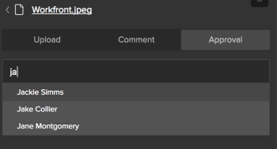

# Verwenden der Workfront-Erweiterung für Illustrator und InDesign

>[!IMPORTANT]
>
>Wir ersetzen die Workfront-Erweiterung für Illustrator und InDesign durch [aktualisierte Creative Cloud-Plug-ins](/help/quicksilver/workfront-integrations-and-apps/adobe-workfront-for-creative-cloud/wf-cc-install-toc.md). Ab Ende 2022 wird diese Erweiterung nicht mehr unterstützt und ist unverändert verfügbar.

Sie können die Workfront-Erweiterung verwenden, um digitale Inhalte, die Sie in Adobe Illustrator und Adobe InDesign speichern und erstellen, in Workfront zu exportieren. Dies beschleunigt den Dokumentenprüfungs- und -genehmigungsprozess.

Die Workfront-Erweiterung wird für Adobe Creative Cloud 2017 und höher in den folgenden Anwendungen unterstützt:

* InDesign
* Illustrator
* Photoshop

   >[!NOTE]
   >
   >Es wird empfohlen, die neue [Adobe Workfront für Photoshop](/help/quicksilver/workfront-integrations-and-apps/adobe-workfront-for-creative-cloud/wf-cc-install-ps.md) Plug-in.

## Zugriffsanforderungen

Sie müssen über folgenden Zugriff verfügen, um die Schritte in diesem Artikel ausführen zu können:

<table style="table-layout:auto"> 
 <col> 
 <col> 
 <tbody> 
  <tr> 
   <td role="rowheader">Adobe Workfront-Plan*</td> 
   <td> 
Pro oder höher
 </td> 
  </tr> 
  <tr data-mc-conditions=""> 
   <td role="rowheader">Adobe Workfront-Lizenz*</td> 
   <td> 
Arbeit oder höher
 </td> 
  </tr> 
  <tr> 
   <td role="rowheader">Produkt</td> 
   <td>Zusätzlich zu einer Workfront-Lizenz benötigen Sie eine Adobe Creative Cloud-Lizenz.</td> 
  </tr> 
  <tr> 
   <td role="rowheader">Objektberechtigungen</td> 
   <td> 
Bearbeiten Sie den Zugriff auf das Objekt, mit dem Sie interagieren möchten.
 
Informationen zum Anfordern von zusätzlichem Zugriff finden Sie unter <a href="../../workfront-basics/grant-and-request-access-to-objects/request-access.md" class="MCXref xref">Zugriff auf Objekte anfordern </a>.
 </td> 
  </tr> 
 </tbody> 
</table>

&#42;Wenden Sie sich an Ihren Workfront-Administrator, um zu erfahren, welchen Plan, welchen Lizenztyp oder welchen Zugriff Sie haben.

## Bei der Workfront-Erweiterung über Illustrator oder InDesign anmelden {#log-in-to-workfront-extension-from-illustrator-or-indesign}

Wenn Sie sich von einer der unterstützten Adobe Apps aus bei Workfront anmelden, werden Sie bei allen unterstützten Adobe Apps angemeldet.

1. Wechseln Sie zur Adobe App, in der Sie die Workfront-Erweiterung verwenden möchten.

   Eine Liste der unterstützten Formate für jede unterstützte Anwendung finden Sie unter [Unterstützte exportierte Dateiformate](#supported-exported-file-formats) in diesem Artikel.

1. Klicken **Fenster** > **Erweiterungen** > Workfront.

1. (Optional) Ziehen Sie das Bedienfeld Workfront an die Stelle, an der es in der Adobe App angezeigt werden soll.
1. Befolgen Sie die Anweisungen zum Anmelden bei Workfront.

   >[!NOTE]
   >
   >* Workfront stellt mithilfe von OAuth 2.0 eine Verbindung zu Adobe Creative Cloud her, einem sicheren Standard, der von den meisten webbasierten Integrationen für die Authentifizierung und Autorisierung von Benutzern verwendet wird.
   >* Wenn Sie aufgefordert werden, die [Domäne oder Host] Ihres Workfront-Kontos angeben: *yourCompany&#39;sDomain.my.workfront.com*. Die Domäne Ihres Unternehmens ist normalerweise der Name Ihres Unternehmens.

   Eine Liste der Ihnen zugewiesenen Arbeitselemente wird angezeigt, wenn das Projekt den aktuellen Status aufweist. Wenn keine Liste angezeigt wird, melden Sie sich bei Workfront an.

   Persönliche Aufgaben sind unter **Kein Projekt**.

## Datei in ein Workfront-Projekt, eine Aufgabe oder ein Problem hochladen {#upload-a-file-to-a-workfront-project-task-or-issue}

Sie können eine Datei aus Ihrem Computerdateisystem hochladen oder eine Datei exportieren, die derzeit in einer Adobe Creative Cloud-Anwendung geöffnet ist, und zwar in ein Workfront-Projekt, eine Aufgabe oder ein Problem. 

Beachten Sie beim Hochladen oder Exportieren einer Datei aus Adobe Creative Cloud Folgendes:

* Ihre Zugriffsebene muss das Hochladen von Dokumenten in Workfront zulassen. Weitere Informationen finden Sie unter [Zugriff auf Dokumente gewähren](../../administration-and-setup/add-users/configure-and-grant-access/grant-access-documents.md).
* Sie müssen über die Berechtigungen zum Hochladen von Dokumenten in das Element verfügen, in dem Sie es verwenden möchten. Weitere Informationen finden Sie unter [Übersicht über die Freigabe von Berechtigungen für Objekte](../../workfront-basics/grant-and-request-access-to-objects/sharing-permissions-on-objects-overview.md).
* Die Datei wird in den Bereich &quot;Dokumente&quot;für das von Ihnen ausgewählte Workfront-Objekt hochgeladen.
* Sie können ein Dokument nicht in den Bereich &quot;Dokumente&quot;im Hauptmenü exportieren  aus einer Adobe Creative Cloud-Anwendung.

In diesem Abschnitt wird Folgendes erläutert:

* [Datei hochladen](#upload-a-file)
* [Eine Datei exportieren, die derzeit in Illustrator oder auf InDesign geöffnet ist](#export-a-file-currently-open-in-illustrator-or-indesign)
* [Laden Sie eine neue Dateiversion von Illustrator oder InDesign hoch.](#upload-a-new-version-of-a-file-from-illustrator-or-indesign)

### Datei hochladen {#upload-a-file}

Sie können Ihre Dateien in ein Projekt, eine Aufgabe oder ein Problem hochladen, ohne Ihre Adobe Creative Cloud-Anwendung zu verlassen.

1. Wenn die Workfront-Erweiterung beim Öffnen der Adobe Creative Cloud-Anwendung nicht angezeigt wird, klicken Sie auf **Fenster** > **Erweiterungen** > Workfront.

   Eine Liste der Ihnen zugewiesenen Arbeitselemente wird angezeigt, wenn das Projekt den aktuellen Status aufweist. Wenn keine Liste angezeigt wird, melden Sie sich bei Workfront an.

   Persönliche Aufgaben sind unter **Kein Projekt**.

1. Klicken Sie auf den Namen des Projekts, der Aufgabe oder des Problems, in das Sie die Datei hochladen möchten.

   Sie können danach suchen, indem Sie den Namen in die **Suche** auswählen **Projekt**, **Aufgabe** oder **Problem** aus dem Dropdown-Menü rechts neben dem **Suche** ankreuzen. Wenn der Name des Arbeitselements nicht in der Liste angezeigt wird, drücken Sie die Eingabetaste **Eingabe** um alle Workfront-Elemente zu durchsuchen, auf die Sie Zugriff haben.

1. Klicken **Auswählen** in der rechten unteren Ecke der Workfront-Erweiterung.
1. Im **Klicken, um das Format auszuwählen** Dropdown-Menü auf das Format klicken, in dem Sie die Datei in Workfront speichern möchten.

   Eine Liste der unterstützten Formate für jede unterstützte Anwendung finden Sie unter [Unterstützte exportierte Dateiformate](#supported-exported-file-formats) in diesem Artikel.

1. (Bedingt) Wenn das Arbeitselement, in das Sie die Datei hochladen möchten, Dokumentordner enthält, wählen Sie einen Dokumentordner im **Klicken, um einen Dokumentordner auszuwählen** und klicken Sie auf **Auswählen**.

1. Klicken **Lokale Datei hochladen**.
1. Im **Datei öffnen** wird angezeigt, suchen Sie die Datei in Ihrem Dateisystem und klicken Sie auf **Öffnen**.

1. (Optional) Geben Sie einen neuen Namen für die Datei ein. 

   

1. Klicken **Hochladen**.

   In Workfront ist das Dokument jetzt im Bereich &quot;Dokumente&quot;für das von Ihnen angegebene Projekt, die Aufgabe oder das Problem aufgeführt.  

1. (Optional) Klicken Sie auf den Namen des Dokuments, um seine Dokumentdetailseite in Workfront zu öffnen.

   Workfront wird in einer neuen Browser-Registerkarte geöffnet.

### Eine Datei exportieren, die derzeit in Illustrator oder auf InDesign geöffnet ist {#export-a-file-currently-open-in-illustrator-or-indesign}

1. Öffnen Sie in einer unterstützten Adobe Creative Cloud-Anwendung eine Datei, die Sie nach Workfront exportieren möchten. 
1. Wenn die Workfront-Erweiterung nicht angezeigt wird, klicken Sie auf **Fenster** > **Erweiterungen** > Workfront.

   Eine Liste der Ihnen zugewiesenen Arbeitselemente wird angezeigt, wenn das Projekt den aktuellen Status aufweist. Wenn keine Liste angezeigt wird, melden Sie sich bei Workfront an.

   Persönliche Aufgaben sind unter **Kein Projekt**.

1. Klicken Sie auf den Namen des Projekts, der Aufgabe oder des Problems, in das/das Sie die Datei exportieren möchten.

   Sie können danach suchen, indem Sie den Namen in die **Suche** auswählen **Projekt**, **Aufgabe** oder **Problem** aus dem Dropdown-Menü rechts neben dem **Suche** ankreuzen. Wenn der Name des Arbeitselements nicht in der Liste angezeigt wird, drücken Sie die Eingabetaste **Eingabe** um alle Workfront-Elemente zu durchsuchen, auf die Sie Zugriff haben.

1. Im **Klicken, um das Format auszuwählen** Dropdown-Menü auf das Format klicken, in dem Sie die Datei in Workfront speichern möchten.

   Eine Liste der unterstützten Formate für jede unterstützte Anwendung finden Sie unter [Unterstützte exportierte Dateiformate](#supported-exported-file-formats) in diesem Artikel.

1. (Bedingt) Wenn das Arbeitselement, in das Sie die Datei hochladen möchten, Dokumentordner enthält, wählen Sie einen Dokumentordner im **Klicken, um einen Dokumentordner auszuwählen** und klicken Sie auf **Auswählen**.
1. (Optional) Um das Dokument umzubenennen, klicken Sie auf den Dokumentnamen und geben Sie einen neuen Namen ein.

   

1. Klicken **Export**. 

   Es wird eine Meldung angezeigt, die bestätigt, dass das Dokument erfolgreich nach Workfront exportiert wurde.

   In Workfront wird das Dokument im Bereich &quot;Dokumente&quot;des in Workfront angegebenen Objekts aufgeführt.

1. (Optional) Klicken Sie auf den Namen des Dokuments, um in Workfront darauf zuzugreifen.

   

   Workfront wird in einer neuen Browser-Registerkarte geöffnet.

### Laden Sie eine neue Dateiversion von Illustrator oder InDesign hoch. {#upload-a-new-version-of-a-file-from-illustrator-or-indesign}

1. Wenn Sie eine Adobe, an der Sie gerade arbeiten, als neue Dateiversion in Workfront in eine unterstützte Dateianwendung exportieren möchten, öffnen Sie sie in der Adobe App. 
1. Wenn die Workfront-Erweiterung nicht angezeigt wird, klicken Sie auf **Fenster** > **Erweiterungen** > Workfront.

   Eine Liste der Ihnen zugewiesenen Arbeitselemente wird angezeigt, wenn das Projekt den aktuellen Status aufweist. Wenn keine Liste angezeigt wird, melden Sie sich bei Workfront an.

   Persönliche Aufgaben sind unter **Kein Projekt**.

1. Klicken Sie auf den Namen des Projekts, der Aufgabe oder des Problems, in dem das vorhandene Dokument aufgeführt ist.

   Sie können danach suchen, indem Sie den Namen in die **Suche** auswählen **Projekt**, **Aufgabe** oder **Problem** aus dem Dropdown-Menü rechts neben dem **Suche** ankreuzen. Wenn der Name des Arbeitselements nicht in der Liste angezeigt wird, drücken Sie die Eingabetaste **Eingabe** um alle Workfront-Elemente zu durchsuchen, auf die Sie Zugriff haben.

   Alle in Adobe Apps hochgeladenen Dokumente, Aufgaben oder Probleme werden in einer Liste angezeigt, unabhängig davon, ob sie aus der Anwendung hochgeladen wurden.

1.  
1. Im **Klicken, um das Format auszuwählen** Dropdown-Menü auf das Format klicken, in dem Sie die Datei in Workfront speichern möchten.

   Dies ist erforderlich, wenn Sie eine Datei exportieren, die Sie in der Adobe App geöffnet haben. Eine Liste der unterstützten Formate für jede unterstützte Anwendung finden Sie unter [Unterstützte exportierte Dateiformate](#supported-exported-file-formats) in diesem Artikel.

1. Wenn Sie eine Adobe exportieren, die Sie in der Dateianwendung als neue Version des ausgewählten Workfront-Dokuments geöffnet haben, klicken Sie auf **Export**.

   Oder

   Wenn Sie eine Datei aus Ihrem Computerdateisystem als neue Version des ausgewählten Workfront-Dokuments hochladen möchten, klicken Sie auf **Lokale Datei hochladen**, suchen Sie die Datei im angezeigten Feld und klicken Sie auf **Öffnen** Klicken Sie auf **Hochladen**.

1. (Optional) Klicken Sie auf den Namen des Dokuments, um dessen neue Version in Workfront anzuzeigen. 

   >[!NOTE]
   >
   >Der Dokumentname in Workfront wird standardmäßig ausgefüllt und kann nicht bearbeitet werden. Auch ändert es nicht den Namen der Datei, die Sie als neue Version hochladen oder exportieren.
   >
   >
   >

## Kommentar zu einem Workfront-Dokument aus Illustrator oder InDesign {#comment-on-a-workfront-document-from-illustrator-or-indesign}

Sie können einem Workfront-Dokument in einer Adobe App direkt Kommentare hinzufügen. In Workfront werden Ihre Kommentare im Bereich &quot;Aktualisierungen&quot;des Dokuments und im Bereich &quot;Aktualisierungen&quot;für das Workfront-Element angezeigt, in dem das Dokument gespeichert ist. 

1. Öffnen Sie eine der unterstützten Adobe Apps.
1. Wenn die Workfront-Erweiterung nicht angezeigt wird, klicken Sie auf **Fenster** > **Erweiterungen** > Workfront.

   Eine Liste der Ihnen zugewiesenen Arbeitselemente wird angezeigt, wenn das Projekt den aktuellen Status aufweist. Wenn keine Liste angezeigt wird, melden Sie sich bei Workfront an.

   Persönliche Aufgaben sind unter **Kein Projekt**.

1. Klicken Sie auf das Projekt, die Aufgabe oder das Problem, in dem das vorhandene Dokument aufgeführt ist.

   Sie können danach suchen, indem Sie den Namen in die **Suche** auswählen **Projekt**, **Aufgabe** oder **Problem** aus dem Dropdown-Menü rechts neben dem **Suche** ankreuzen. Wenn der Name des Arbeitselements nicht in der Liste angezeigt wird, drücken Sie die Eingabetaste **Eingabe** um alle Workfront-Elemente zu durchsuchen, auf die Sie Zugriff haben.

1. Klicken Sie auf den Namen des vorhandenen Dokuments und dann auf **Auswählen** in der rechten unteren Ecke der Workfront-Erweiterung.
1. Klicken Sie auf **Kommentar** und geben Sie Ihre Aktualisierung in das Feld ein, das angezeigt wird.

1. (Optional) Wenn Sie weitere Workfront-Benutzer oder -Teams in den Kommentar einbeziehen möchten, geben Sie den Namen eines Benutzers oder Teams in die **Personen oder Teams benachrichtigen** und klicken Sie dann auf den Namen, wenn er in der Dropdown-Liste angezeigt wird.
1. (Optional) Um die Genehmigung für das Dokument anzufordern, wählen Sie **Genehmigungsanfrage stellen**.
1. Klicken **Aktualisieren**.

   Im Tab Aktualisierungen des Dokuments wird ein Update veröffentlicht. Workfront-Benutzer, die Sie in den Kommentar aufnehmen, erhalten eine In-App-Benachrichtigung und je nach Konfiguration von Workfront möglicherweise auch eine E-Mail-Benachrichtigung.

   Weitere Informationen zu Benachrichtigungen in Workfront finden Sie unter [Anzeigen und Verwalten von In-App-Benachrichtigungen](../../workfront-basics/using-notifications/view-and-manage-in-app-notifications.md). 

   Weitere Informationen zum Empfang von E-Mail-Benachrichtigungen finden Sie unter [Adobe Workfront-Benachrichtigungen](../../workfront-basics/using-notifications/wf-notifications.md).

## Dokumentgenehmigung von Illustrator oder InDesign anfordern

Sie können eine Workfront-Dokumentgenehmigung direkt über eine Adobe App anfordern.

Sie können eine Dokumentgenehmigung von den folgenden Entitäten anfordern:

* Ein Workfront-Benutzer
* Externer Benutzer ohne Workfront-Konto

Sie können in einer Adobe App wie folgt eine Validierung eines Dokuments anfordern:

* Durch Anhängen eines Genehmigers an das Dokument.
* Indem Sie ein Dokument kommentieren, benachrichtigen Sie die Person, wenn Sie einen Kommentar abgeben. und sie als Genehmiger an das Dokument anhängen.

   Informationen zum Anfordern einer Genehmigung beim Kommentieren eines Dokuments finden Sie unter [Kommentar zu einem Workfront-Dokument aus Illustrator oder InDesign](#comment-on-a-workfront-document-from-illustrator-or-indesign) in diesem Artikel.

So beantragen Sie eine Validierung eines Dokuments in einem Antrag auf Adobe:

1. Öffnen Sie eine der unterstützten Adobe Apps.
1. Wenn die Workfront-Erweiterung nicht angezeigt wird, klicken Sie auf **Fenster** > **Erweiterungen** > Workfront.

   Eine Liste der Ihnen zugewiesenen Arbeitselemente wird angezeigt, wenn das Projekt den aktuellen Status aufweist. Wenn keine Liste angezeigt wird, melden Sie sich bei Workfront an.

   Persönliche Aufgaben sind unter **Kein Projekt**.

1. Klicken Sie auf das Projekt, die Aufgabe oder das Problem, in dem das vorhandene Dokument aufgelistet ist, und klicken Sie dann auf den Namen des vorhandenen Dokuments.

   Sie können danach suchen, indem Sie den Namen in die **Suche** auswählen **Projekt**, **Aufgabe** oder **Problem** aus dem Dropdown-Menü rechts neben dem **Suche** ankreuzen. Wenn der Name des Arbeitselements nicht in der Liste angezeigt wird, drücken Sie die Eingabetaste **Eingabe** um alle Workfront-Elemente zu durchsuchen, auf die Sie Zugriff haben.

1. Klicken Sie auf den Namen des vorhandenen Dokuments und dann auf **Auswählen** in der rechten unteren Ecke der Workfront-Erweiterung.
1. Klicken Sie auf **Genehmigung** Registerkarte.
1. Um einen Genehmiger hinzuzufügen, klicken Sie im **Eingabe eines Namensfelds beginnen** Führen Sie einen der folgenden Schritte aus:

   * Geben Sie den Namen eines Genehmigers ein und wählen Sie ihn dann aus, wenn er in der Liste angezeigt wird.

      

   * Geben Sie die E-Mail-Adresse eines externen Benutzers ein.

1. Klicken **Genehmigung anfordern**.

   Workfront-Benutzer, die Sie in den Kommentar einbeziehen oder als Genehmiger hinzufügen, erhalten eine In-App-Benachrichtigung. Abhängig von der Konfiguration von Workfront kann auch eine E-Mail-Benachrichtigung gesendet werden.\
   Externe Benutzer erhalten eine E-Mail-Benachrichtigung, aus der sie eine Entscheidung über die Genehmigung treffen können.

   Informationen zu Benachrichtigungen in Workfront finden Sie unter [Anzeigen und Verwalten von In-App-Benachrichtigungen](../../workfront-basics/using-notifications/view-and-manage-in-app-notifications.md). Informationen zum Empfang von E-Mail-Benachrichtigungen finden Sie unter [Adobe Workfront-Benachrichtigungen](../../workfront-basics/using-notifications/wf-notifications.md).

## Testversand aus Illustrator oder InDesign generieren {#generate-a-proof-from-illustrator-or-indesign}

Wenn Ihr Unternehmen Automated Workflow-Vorlagen verwendet, können Sie einen Testversand für ein in einer Adobe App erstelltes Dokument erstellen, ohne die Anwendung zu verlassen. Informationen zum Erstellen von Testsendungen finden Sie unter [Testsendungen erstellen](../../review-and-approve-work/proofing/creating-proofs-within-workfront/create-proofs--in-wf.md). Informationen zu automatisierten Workflow-Vorlagen finden Sie unter [Automatisierte Workflow-Vorlagen](../../review-and-approve-work/proofing/proofing-overview/automated-workflow.md#automate) in [Übersicht über den automatisierten Workflow](../../review-and-approve-work/proofing/proofing-overview/automated-workflow.md).

1. Öffnen Sie eine der unterstützten Adobe Apps.
1. Wenn die Workfront-Erweiterung nicht angezeigt wird, klicken Sie auf **Fenster** > **Erweiterungen** > Workfront.

   Eine Liste der Ihnen zugewiesenen Arbeitselemente wird angezeigt, wenn das Projekt den aktuellen Status aufweist. Wenn keine Liste angezeigt wird, melden Sie sich bei Workfront an.

   Persönliche Aufgaben sind unter **Kein Projekt**.

1. Wenn das Dokument bereits in Workfront hochgeladen wurde, wählen Sie das Projekt, die Aufgabe oder das Problem in der Workfront-Erweiterung aus, in der das Dokument aufgeführt ist, und klicken Sie dann auf den Dokumentnamen.

   Oder

   Laden Sie ein Adobe-Dokument in ein Workfront-Objekt hoch, wie im Abschnitt beschrieben. [Datei in ein Workfront-Projekt, eine Aufgabe oder ein Problem hochladen](#upload-a-file-to-a-workfront-project-task-or-issue) in diesem Artikel klicken Sie dann auf den Namen des Dokuments.

1. Im **Klicken, um das Format auszuwählen** Dropdown-Menü auf das Format klicken, in dem Sie die Datei in Workfront speichern möchten.

   Einige Formate sind nicht verfügbar, nachdem Sie im folgenden Schritt die Funktion zum Testen aktiviert haben. Weitere Informationen finden Sie unter [Unterstützte exportierte Dateiformate](#supported-exported-file-formats) in diesem Artikel.

1. Klicken **Als neuen Testversand hochladen** , um sie zu aktivieren.
1. Wählen Sie die **Workflow-Vorlage** Sie möchten, dass Personen das Dokument bei der Überprüfung verwenden.

   Ihr Workfront-Administrator richtet Vorlagen für automatisierte Arbeitsabläufe ein, wie in beschrieben. Wenden Sie sich bei Fragen an den Administrator.

   1. Mindestens 1 hinzufügen **Neuer Empfänger** in jede Phase der Workflow-Vorlage.

      Sie können mit der Eingabe eines Namens beginnen und diesen auswählen, wenn Sie ihn in der angezeigten Dropdown-Liste sehen.

   1. Geben Sie die **Proof role** und Häufigkeit **E-Mail-Warnungen** für jeden hinzugefügten Empfänger.

   1. (Optional) Im **E-Mail-Benachrichtigung** auswählen, ob eine E-Mail-Benachrichtigung mit einer optionalen benutzerdefinierten Nachricht zum Testversand an alle von Ihnen hinzugefügten Testversand-Empfänger gesendet werden soll.

1. Klicken **Testversand erstellen**.

   Sie können den Fortschritt des Testversand-Erstellungsprozesses anzeigen. Nach Abschluss der Generierung wird ein Warnhinweis angezeigt. Sie können die Aufgabe öffnen, in der Sie den Testversand erstellt haben und der dort aufgelistet ist.

## Laden Sie eine neue Testversion hoch, ohne Illustrator oder InDesign zu verlassen.

1. Klicken Sie auf ein vorhandenes Dokument mit Testversand und anschließend auf **Auswählen** in der rechten unteren Ecke.
1. Klicken **Als neue Testversion hochladen** , um sie zu aktivieren.
1. (Optional) Wählen Sie die **Workflow-Vorlage** Sie möchten, dass Benutzer die neue Version überprüfen.

   Wenn Sie keine andere Vorlage auswählen, bleibt die für die frühere Version ausgewählte Vorlage aktiv. Wenn Sie die Vorlage für die frühere Version geändert haben, gelten die Änderungen auch für die neue Version.

   Ihr Workfront-Administrator richtet Vorlagen für automatisierte Arbeitsabläufe ein, wie in beschrieben. Wenden Sie sich bei Fragen an den Administrator.

   1. Mindestens 1 hinzufügen **Neuer Empfänger** in jede Phase der Workflow-Vorlage.

      Sie können mit der Eingabe eines Namens beginnen und diesen auswählen, wenn Sie ihn in der angezeigten Dropdown-Liste sehen.

   1. Geben Sie die **Proof role** und Häufigkeit **E-Mail-Warnungen** für jeden hinzugefügten Empfänger.
   1. (Optional) Im **E-Mail-Benachrichtigung** auswählen, ob eine E-Mail-Benachrichtigung mit einer optionalen benutzerdefinierten Nachricht zum Testversand an alle von Ihnen hinzugefügten Testversand-Empfänger gesendet werden soll.

1. Klicken **Neue Testversion erstellen**.

   Sie können den Fortschritt des Testversand-Erstellungsprozesses anzeigen. Nach Abschluss der Generierung wird ein Warnhinweis angezeigt. Sie können die Aufgabe öffnen, in der Sie den Testversand erstellt haben und der dort aufgelistet ist.

## Abmelden von der Workfront-Erweiterung

1. Klicken Sie in der Adobe App auf **Fenster** > **Erweiterungen** > Workfront.

1. Klicken Sie auf **Mehr** Menü  in der oberen rechten Ecke des Bedienfelds.

1. (Optional) Klicken Sie auf **Feedback** , um eine kurze Umfrage zu öffnen und Workfront Ihr Feedback zu Workfront for Adobe Creative Cloud zu senden. 
1. Klicken **Abmelden**.\
   Der Anmeldebildschirm wird angezeigt. Informationen zur Anmeldung finden Sie unter [Bei der Workfront-Erweiterung über Illustrator oder InDesign anmelden](#log-in-to-workfront-extension-from-illustrator-or-indesign) in diesem Artikel.

## Unterstützte exportierte Dateiformate {#supported-exported-file-formats}

* [Unterstützte exportierte Dateiformate für Adobe InDesign](#supported-exported-file-formats-for-adobe-indesign)
* [Unterstützte exportierte Dateiformate für Adobe Illustrator](#supported-exported-file-formats-for-adobe-illustrator)

### Unterstützte exportierte Dateiformate für Adobe InDesign  {#supported-exported-file-formats-for-adobe-indesign}

Workfront unterstützt die folgenden Dateiformate zum Exportieren einer Datei vom InDesign in Workfront:

* EPS - Encapsulated PostScript
* ePub - Elektronische Veröffentlichung mit festem Layout
* ePub - Umfließbare elektronische Veröffentlichung &#42;
* HTML - HyperText Markup Language
* IDML - InDesign Markup Language &#42;
* JPG, JPEG - Joint Fotografic Experts Group
* PDF - Adobe Portable Document File
* PNG - Portable Network Graphics
* SWF - Flash Player &#42;
* XML - Extensible Markup Language &#42;

&#42; Dieses Dateiformat ist nicht verfügbar, wenn **Neuen Testversand hochladen** aktiviert ist (weitere Informationen zu dieser Option finden Sie unter [Testversand aus Illustrator oder InDesign generieren](#generate-a-proof-from-illustrator-or-indesign) in diesem Artikel). Wenn dieses Dateiformat bereits ausgewählt ist, bevor Sie die Option **Neuen Testversand hochladen**, ändert das System das Dateiformat in PDF. Sie können ein anderes Format aus der Liste auswählen.

### Unterstützte exportierte Dateiformate für Adobe Illustrator  {#supported-exported-file-formats-for-adobe-illustrator}

Workfront unterstützt die folgenden Dateiformate zum Exportieren einer Datei aus Illustrator in Workfront:

* DWG - AutoCAD-Zeichnung, AutoCAD-Interchange-Datei &#42;
* JPG, JPEG - Joint Fotografic Experts Group
* PNG - Portable Network Graphics
* PSD - Photoshop-Dokument
* SWF - Flash Player &#42;
* TIFF - Tagged Image File Format

&#42; Dieses Dateiformat ist nicht verfügbar, wenn **Neuen Testversand hochladen** aktiviert ist (weitere Informationen zu dieser Option finden Sie unter [Testversand aus Illustrator oder InDesign generieren](#generate-a-proof-from-illustrator-or-indesign) in diesem Artikel). Wenn dieses Dateiformat bereits ausgewählt ist, bevor Sie die Option **Neuen Testversand hochladen**, ändert das System das Dateiformat in PNG. Sie können ein anderes Format aus der Liste auswählen.
