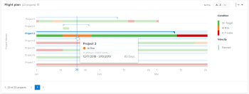

# Anzeigen der Flugplanvisualisierung in Enhanced Analytics

Die Flugplan-Visualisierung zeigt, wie viele Projekte (innerhalb der angewendeten Filterkriterien) in Bearbeitung waren, welche Zustandsänderungen während der Laufzeit dieser Projekte eingetreten sind und wie gut diese Projekte die geplanten Fertigstellungsfristen eingehalten haben.

## Zugriffsanforderungen

Sie müssen über Folgendes verfügen:

<table style="table-layout:auto"> 
 <col> 
 <col> 
 <tbody> 
  <tr> 
   <td role="rowheader"><a href="https://www.workfront.com/plans" target="_blank">Adobe Workfront-Plan</a>*</td> 
   <td> 
Unternehmen oder höher
 </td> 
  </tr> 
  <tr> 
   <td role="rowheader"><a href="../administration-and-setup/add-users/access-levels-and-object-permissions/wf-licenses.md" class="MCXref xref">Übersicht über Adobe Workfront-Lizenzen</a>*</td> 
   <td> 
Überprüfen oder höher
 </td> 
  </tr> 
  <tr> 
   <td role="rowheader">Konfigurationen der Zugriffsebene*</td> 
   <td> 
Zugriff auf Projekte anzeigen
 
Hinweis: Wenn Sie immer noch keinen Zugriff haben, fragen Sie Ihren Workfront-Administrator, ob er zusätzliche Einschränkungen in Ihrer Zugriffsebene festgelegt hat. Informationen dazu, wie ein Workfront-Administrator Ihre Zugriffsebene ändern kann, finden Sie unter <a href="../administration-and-setup/add-users/configure-and-grant-access/create-modify-access-levels.md" class="MCXref xref">Erstellen oder Ändern benutzerdefinierter Zugriffsebenen</a>.
 </td> 
  </tr> 
  <tr> 
   <td role="rowheader">Objektberechtigungen</td> 
   <td> 
Anzeigen des Zugriffs auf das Projekt
 
Informationen zum Anfordern zusätzlicher Zugriffsberechtigungen finden Sie unter <a href="../workfront-basics/grant-and-request-access-to-objects/request-access.md" class="MCXref xref">Anfordern von Zugriffsberechtigungen für Objekte </a>.
 </td> 
  </tr> 
 </tbody> 
</table>

&#42;Wenden Sie sich an Ihren Workfront-Administrator, um herauszufinden, über welchen Plan, welchen Lizenztyp oder welchen Zugriff Sie verfügen.

## Voraussetzungen

Voraussetzungen für die Verwendung der erweiterten Analyse finden Sie im Abschnitt „Voraussetzungen“ in [Übersicht über die erweiterte Analyse](../enhanced-analytics/enhanced-analytics-overview.md).

## Grundlegendes zur Visualisierung des Flugplans

In der tatsächlichen Dauer eines Projekts können Sie nur die folgenden Projektbedingungen sehen:

* Im Zielbereich
* Gefährdet
* In Schwierigkeiten

Weitere Informationen zu Projektbedingungen finden Sie unter [Übersicht über Projektbedingungen und Bedingungstyp](../manage-work/projects/manage-projects/project-condition-and-condition-type.md).

Die Flugplan-Visualisierung zeigt die folgenden Projektdetails:

* **Geplante Dauer**: Die horizontale blaue Linie stellt die geplante Länge des Projekts dar, wobei die Dreiecke an jedem Ende der Linie das Start- und Enddatum angeben.

  

* **Tatsächliche Dauer**: Die dicke, farbige Linie unterhalb der geplanten Dauer stellt die tatsächliche Länge des Projekts dar. Die Farbe der Linie ändert sich je nach dem Zustand des Projekts zu einem bestimmten Zeitpunkt in der Lebensdauer des Projekts.

  

* **Tatsächlicher Zustand**: Die dicke, farbige Linie zeigt auch den Zustand eines Projekts zu verschiedenen Zeitpunkten an. Die Farbe der Linie ändert sich je nach Zustand des Projekts:

   * **grün**: am Ziel
   * **orange**: Gefährdet
   * **Rot**: In Schwierigkeiten

  

Wenn Sie den Mauszeiger über eine Projektzeile in der Flugplanvisualisierung bewegen, können Sie Informationen zum geplanten Zeitrahmen des Projekts, zur aktuellen Projektbedingung und ggf. zur benutzerdefinierten Bedingung anzeigen. Um einen detaillierteren Überblick darüber zu erhalten, was sich auf die Dauer oder Bedingung ausgewirkt haben könnte, können Sie sich die anderen Visualisierungen im Bereich Erweiterte Analyse ansehen.

Anhand dieser Informationen können Sie Folgendes feststellen:

* Welche Ereignisse erstrecken sich auf ein Projekt, das über das ursprünglich geplante Abschlussdatum hinausgeht?
* Wann ein Projekt anfängt, Probleme zu machen.
* Wie viele Projekte im gleichen Zeitraum offen sind.
* Wie viele Projekte aktiv sind.
* Welche Projekte besondere Aufmerksamkeit oder Unterstützung benötigen.

Informationen zum Abrufen der besten Daten für diese Visualisierung finden Sie unter [Erweiterte Analyse - Übersicht](../enhanced-analytics/enhanced-analytics-overview.md).

## Flugplan-Visualisierung anzeigen

1. Klicken Sie auf das **Hauptmenü**-Symbol  und wählen Sie dann **Analytics** aus.
1. (Optional) Um einen anderen Datumsbereich zu verwenden, wählen Sie im Datumsbereichsfilter Neues Start- und Enddatum aus.

   

   Informationen zur Verwendung des Filters für den Datumsbereich finden Sie unter [Anwenden von Filtern in der erweiterten Analyse](../enhanced-analytics/use-enhanced-analytics-filters.md).

1. (Bedingt) Wenn Sie den Projektdatensatz einschränken müssen, wählen Sie die gewünschten Filter aus und wenden Sie sie an.

   Weitere Informationen zum Hinzufügen von Filtern in der erweiterten Analyse finden Sie unter [Anwenden von Filtern in der erweiterten Analyse](../enhanced-analytics/use-enhanced-analytics-filters.md).

   Nachdem Sie Filter hinzugefügt haben, werden Daten für bis zu 50 Projekte angezeigt und die Filter bleiben auch dann aktiv, wenn Sie die Seite verlassen oder sich von Workfront abmelden.

1. (Optional) Um einen Datumsbereich heranzuzoomen, wählen Sie einen Punkt auf der Visualisierung für den Beginn Ihres Datumsbereichs und ziehen Sie ihn an das Ende Ihres Datumsbereichs.

   Alle anderen Visualisierungen werden auf denselben Datumsbereich aktualisiert und ein Zeitrahmenfilter wird erstellt.

   

1. (Optional) Um zu ändern, wie die Projekte sortiert werden, klicken Sie auf **Menü** Sortieren nach“ in der oberen rechten Ecke der Flugplanvisualisierung und wählen Sie dann eine neue Sortieroption aus:

   * **A - Z**
   * **Z - A**
   * **Geplantes Abschlussdatum**
   * **Geplantes Startdatum**

   Alle anderen Visualisierungen auf der Seite werden aktualisiert, damit sie Ihrer Sortierauswahl entsprechen.

1. (Bedingt) Wenn Ihr Datensatz mehr als 50 Projekte enthält, können Sie mit den Pfeilen in der linken unteren Ecke der Visualisierung von einer Gruppe von 50 Projekten zur nächsten navigieren.

   Alle anderen Visualisierungen auf der Seite werden entsprechend Ihrer Seitenauswahl aktualisiert.

   

1. Bewegen Sie den Mauszeiger über das Projektbalkendiagramm, um die blaue Datumslinie sowie die folgenden Details anzuzeigen:

   * Geplanter Zeitplan
   * Aktuelle Bedingung
   * Benutzerdefinierte Bedingung (falls zutreffend)

   

1. (Optional) Um die Visualisierungsdaten zu exportieren, klicken Sie auf **Exportieren**-Symbol  in der oberen rechten Ecke der Visualisierung und wählen Sie dann das Exportformat aus:

   * **Diagramm (PNG)**
   * **Datentabelle (XSLX)**

1. Um weitere Projektinformationen anzuzeigen, klicken Sie in der Visualisierung auf ein Projekt, um den Burndown und die Aufgaben in Flugvisualisierungen zu öffnen.

   Diese Visualisierungen können Ihnen dabei helfen, tiefere Einblicke zu erhalten, was dazu geführt hat, dass das Projekt aus dem Gleis geraten ist. Außerdem können Sie damit problemlos in ein laufendes Projekt einchecken.\
   Weitere Informationen zur Burndown-Visualisierung finden Sie unter [Anzeigen der Burndown-Visualisierung in Enhanced Analytics](../enhanced-analytics/burndown-overview.md). Weitere Informationen zu den Aufgaben in der Flugvisualisierung finden Sie unter [Anzeigen der Aufgaben in der Flugvisualisierung in Enhanced Analytics](../enhanced-analytics/tasks-in-flight-overview.md).

