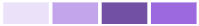

# Visualisierung der Projektaktivität in Enhanced Analytics anzeigen

>[!IMPORTANT]
>
>Enhanced Analytics wird in der Woche des 26. Mai aus Workfront entfernt. Workfront Data Connect ist eine neue, alternative Lösung und kann verwendet werden, um alle derzeit verwendeten Visualisierungen von Enhanced Analytics zu replizieren.  Weitere Informationen finden Sie im Handbuch [Erweiterte Analytics](/help/quicksilver/product-announcements/announcements/enhanced-analytics-deprecation.md)Einstellung“.

<!-- Audited: 12/2023 -->

Die Visualisierung der Projektaktivität zeigt eine aggregierte Ansicht der Aktivitäten auf Projektebene - der Aktivitäten jeder dem Projekt zugewiesenen Person -, die während eines bestimmten Zeitraums aufgetreten sind. Sie können Ihren Fokus einschränken, um die Aktivitäten innerhalb eines Projekts zu verstehen, oder Sie können Projektaktivitäten mit anderen Projekten in Adobe Workfront vergleichen.

>[!NOTE]
>
>Die Visualisierung „Aktivität nach Team“ verhält sich ähnlich wie diese Visualisierung, aber die Visualisierung „Aktivität nach Team“ zeigt die Aktivität „Haupt-Team“ für alle Projekte.\
>Weitere Informationen zur Visualisierung „Aktivität nach Team“ finden Sie unter [Anzeigen der Visualisierung „Aktivität nach Team“ in erweiterten Analysen](../enhanced-analytics/activity-by-team-overview.md).

## Zugriffsanforderungen

Sie müssen über Folgendes verfügen:

<table style="table-layout:auto"> 
 <col> 
 <col> 
 <tbody> 
  <tr> 
   <td role="rowheader"><a href="https://business.adobe.com/products/workfront/pricing.html" target="_blank">Workfront-Plan</a></td> 
   <td> 
Unternehmen oder höher
 </td> 
  </tr> 
  <tr> 
   <td role="rowheader"><a href="../administration-and-setup/add-users/access-levels-and-object-permissions/wf-licenses.md" class="MCXref xref">Übersicht über Adobe Workfront-Lizenzen</a></td> 
   <td>   
Neu:
 
   <ul><li>Leicht oder höher</li></ul>
   
Aktuell:

   <ul><li>Überprüfen oder höher</li></ul>
 </td> 
  </tr> 
  <tr> 
   <td role="rowheader">Konfigurationen der Zugriffsebene</td> 
   <td> 
Zugriff auf Projekte anzeigen
 <!--
Note: If you still don't have access, ask your Workfront administrator if they set additional restrictions in your access level. For information on how a Workfront administrator can change your access level, see <a href="../administration-and-setup/add-users/configure-and-grant-access/create-modify-access-levels.md" class="MCXref xref">Create or modify custom access levels</a>.
--> </td> 
  </tr> 
  <tr> 
   <td role="rowheader">Objektberechtigungen</td> 
   <td> 
Anzeigen
 <!--
For information on requesting additional access, see <a href="../workfront-basics/grant-and-request-access-to-objects/request-access.md" class="MCXref xref">Request access to objects </a>.
--> </td> 
  </tr> 
 </tbody> 
</table>

Weitere Informationen zu den Informationen in dieser Tabelle finden Sie unter [Zugriffsanforderungen in der Dokumentation zu Workfront](/help/quicksilver/administration-and-setup/add-users/access-levels-and-object-permissions/access-level-requirements-in-documentation.md).

## Voraussetzungen

Voraussetzungen für die Verwendung der erweiterten Analyse finden Sie im Abschnitt „Voraussetzungen“ in [Übersicht über die erweiterte Analyse](../enhanced-analytics/enhanced-analytics-overview.md).

## Visualisierung der Projektaktivität

Projektaktivitäten werden in verschiedenen Farben angezeigt, um bestimmte Ereignisse in einem Projekt über einen bestimmten Zeitraum zusammenzufassen:

* **Angemeldete Benutzer**: Violette Kästchen zeigen an, dass Personen, die dem Projekt zugewiesen wurden, an diesem Tag angemeldet waren. Je dunkler der Farbton, umso mehr Personen haben sich angemeldet.

  

* **Änderung des Aufgabenstatus**: Pinkfarbene Kästchen zeigen an, dass Personen den Status einer Aufgabe für das Projekt an diesem Tag geändert haben. Je dunkler der Farbton, umso mehr Aufgabenstatus haben sich geändert.

  

* **Abgeschlossene Aufgaben**: Blaue Kästchen zeigen an, dass Benutzer eine Aufgabe für das Projekt abgeschlossen haben. Je dunkler der Farbton, umso mehr Aufgaben wurden abgeschlossen.

  

Wenn Sie den Mauszeiger über ein Feld bewegen, wird angezeigt, wie oft die Aktion an einem bestimmten Tag genau abgeschlossen wurde. Sie können ein Projekt auswählen, um eine Aufschlüsselung dieser Aktivitäten nach den einzelnen Beitragenden im Projekt anzuzeigen.

Anhand dieser Informationen können Sie Folgendes feststellen:

* Die Aktivität für ein bestimmtes Projekt.
* Die Aktivität eines Projekts im Vergleich zu anderen Projekten.
* Welche Benutzende an einem Projekt arbeiten und mit welcher Frequenz.

Informationen zum Abrufen der besten Daten für diese Visualisierung finden Sie unter [Erweiterte Analyse - Übersicht](../enhanced-analytics/enhanced-analytics-overview.md).

## Visualisierung der Projektaktivität anzeigen

1. Klicken Sie auf das Hauptmenüsymbol  und wählen Sie dann **Analytics**.
1. (Optional) Um einen anderen Datumsbereich zu verwenden, wählen Sie im Datumsbereichsfilter Neues Start- und Enddatum aus.

   

   Informationen zur Verwendung des Filters für den Datumsbereich finden Sie unter [Anwenden von Filtern in der erweiterten Analyse](../enhanced-analytics/use-enhanced-analytics-filters.md).

   >[!NOTE]
   >
   >Wenn Sie einen Datumsbereich für einen Zeitraum von mehr als 3 Monaten auswählen, werden in der Visualisierung der Projektaktivität keine Daten angezeigt.

1. (Bedingt) Wenn Sie den Projektdatensatz einschränken müssen, wählen Sie die gewünschten Filter aus und wenden Sie sie an.

   Weitere Informationen zum Hinzufügen von Filtern in der erweiterten Analyse finden Sie unter [Anwenden von Filtern in der erweiterten Analyse](../enhanced-analytics/use-enhanced-analytics-filters.md).

   Nachdem Sie Filter hinzugefügt haben, werden Daten für bis zu 50 Projekte angezeigt und die Filter bleiben auch dann aktiv, wenn Sie die Seite verlassen oder sich von Workfront abmelden.

1. (Optional) Um einen Datumsbereich heranzuzoomen, wählen Sie einen Punkt auf der Visualisierung für den Beginn Ihres Datumsbereichs und ziehen Sie ihn an das Ende Ihres Datumsbereichs.

   Alle anderen Visualisierungen werden auf denselben Datumsbereich aktualisiert und ein Zeitrahmenfilter wird erstellt.

   

1. (Optional) Um zu ändern, wie die Projekte sortiert werden, klicken Sie auf das Menü **Sortieren nach** und wählen Sie dann eine neue Sortieroption aus:

   * **A - Z**
   * **Z - A**
   * **Geplantes Abschlussdatum**
   * **Geplantes Startdatum**

   Alle anderen Visualisierungen auf der Seite werden aktualisiert, damit sie Ihrer Sortierauswahl entsprechen.

1. (Bedingt) Wenn Ihr Datensatz mehr als 50 Projekte enthält, können Sie mit den Pfeilen in der linken unteren Ecke der Visualisierung von einer Gruppe von 50 Projekten zur nächsten navigieren.

   Alle anderen Visualisierungen auf der Seite werden entsprechend Ihrer Seitenauswahl aktualisiert.

   

1. Klicken Sie in der Visualisierung auf ein Projekt, um weitere Details für das Projekt anzuzeigen.

   Die Liste wird erweitert, um die Aktivitäten der einzelnen Beitragenden im Projekt anzuzeigen.

1. Bewegen Sie den Mauszeiger über ein Feld, um das Datum anzuzeigen, an dem die Benutzer eine Aktion abgeschlossen haben, sowie die Häufigkeit, mit der die Aktion an diesem Tag abgeschlossen wurde.

   

1. (Optional) Um die Visualisierungsdaten zu exportieren, klicken Sie **Export**Symbol „Exportieren“ in der oberen rechten Ecke der Visualisierung und wählen Sie dann das Exportformat aus:

   * **Diagramm (PNG)**
   * **Datentabelle (XSLX)**

