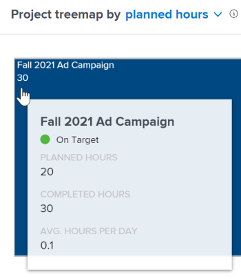
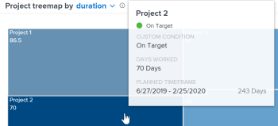

# Anzeigen der Projekt-Treemap-Visualisierung in Enhanced Analytics

<!-- Audited: 12/2023 -->

Die Projekt-Treemap-Visualisierung ist eine Ansicht von Stunden - oder Tagen -, die in einem bestimmten Zeitfenster im Vergleich zu anderen Arbeitsaufträgen in der Größe gearbeitet wurden. Auf diese Weise lässt sich erkennen, wie viel Zeit die Mitarbeiter für ein Projekt aufgewendet haben.

{width="700"}

## Zugriffsanforderungen

+++ Erweitern Sie , um die Zugriffsanforderungen anzuzeigen.

Sie müssen über folgenden Zugriff verfügen, um die Schritte in diesem Artikel ausführen zu können:

<table style="table-layout:auto"> 
 <col> 
 <col> 
 <tbody> 
  <tr> 
   <td role="rowheader"><a href="https://www.workfront.com/plans" target="_blank">Adobe Workfront-Plan</a></td> 
   <td> 
Unternehmen oder höher
 </td> 
  </tr> 
  <tr> 
   <td role="rowheader"><a href="../administration-and-setup/add-users/access-levels-and-object-permissions/wf-licenses.md" class="MCXref xref">Übersicht über Adobe Workfront-Lizenzen</a></td> 
   <td>   
Neu:
 
   <ul><li>Leicht oder höher</li></ul>
   
Aktuell:

   <ul><li>Überprüfen oder höher</li></ul>
 </td> 
  </tr> 
  <tr> 
   <td role="rowheader">Konfigurationen der Zugriffsebene</td> 
   <td> 
Zugriff auf Projekte anzeigen
 <!--
Note: If you still don't have access, ask your Workfront administrator if they set additional restrictions in your access level. For information on how a Workfront administrator can change your access level, see <a href="../administration-and-setup/add-users/configure-and-grant-access/create-modify-access-levels.md" class="MCXref xref">Create or modify custom access levels</a>.
--> </td> 
  </tr> 
  <tr> 
   <td role="rowheader">Objektberechtigungen</td> 
   <td> 
Anzeigen
 <!--
For information on requesting additional access, see <a href="../workfront-basics/grant-and-request-access-to-objects/request-access.md" class="MCXref xref">Request access to objects </a>.
--> </td> 
  </tr> 
 </tbody> 
</table>

Weitere Informationen zu den Informationen in dieser Tabelle finden Sie unter [Zugriffsanforderungen in der Dokumentation zu Workfront](/help/quicksilver/administration-and-setup/add-users/access-levels-and-object-permissions/access-level-requirements-in-documentation.md).

+++

## Voraussetzungen

Voraussetzungen für die Verwendung der erweiterten Analyse finden Sie im Abschnitt „Voraussetzungen“ in [Übersicht über die erweiterte Analyse](../enhanced-analytics/enhanced-analytics-overview.md).

## Visualisierung mit Projekt-Treemaps

Die Felder in der Projekt-Treemap-Visualisierung stellen Projekte dar, und die Größe der Felder zeigt einen Vergleich der Zeit, die für verschiedene Projekte aufgewendet wurde. Je größer der Kasten ist, desto mehr Zeit wird mit dem Projekt verbracht.

Die Projekt-Treemap-Visualisierung besteht aus:

* **Kleinere, hellblaue Kästchen**: Projekte, die weniger Stunden - oder Tage - haben, werden als kleinere Kästchen mit einer hellblauen Farbe angezeigt.

  

* **Größere, dunkelblaue Kästchen**: Projekte, die mehr Stunden - oder Tage - haben, werden als größere Kästchen mit einer dunkelblauen Farbe angezeigt.

  

* **Medium-große, blaue Kästchen**: Projekte, die zwischen den beiden Kategorien liegen, werden als mittelgroße Kästchen mit einem Blauton zwischen den dunkelblauen und hellblauen Farben angezeigt. Für mittelgroße Boxen gibt es 3 mögliche Blautöne.

Die Legende auf der rechten Seite zeigt eine Aufschlüsselung der abgeschlossenen Stunden für jeden Blauton. Diese Legende ist dynamisch und wird entsprechend den Daten aktualisiert.

>[!NOTE]
>
>Wenn Sie sich die Projekt-Treemap-Visualisierung nach Dauer und nicht nach geplanten Stunden ansehen, zeigt diese Legende eine Aufschlüsselung der Arbeitstage für jeden Blauton.\
>>

Anhand dieser Informationen können Sie Folgendes feststellen:

* Die Priorität der Dinge, an denen im ausgewählten Datumsbereich gearbeitet wird.
* Worauf Teams Zeit verwenden.
* Wenn Teams sich auf die richtigen Dinge konzentrieren.
* Wenn auf ein bestimmtes Projekt geklickt wird, wie stark sich der Umfang eines Projekts in diesem Zeitraum geändert hat.

Informationen zum Abrufen der besten Daten für diese Visualisierung finden Sie unter [Erweiterte Analyse - Übersicht](../enhanced-analytics/enhanced-analytics-overview.md).

## Anzeigen der Projekt-Treemap-Visualisierung

1. Klicken Sie auf das Hauptmenüsymbol  und wählen Sie dann **Analytics**.
1. (Optional) Um einen anderen Datumsbereich zu verwenden, wählen Sie im Datumsbereichsfilter Neues Start- und Enddatum aus.

   

   Informationen zur Verwendung des Filters für den Datumsbereich finden Sie unter [Anwenden von Filtern in der erweiterten Analyse](../enhanced-analytics/use-enhanced-analytics-filters.md).

1. (Bedingt) Wenn Sie den Projektdatensatz einschränken müssen, wählen Sie die gewünschten Filter aus und wenden Sie sie an.

   Weitere Informationen zum Hinzufügen von Filtern in der erweiterten Analyse finden Sie unter [Anwenden von Filtern in der erweiterten Analyse](../enhanced-analytics/use-enhanced-analytics-filters.md).

   Nachdem Sie Filter hinzugefügt haben, werden Daten für bis zu 50 Projekte angezeigt und die Filter bleiben auch dann aktiv, wenn Sie die Seite verlassen oder sich von Workfront abmelden.

1. (Optional) Um zu ändern, wie die Projekte sortiert werden, klicken Sie auf **Menü „Sortieren nach** in der oberen rechten Ecke der Projekt-Treemap-Visualisierung und wählen Sie dann eine neue Sortieroption aus:

   * **A - Z**
   * **Z - A**
   * **Geplantes Abschlussdatum**
   * **Geplantes Startdatum**

   Alle anderen Visualisierungen auf der Seite werden aktualisiert, damit sie Ihrer Sortierauswahl entsprechen.

1. (Bedingt) Wenn Ihr Datensatz mehr als 50 Projekte enthält, können Sie mit den Pfeilen in der linken unteren Ecke der Visualisierung von einer Gruppe von 50 Projekten zur nächsten navigieren.

   Alle anderen Visualisierungen auf der Seite werden entsprechend Ihrer Seitenauswahl aktualisiert.

   

1. (Optional) Ändern Sie die Ansicht von **Geplante Stunden** in **Dauer**.

   Geplante Stunden sind standardmäßig ausgewählt.

1. Bewegen Sie den Mauszeiger über ein Projekt, um die Projektbedingung sowie die Anzahl der geplanten Gesamtstunden, die Anzahl der insgesamt abgeschlossenen Stunden und die durchschnittliche Anzahl der pro Tag für das Projekt aufgewendeten Stunden anzuzeigen.

   

   >[!NOTE]
   >
   >Wenn Sie die Ansicht **Dauer** ausgewählt haben, werden die folgenden Details zur Dauer angezeigt:
   >
   >* **Geplanter Zeitrahmen**: Die Anzahl der Tage, die für den Abschluss des Projekts geplant sind.
   >* **Arbeitstage**: Die geplante Dauer für jede Aufgabe, die innerhalb des oben ausgewählten Datumsbereichs abgeschlossen wurde, dividiert durch die Anzahl der Stunden pro Tag.
   >   
   >
   >
   >Weitere Informationen zur Dauer finden Sie im Abschnitt „Ansicht zur Dauer“ in [Erweiterte Analyse - Übersicht](../enhanced-analytics/enhanced-analytics-overview.md).

1. (Optional) Um die Visualisierungsdaten zu exportieren, klicken Sie **Export**Symbol „Exportieren“ in der oberen rechten Ecke der Visualisierung und wählen Sie dann das Exportformat aus:

   * **Diagramm (PNG)**
   * **Datentabelle (XSLX)**

1. Klicken Sie auf ein Projekt, um Burndown und Aufgaben in Flugvisualisierungen zu öffnen und einen tieferen Einblick darin zu erhalten, wie Aufgaben und Stunden - oder Tage - zur Größe eines Projekts beigetragen haben.

Weitere Informationen zur Burndown-Visualisierung finden Sie unter [Anzeigen der Burndown-Visualisierung in Enhanced Analytics](../enhanced-analytics/burndown-overview.md). Weitere Informationen zu den Aufgaben in der Flugvisualisierung finden Sie unter [Anzeigen der Aufgaben in der Flugvisualisierung in Enhanced Analytics](../enhanced-analytics/tasks-in-flight-overview.md).

