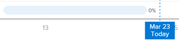

# Anzeigen der Aufgaben in der Flugvisualisierung in Enhanced Analytics

Die Aufgaben in der Flugvisualisierung zeigen an, wie viele Aufgaben (innerhalb der angewendeten Filterkriterien) für ein Projekt ausgeführt werden, wie hoch der Prozentsatz der für jede Aufgabe abgeschlossenen Aufgaben ist und wie planmäßig die Aufgaben ablaufen.

## Zugriffsanforderungen

Sie müssen über Folgendes verfügen:

<table style="table-layout:auto"> 
 <col> 
 <col> 
 <tbody> 
  <tr> 
   <td role="rowheader"><a href="https://www.workfront.com/plans" target="_blank">Adobe Workfront-Plan</a>*</td> 
   <td> 
Unternehmen oder höher
 </td> 
  </tr> 
  <tr> 
   <td role="rowheader"><a href="../administration-and-setup/add-users/access-levels-and-object-permissions/wf-licenses.md" class="MCXref xref">Übersicht über Adobe Workfront-Lizenzen</a>*</td> 
   <td> 
Überprüfen oder höher
 </td> 
  </tr> 
  <tr> 
   <td role="rowheader">Konfigurationen auf Zugriffsebene*</td> 
   <td> 
Zugriff auf Projekte anzeigen
 
Zugriff auf Aufgaben anzeigen (Um Aufgaben zu aktualisieren, benötigen Sie Zugriff auf Aufgaben bearbeiten.)
 
Hinweis: Wenn Sie immer noch keinen Zugriff haben, fragen Sie Ihren Workfront-Administrator, ob er zusätzliche Zugriffsbeschränkungen für Ihre Zugriffsebene festlegt. Informationen dazu, wie ein Workfront-Administrator Ihre Zugriffsebene ändern kann, finden Sie unter <a href="../administration-and-setup/add-users/configure-and-grant-access/create-modify-access-levels.md" class="MCXref xref">Benutzerdefinierte Zugriffsebenen erstellen oder ändern</a>.
 </td> 
  </tr> 
  <tr> 
   <td role="rowheader">Objektberechtigungen</td> 
   <td> 
Berechtigung für Projekt- und Aufgabenobjekte anzeigen
 
Weitere Informationen zum Anfordern von zusätzlichem Zugriff finden Sie unter <a href="../workfront-basics/grant-and-request-access-to-objects/request-access.md" class="MCXref xref">Anfordern des Zugriffs auf Objekte </a>.
 </td> 
  </tr> 
 </tbody> 
</table>

&#42;Wenden Sie sich an Ihren Workfront-Administrator, um zu erfahren, welchen Plan, welchen Lizenztyp oder welchen Zugriff Sie haben.

## Voraussetzungen

Voraussetzungen für die Verwendung von Enhanced Analytics finden Sie im Abschnitt &quot;Voraussetzungen&quot;in der [Übersicht über erweiterte Analysen](../enhanced-analytics/enhanced-analytics-overview.md).

## Grundlegendes zu den Aufgaben in der Flugvisualisierung

Die Aufgaben in der Visualisierung des Flugplans zeigen die folgenden Aufgabendetails an:

* **Geplante Aufgabendauer**: Die Länge einer Taskleiste gibt die geplante Dauer an, die auf dem Startdatum und dem Abschlussdatum der Aufgabe basiert.

  

* **Abgeschlossener Arbeitsaufwand**: Die dunkelblaue Farbe in einer Aufgabenleiste gibt an, wie viel Arbeit für eine Aufgabe abgeschlossen wurde. Dieser Fertigstellungsprozentsatz wird rechts neben der Taskleiste angezeigt.

  

* **verbleibender Arbeitsaufwand**: Die hellblaue Farbe in einer Aufgabenleiste gibt an, wie viel Arbeit für eine Aufgabe ausgeführt werden muss.

  

Anhand dieser Informationen können Sie Folgendes feststellen:

* Wo der Arbeitsaufwand im Mittelpunkt stand.
* Welche Aufgaben ein Projekt gefährden könnten.
* Wie nah eine Aufgabe an der Fertigstellung ist.
* Mit wem Sie über eine bestimmte Aufgabe reden müssen.

Informationen zum Abrufen der besten Daten für diese Visualisierung finden Sie unter [Überblick über erweiterte Analysen](../enhanced-analytics/enhanced-analytics-overview.md).

## Aufgaben in der Flugvisualisierung anzeigen

1. Klicken Sie auf das Hauptmenü-Symbol  und wählen Sie dann **Analytics** aus.
1. (Optional) Wenn Sie einen anderen Datumsbereich verwenden möchten, wählen Sie im Filter für den Datumsbereich die neuen Start- und Enddaten aus.

   

   Informationen zur Verwendung des Datumsbereichfilters finden Sie unter [Anwenden von Filtern in Enhanced Analytics](../enhanced-analytics/use-enhanced-analytics-filters.md).

1. (Bedingt) Wenn Sie den Projektdatensatz einschränken müssen, wählen Sie die Filter aus, die Sie verwenden möchten, und wenden Sie sie an.

   Weitere Informationen zum Hinzufügen von Filtern in Enhanced Analytics finden Sie unter [Anwenden von Filtern in Enhanced Analytics](../enhanced-analytics/use-enhanced-analytics-filters.md).

   Nach dem Hinzufügen von Filtern werden Daten für bis zu 50 Projekte angezeigt und die Filter bleiben auch dann aktiv, wenn Sie die Seite verlassen oder sich von Workfront abmelden.

1. Klicken Sie in der Visualisierung Flugplan oder Projekt-Treemap auf ein Projekt, um weitere Informationen anzuzeigen.

   Die Niederschläge und Aufgaben in den Flugvisualisierungen werden angezeigt.

   >[!NOTE]
   >
   >Weitere Informationen zu diesen anderen Visualisierungen finden Sie unter:
   >
   >   
   >   
   >   * [Anzeigen der Visualisierung des Flugplans in der erweiterten Analyse](../enhanced-analytics/flight-plan-overview.md)
   >   * [Anzeigen der Projekt-Treemap-Visualisierung in Enhanced Analytics](../enhanced-analytics/project-treemap-overview.md)
   >   * [Anzeigen der Aufschlüsselungsvisualisierung in der erweiterten Analyse](../enhanced-analytics/burndown-overview.md)
   >   
   >

1. (Optional) Wenn Sie einen Datumsbereich vergrößern möchten, wählen Sie einen Punkt auf der Visualisierung für den Anfang Ihres Datumsbereichs aus und ziehen Sie ihn an das Ende Ihres Datumsbereichs.

   Alle anderen Visualisierungen werden auf denselben Datumsbereich aktualisiert und es wird ein Zeitrahmen-Filter erstellt.

   

1. (Optional) Um die Sortierung der Aufgaben zu ändern, klicken Sie auf das Menü **Sortieren nach** und wählen Sie dann eine neue Sortieroption aus:

   * **Abschlussdatum**
   * **Alphabetisch A-Z**
   * **Struktur der Aufschlüsselung der Arbeit** (Diese Option entspricht der Reihenfolge, in der die Aufgaben im Projekt angezeigt werden.)

   Alle anderen Visualisierungen auf der Seite werden entsprechend Ihrer Sortierungsauswahl aktualisiert.

1. Überprüfen Sie den Fortschritt der Aufgaben im ausgewählten Projekt und bewegen Sie dann den Mauszeiger über eine bestimmte Aufgabe, um die Anzahl der geplanten Stunden, das geplante Fälligkeitsdatum und den Fertigstellungsprozentsatz anzuzeigen.

   

1. Klicken Sie auf eine Aufgabe, um die Aufgabendetails auf der rechten Seite des Bildschirms zu öffnen, wo Sie weitere Informationen zur Aufgabe sehen, Aktualisierungen anzeigen oder eingeben oder Änderungen an der Aufgabe vornehmen können.

   

1. (Optional) Um die Visualisierungsdaten zu exportieren, klicken Sie oben rechts in der Visualisierung auf das Symbol **Exportieren**  und wählen Sie dann das Exportformat aus:

   * **Diagramm (PNG)**
   * **Datentabelle (XSLX)**

