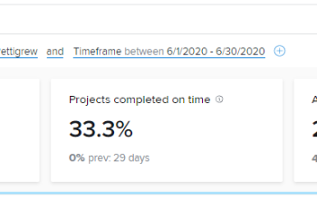

# Visualisierung der Teamkapazität in der erweiterten Analyse anzeigen

Die Visualisierung der Teamkapazität zeigt die Gesamtkapazität eines Heimteams, ob sie überzugewiesen oder unterverteilt sind und wie dynamisch die Kapazität im Laufe der Zeit ist.

## Zugriffsanforderungen

Sie müssen über Folgendes verfügen:

<table style="table-layout:auto"> 
 <col> 
 <col> 
 <tbody> 
  <tr> 
   <td role="rowheader"><a href="https://www.workfront.com/plans" target="_blank">Adobe Workfront-Abo</a>*</td> 
   <td> 
Unternehmen oder höher
 </td> 
  </tr> 
  <tr> 
   <td role="rowheader"><a href="../administration-and-setup/add-users/access-levels-and-object-permissions/wf-licenses.md" class="MCXref xref">Übersicht über Adobe Workfront-Lizenzen</a>*</td> 
   <td> 
Überprüfen oder höher
 </td> 
  </tr> 
  <tr> 
   <td role="rowheader">Konfigurationen auf Zugriffsebene*</td> 
   <td> 
Zugriff auf Projekte anzeigen
 
Hinweis: Wenn Sie immer noch keinen Zugriff haben, fragen Sie Ihren Workfront-Administrator, ob er zusätzliche Zugriffsbeschränkungen für Ihre Zugriffsebene festlegt. Informationen dazu, wie ein Workfront-Administrator Ihre Zugriffsstufe ändern kann, finden Sie unter <a href="../administration-and-setup/add-users/configure-and-grant-access/create-modify-access-levels.md" class="MCXref xref">Benutzerdefinierte Zugriffsebenen erstellen oder ändern</a>.
 </td> 
  </tr> 
  <tr> 
   <td role="rowheader">Objektberechtigungen</td> 
   <td> 
Anzeigen
 
Informationen zum Anfordern von zusätzlichem Zugriff finden Sie unter <a href="../workfront-basics/grant-and-request-access-to-objects/request-access.md" class="MCXref xref">Zugriff auf Objekte anfordern </a>.
 </td> 
  </tr> 
 </tbody> 
</table>

&#42;Wenden Sie sich an Ihren Workfront-Administrator, um zu erfahren, welchen Plan, welchen Lizenztyp oder welchen Zugriff Sie haben.

## Voraussetzungen

Voraussetzungen für die Verwendung von Enhanced Analytics finden Sie im Abschnitt &quot;Voraussetzungen&quot;unter [Erweiterte Analyse - Übersicht](../enhanced-analytics/enhanced-analytics-overview.md).

## Visualisierung der Teamkapazität

Die Visualisierung der Teamkapazität zeigt das Arbeitsvolumen an, das dem Startseiten-Team an einem bestimmten Tag zugewiesen wurde.

* **Burnout**: Wenn die dunkelblaue Füllfarbe über der gepunkteten Linie liegt, werden dem Heimteam mehr Arbeitszeiten zugewiesen, als in der Anzahl der Stunden, die das Team zur Arbeit zur Verfügung hat, abgeschlossen werden können. Dies deutet darauf hin, dass das Team überzugewiesen wurde und möglicherweise kurz vor dem Start steht.

   

* **Unangefochten**: Wenn die dunkelblaue Füllfarbe unter der gepunkteten Linie liegt, hat das Heimteam mehr Arbeitsstunden als die ihnen zugewiesene Arbeitszeit. Dies weist darauf hin, dass das Team nicht genügend Platz hat und möglicherweise nicht angefochten werden kann.

   

* **Saldo**: Wenn die hellere oder transparentere blaue Füllfarbe direkt über, direkt unterhalb oder an der gepunkteten Linie liegt, hat das Heimteam eine Arbeitszeit zugewiesen, die es innerhalb der verfügbaren Arbeitszeiten abschließen kann. Dies zeigt, dass die Arbeitslast des Teams ausgeglichener ist.

   

Wenn Sie den Mauszeiger über einen Punkt in der Visualisierung bewegen, werden die folgenden Details für einen bestimmten Tag angezeigt:

* **Geplante Stunden**: Dies ist die Anzahl der geplanten Arbeitsstunden, die das Team durchführen muss.
* **Verfügbare Stunden**: Dies ist die Anzahl der Arbeitsstunden, die das Team zur Arbeit zur Verfügung hat.
* **Kapazität**: Zusätzlich zu einem Kapazitätsprozentsatz werden auch die Bezeichnungen Kapazität, Unterkapazität oder Überkapazität angezeigt.

Anhand dieser Informationen können Sie Folgendes feststellen:

* Als das Zuhause-Team überzugewiesen oder unterzugewiesen wurde.
* Wenn das Heimteam täglich überverteilt oder unterzugewiesen ist.
* Wie konsistent die Arbeitslast eines Heimteams von Tag zu Tag ist.
* Wenn Sie Kapazitätsprobleme mit neuer Arbeit schaffen.

Informationen zum Abrufen der besten Daten für diese Visualisierung finden Sie unter [Erweiterte Analyse - Übersicht](../enhanced-analytics/enhanced-analytics-overview.md).

## Visualisierung der Teamkapazität anzeigen

1. Klicken Sie auf das Symbol Hauptmenü . , wählen Sie **Analytics**.
1. Wählen Sie im linken Bereich die Option **Personen**.

   

1. (Optional) Wenn Sie einen anderen Datumsbereich verwenden möchten, wählen Sie im Filter für den Datumsbereich die neuen Start- und Enddaten aus.

   

   Informationen zur Verwendung des Datumsbereichfilters finden Sie unter [Filter in erweiterten Analysen anwenden](../enhanced-analytics/use-enhanced-analytics-filters.md).

1. (Bedingt) Wenn Sie Ihren Team-Filter nicht festgelegt haben, fügen Sie den Team-Filter hinzu und wählen Sie die einzelnen Teams aus, für die Daten angezeigt werden sollen.

   Weitere Informationen zum Hinzufügen von Filtern in der erweiterten Analyse finden Sie unter [Filter in erweiterten Analysen anwenden](../enhanced-analytics/use-enhanced-analytics-filters.md).

   Nach dem Hinzufügen von Filtern werden Daten für bis zu 50 Projekte angezeigt und die Filter bleiben auch dann aktiv, wenn Sie die Seite verlassen oder sich von Workfront abmelden.

1. Klicken Sie in der Visualisierung der Ressourcenkapazität auf ein Team, um weitere Informationen anzuzeigen.

   Die Visualisierung der Teamkapazität wird angezeigt.

   Weitere Informationen zur Visualisierung der Ressourcenkapazität finden Sie unter [Anzeigen der Visualisierung der Ressourcenkapazität in Enhanced Analytics](../enhanced-analytics/resource-capacity-overview.md).

1. (Optional) Wenn Sie einen Datumsbereich vergrößern möchten, wählen Sie einen Punkt auf der Visualisierung für den Anfang Ihres Datumsbereichs aus und ziehen Sie ihn an das Ende Ihres Datumsbereichs.

   Alle anderen Visualisierungen werden auf denselben Datumsbereich aktualisiert und es wird ein Zeitrahmen-Filter erstellt.

   

1. Bewegen Sie den Mauszeiger über einen Punkt auf der Diagrammlinie, um die geplanten Stunden und geplanten Stunden für das angegebene Datum sowie den Kapazitätsprozentsatz und die Frage zu sehen, ob das Heimteam zu der Zeit vorbei, unterwegs oder auf Kapazität war.

   

1. (Optional) Um die Visualisierungsdaten zu exportieren, klicken Sie auf das **Symbol &quot;Exportieren&quot;**  Wählen Sie oben rechts in der Visualisierung das Exportformat aus:

   * **Diagramm (PNG)**
   * **Datentabelle (XSLX)**

