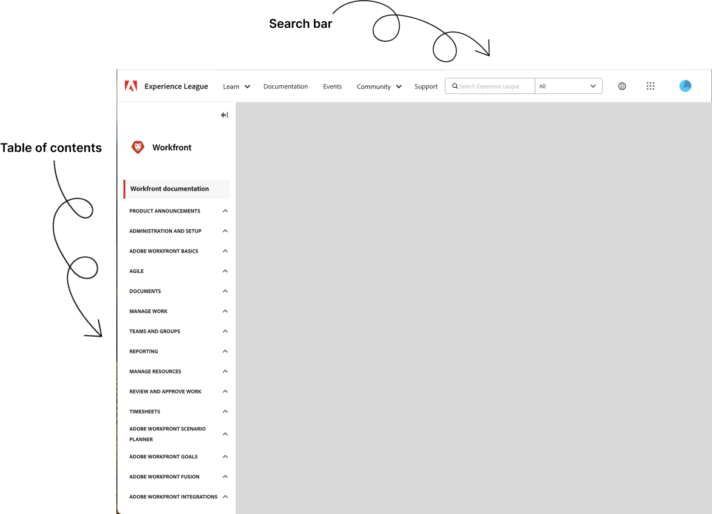

# [!DNL Workfront]-Dokumentation

Willkommen auf der Homepage für Adobe Workfront und zugehörige technische Dokumentation. Verwenden Sie die folgenden Links, Hilfeartikel und zusätzlichen Ressourcen von Adobe Workfront, um zu erfahren, wie Sie Adobe Workfront in Ihrer Organisation implementieren und effektiv nutzen können.

## Neue Funktionen

>[!BEGINTABS]

>[!TAB Neueste Version]

* [Versionsüberblick für das zweite Quartal 2026](/help/quicksilver/product-announcements/product-releases/26-q2-release-activity/26-q2-release-overview.md)
* [Veröffentlichungen von Adobe Workfront-Planung](/help/quicksilver/product-announcements/product-releases/planning-release-activity/planning-release-activity-26-q2.md)
* [Adobe Workfront Fusion-Veröffentlichungen](/help/quicksilver/product-announcements/product-releases/planning-release-activity/planning-release-activity-article-index.md)

>[!TAB Versionen 2026]

* [Versionsüberblick für das zweite Quartal 2026](/help/quicksilver/product-announcements/product-releases/26-q2-release-activity/26-q2-release-overview.md)
* [Überblick über die Version vom ersten Quartal 2026](/help/quicksilver/product-announcements/product-releases/26-q1-release-activity/26-q1-release-overview.md)
* [Veröffentlichungen von Adobe Workfront-Planung](/help/quicksilver/product-announcements/product-releases/planning-release-activity/planning-release-activity-article-index.md)

>[!TAB Versionen 2025]

* [Versionsüberblick für das vierte Quartal 2025](/help/quicksilver/product-announcements/product-releases/25-q4-release-activity/25-q4-release-overview.md)
* [Versionsüberblick für das dritte Quartal 2025](/help/quicksilver/product-announcements/product-releases/25-q3-release-activity/25-q3-release-overview.md)
* [Versionsüberblick für das zweite Quartal 2025](/help/quicksilver/product-announcements/product-releases/25-q2-release-activity/25-q2-release-overview.md)
* [Versionsüberblick für das erste Quartal 2025](/help/quicksilver/product-announcements/product-releases/25-q1-release-activity/25-q1-release-overview.md)
* [Veröffentlichungen von Adobe Workfront-Planung](/help/quicksilver/product-announcements/product-releases/planning-release-activity/planning-release-activity-article-index.md)
* [Adobe Workfront Fusion-Veröffentlichungen](/help/quicksilver/product-announcements/product-releases/planning-release-activity/planning-release-activity-article-index.md)

<!--

>[!TAB 2024 releases]

* [First Quarter 2024 release overview](/help/quicksilver/product-announcements/product-releases/24-q1-release-activity/24-q1-release-overview.md)
* [Second Quarter 2024 release overview](/help/quicksilver/product-announcements/product-releases/24-q2-release-activity/24-q2-release-overview.md)
* [Third Quarter 2024 release overview](/help/quicksilver/product-announcements/product-releases/24-q3-release-activity/24-q3-release-overview.md)
* [Fourth Quarter 2024 release overview](/help/quicksilver/product-announcements/product-releases/24-q4-release-activity/24-q4-release-overview.md)
* [Adobe Workfront Fusion release activity](https://experienceleague.adobe.com/de/docs/workfront-fusion/using/fusion-release-activity/fusion-release-activity)
* [Adobe Workfront Planning Fourth Quarter 2025 release activity](/help/quicksilver/product-announcements/product-releases/planning-release-activity/planning-release-activity-24-q4.md)

-->

>[!TAB Beta-Versionen]

* [Beta-Programme](/help/quicksilver/product-announcements/betas/betas.md)

>[!TAB Bekannte Probleme]

* [Bekannte Probleme](https://experienceleague.adobe.com/de/docs/workfront-known-issues/issues/overview)
* [Wartungs-Updates](https://experienceleague.adobe.com/de/docs/workfront-known-issues/releases/current-updates)

>[!ENDTABS]

## Erkunden der Dokumentation

<table>

<tr>
    <td style="text-align: center;">
<b>Administrierende</b>
</td>
    <td colspan="2" style="text-align: center;">
<b>Benutzende</b>
</td>
    <td style="text-align: center;">
<b>Entwickelnde</b>
</td>
  </tr>
  <tr>
    <td>
    <ul>
    <li><a href="/help/quicksilver/administration-and-setup/get-started-wf-administration/get-started-with-wf-administration.md">Erste Schritte bei der Workfront-Administration</a></li>
    <li><a href="https://experienceleague.adobe.com/de/docs/workfront-fusion/using/get-started-with-fusion/get-started-fusion-toc">Erste Schritte bei der Workfront-Konfiguration</li>
    <li><a href="/help/quicksilver/app-builder/install-apps-on-exchange.md">Abrufen und Installieren von Anwendungen aus Adobe Exchange</a></li>
    </ul>
 </td>
    <td>
        <ul>
        <li><a href="/help/quicksilver/workfront-basics/workfront-basics.md">Adobe Workfront – Grundlagen: Artikelindex</a></li>
        <li><a href="/help/quicksilver/manage-work/manage-work.md">Erste Schritte mit Work Management</a></li>
        <li><a href="/help/quicksilver/reports-and-dashboards/reports-and-dashboards-overview.md">Erste Schritte mit Berichten und Dashboards</a></li>
        <li><a href="/help/quicksilver/reports-and-dashboards/reports/text-mode/text-mode-resources.md">Erste Schritte mit dem Textmodus</a></li>
        </ul>
    </td>
    <td><ul>
        <li><a href="/help/quicksilver/agile/agile-overview.md">Erste Schritte mit Agile</a></li>
        <li><a href="/help/quicksilver/documents/documents-overview.md">Erste Schritte mit Dokumenten</a></li>
        <li><a href="/help/quicksilver/resource-mgmt/workload-balancer/workload-balancer.md">Erste Schritte mit dem Workload Balancer</a></li>
        <li><a href="/help/quicksilver/resource-mgmt/workload-balancer/overview-workload-balancer.md">Erste Schritte mit Überprüfung und Genehmigung</a></li>
        </ul></td>
    <td><ul>
        <li><a href="/help/quicksilver/wf-api/general/api-basics.md">API-Grundlagen</a></li>
        <li><a href="https://developer.adobe.com/workfront/api-explorer/">API-Explorer</a></li>
        <li><a href="/help/quicksilver/workfront-integrations-and-apps/workfront-integrations.md">Workfront-Integrationen</a></li>
        <li><a href="/help/quicksilver/app-builder/app-builder.md">Erstellen benutzerdefinierter Anwendungen für Workfront mit Adobe App Builder</a></li>
        </ul></td>
  </tr>
</table>

## Tipps zum Suchen von Inhalten in Experience League

Die Suche in der Dokumentation kann bei strategischer Vorgehensweise effizienter sein. Hier sind einige Tipps, mit denen Sie die gesuchten Informationen auf effektive Weise finden können:

### Verwenden des Inhaltsverzeichnisses und der Suchleiste

* **Inhaltsverzeichnis**: Beginnen Sie mit dem Inhaltsverzeichnis links auf der Seite, um sich einen Überblick über die verfügbaren Themen zu verschaffen. Durch Erweitern der Abschnitte können Sie das Gesamtangebot auf bestimmte Themen beschränken.
* **Suchleiste**: Verwenden Sie die Suchleiste, um die gewünschte Dokumentation zu finden. Geben Sie bestimmte Begriffe im Zusammenhang mit Ihrem Problem oder Thema ein. Verwenden Sie anstelle von allgemeinen Begriffen wie „Projekt-Management“ zum Beispiel „Projekt-Timeline-Setup“ oder „Aufgabenabhängigkeiten“.

### Erkunden der Lern- und Schulungsabschnitte

* **Schulungsmaterialien**: Navigieren Sie zur Seite für [Workfront-Schulungen](https://experienceleague.adobe.com/de/browse/workfront). Dort finden Sie eine Bibliothek mit Schulungsvideos und -artikeln, die Ihnen dabei helfen, die Funktionen und Einstellungen von Workfront besser zu verstehen. Sie können auch unter [learning.adobe.com](https://learning.adobe.com/) auf kostenpflichtige Schulungsmaterialien zugreifen.
* **Kurse**: Suchen Sie nach [Kursen für strukturiertes Lernen](https://experienceleague.adobe.com/home?lang=de&Solution=Workfront#courses), die Sie in einer logischen Reihenfolge durch verschiedene Funktionen von Workfront führen.

### Antwortsuche in Community-Foren

* **Fragen stellen**: Wenn Sie in der Dokumentation keine Antwort auf Ihre Frage finden, versuchen Sie es mit einem Beitrag in den [Workfront Community-Foren](https://experienceleaguecommunities.adobe.com/t5/workfront/ct-p/workfront?profile.language=de), wo Ihnen andere Benutzende und Fachleute weiterhelfen können.
