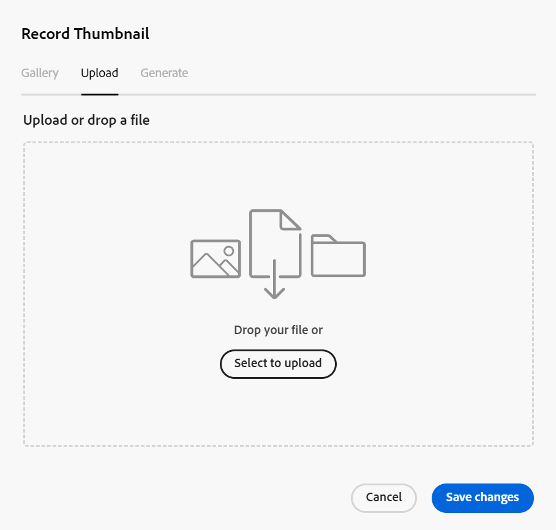
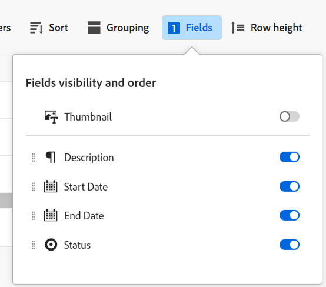

<!--update the metadata with real information-->

# Miniaturansichten zu Datensätzen hinzufügen

{{maestro-important-intro}}

Sie können Datensätze mit eindeutigen Miniaturansichten in Adobe Maestro verknüpfen, um sie leicht zu erkennen.

Sie müssen Datensatztypen erstellen, bevor Sie mit der Erstellung und Bearbeitung von Datensätzen beginnen können.
Weitere Informationen finden Sie unter [Erstellen von Datensatztypen](../architecture/create-record-types.md).

## Zugriffsanforderungen

<!--************double-check permissions here - asking Isk and Lilit what permissions users need for adding thumbnails-->

Sie müssen über folgenden Zugriff verfügen, um die Schritte in diesem Artikel ausführen zu können:

<table style="table-layout:auto">
 <col>
 </col>
 <col>
 </col>
 <tbody>
    <tr>
<tr>
<td>
   
 Produkt
 </td>
   <td>
   
 Adobe Workfront
 </td>
  </tr>  
 <td role="rowheader">
Adobe Workfront-Abkommen
</td>
   <td>

Ihr Unternehmen muss am Adobe Maestro Closed-Beta-Programm teilnehmen. Wenden Sie sich an Ihren Kundenbetreuer, um sich über dieses neue Angebot zu informieren. 

   </td>
  </tr>
  <tr>
   <td role="rowheader">
Adobe Workfront-Abo
</td>
   <td>

Alle

   </td>
  </tr>
  <tr>
   <td role="rowheader">
Adobe Workfront-Lizenz
</td>
   <td>
   
Alle
 
  </td>
  </tr>

<tr>
   <td role="rowheader">
Konfigurationen auf Zugriffsebene
</td>
   <td> 
Es gibt keine Zugriffskontrollen für Maestro 
  
</td>
  </tr>
<tr>
   <td role="rowheader">
Berechtigungen
</td>
   <td> 
Beitragen oder höhere Berechtigungen zu einem Arbeitsbereich 
  
   
Systemadministratoren haben Berechtigungen für alle Arbeitsbereiche, einschließlich derjenigen, die sie nicht erstellt haben

</td>
  </tr>
<tr>
   <td role="rowheader">
Layout-Vorlage
</td>
   <td>  
Allen Benutzern, einschließlich Workfront-Administratoren, muss eine Layoutvorlage zugewiesen werden, die den Maestro-Bereich im Hauptmenü enthält. 
 
Weitere Informationen finden Sie unter <a href="/help/quicksilver/maestro/access/access-overview.md">Zugriffsübersicht</a>. 
  
</td>
  </tr>

</tbody>
</table>

## Überlegungen zu Miniaturansichten von Datensätzen

Um in einer Tabellenansicht visuell zwischen Datensätzen zu unterscheiden, können Sie jedem Datensatz ein eindeutiges Miniaturbild zuordnen.

Beachten Sie Folgendes:

* Sie können nur Bilddateien als Miniaturansichten hinzufügen.
  <!--above: when you know exactly what type of files are allowed, add the exact extensions above-->
* Sie können einzelnen Datensätzen in der Tabellenansicht ein Miniaturbild hinzufügen.
* Miniaturansichten gehören zu den Datensatzinformationen und werden in Ansichten angezeigt, in denen Datensätze angezeigt werden. Beispielsweise werden Miniaturansichten neben Datensatzinformationen in den folgenden Bereichen angezeigt:

   * Das primäre Feld eines Datensatzes in der Tabellenansicht
   * Die Datensatzleiste in der Timeline-Ansicht.
* Auf der Detailseite des Datensatzes oder in der Timeline-Ansicht können Sie keine Datensatzminiaturansichten hinzufügen.
* Miniaturansichten werden nicht auf der Detailseite des Datensatzes angezeigt.

## Hinzufügen einer Miniaturansicht zu einem Datensatz

{{step1-to-maestro}}

1. Wählen Sie den Arbeitsbereich aus, für dessen Datensätze Sie Miniaturansichten hinzufügen möchten, und klicken Sie dann auf die Karte vom Typ Datensatz .

   Dadurch wird die Seite mit dem Datensatztyp geöffnet.
1. Wählen Sie eine Tabellenansicht aus dem **Ansicht** Dropdown-Menü. Alle Datensätze des ausgewählten Typs werden in einer Tabelle angezeigt.
1. Bewegen Sie den Mauszeiger über die primären Feldinformationen und klicken Sie auf die Schaltfläche **Mehr** Menü Klicken Sie auf **Miniatur**.

   

   >[!TIP]
   >
   >   Das primäre Feld ist das Feld, das in der ersten Spalte einer Tabellenansicht angezeigt wird. Das Primärfeld ist immer eingefroren und kann nicht ausgeblendet oder neu positioniert werden.

   Die **Miniaturansicht aufzeichnen** wird geöffnet.

   

   <!--update screen shot with correct casing-->

1. Im **Hochladen** Registerkarte eine Datei per Drag-and-Drop als Miniaturansicht hinzufügen, oder klicken Sie auf **Hochladen auswählen**, suchen Sie dann nach einer Bilddatei, die hinzugefügt werden soll. Die Datei muss auf Ihrem Computer gespeichert werden.
1. (Optional) Verwenden Sie das Größenanpassungs-Tool, um das Bild zu beschneiden und seine Größe zu ändern.
1. Klicks **Bild verwenden** , um das Bild als Miniaturansicht hinzuzufügen.
Dadurch wird die **Miniaturansicht aufzeichnen** ankreuzen.
1. (Bedingt) Wenn Sie mindestens über Beitragsberechtigungen für die Tabellenansicht verfügen, klicken Sie auf **Felder** in der oberen rechten Ecke der Tabellenansicht.
1. Wählen Sie die **Miniatur** umschalten, um die Miniaturansicht anzuzeigen. Diese Option ist standardmäßig deaktiviert.

   

   Die Miniaturansicht wird links neben dem primären Feldwert angezeigt.
1. (Optional und bedingt) Wenn Sie nicht über Beitragsberechtigungen oder höhere Berechtigungen für die Ansicht verfügen, wählen Sie eine neue Ansicht aus der **Ansicht** oder eine Ansicht erstellen.
1. (Optional) Um die Miniaturansicht zu entfernen, bewegen Sie den Mauszeiger über das primäre Feld und klicken Sie auf **Mehr** Menü > **Miniatur** > die **Entfernen** icon Klicken Sie auf **Änderungen speichern**.
