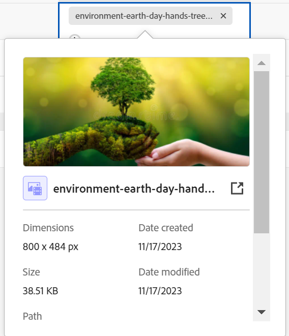

<!--when you make this live, update the metadata above to this: 
---
title: Connect records and objects
description: In addition to connecting Maestro records to one another, you can also connect Maestro records to objects from other applications.  
topic: Architecture
role: User
hidefromtoc: yes
hide: yes
---
-->
<!--udpate the metadata with real information when making this available in TOC and in the left nav-->

<!--if you change steps here, also update steps in the "Connect records" article-->

# Datensätze verbinden

>[!IMPORTANT]
>
>Die Informationen in diesem Artikel beziehen sich auf Adobe Maestro, ein neues Angebot von Adobe Workfront.
>
>Derzeit ist Adobe Maestro Teil eines Betaprogramms, das für eine begrenzte Anzahl von Kunden geöffnet ist. Sie müssen Workfront-Kunde sein, um Maestro-Funktionen verwenden zu können.
>
>Wenden Sie sich an Ihren Kundenbetreuer, um weitere Informationen zum Betaprogramm für Maestro zu erhalten.
>
>Weitere Informationen finden Sie unter [Übersicht über Adobe Maestro](../maestro-overview.md).

Sie können Adobe Maestro-Datensätze miteinander oder mit Objekten aus anderen Anwendungen verbinden.

Sie müssen zunächst zwei Datensatztypen oder einen Datensatztyp mit einem Objekttyp aus einer anderen Anwendung verbinden. Anschließend können Sie über die Tabellenansicht des Datensatztyps Datensätze miteinander oder Datensätze mit anderen Objekten verbinden.

Informationen zum Verbinden von Datensatztypen untereinander oder mit Objekttypen aus anderen Anwendungen finden Sie unter [Datensatztypen verbinden](../architecture/connect-record-types.md).

Ein Beispiel für das Verbinden von Datensatztypen finden Sie unter [Beispiel für das Verbinden von Datensatztypen und Datensätzen](../architecture/example-connect-record-types-and-records.md).

Sie können Folgendes verbinden:

* Betriebsaufzeichnungen von Maestro
* Maestro-Betriebsaufzeichnungen für Taxonomiedatensätze
* Maestro-Betriebsaufzeichnungen und -objekte aus anderen Anwendungen.

  Sie können Maestro-Datensätze mit Objekten der unten aufgeführten Typen aus den folgenden Anwendungen verbinden:

   * Adobe Workfront

      * Projekte
      * Portfolios
      * Programme
      * Firma
      * Gruppe

   * Adobe Experience Manager Assets

      * Bilddateien
      * Ordner

  <!--when you add more objects, fix the Access Requirements below which right now refer only to projects-->

## Zugriffsanforderungen

Sie müssen über folgenden Zugriff verfügen, um die Schritte in diesem Artikel ausführen zu können:

<table style="table-layout:auto">
 <col>
 </col>
 <col>
 </col>
 <tbody>
    <tr>
<tr>
<td>Produkt
 </td>
   <td>
   
 Adobe Workfront
 
   
Um Maestro-Datensätze mit Experience Manager Assets zu verbinden, müssen Sie über eine Adobe Experience Manager Assets-Lizenz verfügen und die Workfront-Instanz Ihres Unternehmens muss mit der Adobe Business Platform oder der Adobe Admin Console integriert sein.

   </td>
  </tr>  
 <td role="rowheader">
Adobe Workfront-Abkommen
</td>
   <td>

Ihr Unternehmen muss am Adobe Maestro Closed-Beta-Programm teilnehmen. Wenden Sie sich an Ihren Kundenbetreuer, um sich über dieses neue Angebot zu informieren. 

   </td>
  </tr>
  <tr>
   <td role="rowheader">
Adobe Workfront-Abo
</td>
   <td>

Alle

   </td>
  </tr>
  <tr>
   <td role="rowheader">
Adobe Workfront-Lizenz
</td>
   <td>
   
Alle
 
  </td>
  </tr>

<tr>
   <td role="rowheader">
Konfiguration der Zugriffsebene
</td>
   <td> 
Es gibt keine Zugriffssteuerungsebenen für Maestro
  
</td>
  </tr>
<tr>
   <td role="rowheader">
Berechtigungen
</td>
   <td> 
Berechtigungen für einen Arbeitsbereich verwalten</a> 
  
   
Systemadministratoren haben Berechtigungen für alle Arbeitsbereiche, einschließlich derjenigen, die sie nicht erstellt haben

</td>
  </tr>

<tr>
   <td role="rowheader">
Layout-Vorlage
</td>
   <td> 
Ihr Workfront- oder Gruppenadministrator muss den Maestro-Bereich in Ihre Layoutvorlage einfügen. Weitere Informationen finden Sie unter <a href="../access/access-overview.md">Zugriffsübersicht</a>. 
  
</td>
  </tr>

</tbody>
</table>

<!--Maybe enable this at GA - but Maestro is not supposed to have Access controls in the Workfront Access Level: 
>[!NOTE]
>
>If you don't have access, ask your Workfront administrator if they set additional restrictions in your access level. For information on how a Workfront administrator can change your access level, see [Create or modify custom access levels](../administration-and-setup/add-users/configure-and-grant-access/create-modify-access-levels.md). -->

## Datensätze verbinden

### Überlegungen zum Verbinden von Datensätzen

* Nachdem Sie Datensatztypen verbunden haben, werden die verbundenen Datensatztypen in der Tabelle der Datensatztypen, von denen sie verknüpft sind, als verknüpfte Datensatzfelder angezeigt.
* Sie können Datensätze und Objekte der verknüpften Datensätze und Objekttypen aus den verknüpften Datensatzfeldern durchsuchen und hinzufügen.
* Sie können der Tabelle des Datensatztyps, von dem Sie die Relation herstellen, Felder aus den verknüpften Datensatztypen hinzufügen.
* Die Werte verknüpfter Felder in den Datensätzen, aus denen Sie die Relation herstellen, können nicht manuell aktualisiert werden.

  Die Werte der verknüpften Felder aus den verknüpften Datensätzen füllen den Maestro-Datensatz, den Sie aus dem von Ihnen konfigurierten Maestro-Arbeitsbereich oder aus der Drittanbieteranwendung verknüpfen.

* Jeder, der Zugriff auf Maestro- und Verwaltungsberechtigungen für den Arbeitsbereich hat, kann die Verbindungen sehen, die Sie zwischen Maestro-Datensätzen oder zwischen Maestro-Datensätzen und den Objekten anderer Anwendungen herstellen. Sie können verbundene Datensätze und Objekte unabhängig von ihren Berechtigungen für die Drittanbieteranwendungen anzeigen, mit denen Sie eine Verbindung herstellen. <!--check with PM-->
* Sie können die Verbindungen aller anderen Benutzer anzeigen und bearbeiten, wenn Sie über Verwaltungsberechtigungen für den Arbeitsbereich verfügen, in dem die verbundenen Datensätze gespeichert sind.
* Sie können einen Maestro-Datensatz mit einem oder mehreren Objekten aus einer anderen Anwendung verbinden.
* Um Maestro-Datensätze mit anderen Datensätzen oder Objekten zu verknüpfen, benötigen Sie Folgendes:

   * Mindestens ein Maestro-Arbeitsbereich, -Datensatztyp und -Datensatz.

     Weitere Informationen finden Sie in den folgenden Artikeln:

      * [Erstellen von Arbeitsbereichen](../architecture/create-workspaces.md)
      * [Erstellen von Datensatztypen](../architecture/create-record-types.md)
      * [Datensätze erstellen](../records/create-records.md)

   * Verbindungen zwischen Datensatztypen oder zwischen Datensatztypen und Objekten aus anderen Anwendungen. Weitere Informationen finden Sie unter [Datensatztypen verbinden](../architecture/connect-record-types.md)

### Maestro-Datensätze verbinden

{{step1-to-maestro}}

Der zuletzt aufgerufene Arbeitsbereich sollte standardmäßig geöffnet werden.

1. (Optional) Erweitern Sie den nach unten zeigenden Pfeil rechts neben einem vorhandenen Workspace-Namen und wählen Sie den Arbeitsbereich aus, aus dem Sie Datensätze verbinden möchten.
1. Klicken Sie auf die Karte eines Datensatztyps, um die Seite vom Typ Datensatz zu öffnen.
1. Wählen Sie eine **Verzeichnis** Ansicht von **Ansicht** Dropdown-Menü in der oberen rechten Ecke der Seite vom Typ Datensatz.
1. (Optional) Fügen Sie dem ausgewählten Datensatztyp durch Hinzufügen einer neuen Zeile zur Tabelle Datensätze hinzu. Weitere Informationen finden Sie unter [Datensätze erstellen](../../maestro/records/create-records.md).
1. Markieren Sie ausgehend von einem Datensatz in der Tabellenansicht die verknüpfte Datensatzspalte und bewegen Sie den Mauszeiger über die Zelle, die dem Datensatz entspricht, den Sie mit anderen Datensätzen verknüpfen möchten. Klicken Sie dann auf die Schaltfläche **+** Symbol.

   Die **Objekte verbinden** angezeigt.

   

1. Geben Sie den Namen eines Datensatzes in das Suchfeld ein und wählen Sie ihn aus, wenn er in der Liste angezeigt wird

   Oder

   Wählen Sie den Namen eines oder mehrerer Datensätze im Feld aus und klicken Sie auf **Objekte verbinden** in der oberen rechten Ecke des Felds &quot;Objekte verbinden&quot;ein.

   Folgendes wird hinzugefügt:

   * Die verknüpften Datensätze werden im verknüpften Datensatzfeld des Datensatzes angezeigt, den Sie in Schritt 5 ausgewählt haben. <!--accurate?--> Durch die Aktualisierung der verknüpften Datensätze werden die verknüpften Felder für die Datensätze, von denen Sie die Relation herstellen, automatisch aktualisiert. Verknüpfte Felder können nicht manuell bearbeitet werden.

     >[!TIP]
     >
     >* &quot;Verknüpfte Felder&quot;und &quot;Suchfelder&quot;werden synonym verwendet.
     >
     >* Wenn Sie die **Mehrere Datensätze zulassen** festlegen, wenn Sie die Datensatztypen miteinander verbunden haben, werden die Feldwerte für mehrere ausgewählte Objekte entweder durch Kommas getrennt angezeigt oder entsprechend dem ausgewählten Aggregator aggregiert.

1. (Optional) Schließen Sie die Maestro-Datensatztyp-Seite und wechseln Sie zum ausgewählten Arbeitsbereich.
1. Klicken Sie auf die Karte des Datensatztyps, mit dem Sie verknüpft sind.

   Wenn Sie beispielsweise die **Kampagne** mit dem Produktdatensatz aufzeichnen, klicken Sie auf die **Produkt** Karte.

   Die Karte vom Typ Datensatz sollte in der Tabellenansicht geöffnet werden. Wenn nicht, wählen Sie eine Tabellenansicht aus.

   Beachten Sie, dass **Kampagne** Das Feld für verknüpfte Datensätze zeigt die Namen der Kampagnen an, die Sie mit Produkten verknüpft haben, auf der Seite Produktdatensatz-Typ . Durch die Aktualisierung der Campaign-Informationen wird das Campaign-verknüpfte Datensatzfeld für den Produktdatensatz-Typ automatisch aktualisiert.

### Maestro-Datensätze mit Workfront-Objekten verbinden

<!--when we will have more applications to link to from Maestro, change the title to soemthing like: Connect Maestro records to objects from other applications-->

Nachdem Sie eine Verbindung zwischen einem Maestro-Record-Typ und einem Workfront-Objekttyp hergestellt haben, können Sie einzelne Maestro-Datensätze mit Objekten in Workfront verbinden. Die von Ihnen verbundenen Workfront-Felder werden automatisch in die Maestro-Datensätze eingefügt, von denen Sie die Objekte verknüpfen.

{{step1-to-maestro}}

Der zuletzt aufgerufene Arbeitsbereich sollte standardmäßig geöffnet werden.

1. (Optional) Erweitern Sie den nach unten zeigenden Pfeil rechts neben einem vorhandenen Workspace-Namen und wählen Sie den Arbeitsbereich aus, aus dem Sie Datensätze verbinden möchten.
1. Klicken Sie auf die Karte eines Datensatztyps, um die Seite vom Typ Datensatz zu öffnen.
1. Wählen Sie eine **Verzeichnis** Ansicht von **Ansicht** Dropdown-Menü in der oberen rechten Ecke der Seite vom Typ Datensatz.

1. (Optional) Fügen Sie dem ausgewählten Datensatztyp einzelne Datensätze hinzu, indem Sie der Tabelle eine neue Zeile hinzufügen. Weitere Informationen finden Sie unter [Datensätze erstellen](../../maestro/records/create-records.md).
1. (Bedingt) Wenn Sie den ausgewählten Datensatztyp mit einem Workfront-Objekt verbunden haben, wechseln Sie zur verknüpften Objektspalte und bewegen Sie den Mauszeiger über die Zelle, die dem Datensatz entspricht, den Sie mit Objekten aus Workfront verknüpfen möchten, und klicken Sie auf die Schaltfläche **+** Symbol.

   Die **Objekte verbinden** angezeigt.

   

   Weitere Informationen zum Verbinden von Datensatztypen mit Objekten aus einer Drittanbieteranwendung finden Sie unter [Datensatztypen verbinden](../architecture/connect-record-types.md).

1. Geben Sie den Namen eines Workfront-Objekts in das Suchfeld ein und wählen Sie es dann aus, wenn es in der Liste angezeigt wird

   Oder

   Wählen Sie den Namen eines oder mehrerer Objekte im Feld aus und klicken Sie dann auf **Objekte verbinden** in der oberen rechten Ecke des Felds &quot;Objekte verbinden&quot;ein.

   Folgendes wird hinzugefügt:

   * Die ausgewählten Workfront-Objekte werden dem verknüpften Datensatzfeld hinzugefügt.
   * Wenn Sie sie hinzugefügt haben, als Sie den Datensatztyp mit Workfront verbunden haben, werden die verknüpften Felder (oder die Suchfelder) automatisch mit Informationen aus Workfront gefüllt.
   * Der neue Datensatztyp &quot;&lt; Name des Workfront-Objekttyps >&quot;wird im selben Arbeitsbereich wie der Maestro-Datensatz erstellt, von dem Sie die Verknüpfung herstellen. Der Name des Objekts ist Teil des Namens dieses Datensatztyps. Wenn Sie beispielsweise mit Workfront-Projekten verknüpfen, wird die **Projekt** Record-Typ in Maestro.

     Dies ist ein schreibgeschützter Datensatztyp und zeigt Workfront-Objekte an, die in dem neuen verknüpften Objektfeld ausgewählt sind, das Sie aus dem Maestro-Datensatz erstellt haben. Die verknüpften Felder des verknüpften Objekts werden auch in den schreibgeschützten verknüpften Workfront-Datensätzen angezeigt.

     >[!IMPORTANT]
     >
     > Der schreibgeschützte Workfront-Objektdatensatz wird nur erstellt, wenn einzelne Projekte zu Maestro-Datensätzen hinzugefügt werden. Beim Erstellen einer Verbindung zwischen einem Maestro-Record-Typ und einem Workfront-Objekttyp wird der Workfront-Record-Typ nicht erstellt.

     Alle vorhandenen Informationen aus den Feldern der Workfront-Objekte werden in den verknüpften Feldern oder Suchfeldern angezeigt.

     >[!TIP]
     >
     >
     >* Wenn Sie die Einstellung Mehrere Datensätze zulassen aktiviert haben, werden die Werte der verschiedenen Objekte entweder durch Kommas getrennt oder nach dem von Ihnen ausgewählten Aggregator aggregiert.
     >
     >* Für die verknüpften Workfront-Objekte in Workfront wird kein mit Maestro verknüpftes Datensatzfeld erstellt.

1. (Optional) Schließen Sie die Maestro-Datensatztyp-Seite und wechseln Sie zum ausgewählten Arbeitsbereich.
1. (Optional) Klicken Sie auf die Karte für den Workfront-Objektdatensatztyp. Klicken Sie beispielsweise auf die **Projekt** -Karte, wenn Sie mit Workfront-Projekten verknüpft sind. Die schreibgeschützte Workfront-Datensatztypkarte sollte in der Tabellenansicht geöffnet werden.

   Die auf der Seite Workfront-Datensatztyp aufgelisteten Datensätze sind schreibgeschützte Workfront-Objekte, die aus Maestro-Datensätzen verknüpft wurden. Die vom Workfront-Datensatztyp verknüpften Felder werden ebenfalls als schreibgeschützte Spalten angezeigt und automatisch ausgefüllt, wenn sie in Workfront ausgefüllt werden.

1. (Optional) Führen Sie einen der folgenden Schritte aus, um die Seite &quot;Workfront-Objektdatensatzdetails&quot;in Maestro zu öffnen:

   * Wechseln Sie vom verknüpften Datensatztyp zum Workfront-Objekt-verknüpften Datensatzfeld und klicken Sie auf den Namen des Workfront-Objekts.
   * Aus dem **Verzeichnis** Ansicht der Workfront-Datensatztypseite, klicken Sie auf den Namen des Workfront-Objekts

     Oder

     Klicken Sie auf **Mehr** Menü rechts neben dem Workfront-Objektnamen und klicken Sie auf **Ansicht**.

     

   Dadurch wird die Maestro-Detailseite des verknüpften Workfront-Objekts geöffnet. Dies ist eine schreibgeschützte Seite.

1. (Optional) Führen Sie einen der folgenden Schritte aus, um das verknüpfte Workfront-Objekt in Workfront zu öffnen:

   * Aus dem **Verzeichnis** Ansicht der Workfront-Datensatztypseite, klicken Sie auf den Namen des Workfront-Objekts, um den Projektdatensatz in Maestro zu öffnen.

   Oder

   Klicken Sie auf **Mehr** Menü rechts neben dem Workfront-Objektnamen und klicken Sie auf **Zu Quelle wechseln**.

   

   Dadurch wird die Workfront-Objektseite geöffnet. Sie können Informationen zum Workfront-Objekt bearbeiten, sofern Sie dazu berechtigt sind.

1. (Optional) Klicken Sie auf der schreibgeschützten Workfront-Objektdatensatzseite in Maestro auf die **Felder hinzufügen** icon  in der oberen rechten Ecke der Tabellenansicht, um Workfront-Felder zum Workfront-Datensatztyp hinzuzufügen oder daraus zu entfernen.

   >[!NOTE]
   >
   >  Die Felder, die Sie auf der Seite &quot;Workfront-Objektdatensatz&quot;hinzufügen oder entfernen, werden nicht zum Maestro-Datensatztyp hinzugefügt oder entfernt, der mit dem Workfront-Objekttyp verknüpft ist. Die Felder sind nur auf der schreibgeschützten Workfront-Datensatztypseite sichtbar, sodass Sie sie in Maestro überprüfen können.

1. (Optional und bedingt) Wenn Sie dem Workfront-Objekt mindestens zwei Datumsfelder hinzugefügt haben, klicken Sie auf die Schaltfläche **Ansicht** Dropdown-Menü auf der Seite Workfront-Objektdatensatztyp auswählen und **Timeline** Ansicht oder **Ansicht erstellen** , um eine Timeline-Ansicht zu erstellen.  Weitere Informationen finden Sie unter [Verwalten der Timeline-Ansicht](/help/quicksilver/maestro/views/manage-the-timeline-view.md).

   Die mit Workfront verknüpften Objekte werden in der Timeline-Ansicht angezeigt.

### Maestro-Datensätze mit Adobe Experience Manager-Objekten verbinden

<!--when we will have more applications to link to from Maestro, change the title to soemthing like: Connect Maestro records to objects from other applications-->

>[!IMPORTANT]
>
>Sie müssen über eine Adobe Experience Manager Assets-Lizenz verfügen und die Workfront-Instanz Ihres Unternehmens muss mit der Adobe Business Platform oder der Adobe Admin Console integriert sein, um Maestro-Datensätze mit Adobe Experience Manager Assets verbinden zu können.
>
>Wenn Sie Fragen zum Einstieg in die Adobe Admin Console haben, lesen Sie den Abschnitt [Häufig gestellte Fragen zu Adobe Unified Experience](/help/quicksilver/workfront-basics/navigate-workfront/workfront-navigation/unified-experience-faq.md).

Nachdem Sie eine Verbindung zwischen einem Maestro-Record-Typ und Adobe Experience Manager Assets hergestellt haben, können Sie einzelne Maestro-Datensätze mit Experience Manager-Assets verbinden. Die Asset-Felder, mit denen Sie die Verbindung von Experience Manager Assets aus hergestellt haben, werden automatisch in den Maestro-Datensatztyp eingetragen, von dem Sie die Verbindung hergestellt haben.

{{step1-to-maestro}}

Der zuletzt aufgerufene Arbeitsbereich sollte standardmäßig geöffnet werden.

1. (Optional) Erweitern Sie den nach unten zeigenden Pfeil rechts neben einem vorhandenen Workspace-Namen und wählen Sie den Arbeitsbereich aus, aus dem Sie Datensätze verbinden möchten.
1. Klicken Sie auf die Karte eines Datensatztyps, um die Seite vom Typ Datensatz zu öffnen.
1. Wählen Sie eine **Verzeichnis** Ansicht von **Ansicht** Dropdown-Menü in der oberen rechten Ecke der Seite vom Typ Datensatz.

1. (Optional) Fügen Sie dem ausgewählten Datensatztyp einzelne Datensätze hinzu, indem Sie der Tabelle eine neue Zeile hinzufügen. Weitere Informationen finden Sie unter [Datensätze erstellen](../../maestro/records/create-records.md).
1. (Bedingt) Wenn Sie den ausgewählten Datensatztyp mit Experience Manager Assets verbunden haben, wechseln Sie zur verknüpften Objektspalte und bewegen Sie den Mauszeiger über die Zelle, die dem Datensatz entspricht, den Sie mit anderen Objekten aus dem Experience Manager verknüpfen möchten, und klicken Sie auf die Schaltfläche **+** Symbol.

   Die **Auswählen von Assets** angezeigt. <!--update screen shot with actual assets-->

   

   Weitere Informationen zum Verbinden von Datensatztypen mit Objekten aus einer Drittanbieteranwendung finden Sie unter [Datensatztypen verbinden](../architecture/connect-record-types.md).

1. Klicken Sie auf , um einige der folgenden Asset-Typen auszuwählen:

   * Bilder
   * Ordner

   Sie können mehrere Assets auswählen.

   >[!IMPORTANT]
   >
   > Sie können nur Assets verbinden, auf die Sie Zugriff haben, um sie in Experience Manager anzuzeigen. Nach der Verbindung können alle Maestro-Benutzer die Assets in Maestro anzeigen, unabhängig vom Zugriff auf sie in Experience Manager Assets.

1. Klicks **Auswählen**.

   Folgendes wird hinzugefügt:

   * Die ausgewählten Experience Manager-Assets werden dem verknüpften Datensatzfeld hinzugefügt.
   * Die verknüpften Felder (oder Lookup-Felder) enthalten Informationen aus dem mit dem Experience Manager verbundenen Asset.
   * Der neue Datensatztyp &quot;Experience Manager Assets&quot;wird im selben Arbeitsbereich wie der Maestro-Datensatz erstellt, von dem Sie die Verknüpfung herstellen. <!--is this still added?-->

     Dies ist ein schreibgeschützter Datensatztyp und zeigt Experience Manager-Assets an, die in dem neuen verknüpften Objektfeld ausgewählt sind, das Sie aus dem Maestro-Datensatz erstellt haben. Die verknüpften Felder des verknüpften Objekts werden auch in den schreibgeschützten Experience Manager-Datensätzen angezeigt.

     >[!IMPORTANT]
     >
     > Der schreibgeschützte Experience Manager Assets-Datensatztyp wird nur erstellt, wenn einzelne Assets zu Maestro-Datensätzen hinzugefügt werden. Die Erstellung einer Verbindung zwischen einem Maestro-Record-Typ und Experience Manager Assets erzeugt nicht den Experience Manager Assets-Record-Typ.

     Alle vorhandenen Informationen aus den Feldern der Experience Manager-Assets werden in den verknüpften Feldern oder Suchfeldern angezeigt.

     >[!TIP]
     >
     >
     >* Wenn Sie die Einstellung Mehrere Datensätze zulassen aktiviert haben, werden die Werte der verschiedenen Objekte durch Kommas getrennt angezeigt.
     >
     >* Für die verknüpften Experience Manager-Assets in der Experience Manager Assets-Anwendung wird kein verknüpftes Datensatzfeld mit den verknüpften Maestro-Datensätzen erstellt.

1. (Optional) Schließen Sie die Maestro-Datensatztyp-Seite und wechseln Sie zum ausgewählten Arbeitsbereich.
1. Klicken Sie auf die Karte für den Experience Manager Assets-Datensatztyp. Die schreibgeschützte Experience Manager Assets-Datensatztypkarte sollte in der Tabellenansicht geöffnet werden.

   Die auf der Experience Manager Assets-Datensatztypseite aufgelisteten Datensätze sind schreibgeschützte Assets. Die vom Experience Manager Assets-Datensatztyp verknüpften Felder werden ebenfalls als schreibgeschützte Spalten angezeigt und automatisch ausgefüllt, wenn sie in Experience Manager eingetragen sind.

1. (Optional) Gehen Sie zu dem mit Experience Manager Assets verknüpften Datensatztyp und klicken Sie im verknüpften Datensatzfeld auf den Namen eines Assets. Die Experience Manager-Details des Assets werden in einem Popup-Fenster angezeigt. <!--update screen shot with hi-rez picture-->

   

   Die folgenden Felder werden für eine Bilddatei angezeigt:

   * Eine Miniaturansicht des Bildes
   * Der Name der Bilddatei
   * Dimensionen
   * Größe
   * Beschreibung
   * Der Dateipfad im Experience Manager
   * Der Asset-Typ
   * Erstellungsdatum
   * Änderungsdatum

1. (Optional) Gehen Sie wie folgt vor, um die Experience Manager Assets-Datensatzdetailseite in Maestro zu öffnen:

   1. Navigieren Sie zu **Experience Manager Assets** Karte vom Typ Maestro-Datensatz in demselben Arbeitsbereich, den Sie ursprünglich ausgewählt haben, und klicken Sie auf , um die Seite vom Typ Datensatz zu öffnen.
Die Experience Manager Assets Maestro-Datensatztyp-Seite ist schreibgeschützt.
   1. Klicken Sie in der Tabellenansicht auf den Namen eines Assets

      Oder

      Bewegen Sie den Mauszeiger über den Namen eines Assets und klicken Sie auf **Mehr** Menü  rechts neben dem Asset-Namen und klicken Sie dann auf **Ansicht**.\
      Dadurch wird der Maestro des Assets geöffnet **Details** Seite. Dies ist eine schreibgeschützte Seite.
1. (Optional) Führen Sie einen der folgenden Schritte aus, um die Seite mit den Datensatzdetails für Experience Manager-Assets in Experience Manager zu öffnen:

   * Rufen Sie die Seite Maestro-Record Type des Datensatzes auf, von dem Sie die Verknüpfung herstellen, klicken Sie im verknüpften Datensatzfeld auf den Namen eines Assets, um das Popup-Fenster zu öffnen, und klicken Sie dann auf die Schaltfläche **Öffnen** icon  , um das Asset zu öffnen.
   * Navigieren Sie zu **Experience Manager Assets** Karte vom Typ Maestro-Datensatz im selben Arbeitsbereich, den Sie ursprünglich ausgewählt haben, und klicken Sie auf , um die Seite vom Typ Datensatz zu öffnen. Klicken Sie auf den Namen eines Assets, um den Maestro zu öffnen. **Details** Seite und klicken Sie dann auf **Zu Quelle wechseln** in der oberen rechten Ecke des Bildschirms.

     
   * Navigieren Sie zu **Experience Manager Assets** Maestro-Record-Type-Karte in demselben Arbeitsbereich, den Sie ursprünglich ausgewählt haben, und klicken Sie auf die Karte, um die Experience Manager Assets-Record-Type-Seite zu öffnen. Bewegen Sie den Mauszeiger über den Namen eines Assets und klicken Sie auf die Schaltfläche **Mehr** Menü und klicken Sie auf **Zu Quelle wechseln**.

     

   Das Asset wird in Experience Manager Assets geöffnet.

1. (Optional) Klicken Sie auf die **Felder hinzufügen** icon  in der rechten oberen Ecke der Tabellenansicht auf der Experience Manager Assets-Datensatztypseite, um Experience Manager-Felder hinzuzufügen oder zu entfernen.

   >[!NOTE]
   >
   >  Die Felder, die Sie auf der Experience Manager Assets-Datensatztyp-Seite hinzufügen oder entfernen, werden nicht zum Maestro-Datensatztyp hinzugefügt oder entfernt, der mit dem Experience Manager-Asset verknüpft ist. Die Felder sind nur auf der schreibgeschützten Experience Manager Assets-Datensatztypseite sichtbar, sodass Sie sie in Maestro überprüfen können.

1. (Optional und bedingt) Wenn Sie dem mit dem Experience Manager verknüpften Asset mindestens zwei Datumsfelder hinzugefügt haben, klicken Sie auf die Schaltfläche **Ansicht** Dropdown-Menü auf der Experience Manager Assets-Datensatztypseite und wählen Sie die **Timeline** Ansicht oder **Ansicht erstellen** , um eine Timeline-Ansicht zu erstellen.  Weitere Informationen finden Sie unter [Verwalten der Timeline-Ansicht](/help/quicksilver/maestro/views/manage-the-timeline-view.md).
Die mit Experience Manager Assets verknüpften Assets werden in der Timeline-Ansicht angezeigt.