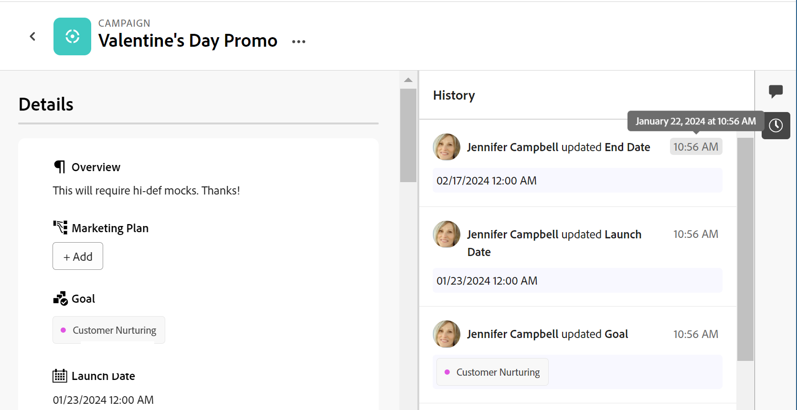

# Übersicht über den Verlaufsabschnitt

<!--update the metadata with real information when making this available in TOC and in the left nav-->

<!--update the system updates articles when we release to open beta - check the long commenting stream article list and see articles that document where in the system we have system updates; "Maestro records" should be there-->

<!--The highlighted information on this page refers to functionality not yet generally available. It is available only in the Preview environment for all customers. 

For information about the current release schedule, see [First Quarter 2024 release overview](/help/quicksilver/product-announcements/product-releases/24-q1-release-activity/24-q1-release-overview.md). -->

Sie können an Adobe Maestro-Datensätzen zusammenarbeiten, indem Sie Kommentare oder Antworten im rechten Bereich eines Datensatzes hinzufügen. Sie können auch andere Änderungen anzeigen, die am Datensatz vorgenommen und vom System in diesem Bereich aufgezeichnet wurden.

Im rechten Bereich eines Datensatzes werden die folgenden Abschnitte angezeigt:

* **Kommentare**: Zeigt Kommentare und Antworten an, die Benutzer zu Datensätzen hinzufügen. Weitere Informationen zum Verwalten von Kommentaren in Maestro-Datensätzen finden Sie unter [Verwalten von Datensatzkommentaren](/help/quicksilver/maestro/records/manage-record-comments.md).
* **Geschichte**: Zeigt systemaufgezeichnete Änderungen an, die Benutzer an den Datensatzfeldern vornehmen.

## Suchen Sie den Abschnitt Verlauf eines Datensatzes

{{step1-to-maestro}}

Der zuletzt aufgerufene Arbeitsbereich wird standardmäßig geöffnet.

1. Wählen Sie eine Tabellenansicht aus dem **Ansicht** Dropdown-Menü.
1. Klicken Sie in der Tabellenansicht auf den Namen eines Datensatzes.

   Der Rekord **Details** Seite geöffnet. Der Bereich Kommentare wird standardmäßig im rechten Bereich geöffnet.
1. Klicken Sie auf **Verlauf anzeigen** icon . Alle Änderungen an den Feldern des Datensatzes werden im rechten Bereich angezeigt, beginnend mit dem letzten.
1. (Optional) Klicken Sie auf die **Verlauf ausblenden** icon  , um den rechten Bereich zu schließen.

## Überlegungen zum Abschnitt Verlauf

Sie können die Änderungen, die an den Feldern vorgenommen wurden, im Abschnitt Verlauf des rechten Bereichs der Detailseite eines Operationssatzes oder der Taxonomie überprüfen.

* Maestro zeichnet die folgenden Informationen im Abschnitt Verlauf auf:

   * Alle Feldänderungen

   * Die alten und neuen Werte der Felder, wenn sich die Werte ändern. Die alten Werte werden im Durchstreichen-Format angezeigt.

   * Der vollständige Name des Benutzers, der die Änderung vorgenommen hat

   * Ein Datum und ein Zeitstempel für den Zeitpunkt der Änderung.

* In den Feldern der folgenden Typen werden immer der alte Wert (im Durchstreichen-Format) und der neue Wert angezeigt:

   * Text
   * Absatz
   * Währung
   * Datum
   * Zahl
   * Prozentsatz
   * Einzelauswahl

* Felder der folgenden Typen zeigen den alten Wert nur dann im Durchstreichen-Format an, wenn mindestens einer der mehreren Werte entfernt wurde:

   * Mehrfachauswahl
   * Verknüpfte Datensatzfelder
   * Personen

  Wenn durch die Änderung nur Werte zum Feld hinzugefügt werden, wird der alte Wert nicht angezeigt und nur der neue Feldwert wird angezeigt.

* Felder vom Typ Kontrollkästchen zeigen den alten Wert nie im Durchstreichen-Format an. Wenn das Feld bearbeitet wird, wird nur der aktuelle Status zum Zeitpunkt der Änderung angezeigt.

  Weitere Informationen zu Maestro-Feldern finden Sie unter [Felder erstellen](/help/quicksilver/maestro/fields/create-fields.md).

* Änderungen an Feldern der folgenden Typen werden nicht im Abschnitt Verlauf angezeigt:

   * Verknüpfte (Lookup) Felder
   * Formel
   * Erstellt von
   * Erstellt am Datum
   * Zuletzt geändert von
   * Zuletzt geändert am

* Wenn ein Feld aus dem System entfernt wird, bleiben die in diesem Feld vorgenommenen Aktualisierungen im Abschnitt Verlauf . Es gibt keinen Hinweis darauf, dass das Feld im Abschnitt Verlauf eines Datensatzes entfernt wurde.