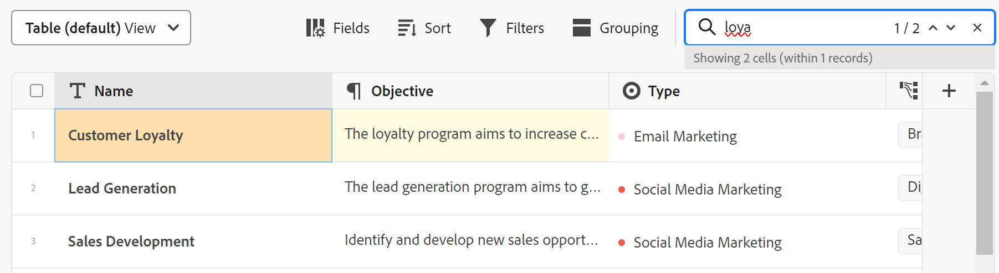

# Tabellenansicht verwalten

<!--
title: Manage the table view
description: You can display records in a table view when using Adobe Maestro. 
hidefromtoc: yes
author: Alina
feature: Work Management
role: User
hide: yes
-->

<!--update the metadata with real information when making this available in TOC and in the left nav-->

>[!IMPORTANT]
>
>Derzeit ist Adobe Maestro Teil eines Betaprogramms, das für eine begrenzte Anzahl von Kunden geöffnet ist.
>
>Wenden Sie sich an Ihren Kundenbetreuer, um weitere Informationen zum Betaprogramm für Maestro zu erhalten.
>
>Weitere Informationen finden Sie unter [Übersicht über Adobe Maestro](../maestro-overview.md).

Sie können Datensätze und ihre Felder in einer Tabellenansicht anzeigen, wenn Sie auf die Seite vom Typ Datensatz in Adobe Maestro zugreifen.

Informationen zu Maestro-Ansichten und deren Verwaltung finden Sie unter [Verwalten von Datensatzansichten](../views/manage-record-views.md).

## Zugriffsanforderungen

Sie müssen über folgenden Zugriff verfügen, um die Schritte in diesem Artikel ausführen zu können:

<table style="table-layout:auto">
 <col>
 <tbody>
<td>
   
 Adobe
 </td>
   <td>
   
 Adobe Workfront
 </td>
  </tr>  
 <td role="rowheader">
Adobe Workfront-Abkommen
</td>
   <td>

Ihr Unternehmen muss am Adobe Maestro Closed-Beta-Programm teilnehmen. Wenden Sie sich an Ihren Kundenbetreuer, um sich über dieses neue Angebot zu informieren. 

   </td>
  </tr>
  <tr>
   <td role="rowheader">
Adobe Workfront-Abo
</td>
   <td>

Beliebig

   </td>
  </tr>
  <tr>
   <td role="rowheader">
Adobe Workfront-Lizenz
</td>
   <td>
   
Beliebig
 
  </td>
  </tr>

<tr>
   <td role="rowheader">Zugriffsebene</td>
   <td> 
Beliebig
  
</td>
  </tr>
<tr>
   <td role="rowheader">Layout-Vorlage</td>
   <td> 
Ihr Systemadministrator muss den Maestro-Bereich in Ihre Layoutvorlage einfügen. Weitere Informationen finden Sie unter <a href="../access/grant-access.md">Zugriff auf Adobe Maestro gewähren</a>. 
  
</td>
  </tr>
 </tbody>
</table>

<!--Maybe enable this at GA - but Maestro is not supposed to have Access controls in the Workfront Access Level: 
>[!NOTE]
>
>If you don't have access, ask your Workfront administrator if they set additional restrictions in your access level. For information on how a Workfront administrator can change your access level, see [Create or modify custom access levels](../administration-and-setup/add-users/configure-and-grant-access/create-modify-access-levels.md). -->

<!-- Notes to add for the table: for the "Workfront plans" row: the above is only for closed beta; when going to GA - activate the following plans:    

Current plan: Prime and Ultimate

Legacy plan: Enterprise
-->

<!-- Notes for the table: for the "Workfront access" row: 
For more information, see <a href="../../administration-and-setup/add-users/access-levels-and-object-permissions/wf-licenses.md" class="MCXref xref">Adobe Workfront licenses overview</a>.
-->

## Tabellenansicht verwalten {#manage-a-table-view}

<!--insert screen shot of table view-->

Bei der Erstellung einer Tabellenansicht werden alle Datensätze des ausgewählten Typs in einer Tabelle angezeigt. Jede Zeile ist ein eindeutiger Datensatz und jede Spalte ist ein Datensatzfeld. Alle Felder und Datensätze werden standardmäßig angezeigt.

So verwalten Sie eine Tabellenansicht:

1. Erstellen Sie eine Tabellenansicht, wie im Artikel beschrieben [Verwalten von Datensatzansichten](../views/manage-record-views.md).

   

1. Aktualisieren Sie die folgenden Ansichtselemente wie in den folgenden Unterabschnitten beschrieben:
   * [Spalten (oder Felder)](#add-columns-or-fields)
   * [Zeilen (oder Datensätze)](#add-rows-or-records)
   * [Filter](#add-filters)
   * [Gruppierung](#add-groupings)
   * [Sortieren](#sort-information)

### Spalten (oder Felder) hinzufügen {#add-columns}

Die Spaltenüberschriften einer Maestro-Tabellenansicht zeigen Felder an, die mit den Datensätzen in der Ansicht verknüpft sind. Dieselben Felder, die in der Tabellenansicht angezeigt werden, werden auch im Abschnitt Details eines Maestro-Datensatzes angezeigt. Weitere Informationen finden Sie unter [Datensätze bearbeiten](../records/edit-records.md).

<!-- this is not available yet:You can display record fields (or columns) in both a table and a timeline view. However, the number of columns displayed in the table of the timeline view is limited and you cannot add columns in addition to those selected by default. -->

Das Hinzufügen von Spalten zu einer Ansicht entspricht dem Hinzufügen von Feldern zu einem Datensatztyp.

Sie können bis zu 500 Felder (oder Spalten) in einer Tabellenansicht hinzufügen.

1. Gehen Sie zu einer Seite vom Typ Datensatz und wählen Sie eine **Verzeichnis** Ansicht aus dem Dropdown-Menü &quot;Ansicht&quot;aus.
1. Fügen Sie Felder (oder Spalten) hinzu, wie im Artikel beschrieben [Felder erstellen](../architecture-and-fields/create-fields.md).

   Die hinzugefügten Spalten sind für alle Benutzer sichtbar, die auf den Datensatztyp zugreifen, und werden auf der Detailseite der Datensätze des ausgewählten Datensatztyps als neue Felder hinzugefügt.

1. Führen Sie einen der folgenden Schritte aus, um die Spalten in der Tabelle neu anzuordnen:

   * Ziehen Sie die Spaltenüberschrift in den Arbeitsbereich und legen Sie sie an der gewünschten Position ab. Die Spalte, die Sie kurz verschoben haben, wird mit blauem Hintergrund angezeigt, bis Sie weitere Anpassungen an der Tabelle vornehmen.

   * Klicks **Felder** Ziehen Sie die Felder in die Symbolleiste der Tabelle und legen Sie sie in der gewünschten Reihenfolge ab. Klicken Sie dann außerhalb der **Sichtbarkeit und Reihenfolge der Felder** , um es zu schließen.

     

   >[!TIP]
   >
   >* Das Feld Name ist immer das erste Feld in der Tabellenansicht.
   >
   >* Das Feld &quot;Name&quot;kann nicht an eine andere Position verschoben werden.
   >
   >* Das Feld Name kann nicht ausgeblendet werden.
   >
   >* Das Feld Name ist eingefroren und nicht Teil des horizontalen Bildlaufs.

1. Wählen Sie einen oder mehrere Datensätze in einer Zeile aus, ziehen Sie die **handle** icon  links neben dem Datensatznamen, um die Zeilen neu anzuordnen.

   >[!NOTE]
   >
   >Wenn Sie mindestens eine Sortierung auf die Tabellenansicht anwenden, können Sie die Reihenfolge der Zeilen nicht ändern.

1. Klicken Sie auf die Spaltentrennlinien und ziehen Sie sie an die gewünschte Stelle, um die Spaltenbreite zu vergrößern.

   >[!TIP]
   >
   >Die Änderungen an der Spaltenbreite und -reihenfolge sind dauerhaft und für alle Benutzer sichtbar, die auf den Datensatztyp zugreifen.

1. Bewegen Sie den Mauszeiger über die Spaltenüberschrift, klicken Sie dann auf den nach unten zeigenden Pfeil und klicken Sie dann auf **Feld ausblenden**

   Oder

   Klicks **Felder** in der Tabellen-Symbolleiste und deaktivieren Sie den Umschalter, der den auszublendenden Feldern (oder Spalten) zugeordnet ist.

   >[!TIP]
   >
   >Die Anzahl der ausgeblendeten Felder wird links neben dem Symbol Felder in der Symbolleiste angezeigt.

1. Klicken Sie auf **Felder** aktivieren und aktivieren Sie den Umschalter, der den Feldern zugeordnet ist, die in den Spalten der Tabelle angezeigt werden sollen. Alle Felder werden standardmäßig angezeigt.

1. Führen Sie die folgenden Schritte aus, um schnell nach Datensätzen zu suchen, die einem Keyword entsprechen:

   1. Klicken Sie auf **suchen** icon  und beginnen Sie mit der Eingabe eines Suchbegriffs, das mit einem Feld eines Datensatzes verknüpft ist, das auf dem Bildschirm angezeigt wird. Die Anzahl der richtigen Übereinstimmungen wird neben dem Suchelement angezeigt und das Feld mit der richtigen Übereinstimmung wird blau hervorgehoben.

      Sie können beliebige Wörter oder Sonderzeichen verwenden, die auf dem Bildschirm sichtbar sind.

      Sie können keine Suchbegriffe verwenden, die Feldern zugeordnet sind, die in der Tabellenansicht ausgeblendet sind.

      

   1. (Optional) Wenn mehrere Übereinstimmungen vorliegen, klicken Sie auf die Pfeile nach oben und unten rechts neben dem Suchbegriff, um alle Übereinstimmungen in der Tabelle zu finden.

   1. Klicken Sie auf **X** in das Suchfeld ein, um den Suchbegriff zu löschen.

### Zeilen (oder Datensätze) hinzufügen {#add-rows}

Die Zeilen einer Maestro-Tabellenansicht zeigen einzelne Datensätze des ausgewählten Datensatztyps an.

Sie können bis zu 10.000 Datensätze (oder Zeilen) für einen Datensatztyp in Maestro haben.

Das Hinzufügen von Zeilen zu einer Maestro-Tabellenansicht entspricht dem Erstellen von Datensätzen in einer Tabelle.

Weitere Informationen finden Sie unter [Datensätze erstellen](../records/create-records.md).

<!-- this is not possible right now:

1. To reorder the rows, click the row header, drag and drop it in the desired location. 

    The changes you make to the row order are permanent and visible to all users who access the record type
-->

### Filter hinzufügen {#add-filters}

<!-- this section links from the timeline view; consider splitting them if they become different-->

Mithilfe von Filtern können Sie die Anzahl der auf dem Bildschirm angezeigten Informationen verringern.

Beachten Sie Folgendes beim Arbeiten mit Filtern in der Tabellenansicht:
<!-- this list is almost identical to the one for the table view - update both-->

* Die Filter, die Sie für die Tabellenansicht erstellen, funktionieren unabhängig von den Filtern in der Timeline-Ansicht, wenn sie auf denselben Datensatztyp angewendet werden.

* Die Filter sind für die ausgewählte Ansicht eindeutig. Für zwei Tabellenansichten desselben Datensatztyps können unterschiedliche Filter angewendet werden. Zwei Benutzer, die sich dieselbe Tabellenansicht ansehen, sehen denselben Filter, der derzeit angewendet wird.

* Sie können die erstellten Filter nicht benennen und auf eine Tabellenansicht anwenden.

* Durch das Entfernen von Filtern werden diese von allen Benutzern entfernt, die auf denselben Datensatztyp wie Sie zugreifen, und es wird die gleiche Ansicht wie die von Ihnen verwendete verwendet.

* Das Hinzufügen von Filtern zur Tabellenansicht entspricht dem Hinzufügen von Filtern zur Timeline-Ansicht.

So fügen Sie einer Tabellenansicht einen Filter hinzu:

1. Erstellen Sie eine Tabellenansicht für eine Seite vom Typ Datensatz, wie im Artikel beschrieben [Verwalten von Datensatzansichten](../views/manage-record-views.md).
1. Wählen Sie eine Tabellenansicht aus und klicken Sie auf **Filter** in der oberen rechten Ecke der Tabelle.
1. Klicks **Bedingung hinzufügen** und fügen Sie die folgenden Informationen hinzu:

   * Wählen Sie ein Feld aus, nach dem Sie filtern möchten <!-- the tip below might change-->

   * Wählen Sie eine Option (oder einen Filter-Modifikator) aus, um festzulegen, welche Art von Bedingung das Feld erfüllen muss

     Die nachstehende Tabelle zeigt die verfügbaren Modifikatoren für jeden Feldtyp.

     >[!TIP]
     >
     > Verknüpfte Felder können nicht ausgewählt werden. Weitere Informationen finden Sie unter [Felder erstellen](../architecture-and-fields/create-fields.md).

     <table>
        <thead>
        <tr>
            <th><b>Feldtyp</b></th>
            <th><b>Modifikatoren</b></th>
        </tr>
        </thead>
        <tbody>
        <tr>
            <td>Einzeiliger Absatz </td>
            <td>
Enthält

            
Enthält nicht

            
Ist

            
Ist nicht

            
Ist leer

            
Ist nicht leer
</td>
        </tr>
        <tr><td>Einzelauswahl</td>
            <td>
Ist

            
Ist nicht

            
Ist ein beliebiges von

            
Ist keines von

            
Ist leer

            
Ist nicht leer
</td>
        </tr>
        <tr>
            <td>Mehrfachauswahl</td>
            <td>
Hat eines von

            
Hat alle von

            
Ist genau

            
Hat keines von

            
Ist leer

            
Ist nicht leer
</td>
        </tr>
        <tr>
            <td>Numerisch, Prozent, Währung</td>
            <td>
=

            
≠

            
 &lt; 

            
&gt;

            
≤

            
≥

            
Ist leer

            
Ist nicht leer
</td>
        </tr>
        <tr>
            <td>Datum</td>
            <td>
Ist

            
Ist nicht

            
Ist nach

            
Ist vor

            
Ist zwischen

Ist nicht zwischen

            
Ist leer

Ist nicht leer
</td>
        </tr>

     <tr>
            <td>Kontrollkästchen</td>
            <td>
Ist

        </tr>
        </tbody>
        </table>

   * Wählen Sie einen Wert für das ausgewählte Feld aus.

   

   Es gibt keine Beschränkung für die Anzahl der Filterbedingungen, die Sie hinzufügen können.

1. (Optional) Klicken Sie auf **Bedingung hinzufügen** um eine weitere Filteroption hinzuzufügen und die oben beschriebenen Schritte zu wiederholen. Die Anzahl der angewendeten Filter wird links neben dem Symbol Filter angezeigt.
1. Klicken Sie auf die folgenden Operatoren, um anzugeben, wie die Filterbedingungen verbunden werden und angewendet werden sollen:

   * **und**: Alle angegebenen Bedingungen müssen erfüllt sein.
   * **Oder**: Jede der angegebenen Bedingungen muss erfüllt sein. Dies ist die Standardoption.

   Die Liste der Datensätze wird automatisch gefiltert.  <!--at this time, you can't name and save the filter - but will this change?!-->
   <!-- asked on the task for the simple filters whether there is a limitation for how many statements a filter can have?!-->

1. (Optional) Klicken Sie auf **Filter** und klicken Sie dann auf **x** -Symbol, um einen Filter zu entfernen. <!--right now you cannot "clear all" for filters, but this might come later-->

<!-- this is not available yet

### Add groupings {#add-groupings}

*******************this section might link in the future from the timeline view; right now it's only documented there; also, check the steps below because this was not released to the table when they were written*****************

You can group records by similar information when applying  a grouping to a view.

You can apply groupings both in the table and timeline views. The groupings of the table view are independent from those in the timeline view of the same record type. 

Consider the following:

* You can apply 3 levels of grouping in a Maestro view. The records are grouped in the order of groupings that you select. (***************check on this; this might be true for timeline, but not for table??? One dev said in a demo that there are unlimited groupings in a table - check *********************)
* You can apply up to 4 levels of grouping when using the API. 

To add a grouping:

1. Create a view, as described in [Create or edit record views](#create-or-edit-record-views). 
1. (Conditional) To apply a grouping in the table view, do the following:
    
    1. ***************start adding steps for building a grouping - see if there it a global setting or just per column; also, see if the steps are different for a table vs a timeline view?!**********************
1. (Conditional) To apply a grouping in the timeline view, do the following:

    1. Go to a timeline view, then click **Group**. ************************did they rename this to "Grouping"?!****************************
        ******************insert screen shot***********
    1. Click one of the 5 suggested fields, or click **Choose a different field** to display all fields, then click one when it displays in the list. 
    
        >[!TIP]
        >
        > You cannot select linked fields. For information, see [Create fields](../architecture-and-fields/create-fields.md).  
    The grouping is applied automatically to the timeline and records display inside the grouping box.    <********************ensure this is correct functionality here*************
    
    1. (Optional) Click **Add grouping** to add up to 3 groupings. 

        The number of groupings applied displays to the left of the Grouping icon in the upper-right corner of the toolbar. **********ensure this says "grouping" and not "group"*****************
    
    1. (Optional) Click **Clear all** to remove all groupings.  

-->

### Sortierung hinzufügen {#sort-information}

Durch Anwendung einer Sortierung können Sie Informationen in einer bestimmten Reihenfolge organisieren.

Sie können die folgenden Informationen sortieren:

* Alle Datensätze in einer Tabellenansicht. <!--or timeline view. ***********verify this is the case for the timeline view*********************-->
  <!--* All groupings. - this is not available yet-->

Beachten Sie beim Sortieren von Datensätzen in der Tabellenansicht Folgendes:

<!-- if this is available for the timeline view, update both when you update one-->

* Die Sortierung ist für die ausgewählte Ansicht eindeutig. Für zwei Tabellenansichten desselben Datensatztyps können unterschiedliche Sortierkriterien angewendet werden. Zwei Benutzer, die sich dieselbe Tabellenansicht ansehen, sehen dieselbe Sortierung, die derzeit angewendet wird.

* Sie können die erstellten Sortierungen nicht benennen und auf eine Tabellenansicht anwenden.

* Die von Ihnen erstellte Sortierung wird beim Navigieren beibehalten.

* Sie können so viele Felder sortieren, wie in der Tabellenansicht eines Datensatztyps angezeigt werden.

* Wenn Sie Sortierungskriterien entfernen, werden diese von allen Benutzern entfernt, die auf denselben Datensatztyp wie Sie zugreifen, und es wird die gleiche Ansicht wie Sie verwendet.

Zum Sortieren <!--ungrouped (add this when sorting for groupings will be available--> -Einträge, führen Sie folgende Schritte aus:

1. Erstellen Sie eine Tabellenansicht, wie im Artikel beschrieben [Verwalten von Datensatzansichten](../views/manage-record-views.md).
1. Klicken Sie auf **Sortieren** icon  in der oberen rechten Ecke der Tabelle

   Oder

   Bewegen Sie den Mauszeiger über den Namen einer Spalte in der Tabellenansicht, klicken Sie auf den nach unten zeigenden Pfeil rechts neben dem Spaltenüberschriftsnamen und klicken Sie dann auf **Nach diesem Feld sortieren**. Das Feld wird als Sortierungsauswahl im Sortiersymbol in der oberen rechten Ecke der Tabellenansicht hinzugefügt.
1. Im **Sortieren von Datensätzen nach** auf eines der vorgeschlagenen Felder klicken oder auf **Andere Felder auswählen** und suchen Sie nach einem anderen Feld und klicken Sie dann darauf, wenn es in der Liste angezeigt wird.

   Die Sortierung wird automatisch auf die Tabellenansicht angewendet und die Datensätze werden nach den von Ihnen ausgewählten Kriterien sortiert angezeigt.

   <!-- add a step that you can rearrange the sorting fields here, when this will be possible-->

1. (Optional) Wiederholen Sie die obigen Schritte, um nach zusätzlichen Feldern zu sortieren.

   Die Anzahl der Felder, nach denen Sie sortieren möchten, wird links neben dem Symbol Sortieren in der oberen rechten Ecke der Symbolleiste angezeigt. Sie können nur Felder auswählen, die in den Spalten der Tabellenansicht angezeigt werden.

   >[!TIP]
   >
   > Verknüpfte Felder können nicht ausgewählt werden. Weitere Informationen finden Sie unter [Felder erstellen](../architecture-and-fields/create-fields.md).

1. (Optional) Im **Sortieren von Datensätzen nach** und klicken Sie auf das **x** Symbol rechts neben einem Sortierfeld zum Entfernen der Sortierung

   Oder

   Klicks **Alle löschen** , um alle Felder aus der Sortierung zu entfernen.

1. Klicken Sie außerhalb der **Sortieren von Datensätzen nach** zum Schließen.

   

   Die in der Tabelle angezeigten Informationen werden nach den von Ihnen ausgewählten Kriterien sortiert.

   In den für die Sortierung ausgewählten Feldern wird ein Sortiersymbol angezeigt, gefolgt von einer Zahl, die die Reihenfolge angibt, in der die Sortierung angewendet wird.

<!-- this is not available yet: 

To sort grouped records: 

1. Create a view, as described in [Create or edit record views](#create-or-edit-record-views). 
1. ************************* add steps here for sorting grouped records****************

-->
