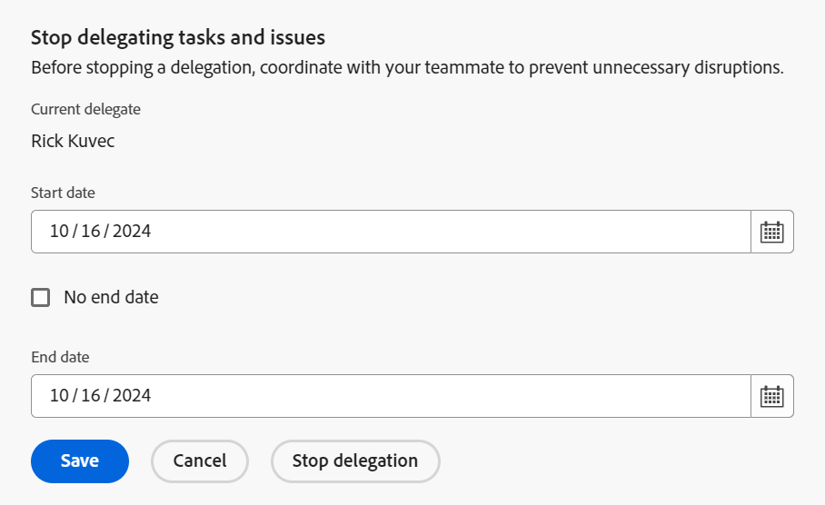

# Delegieren von Aufgaben und Problemen

<!-- Audited: 10/2024 -->

<!--
<NOTE: 
<you might need to change the tile to Delegate PTI, etc, when that functionality is added. Named it this so it will not conflict with the TOC article for Delegate section which was also "Delegate work"
I wrote this as a "Manage..." article and I did not add three separate articles, to match what we have for delegating approval requests)
-->

Sie können die Ihnen zugewiesene Arbeit vorübergehend delegieren, während Sie abwesend sind.

Sie können Aufgaben- und Problemzuweisungen oder Genehmigungen delegieren. In diesem Artikel wird beschrieben, wie Sie Aufgaben- und Problemzuweisungen delegieren.

Allgemeine Informationen zum Delegieren von Arbeit finden Sie unter [Delegieren von Arbeit - Übersicht](../../manage-work/delegate-work/delegate-work-overview.md).

## Zugriffsanforderungen

+++ Erweitern, um die Zugriffsanforderungen für die in diesem Artikel beschriebene Funktionalität anzuzeigen.

>[!IMPORTANT]
>
>* Die Benutzer, die Sie als Delegierte auswählen, erhalten dieselben Berechtigungen wie Ihre Berechtigungen für die Aufgaben und Probleme, die Sie an sie delegieren.
>* Die Berechtigungen müssen innerhalb ihrer Zugriffsebenen funktionieren, und manchmal können ihre Zugriffsebenen niedriger sein als Ihre.
>
>   
>   Wenn ein(e) Benutzende(r) beispielsweise nur Lesezugriff auf Aufgaben in der Zugriffsebene hat und Sie Verwaltungsberechtigungen für die Aufgaben haben, die Sie an ihn/sie delegieren, erhalten er/sie Verwaltungsberechtigungen für die Aufgaben, die Sie an ihn/sie delegieren. Sie können jedoch nicht dieselben Aktionen wie Sie für die delegierten Aufgaben ausführen. Um Aufgaben in Ihrer Abwesenheit aktualisieren zu können, müssen sie vom Systemadministrator Bearbeitungszugriff auf Aufgaben anfordern.
>
>   
>   Informationen dazu, wie ein Systemadministrator Ihre Zugriffsebene ändern kann, finden Sie unter [Erstellen oder Ändern benutzerdefinierter Zugriffsebenen](../../administration-and-setup/add-users/configure-and-grant-access/create-modify-access-levels.md).
>
>* Bei Elementen, die zugewiesen werden, nachdem die Delegierung bereits gestartet wurde, kann es bis zu einer Stunde dauern, nachdem das Element für [!DNL Workfront] zugewiesen wurde, um die neu zugewiesenen Elemente für den Beauftragten freizugeben.

Sie müssen über folgenden Zugriff verfügen, um die Schritte in diesem Artikel ausführen zu können:

<table style="table-layout:auto"> 
 <col> 
 <col> 
 <tbody> 
  <tr> 
   <td role="rowheader">Adobe Workfront-Paket</td> 
   <td> 
Beliebig
 </td> 
  </tr> 
  <tr> 
   <td role="rowheader">Adobe Workfront-Lizenz</td> 
   <td> 
Mitwirkender oder höher

Überprüfen oder höher

>[!NOTE]
>
>Obwohl Sie Arbeiten zugewiesen werden können, wenn Sie über eine Anforderungslizenz verfügen, können Sie Ihre Arbeit nicht an andere delegieren. [!DNL Workfront] empfiehlt nicht, Benutzern mit Prüfungs-, Anforderungs- oder Mitwirkendenaufgaben Arbeit zuzuweisen.

</tr> 
  <tr> 
   <td role="rowheader">Konfigurationen der Zugriffsebene</td> 
   <td> 
Zugriff auf Aufgaben und Probleme bearbeiten 
     
 </td> 
  </tr> 
  <tr> 
   <td role="rowheader">Objektberechtigungen</td> 
   <td> 
Anzeigen von oder höhere Berechtigungen für die Aufgaben oder Probleme, denen Sie zugewiesen sind
 
    </td> 
  </tr> 
 </tbody> 
</table>

Weitere Informationen finden Sie unter [Zugriffsanforderungen in der Dokumentation zu Workfront](/help/quicksilver/administration-and-setup/add-users/access-levels-and-object-permissions/access-level-requirements-in-documentation.md).

+++

<!--note from the table for Object permissions:
     
Contribute or higher permissions to the projects where you are designated as the Project Owner (NOTE: you cannot delegate projects yet)

    -->

## Voraussetzungen

Bevor Sie die in diesem Artikel beschriebenen Aktivitäten durchführen können, müssen Sie Folgendes sicherstellen:

* Ihr [!DNL Workfront]- oder Gruppenadministrator hat die Einstellung [!UICONTROL **Erlauben Sie Benutzern, ihre Aufgaben und Probleme zu delegieren**] im Abschnitt [!UICONTROL Voreinstellungen für Aufgaben und Probleme] im Bereich [!UICONTROL Setup] Ihrer [!DNL Workfront]-Instanz aktiviert.

  Weitere Informationen finden Sie unter [Systemweite Aufgaben- und Problemeinstellungen konfigurieren](../../administration-and-setup/set-up-workfront/configure-system-defaults/set-task-issue-preferences.md).

## Delegieren von Aufgaben und Problemen an einen anderen Benutzer

Bevor Sie Arbeit an andere delegieren, empfehlen wir Ihnen, sich an diese zu wenden und sie darüber zu informieren, dass sie als Beauftragte für Ihre Arbeitselemente benannt werden. Fragen Sie vor der Delegierung von Arbeiten um mündliche Zustimmung, damit sichergestellt ist, dass der Mitarbeiter genügend Zeit hat, um die Arbeiten auch außerhalb des Büros abzuschließen.

Allgemeine Informationen zum Delegieren von Aufgaben und Problemen finden Sie unter [Delegieren von Aufgaben und Problemen - Übersicht](/help/quicksilver/manage-work/delegate-work/delegate-work-overview.md).

So delegieren Sie Ihre Aufgaben und Probleme an andere:

1. Navigieren Sie zum Bereich [!UICONTROL **Startseite**].
1. Stellen Sie sicher, dass Sie die Widgets [!UICONTROL **Meine**]&quot;, [!UICONTROL **Meine**]&quot; oder [!UICONTROL **Meine Probleme**] zu Ihrer [!UICONTROL **Startseite**] haben.

   Weitere Informationen finden Sie unter [Hinzufügen, Bearbeiten oder Entfernen von Widgets auf der Startseite](/help/quicksilver/workfront-basics/using-home/using-the-home-area/add-edit-remove-widgets-in-new-home.md)

1. Klicken Sie [!UICONTROL **Delegieren**] in der oberen linken Ecke der Widgets [!UICONTROL **Meine Arbeit**], [!UICONTROL **Meine Aufgaben**] oder [!UICONTROL **Meine Probleme**].

   

1. Aktualisieren Sie Folgendes:

   * [!UICONTROL **Aufgaben und Probleme delegieren an**]: Beginnen Sie mit der Eingabe des Namens eines Benutzers, an den Ihre Aufgaben und Probleme delegiert werden sollen, und wählen Sie ihn aus, wenn er in der Liste angezeigt wird. Sie können nur einen Benutzer auswählen.

     Der Benutzer, den Sie als Delegierten auswählen, erhält dieselben Berechtigungen wie Ihre Berechtigungen für die Aufgaben und Probleme, die Sie an ihn delegieren.

   * [!UICONTROL **Startdatum**]: Wählen Sie ein Datum aus dem Kalender aus, an dem die Delegierung Ihrer Arbeitselemente beginnen soll.

     >[!TIP]
     >
     >Das Startdatum darf nicht in der Vergangenheit liegen.

   * [!UICONTROL **Kein Enddatum**]: Wählen Sie diese Option aus, wenn Sie das Enddatum für Ihre Delegierung nicht angeben möchten.

   * [!UICONTROL **Enddatum**]: Wählen Sie ein Datum aus dem Kalender aus, an dem die Delegierung beendet werden soll.

     >[!TIP]
     >
     >Wenn Sie das Feld Enddatum leer lassen und die Option Kein Enddatum nicht ausgewählt ist, wird die Delegierung nur für den aktuellen Tag festgelegt.

     
     <!--check screen shot - submitted bug for casing-->

1. Klicken Sie auf [!UICONTROL **Speichern**].

   Folgendes geschieht:

   * Ihre Arbeit wird an den angegebenen Benutzer delegiert. Alle unvollständigen Aufgaben oder Probleme, die innerhalb des von Ihnen ausgewählten Zeitraums ein Datum aufweisen (einschließlich neu zugewiesener Aufgaben, nachdem die Delegierung aktiviert wurde), werden delegiert.

     >[!TIP]
     >
     >   Abgeschlossene Arbeitselemente, deren Datum innerhalb des Zeitrahmens der Delegierung liegt, werden nicht delegiert.

   * Sie erhalten unten auf dem Bildschirm eine Nachricht, die bestätigt, dass Sie die Delegierung Ihrer Arbeit an einen anderen Benutzer aktiviert haben. Der Name des stellvertretenden Benutzers wird in der Bestätigungsmeldung angezeigt.

   * Ein Hinweis darauf, dass Ihre Aufgaben und Probleme an andere Benutzer delegiert wurden, wird in den meisten Bereichen angezeigt, in denen Sie Zuweisungen in [!DNL Workfront] sehen können. Weitere Informationen dazu, welche Bereiche keine Delegaten-Namen enthalten, finden Sie unter [Delegierte Arbeit - Übersicht](delegate-work-overview.md).

   * Die Schaltfläche [!UICONTROL **Delegieren**] im Bereich [!UICONTROL **Startseite**] ändert sich in [!UICONTROL **Delegierung bearbeiten**], um anzugeben, dass eine Delegierung vorhanden ist.
     <!--
      <MadCap:conditionalText data-mc-conditions="QuicksilverOrClassic.Draft mode">
      (NOTE: is this shot correct? See UI - this is a mock)
      </MadCap:conditionalText>
      -->

     

   * Wenn Ihre Ereignisbenachrichtigungen und Ihre persönlichen Benachrichtigungen aktiviert sind, erhalten Sie auch eine E-Mail-Bestätigung Ihrer Delegierung.

   * Der Benutzer, den Sie als Delegierten ausgewählt haben, erhält eine E-Mail über die Delegierung, wenn seine Ereignisbenachrichtigungen aktiviert sind.

     Informationen zur Aktivierung persönlicher E-Mail-Benachrichtigungen finden Sie unter [Eigene E-Mail-Benachrichtigungen ändern](../../workfront-basics/using-notifications/activate-or-deactivate-your-own-event-notifications.md).

## Bearbeiten oder Beenden der Delegierung

Sie können eine Delegierung ablaufen lassen, wenn Sie ein Enddatum ausgewählt haben, oder sie manuell beenden. Sie können auch den Zeitrahmen für die Delegierung ändern, wenn sich die Daten für die Delegierung ändern.

1. Gehen Sie zum Bereich [!UICONTROL **Startseite**] und klicken Sie dann in einem der folgenden Widgets auf [!UICONTROL **Delegierung**] Bearbeiten: **Meine Arbeit**, **Meine Aufgaben** oder **Meine Probleme**.
1. Führen [!UICONTROL  im Feld „Beenden des Delegierens von Aufgaben ] Problemen“ einen der folgenden Schritte aus:
   * Ändern Sie das [!UICONTROL **Startdatum**] oder das [!UICONTROL **Enddatum**]
   * Klicken Sie auf [!UICONTROL **Delegierung beenden**]

   >[!TIP]
   >
   >    Sie können nur das Enddatum einer Delegierung bearbeiten, wenn die Delegierung bereits begonnen hat.

   

1. (Bedingt) Klicken Sie auf [!UICONTROL **Speichern**], um die neuen Delegierungsdaten zu speichern

   ODER

   Klicken Sie [!UICONTROL **Bestätigungsfeld auf**] Delegierung beenden“, um das Beenden der Delegierung zu bestätigen.

   Die Delegierung hat entweder das Datum aktualisiert oder sie gestoppt und die delegierten Benutzer wurden aus Ihren Aufgaben und Problemen entfernt. Ihre Berechtigungen für die Aufgaben und Probleme bleiben bestehen.

## Delegierte Arbeit suchen und Informationen delegieren

<!--(if this was released, make sure that viewing delegated approvals has not changed, as documented here: /Content/Review and approve work/Manage Approvals/delegate-approval-requests.html) 
-->

Wenn Aufgaben und Probleme delegiert werden, gibt es mehrere Bereiche in [!DNL Workfront], in denen Sie die delegierte Arbeit sehen oder sehen können, wer die Delegierten sind.

* [Suchen Sie die Beauftragten im Feld Zuweisungen .](#locate-delegates-in-the-assignments-box)
* [Delegierte Arbeit in &quot;[!UICONTROL &quot; ]](#locate-delegated-work-in-home)

### Suchen Sie Delegierte im Feld [!UICONTROL Arbeitsaufträge].

Wenn Ihr System- oder Gruppenadministrator die Delegierung von Arbeit in Ihrem System aktiviert, werden im Feld [!UICONTROL Arbeitsaufträge] die folgenden Registerkarten überall dort angezeigt, wo Sie darauf zugreifen können:

* [!UICONTROL **Arbeitsaufträge**]: Die der Aufgabe oder dem Problem zugewiesenen Benutzer werden hier angezeigt.
* [!UICONTROL **Delegierungen**]: Benutzer, die von den Beauftragten für die Aufgabe oder das Problem als Beauftragte zugewiesen wurden, werden hier angezeigt.

Das Feld [!UICONTROL Arbeitsaufträge] kann in den folgenden Bereichen aufgerufen werden:

* Die Kopfzeile der Aufgabe oder des Problems

  Das Feld [!UICONTROL Arbeitsaufträge] in der Aufgaben- oder Problem-Kopfzeile ändert sich in [!UICONTROL Arbeitsaufträge und Zuweisungen].

  

* Der [!UICONTROL Workload-Balancer] beim manuellen Zuweisen von Aufgaben oder Problemen

  

>[!NOTE]
>
> Delegaten können nicht im Abschnitt [!UICONTROL Arbeitsaufträge] einer Aufgabe oder eines Problems im Bearbeitungsfeld angezeigt werden.

Wenn eine Aufgabe oder ein Problem delegiert wird und die [!UICONTROL Delegierungen]-Unterregisterkarte leer ist, kann eines der folgenden Szenarien vorliegen:

* Sie wurden der Aufgabe oder dem Problem nicht zugewiesen.
* Die Aufgaben- oder Problemdaten liegen außerhalb des Zeitrahmens der Delegierung.

>[!TIP]
>
>Die geplanten Stunden oder tatsächlichen Stunden für delegierte Aufgaben und Probleme werden in Ressourcen-Management-Tools wie dem [!UICONTROL Workload-Balancer] oder dem [!DNL Resource Planner] für die delegierten Benutzer nicht berücksichtigt. Die Stunden bleiben nur dem zugewiesenen Benutzer zugeordnet.

### Delegierte Arbeit in &quot;[!UICONTROL &quot; ]

1. Navigieren Sie zum Bereich [!UICONTROL **Startseite**] im Widget [!UICONTROL **Meine Arbeit**].
1. Klicken Sie auf das Dropdown-Menü Filter und wählen Sie eine oder mehrere der folgenden Optionen aus:
   * [!UICONTROL **Delegiert**], um Aufgaben und Probleme anzuzeigen, die an Sie oder von Ihnen delegiert wurden.
   * [!UICONTROL **An mich delegiert**], um Aufgaben und Probleme anzuzeigen, die Ihnen von einem anderen Benutzer zugewiesen wurden.
   * [!UICONTROL **Delegiert von mir**], um Aufgaben und Probleme anzuzeigen, die von Ihnen an andere Benutzer delegiert wurden.

     

1. (Optional) Klicken Sie auf das [!UICONTROL **Sortieren**] Dropdown-Menü, um die Liste nach folgenden Kriterien zu sortieren:
   * [!UICONTROL Fälligkeitsdatum] Dies ist die standardmäßige Sortieroption.
   * [!UICONTROL Name]
   * [!UICONTROL Prozent abgeschlossen]
   * [!UICONTROL Status]
1. (Optional) Erweitern Sie das Dropdown-Menü Gruppierungen oben rechts im Widget [!UICONTROL **Meine Arbeit**] und gruppieren Sie nach einem der folgenden Kriterien:
   * Nichts. Dies ist die Standardgruppierungsoption.
   * [!UICONTROL Projekt]
   * [!UICONTROL Status]
   * [!UICONTROL Fälligkeitsdatum]

1. Um die von Ihnen delegierten oder an Sie delegierten Elemente anzuzeigen, zeigen Sie eine der folgenden Aktionen an:

   * Bei Elementen, die Sie an andere delegiert haben, suchen Sie den Namen des Delegierten unter dem Status der Aufgabe oder des Problems nach &quot;[!UICONTROL **delegiert an**].

   * Bei Elementen, die Ihnen delegiert wurden, suchen Sie den Namen des Verantwortlichen unter dem Status der Aufgabe oder des Problems nach &quot;[!UICONTROL **an Sie delegiert von**].

     >[!TIP]
     >
     >    Wenn der Beginn der Delegierung auf ein Datum nach dem heutigen Datum eingestellt ist, wird das Startdatum der Delegierung auch in der [!UICONTROL Arbeitsliste“ ]. Die delegierten Elemente werden in der Gruppierung angezeigt, die Sie für [!UICONTROL Arbeitsliste] je nach Gruppierungstyp auswählen. Wenn Sie beispielsweise nach „Geplantes Abschlussdatum[!UICONTROL  gruppieren] werden die delegierten Elemente in der Gruppierung angezeigt, die ihren geplanten Abschlussdaten entspricht.
