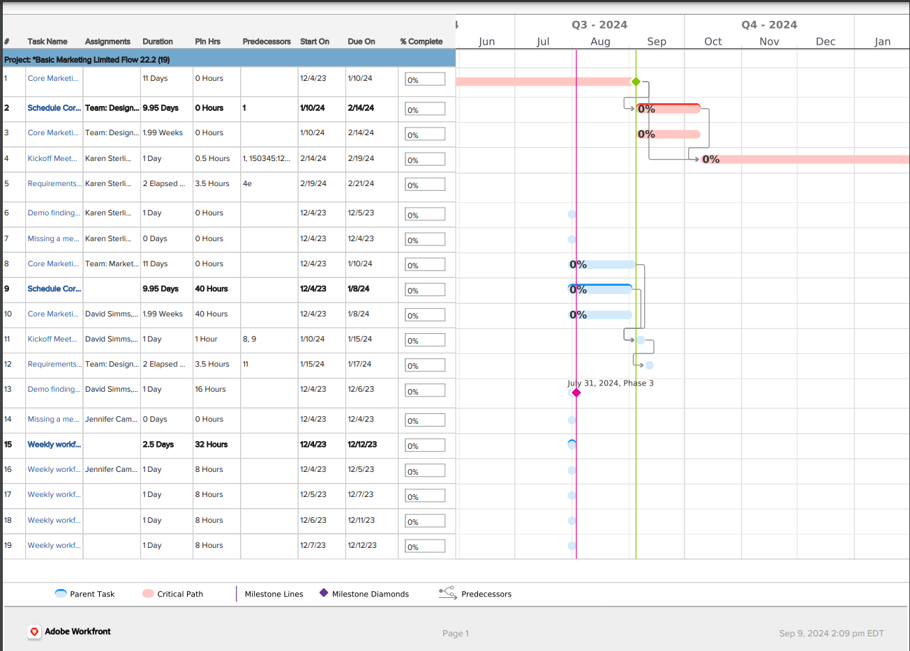

# Exportieren des [!UICONTROL Gantt-Diagramms] nach PDF

<!--Audited: 5/2025-->

Sie können das [!UICONTROL Gantt-Diagramm] in eine PDF exportieren. Danach können Sie sie ausdrucken oder an eine E-Mail anhängen, um sie für andere Benutzer freizugeben.

## Zugriffsanforderungen

+++ Erweitern Sie , um die Zugriffsanforderungen für die -Funktion in diesem Artikel anzuzeigen.

<table style="table-layout:auto"> 
 <col> 
 <col> 
 <tbody> 
  <tr> 
   <td role="rowheader">[!UICONTROL Adobe Workfront] Plan</td> 
   <td> 
Beliebig 
 </td> 
  </tr> 
  <tr> 
   <td role="rowheader">[!UICONTROL Adobe Workfront] Lizenz</td> 
   <td> 
Neu:[!UICONTROL light] oder höher

   
Aktuell:[!UICONTROL Überprüfen] oder höher
 </td> 
  </tr> 
  <tr> 
   <td role="rowheader">Konfigurationen der Zugriffsebene</td> 
   <td> 
Zugriff auf Projekte und Aufgaben in [!UICONTROL View] oder höher
 </td> 
  </tr> 
  <tr> 
   <td role="rowheader">Objektberechtigungen</td> 
   <td> 
[!UICONTROL View] oder höher Zugriff auf das Projekt
 </td> 
  </tr> 
 </tbody> 
</table>

Weitere Informationen zu den Informationen in dieser Tabelle finden Sie unter [Zugriffsanforderungen in der Dokumentation zu Workfront](/help/quicksilver/administration-and-setup/add-users/access-levels-and-object-permissions/access-level-requirements-in-documentation.md).

+++

## Exportieren Sie das [!UICONTROL Gantt-Diagramm]

1. Greifen Sie auf das [!UICONTROL Gantt]Diagramm) zu, das Sie nach PDF exportieren möchten, wie in [Erste Schritte mit dem [!UICONTROL Gantt-Diagramm]](../../../manage-work/gantt-chart/use-the-gantt-chart/get-started-with-gantt.md) beschrieben.
1. Konfigurieren Sie das [!UICONTROL Gantt-]), um die entsprechenden Informationen anzuzeigen, die Sie exportieren möchten.

   >[!NOTE]
   >
   >Wenn Sie das [!UICONTROL Gantt-]) aus einer Projektliste exportieren, enthält die PDF-Datei nur die Projekte in der Liste, nicht die Aufgaben für jedes Projekt. Wenn Sie eine Liste von Aufgaben exportieren möchten, können Sie dies über das Projekt tun, dem sie zugeordnet sind, oder indem Sie einen Aufgabenbericht erstellen und die Ergebnisse des Berichts in der [!UICONTROL Gantt-Ansicht] anzeigen.

   Konfigurieren Sie eine der folgenden Informationen:

   * Klicken Sie auf **Filter**, **Ansicht** und **Gruppierung** über dem [!UICONTROL Gantt-Diagramm] und fügen Sie den vorhandenen Filter, die Ansicht oder die Gruppierung hinzu oder bearbeiten Sie sie, die auf die Liste der Elemente im [!UICONTROL Gantt-Diagramm].

     Alle in der Listenansicht ausgewählten Filter und Gruppierungen werden beim Anzeigen des [!UICONTROL Gantt-Diagramms“ ]. Ansichten werden im exportierten [!UICONTROL Gantt-Diagramm] nur innerhalb der Liste angezeigt, die neben dem [!UICONTROL Gantt-Diagramm] auf der ersten Seite angezeigt wird. Ansichten werden nicht im [!UICONTROL Gantt-Diagramm] selbst angezeigt.

     >[!TIP]
     >
     >Um mehr Platz für das [!UICONTROL Gantt-Diagramm] zu lassen, wenden Sie eine Ansicht an, die so wenige Spalten wie möglich enthält.

   * Wählen Sie die **Zu voraussichtlichen Terminen wechseln** aus, um voraussichtliche anstatt geplante Termine anzuzeigen. Standardmäßig werden geplante Termine angezeigt.

   * Klicken Sie auf **Einstellungen**-Symbol  in der oberen rechten Ecke des Gantt-Diagramms und wählen Sie die Informationen aus, die Sie anzeigen möchten. Nach der Auswahl werden diese Informationen in die exportierte Gantt-PDF-Datei aufgenommen.

     Wählen Sie aus den folgenden Optionen aus:

      * Tatsächliche Termine
      * Arbeitsaufträge
      * Ausgangsbasis
      * Verpflichtungsdatum
      * % abgeschlossen
      * Kritischer Pfad
      * Meilenstein-Diamanten
      * Meilenstein-Linien
      * Vorgänger
      * Fortschrittsstatus
      * (Bedingt) Geplante Termine
      * (Bedingt) Voraussichtliche Termine

     Weitere Informationen finden Sie unter   [Anzeige von Informationen im [!UICONTROL Gantt-Diagramm]](../../../manage-work/gantt-chart/use-the-gantt-chart/configure-info-on-gantt-chart.md) konfigurieren

     >[!NOTE]
     >
     > Zuweisungen werden nicht im [!UICONTROL Gantt-Diagramm] angezeigt, wenn das [!UICONTROL Gantt-Diagramm] nach PDF exportiert wird. Nach dem Export werden Zuweisungen nur in der Listenansicht angezeigt.

   * Der Zeitraum, der auf dem [!UICONTROL Gantt-Diagramm“ angezeigt ]. Wie dies in der Exportdatei angezeigt wird, hängt davon ab, ob Sie **[!UICONTROL Was ich sehe]** oder **[!UICONTROL Mehrere Seiten]** in einem späteren Schritt auswählen.

     Weitere Informationen finden Sie unter [Informationen im [!UICONTROL Gantt-Diagramm]](../../../manage-work/gantt-chart/use-the-gantt-chart/view-info-in-gantt.md).

1. (Optional) Um nur bestimmte Aufgaben in die exportierte PDF aufzunehmen, wählen Sie die Aufgaben aus, die Sie einbeziehen möchten. Wenn Sie keine Aufgaben auswählen, werden alle Aufgaben in die exportierte PDF aufgenommen.

   Wenn Sie beispielsweise das [!UICONTROL Gantt-Diagramm] für ein Projekt mit 50 Vorgängen anzeigen, aber nur 10 Vorgänge auf dem exportierten [!UICONTROL Gantt-Diagramm] anzeigen möchten, wählen Sie die 10 Vorgänge aus, die angezeigt werden sollen.

1. Klicken Sie auf das Druckersymbol  in der rechten oberen Ecke des Gantt-Diagramms.
Das **[!UICONTROL In PDF exportieren]** wird angezeigt.

   

1. Wählen **im Abschnitt &quot;**&quot; eine der folgenden Optionen aus, um anzugeben, ob Sie nur das exportieren möchten, was Sie sehen, oder das gesamte [!UICONTROL Gantt-Diagramm]:

   * **[!UICONTROL Was ich sehe]:** Exportiert alle Aufgaben (einschließlich aller Unteraufgaben), die vor dem Exportieren von bis zu 500 Elementen auf dem Bildschirm angezeigt werden. (Dies wird nicht im Abschnitt **[!UICONTROL Vorschau]** angezeigt; der Abschnitt **Vorschau** enthält nur Beispieldaten.)

     Teilaufgaben werden auch dann in die exportierte PDF aufgenommen, wenn die übergeordnete Aufgabe reduziert ist und die Teilaufgaben nicht sichtbar sind. Um nur übergeordnete Aufgaben einzubeziehen, wählen Sie die einzubeziehenden übergeordneten Aufgaben aus und lassen Sie alle Unteraufgaben deaktiviert.

     >[!TIP]
     >
     >Sie können das Zoom- oder Reglerwerkzeug verwenden, um nur einen Teil des [!UICONTROL Gantt-Diagramms] anzuzeigen, wie in [Anzeigen von Informationen im [!UICONTROL Gantt-Diagramm]](../../../manage-work/gantt-chart/use-the-gantt-chart/view-info-in-gantt.md) beschrieben. Wählen Sie eine detailliertere Option aus, um mehr zu exportierende Seiten anzuzeigen, oder wählen Sie eine weniger detailliertere Option aus, um weniger zu exportierende Seiten anzuzeigen.

   * **[!UICONTROL Mehrere Seiten]:** Exportiert das gesamte [!UICONTROL Gantt-] (bis zu 500 Elemente), einschließlich der Elemente, die auf dem aktuellen Bildschirm nicht sichtbar sind.

     >[!NOTE]
     >
     >* Wenn Sie ein [!UICONTROL Gantt-Diagramm] mit mehr als 500 Elementen exportieren müssen, wenden Sie vor dem Anzeigen des [!UICONTROL Gantt-Diagramms] einen Filter auf die Liste an, sodass weniger als 500 Elemente oder 250 Seiten angezeigt werden. Informationen zum Anwenden eines Filters finden Sie unter [Filterübersicht](../../../reports-and-dashboards/reports/reporting-elements/filters-overview.md).
     >
     >
     >* Unter folgenden Umständen können Sie nicht das gesamte Gantt-Diagramm exportieren:
     >   
     >   * Wenn er sich über mehr als 250 Seiten erstreckt.
     >   * Wenn es mehr als 500 Elemente enthält.

1. Wenn der PDF nach dem Export in PDF gedruckt wird, wählen Sie die Papiergröße, auf die Sie drucken möchten, im Dropdown-Menü **[!UICONTROL Seitengröße]** aus.
Sie können aus den folgenden Optionen auswählen:

   * **[!UICONTROL Brief]**
   * **[!UICONTROL Legal]**
   * **[!UICONTROL Sachkonto]**
   * **[!UICONTROL A1]**
   * **[!UICONTROL A2]**
   * **[!UICONTROL A3]** (nur für einige Sprachen verfügbar)
   * **[!UICONTROL A4]**
1. Wählen **[!UICONTROL im Abschnitt]** aus, ob der PDF im Querformat oder im Hochformat exportiert werden soll.
1. Wählen Sie **[!UICONTROL Legende anzeigen]** aus, wenn Sie die Legende in Ihre exportierte PDF aufnehmen möchten.
1. Klicken Sie **[!UICONTROL Exportieren]**. Die PDF-Datei wird erstellt und auf Ihren Computer heruntergeladen.

   In der Legende am unteren Rand der exportierten Datei werden nur die Optionen erläutert, die Sie in Ihrem [!UICONTROL Gantt-Diagramm] aktiviert haben und die in Ihrer Aufgabenliste verfügbar sind. Beispielsweise werden Meilensteine nur dann in der Legende angezeigt, wenn mit einem Meilenstein mindestens eine Aufgabe verknüpft ist.

   
