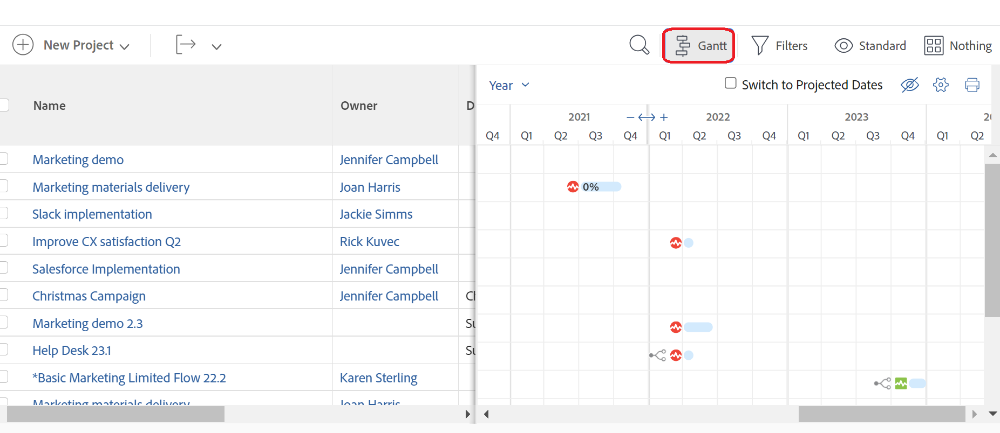

# Erste Schritte mit dem [!UICONTROL Gantt-Diagramm]

<!-- Audited: 01/2024 -->

Die Gantt-Diagramme in Adobe Workfront bieten eine visuelle Darstellung der Zeitleiste einer Liste von Aufgaben oder Projekten.

In [!DNL Adobe Workfront] gibt es zwei [!UICONTROL Gantt Charts] mit ähnlichen Funktionen:

* **Die Aufgabenliste [!UICONTROL Gantt-Diagramm]**: zeigt Informationen über Aufgaben und deren Timeline auf Projektebene an. Ein ähnliches [!UICONTROL Gantt-Diagramm] zeigt Informationen zu Vorlagenaufgaben auf Vorlagenebene an.
* **Die Projektliste [!UICONTROL Gantt-Diagramm]**: zeigt Informationen über Projekte und deren Timeline an.

Obwohl sie ähnlich aussehen und sich anfühlen, ist die Funktionalität jedes einzelnen unterschiedlich.

## Überlegungen zum Gantt-Diagramm

* Sie können Informationen im folgenden [!UICONTROL Gantt-Diagramm] bearbeiten:
   * Aufgabenliste
* Sie können Informationen in den folgenden [!UICONTROL Gantt Charts] nicht bearbeiten:
   * Eine Aufgabenliste für Vorlagen
   * Eine Projektliste
* Für eine Liste von Vorlagen ist keine [!UICONTROL Gantt-Diagramm] -Option verfügbar.
* Sie können konfigurieren, welche Informationen sowohl in der Aufgabenliste [!UICONTROL Gantt-Diagramm] als auch in der Projektliste [!UICONTROL Gantt-Diagramm] angezeigt werden.
* Sie können die Farben oder Schriftarten, in denen die [!UICONTROL Gantt-Diagramm]-Informationen angezeigt werden, nicht konfigurieren.
* Wenn Informationen aus Aufgaben aktualisiert werden, werden sie automatisch sowohl in der Aufgabenliste [!UICONTROL Gantt-Diagramm] als auch in der Projektliste [!UICONTROL Gantt-Diagramm] angezeigt.
* Wenn Informationen aus Vorlagenaufgaben aktualisiert werden, werden sie automatisch in der Vorlagenaufgabenliste [!UICONTROL Gantt-Diagramm] angezeigt.

## Zugriff auf das [!UICONTROL Gantt-Diagramm]

Die [!UICONTROL Gantt]-Diagramme in [!DNL Workfront] bieten eine visuelle Darstellung einer Liste von Aufgaben oder Projekten.

Sie können die Aufgabenliste [!UICONTROL Gantt-Diagramm] direkt aus der Aufgabenliste eines Projekts oder aus einem Aufgabenbericht anzeigen.

Sie können die Projektliste [!UICONTROL Gantt-Diagramm] in einer Projektliste oder in einem Projektbericht anzeigen.

### Aufgabenliste [!UICONTROL Gantt-Diagramm] {#task-list-gantt-chart}

<!--The task list [!UICONTROL Gantt Chart] is accessible in the following areas:

* In a Project

   * [!UICONTROL Tasks] section
   * [!UICONTROL Subtasks] section of a task

* In a [!UICONTROL Template]

* In a [!UICONTROL Task] report-->

So greifen Sie auf die Aufgabenliste [!UICONTROL Gantt Chart] eines Projekts oder einer Vorlage zu:

1. Markieren Sie einen der folgenden Bereiche:

   * Ein Projekt und klicken Sie dann im linken Bereich auf [!UICONTROL **Aufgaben**] .
   * Eine Vorlage und klicken Sie dann im linken Bereich auf [!UICONTROL **Vorlagenaufgaben**] .
   * Eine Aufgabe oder Vorlagenaufgabe und klicken Sie dann im linken Bereich auf [!UICONTROL **Unteraufgaben**] .
   * Ein Aufgabenbericht

1. Klicken Sie oben in der Aufgabenliste auf das Symbol [!UICONTROL **Gantt**]  .

   

   Die Aufgabenliste [!UICONTROL Gantt-Diagramm] wird rechts neben der Aufgabenliste geöffnet.

1. Um zu konfigurieren, welche Informationen im Aufgabendiagramm [!UICONTROL Gantt] angezeigt werden sollen, klicken Sie auf das Symbol [!UICONTROL **Einstellungen**] und aktivieren Sie dann eine der folgenden Optionen:

   * [!UICONTROL Tatsächliche Datumswerte]
   * [!UICONTROL Arbeitsaufträge]
   * [!UICONTROL Grundlinie]
   * [!UICONTROL Datum der Übermittlung]
   * [!UICONTROL % Complete]
   * [!UICONTROL Kritischer Pfad]
   * [!UICONTROL Milestone Diamonds]
   * [!UICONTROL Milestone-Linien]
   * [!UICONTROL Vorgänger]
   * [!UICONTROL Fortschrittsstatus]
   * [!UICONTROL Vorgeschlagene Datumswerte]

1. Beginnen Sie mit der Bearbeitung der Aufgaben, wie in den folgenden Artikeln beschrieben:

   * [Konfigurieren der Anzeige von Informationen im Gantt-Diagramm](../use-the-gantt-chart/configure-info-on-gantt-chart.md)
   * [Aktualisieren von Informationen in der Aufgabenliste Gantt-Diagramm](../use-the-gantt-chart/update-info-task-list-gantt.md)

### Projektliste [!UICONTROL Gantt-Diagramm] {#project-list-gantt-chart}

<!--The project list [!UICONTROL Gantt Chart] is accessible in the following areas:

* In the [!UICONTROL Projects] area
* In the [!UICONTROL Projects] section of a [!UICONTROL Portfolio]
* In the [!UICONTROL Projects] section of a [!UICONTROL Program]
* In a [!UICONTROL Project] report-->

So greifen Sie auf die Projektliste [!UICONTROL Gantt Chart] zu:

1. Markieren Sie einen der folgenden Bereiche:

   * Der Bereich [!UICONTROL **Projekte**]
   * Der Abschnitt [!UICONTROL **Projekte**] eines [!UICONTROL Portfolios]
   * Der Abschnitt [!UICONTROL **Projekte**] eines [!UICONTROL Programms]
   * Bericht [!UICONTROL **Projekt**]

1. Klicken Sie oben in der Projektliste auf das Symbol [!UICONTROL **Gantt**] .

   

   Die Projektliste [!UICONTROL Gantt-Diagramm] wird geöffnet.

1. Um zu konfigurieren, welche Informationen im Diagramm [!UICONTROL Gantt] des Projekts angezeigt werden sollen, klicken Sie auf das Symbol [!UICONTROL **Einstellungen**] und aktivieren Sie dann eine der folgenden Optionen:

   * [!UICONTROL Tatsächliche Datumswerte]
   * [!UICONTROL % Complete]
   * [!UICONTROL Milestone Diamonds]
   * [!UICONTROL Milestone-Linien]
   * [!UICONTROL Vorgänger]
   * [!UICONTROL Fortschrittsstatus]
   * [!UICONTROL Vorgeschlagene Datumswerte]
