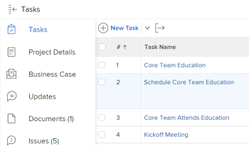
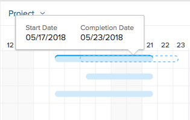

# Informationen in der Aufgabenliste [!UICONTROL Gantt-Diagramm] aktualisieren

Die Aufgabenliste [!UICONTROL Gantt-Diagramm] enthält Details zu Aufgaben, die sich auf ein Projekt oder eine Vorlage beziehen.

In einer Vorlage spiegelt die Aufgabenliste [!UICONTROL Gantt-Diagramm] die in der Aufgabenliste der Vorlage auf Aufgabenebene vorgenommenen Aktualisierungen wider. Das mit einer Vorlage verknüpfte [!UICONTROL Gantt-Diagramm] kann nicht bearbeitet werden.

In einem Projekt können Sie Aufgabeninformationen direkt in der Aufgabenliste [!UICONTROL Gantt-Diagramm] aktualisieren.

In diesem Artikel werden die folgenden Aktionen beschrieben, die Sie direkt in der Aufgabenliste [!UICONTROL Gantt-Diagramm] ausführen können:

* Ändern der Aufgabendauer
* Erstellen oder Entfernen von Vorgängerbeziehungen
* Beginn und Ende von Aufgaben ändern
* Prozentsatz aktualisieren abgeschlossen
* Level-Projektressourcen

## Zugriffsanforderungen

Sie müssen über Folgendes verfügen, um die Schritte in diesem Artikel zu befolgen:

<table style="table-layout:auto"> 
 <col> 
 <col> 
 <tbody> 
  <tr> 
   <td role="rowheader">[!DNL Adobe Workfront] plan*</td> 
   <td> 
Alle 
 </td> 
  </tr> 
  <tr> 
   <td role="rowheader">[!DNL Adobe Workfront] license*</td> 
   <td> 
[!UICONTROL Plan] 
 </td> 
  </tr> 
  <tr> 
   <td role="rowheader">Konfigurationen auf Zugriffsebene*</td> 
   <td> 
[!UICONTROL Zugriff auf Projekte und Aufgaben bearbeiten
 
Hinweis: Wenn Sie immer noch keinen Zugriff haben, fragen Sie Ihren [!DNL Workfront] -Administrator, ob er zusätzliche Zugriffsbeschränkungen für Ihre Zugriffsebene festlegt. Informationen dazu, wie ein [!DNL Workfront] -Administrator Ihre Zugriffsebene ändern kann, finden Sie unter <a href="../../../administration-and-setup/add-users/configure-and-grant-access/create-modify-access-levels.md" class="MCXref xref">Benutzerdefinierte Zugriffsebenen erstellen oder ändern</a>.
 </td> 
  </tr> 
  <tr> 
   <td role="rowheader">Objektberechtigungen</td> 
   <td> 
[!UICONTROL] Zugriff auf das Projekt und die Aufgaben verwalten 
 
Weitere Informationen zum Anfordern von zusätzlichem Zugriff finden Sie unter <a href="../../../workfront-basics/grant-and-request-access-to-objects/request-access.md" class="MCXref xref">Anfordern des Zugriffs auf Objekte </a>.
 </td> 
  </tr> 
 </tbody> 
</table>

&#42;Wenden Sie sich an Ihren [!DNL Workfront] -Administrator, um zu erfahren, welchen Plan, welchen Lizenztyp oder welchen Zugriff Sie haben.

## Ändern der Aufgabendauer

1. Wechseln Sie zu dem Projekt, das Sie ändern möchten.
1. Klicken Sie im linken Bereich auf **[!UICONTROL Aufgaben]** .

   

1. Klicken Sie auf das Symbol **[!UICONTROL Gantt chart]** .

   

   Alle Änderungen werden automatisch gespeichert, wenn die Option **[!UICONTROL Autosave]** aktiviert ist. Sie ist standardmäßig aktiviert.

1. (Optional) Klicken Sie auf das Symbol **[!UICONTROL Planmodus]** und wählen Sie **[!UICONTROL Manuelles Speichern von Standard]** oder **[!UICONTROL Timeline-Planung]** aus, um Ihre Änderungen manuell zu speichern.

   

1. Bewegen Sie den Mauszeiger über die Zeitleiste einer Aufgabe und ziehen Sie die Zeitleistenanzeige an ein anderes Datum.
1. Legen Sie den Indikator ab, wenn Sie das richtige neue Abschlussdatum für die Aufgabe erreicht haben.
1. (Optional und bedingt) Wenn Sie ausgewählt haben, Ihre Änderungen manuell zu speichern, klicken Sie auf die Symbole **[!UICONTROL Rückgängig]** oder &#x200B;**[!UICONTROL Wiederholen]** , wenn Sie eine der Änderungen abbrechen oder duplizieren möchten.

   >[!TIP]
   >
   >Sie können die folgenden Tastaturbefehle verwenden, um Änderungen am Gantt-Diagramm rückgängig zu machen oder wiederherzustellen:
   >
   >   
   >   
   >   * [!DNL Mac]: Verwenden Sie [!UICONTROL Befehl + Z], um das Rückgängigmachen rückgängig zu machen, und [!UICONTROL Befehl + Umschalt + Z], um es erneut auszuführen.
   >   * [!DNL Windows]: Verwenden Sie [!UICONTROL Strg + Z], um das Rückgängigmachen rückgängig zu machen, und [!UICONTROL Strg + Y], um es erneut durchzuführen.
   >   
   >

1. Klicken Sie oben rechts im [!UICONTROL Gantt-Diagramm] auf **[!UICONTROL Speichern]**.

## Erstellen oder Entfernen von Vorgängerbeziehungen

1. Wechseln Sie zu dem Projekt, das Sie ändern möchten.
1. Klicken Sie im Bereich **[!UICONTROL Aufgaben]** auf das Symbol **[!UICONTROL Gantt-Diagramm]**.

   Die Option **[!UICONTROL Automatisches Speichern]** ist standardmäßig ausgewählt. In diesem Fall werden alle Änderungen automatisch gespeichert.

   

1. (Optional) Klicken Sie auf das Symbol **[!UICONTROL Planmodus]** und wählen Sie **[!UICONTROL Manuelles Speichern von Standard]** oder **[!UICONTROL Timeline-Planung]** aus, um Ihre Änderungen manuell zu speichern.

   

1. Um eine Vorgängerbeziehung zu erstellen, klicken Sie auf den Startpunkt einer Aufgabe und ziehen Sie sie an den Endpunkt der Aufgabe.
1. Um eine Vorgängerbeziehung zu löschen, klicken Sie auf eine Vorgängerzeile, die zwei Aufgaben miteinander verbindet, um sie auszuwählen, und drücken Sie dann **[!UICONTROL Löschen]** auf Ihrer Tastatur.\
   

1. (Optional und bedingt) Wenn Sie Ihre Änderungen manuell speichern möchten, klicken Sie auf die Symbole **[!UICONTROL Rückgängig]** oder &#x200B;**[!UICONTROL Wiederholen]** , wenn Sie eine der Änderungen abbrechen oder duplizieren möchten.

   >[!TIP]
   >
   >Sie können die folgenden Tastaturbefehle verwenden, um Änderungen am Gantt-Diagramm rückgängig zu machen oder wiederherzustellen:
   >
   >   
   >   
   >   * [!DNL Mac]: Verwenden Sie [!UICONTROL Befehl + Z], um das Rückgängigmachen rückgängig zu machen, und [!UICONTROL Befehl + Umschalt + Z], um es erneut auszuführen.
   >   * [!DNL Windows]: [!UICONTROL Verwenden Sie Strg + Z], um das Rückgängigmachen rückgängig zu machen, und [!UICONTROL Strg + Y], um es wiederherzustellen.
   >   
   >

1. Klicken Sie auf **[!UICONTROL Speichern]** .

## Beginn und Ende von Aufgaben ändern

1. Wechseln Sie zu dem Projekt, das Sie ändern möchten.
1. Klicken Sie im Bereich **[!UICONTROL Aufgaben]** auf das Symbol **[!UICONTROL Gantt-Diagramm]**.

   Alle Änderungen werden automatisch gespeichert, wenn die Option **[!UICONTROL Autosave]** aktiviert ist. Sie ist standardmäßig aktiviert.

   

1. (Optional) Klicken Sie auf das Symbol **[!UICONTROL Planmodus]** und wählen Sie **[!UICONTROL Manuelles Speichern von Standard]** oder **[!UICONTROL Timeline-Planung]** aus, um Ihre Änderungen manuell zu speichern.

   

1. Bewegen Sie den Mauszeiger über den Mittelpunkt der Aufgabe und suchen Sie den Pfeil mit mehreren Richtungen.
1. Klicken Sie auf die Aufgabe und ziehen Sie sie an das gewünschte Datum.

   

1. Wenn Sie das Aufgabendatum in einer Weise ändern, die sich auf die Aufgabenbegrenzung auswirkt, klicken Sie auf **[!UICONTROL Annehmen]** , um die Änderung der Aufgabenbegrenzung zu bestätigen.

   >[!NOTE]
   >
   >Wenn die Aufgabe eine der folgenden Einschränkungen aufweist, aktualisiert das System die [!UICONTROL Aufgabenbegrenzung] auf [!UICONTROL Anfang Nr. früher] als , wenn das Projekt vom [!UICONTROL Startdatum] geplant ist, oder auf [!UICONTROL Beenden nicht später als], wenn das Projekt ab dem [!UICONTROL Abschlussdatum] geplant ist:
   >
   >   
   >   
   >   * [!UICONTROL Sobald wie möglich]
   >   * [!UICONTROL So spät wie möglich]
   >   * [!UICONTROL früheste verfügbare Zeit]
   >   * [!UICONTROL Neueste verfügbare Zeit]
   >   
   >   
   >In einigen Fällen können die Vorgängerbeziehungen verhindern, dass die Aufgaben früher gestartet werden, und die Verschiebung der Aufgabe ist nicht zulässig.

1. (Optional und bedingt) Wenn Sie ausgewählt haben, Ihre Änderungen manuell zu speichern, klicken Sie auf die Symbole **[!UICONTROL Rückgängig]** oder &#x200B;**[!UICONTROL Wiederholen]** , wenn Sie eine der Änderungen abbrechen oder duplizieren möchten.

   >[!TIP]
   >
   >Sie können die folgenden Tastaturbefehle verwenden, um Änderungen am [!UICONTROL Gantt-Diagramm] rückgängig zu machen oder wiederherzustellen:
   >
   >   
   >   
   >   * [!DNL Mac]: Verwenden Sie [!UICONTROL Befehl + Z], um das Rückgängigmachen rückgängig zu machen, und [!UICONTROL Befehl + Umschalt + Z], um es erneut auszuführen.
   >   * [!DNL Windows]: Verwenden Sie [!UICONTROL Strg + Z], um das Rückgängigmachen rückgängig zu machen, und [!UICONTROL Strg + Y], um es erneut durchzuführen.
   >   
   >

1. Klicken Sie auf **[!UICONTROL Speichern]**.

## Prozentsatz aktualisieren abgeschlossen

1. Wechseln Sie zu dem Projekt, das Sie ändern möchten.
1. Klicken Sie im Bereich **[!UICONTROL Aufgaben]** auf das Symbol **[!UICONTROL Gantt-Diagramm]**.

   

   Alle Änderungen werden automatisch gespeichert, wenn die Option **[!UICONTROL Autosave]** aktiviert ist. Sie ist standardmäßig aktiviert.

1. (Optional) Klicken Sie auf das Symbol **[!UICONTROL Planmodus]** und wählen Sie **[!UICONTROL Manuelles Speichern von Standard]** oder **[!UICONTROL Timeline-Planung]** aus, um Ihre Änderungen manuell zu speichern.
1. Doppelklicken Sie auf die Prozentzahl innerhalb der Aufgabe und geben Sie die Nummer ein.

   >[!IMPORTANT]
   >
   >Sie müssen [!UICONTROL % Complete] im Dialogfeld [!UICONTROL Options] ausgewählt haben, um den Prozentsatz abzuschließen. Klicken Sie dazu auf das Symbol **[!UICONTROL Optionen]** und wählen Sie **[!UICONTROL % Complete]** aus.
   >
   >
   >   >
   >

1. (Optional und bedingt) Wenn Sie Ihre Änderungen manuell speichern möchten, klicken Sie auf die Symbole **[!UICONTROL Rückgängig]** oder &#x200B;**[!UICONTROL Wiederholen]** , wenn Sie eine der Änderungen abbrechen oder duplizieren möchten.

   >[!TIP]
   >
   >Sie können die folgenden Tastaturbefehle verwenden, um Änderungen am [!UICONTROL Gantt-Diagramm] rückgängig zu machen oder wiederherzustellen:
   >
   >   
   >   
   >   * [!DNL Mac]: Verwenden Sie [!UICONTROL Befehl + Z], um das Rückgängigmachen rückgängig zu machen, und [!UICONTROL Befehl + Umschalt + Z], um es erneut auszuführen.
   >   * [!DNL Windows]: Verwenden Sie [!UICONTROL Strg + Z], um das Rückgängigmachen rückgängig zu machen, und [!UICONTROL Strg + Y], um es erneut durchzuführen.
   >   
   >

1. Klicken Sie oben rechts im [!UICONTROL Gantt-Diagramm] auf **[!UICONTROL Speichern]**.

## Level-Projektressourcen

Sie können die Aufgabenliste [!UICONTROL Gantt-Diagramm] verwenden, um Ihre Ressourcen zu unterteilen.

Informationen zum Leveln von Ressourcen im [!UICONTROL Gantt-Diagramm] finden Sie unter [Level-Ressourcen im [!UICONTROL Gantt-Diagramm]](../../../manage-work/gantt-chart/use-the-gantt-chart/level-resources-in-gantt.md).

<!--

(NOTE:&nbsp;this is drafted because I moved the whole content to the article linked above)

<ol>
<li value="1">Go to the project you want to level.</li>
<li value="2"> 
 In the <strong>Tasks</strong> area, click the <strong>Gantt chart</strong> icon.
 
All changes are saved automatically when the <strong>Autosave</strong> option is enabled. It is enabled by default. 
 </li>
<li value="3">

(Optional) Click the <strong>Plan mode</strong> icon and select <strong>Manual save Standard</strong> or <strong>Timeline Planning</strong> to save your changes manually.
 <note type="tip">
You cannot level resources in the Gantt chart when the Autosave option is enabled.
</note>

  

 </li>
<li value="4"> 
Click the <strong>Level Resources</strong> drop-down menu.
 
  
 </li>
<li value="5">Select one of following options:
<ul>
<li><strong>Level Now</strong>: Applies resource leveling to the selected task.</li>
<li>
<strong>Clear Leveling</strong>: Removes all resource leveling from the selected task.
</li>
</ul><note type="note">
Your resources might be overallocated if they are assigned to multiple tasks which occur during the same time frame.
</note></li>
<li value="6"> 
(Optional and conditional) If you have disabled the Autosave option, click the <strong>Undo</strong> or<strong>Redo</strong> icons if you want to cancel or duplicate any of the changes. 
 <note type="tip">

You can use the following keyboard shortcuts to undo or redo changes on the Gantt chart:

<ul>
<li>Mac: Use Command + Z to undo and Command + Shift + Z to redo.</li>
<li>Windows: Use Ctrl + Z to undo and Ctrl + Y to redo.</li>
</ul>
</note> </li>
<li value="7">Click <strong>Save</strong> in the upper-right corner of the Gantt chart.</li>
</ol>

-->

<!--
<h2 data-mc-conditions="QuicksilverOrClassic.Draft mode"> </h2>
-->
