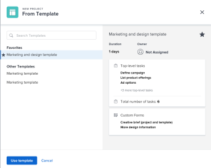
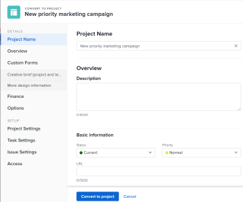

# Konvertieren eines Problems in ein Projekt

<!--Audited: 08/2025-->

Wenn nach dem Senden des Problems weitere Arbeit zum Abschließen des Problems erforderlich ist, können Sie das Problem in ein Projekt konvertieren.

Sie können ein Problem mit in ein Projekt konvertieren, ohne eine Projektvorlage zu verwenden. In diesem Artikel werden beide Möglichkeiten zum Konvertieren von Problemen in Projekte beschrieben.

>[!IMPORTANT]
>
>Um allgemeine Informationen zu Konvertierungsproblemen zu erhalten, empfehlen wir, auch den Artikel [Überblick über Konvertierungsprobleme in Adobe Workfront&quot; ](../../../manage-work/issues/convert-issues/convert-issues.md).

Wenn Sie ein Projekt aus einer Anfrage erstellen, werden einige der Felder im Projekt aus anderen Objekten gefüllt. Weitere Informationen finden Sie im Abschnitt „Standardeinstellungen für neue Projekte“ im Artikel &quot;[ erstellen](../../../manage-work/projects/create-projects/create-project.md).

## Zugriffsanforderungen

+++ Erweitern, um die Zugriffsanforderungen für die in diesem Artikel beschriebene Funktionalität anzuzeigen.

<table style="table-layout:auto"> 
 <col> 
 <col> 
 <tbody> 
  <tr> 
   <td role="rowheader">Adobe Workfront-Paket</td> 
   <td> 
Beliebig
 </td> 
  </tr> 
  <tr> 
   <td role="rowheader">Adobe Workfront-Lizenz</td> 
   <td>
   
Standard
 
    
Abo
 </td> 
  </tr> 
  <tr> 
   <td role="rowheader">Konfigurationen der Zugriffsebene</td> 
   <td> 
Zugriff auf Probleme, Aufgaben und Projekte bearbeiten
 
Zugriff auf Finanzdaten bearbeiten, um Finanzinformationen für eine geplante konvertierte Anfrage zu aktualisieren
 </td> 
  </tr> 
  <tr> 
   <td role="rowheader">Objektberechtigungen</td> 
   <td> 
Anzeigen der Berechtigungen für das Problem
 
Sie erhalten Verwaltungsberechtigungen für das Projekt, nachdem Sie das Problem konvertiert haben
 </td> 
  </tr> 
 </tbody> 
</table>

Weitere Details zu den Informationen in dieser Tabelle finden Sie unter [Zugriffsanforderungen in der Dokumentation zu Workfront](/help/quicksilver/administration-and-setup/add-users/access-levels-and-object-permissions/access-level-requirements-in-documentation.md).

+++

<!--
Old:

<table style="table-layout:auto"> 
 <col> 
 <col> 
 <tbody> 
  <tr> 
   <td role="rowheader">Adobe Workfront plan</td> 
   <td> 
Any
 </td> 
  </tr> 
  <tr> 
   <td role="rowheader">Adobe Workfront license</td> 
   <td>
   
New: Standard 
 
    
Current: Plan 
 </td> 
  </tr> 
  <tr> 
   <td role="rowheader">Access level configurations*</td> 
   <td> 
Edit access to Issues, Tasks, and Projects
 
Edit access to Financial Data to update financial information for a projected converted from the issue
 </td> 
  </tr> 
  <tr> 
   <td role="rowheader">Object permissions</td> 
   <td> 
View permissions to the issue
 
You obtain Manage permissions to the project after the issue is converted
 </td> 
  </tr> 
 </tbody> 
</table>
-->

## Zu beachten

* Beim Konvertieren eines Problems in ein Projekt gibt es ein Verarbeitungslimit von 5 Minuten. Wenn an das Problem eine große Anzahl von Dokumenten angehängt ist und es nicht konvertiert werden kann, müssen Sie möglicherweise einige der Dokumente entfernen und erneut versuchen.
* Wenn Ihr Unternehmen sowohl den veralteten Workfront- als auch den Adobe-Cloud-Speicher für Dokumente verwendet, treten beim Konvertieren eines Problems in ein Projekt die folgenden Szenarien auf: <!--this info also duplicated in Document management overview for projects and related objects and Convert a task to a project-->
   * Ein Problem mit einem alten Workfront-Speicher erstellt ein veraltetes Workfront-Speicherprojekt.
   * Ein Adobe-Cloud-Speicherproblem erstellt ein Adobe-Cloud-Speicherprojekt.
   * Wenn Sie eine ältere Workfront-Speichervorlage verwenden, um ein Adobe-Cloud-Speicherproblem zu konvertieren, wird ein Adobe-Cloud-Speicherprojekt erstellt.
   * Wenn Sie eine Adobe-Cloud-Speichervorlage verwenden, um ein veraltetes Workfront-Speicherproblem zu konvertieren, wird ein veraltetes Workfront-Speicherprojekt erstellt.

     Weitere Informationen finden Sie unter [Übersicht über das Dokumentenmanagement für Projekte und verwandte Objekte](/help/quicksilver/manage-work/projects/manage-projects/manage-documents-on-projects.md).

## Konvertieren eines Problems in ein Projekt

Sie können ein Problem in ein leeres Projekt konvertieren.

1. Gehen Sie zu einem Projekt und klicken Sie **[!UICONTROL linken Bereich]** Probleme“.
1. Führen Sie in der angezeigten Problemliste einen der folgenden Schritte aus:

   * Um ein Problem in ein leeres Projekt zu konvertieren, klicken Sie auf den Namen des Problems, klicken Sie auf das Menü **[!UICONTROL Mehr]**  rechts neben dem Problemnamen und klicken Sie dann auf **[!UICONTROL In ein leeres Projekt konvertieren]**.

     ODER

     Wählen Sie das Problem in der Problemliste aus, klicken Sie oben in der Liste auf **[!UICONTROL Mehr]** Menü  und klicken Sie dann auf **[!UICONTROL In ein leeres Projekt konvertieren]**.

     >[!IMPORTANT]
     >
     >Die Option In leeres Projekt konvertieren wird nur angezeigt, wenn Ihr System- oder Gruppenadministrator die Einstellung [!UICONTROL Benutzer dürfen Projekte ohne Vorlage erstellen] im Bereich [!UICONTROL Setup] aktiviert hat. Weitere Informationen finden Sie unter [Systemweite Projektvoreinstellungen konfigurieren](../../../administration-and-setup/set-up-workfront/configure-system-defaults/set-project-preferences.md).

     Sie müssen nach dem Konvertieren des Problems manuell Aufgaben zum Projekt hinzufügen oder eine Vorlage an das Projekt anhängen.

     >[!TIP]
     >   
     >* Wenn das Problem mit einer Anfrage-Warteschlange erstellt wurde, übernimmt das neue Projekt die Gruppe der Anfrage-Warteschlange.
     >* Wenn das Problem durch Hinzufügen zum Abschnitt „Probleme“ des Projekts erstellt wurde, übernimmt das neue Projekt die Gruppe des Problemprojekts.

     >[!TIP]
     >
     >Wenn das Problem mit einem Genehmigungsprozess verknüpft ist oder bereits mit einem Lösungsobjekt verknüpft ist, zeigt Workfront oben im Feld In Projekt konvertieren einen Warnhinweis an, der Sie darüber informiert, dass die Genehmigung entfernt oder das Lösungsobjekt während der Konvertierung überschrieben wird. Weitere Informationen finden Sie unter [Übersicht über Konvertierungsprobleme in Adobe Workfront](../../../manage-work/issues/convert-issues/convert-issues.md).

1. (Optional und bedingt) Klicken Sie [!UICONTROL **Optionen**] im linken Bereich und wählen Sie dann eine der verfügbaren Optionen aus:

   * [!UICONTROL **Ursprüngliche Anfrage beibehalten und deren Lösung mit dem Projekt verknüpfen**]

     Wenn diese Option deaktiviert ist, wird das ursprüngliche Problem gelöscht.

     >[!NOTE]
     >
     >Benutzende ohne Zugriff oder Berechtigung zum Löschen von Problemen können das Problem während der Konvertierung nicht löschen, unabhängig vom Status dieser Einstellung. Informationen zu Zugriff und Berechtigungen für Probleme finden Sie unter:
     >
     >* [Zugriff auf Anfragen gewähren](../../../administration-and-setup/add-users/configure-and-grant-access/grant-access-issues.md)
     > 
     >* [Freigeben eines Problems](../../../workfront-basics/grant-and-request-access-to-objects/share-an-issue.md)

   * [!UICONTROL **Erlauben Sie (Benutzername), Zugriff auf dieses Projekt zu erhalten**]

     Wenn die Auswahl aufgehoben wird, hat der [!UICONTROL Primäre Kontakt des Problems] keinen Zugriff auf die neue Aufgabe.

     >[!NOTE]
     >
     >Die hier verfügbaren Optionen hängen davon ab, wie der Workfront-Administrator sie für alle Personen im System oder für Ihre Gruppe konfiguriert hat. Weitere Informationen finden Sie unter [Systemweite Aufgaben- und Problemeinstellungen konfigurieren](../../../administration-and-setup/set-up-workfront/configure-system-defaults/set-task-issue-preferences.md).
     >
     >
     >Oder, falls die Gruppen der obersten Ebene in Ihrer Organisation sie separat konfiguriert haben, hängen die hier verfügbaren Optionen davon ab, welche Gruppe Sie in Schritt 6 für das neue Projekt ausgewählt haben. Weitere Informationen finden Sie unter [Konfigurieren von Aufgaben- und Problemeinstellungen für eine Gruppe](../../../administration-and-setup/manage-groups/create-and-manage-groups/configure-task-issue-preferences-group.md).

1. Klicken Sie [!UICONTROL **Benutzerdefinierte Forms**] und führen Sie einen der folgenden Schritte aus:

   * Überprüfen Sie die benutzerdefinierten Formulare, die an das Problem angehängt sind. Sie werden in das neue Projekt übertragen, wenn sie auch benutzerdefinierte Projektformulare sind.
   * Weitere benutzerdefinierte Formulare hinzufügen
   * Stellen Sie sicher, dass alle erforderlichen Felder über gültige Informationen verfügen.
   * Ordnen Sie die benutzerdefinierten Formulare neu an, indem Sie sie  an die gewünschte Position ziehen.
   * Klicken Sie auf das **x**-Symbol rechts neben jedem Formular, das Sie nicht in das Projekt übertragen möchten. Dadurch wird das Formular aus dem Projekt entfernt.
   * Falls erforderlich, übertragen Sie benutzerdefinierte Formularinformationen von der Anfrage an das Projekt.

     >[!TIP]
     >
     >* Wenn ein benutzerdefiniertes Formular mit mehreren Objekten, das an das Problem angehängt ist, für die Verwendung sowohl bei Problemen als auch bei Projekten konfiguriert ist, werden alle im Formular gespeicherten Informationen beibehalten, wenn Sie die Konvertierung durchführen, wenn die Felder sowohl für das Problem als auch für die benutzerdefinierten Formulare des Projekts vorhanden sind.
     >* Wenn ein benutzerdefiniertes Formular mit mehreren Objekten und einem berechneten Feld sowohl an das Problem als auch an das Projekt angehängt ist, müssen das Problem und das Projekt mit allen Feldern kompatibel sein, auf die in den berechneten benutzerdefinierten Feldern des Formulars verwiesen wird. Bei einer Inkompatibilität werden Sie durch eine Meldung darauf hingewiesen, dass Sie Anpassungen vornehmen müssen. Weitere Informationen finden Sie im Abschnitt „Berechnete benutzerdefinierte Felder in benutzerdefinierten Formularen mit mehreren Objekten“ im Abschnitt [Hinzufügen berechneter Felder zu einem Formular](/help/quicksilver/administration-and-setup/customize-workfront/create-manage-custom-forms/form-designer/design-a-form/add-a-calculated-field.md).

1. Klicken Sie [!UICONTROL **In Projekt konvertieren**].

   >[!TIP]
   >
   >Wenn Sie sich entschieden haben, das ursprüngliche Problem zu löschen, ist das Problem jetzt ein Projekt.
   >   
   >ODER
   >  
   >Wenn Sie sich entschieden haben, die ursprüngliche Anfrage beizubehalten, ist die Anfrage jetzt mit dem neuen Projekt verknüpft und wird nach Abschluss des Projekts abgeschlossen.
   >
   >Informationen in einigen Problemfeldern werden an das Projekt übertragen, wenn Sie sie während der Konvertierung nicht geändert haben.

1. (Optional) Legen Sie alle weiteren Projektdetails &#x200B;Projekteigentümer, Projektdaten) und Aufgaben nach Bedarf fest.
1. Klicken Sie [!UICONTROL **In Projekt konvertieren**].

   Das Problem wird jetzt in ein Projekt konvertiert. Die Projektseite wird angezeigt.

## Konvertieren eines Problems in ein Projekt mithilfe einer Vorlage

Sie können ein Problem mithilfe einer Vorlage in ein Projekt konvertieren.

1. Gehen Sie zu einem Projekt und klicken Sie **[!UICONTROL linken Bereich]** Probleme“.
1. Klicken Sie in der angezeigten Problemliste auf den Namen des Problems, klicken Sie auf das Menü **[!UICONTROL Mehr]**  rechts neben dem Problemnamen, klicken Sie dann auf **Aus Vorlage in Projekt konvertieren** und geben Sie den Namen einer Vorlage in das Feld **Suchvorlage** ein. Klicken Sie dann auf den Namen der Vorlage, wenn sie in der Liste angezeigt wird. Fahren Sie mit Schritt 3 fort.

   >[!TIP]
   >
   >Wenn Sie Vorlagen zu Ihrer Favoritenliste hinzugefügt haben, können Sie den Mauszeiger über das Menü [!UICONTROL **Favoritenvorlagen**] bewegen und auf die gewünschte Vorlage klicken.

   Das Feld Neues Projekt aus Vorlage wird angezeigt.

   

   >[!TIP]
   >
   >* Wenn das Problem mit einem Genehmigungsprozess verknüpft ist oder bereits mit einem Lösungsobjekt verknüpft ist, zeigt Workfront oben im Feld In Projekt konvertieren einen Warnhinweis an, der Sie darüber informiert, dass die Genehmigung entfernt oder das Lösungsobjekt während der Konvertierung überschrieben wird. Weitere Informationen finden Sie unter [Übersicht über Konvertierungsprobleme in Adobe Workfront](../../../manage-work/issues/convert-issues/convert-issues.md).
   >   
   >* Wenn das Problem mit einer Anfrage-Warteschlange erstellt wurde, übernimmt das neue Projekt die Gruppe der Anfrage-Warteschlange.
   >* Wenn das Problem durch Hinzufügen zum Abschnitt „Probleme“ des Projekts erstellt wurde, übernimmt das neue Projekt die Gruppe des Problemprojekts.

1. Überprüfen Sie die Vorlagendetails auf der rechten Seite.

   Die Vorlagendetails umfassen Folgendes:

   * Vorlagendauer
   * Inhaber der Vorlage
   * Die Anzahl der Aufgaben der obersten Ebene, einschließlich der Namen der drei wichtigsten Aufgaben
   * Die Anzahl aller Aufgaben in der Vorlage
   * Die Namen der benutzerdefinierten Vorlagenformulare

1. (Optional) Bewegen Sie den Mauszeiger über den Namen einer Vorlage und klicken Sie auf das **Favoriten**-Symbol , um diese als Favorit für die zukünftige Verwendung zu markieren.

   >[!TIP]
   >
   >Sie können bis zu 40 Workfront-Elemente als Favoriten markieren. Dazu gehören Vorlagen und andere Elemente.

1. Klicken Sie [!UICONTROL **Vorlage verwenden**], um eine Vorlage auszuwählen.

   Das [!UICONTROL In Projekt konvertieren] wird geöffnet.

   

   >[!TIP]
   >
   >* Wenn Sie eine ältere Workfront-Speichervorlage verwenden, um ein Adobe-Cloud-Speicherproblem zu konvertieren, wird ein Adobe-Cloud-Speicherprojekt erstellt.
   >* Wenn Sie eine Adobe-Cloud-Speichervorlage verwenden, um ein veraltetes Workfront-Speicherproblem zu konvertieren, wird ein veraltetes Workfront-Speicherprojekt erstellt.
   >
   >Weitere Informationen finden Sie unter [Übersicht über das Dokumentenmanagement für Projekte und verwandte Objekte](/help/quicksilver/manage-work/projects/manage-projects/manage-documents-on-projects.md).

1. Wenn ein Feld bereits in der Vorlage ausgefüllt ist, wird das Feld im Feld [!UICONTROL In Projekt konvertieren] vorausgefüllt. Sie können die vorausgefüllten Werte bearbeiten, um sie besser an Ihr Projekt anzupassen. Weitere Informationen finden Sie unter [Projekte bearbeiten](../../../manage-work/projects/manage-projects/edit-projects.md).

   >[!TIP]
   >
   >* Ihr System- oder Gruppenadministrator kann Felder im Feld „In Projekt [!UICONTROL &quot; hinzufügen oder entfernen] indem er die Projektdetailinformationen in Ihrer [!UICONTROL Layoutvorlage] aktualisiert.
   >
   >* Um Felder im Abschnitt [!UICONTROL Finanzen] im Feld [!UICONTROL In Projekt konvertieren] zu aktualisieren, benötigen Sie [!UICONTROL Bearbeiten] Zugriff auf [!UICONTROL Finanzdaten] in Ihrer Zugriffsebene. Wenn Sie [!UICONTROL Ansicht] Zugriff auf [!UICONTROL Finanzdaten] in Ihrer Zugriffsebene haben, werden alle Finanzinformationen aus der Vorlage an das neue Projekt übertragen und Sie können sie nicht bearbeiten, während Sie das Problem konvertieren. Weitere Informationen finden Sie unter [Zugriff auf Finanzdaten gewähren](../../../administration-and-setup/add-users/configure-and-grant-access/grant-access-financial.md) und [Vorlage freigeben](../../../workfront-basics/grant-and-request-access-to-objects/share-a-template.md).

1. (Optional und bedingt) Klicken Sie [!UICONTROL **Optionen**] im linken Bereich und wählen Sie dann eine der verfügbaren Optionen aus:

   * [!UICONTROL **Ursprüngliche Anfrage beibehalten und deren Lösung mit dem Projekt verknüpfen**]

     Wenn diese Option deaktiviert ist, wird das ursprüngliche Problem gelöscht.

     >[!NOTE]
     >
     >Benutzende ohne Zugriff oder Berechtigung zum Löschen von Problemen können das Problem während der Konvertierung nicht löschen, unabhängig vom Status dieser Einstellung. Informationen zu Zugriff und Berechtigungen für Probleme finden Sie unter:
     >
     >* [Zugriff auf Anfragen gewähren](../../../administration-and-setup/add-users/configure-and-grant-access/grant-access-issues.md)
     > 
     >* [Freigeben eines Problems](../../../workfront-basics/grant-and-request-access-to-objects/share-an-issue.md)

   * [!UICONTROL **Erlauben Sie (Benutzername), Zugriff auf dieses Projekt zu erhalten**]

     Wenn die Auswahl aufgehoben wird, hat der [!UICONTROL Primäre Kontakt des Problems] keinen Zugriff auf die neue Aufgabe.

     >[!NOTE]
     >
     >Die hier verfügbaren Optionen hängen davon ab, wie der Workfront-Administrator sie für alle Personen im System oder für Ihre Gruppe konfiguriert hat. Weitere Informationen finden Sie unter [Systemweite Aufgaben- und Problemeinstellungen konfigurieren](../../../administration-and-setup/set-up-workfront/configure-system-defaults/set-task-issue-preferences.md).
     >
     >
     >Oder, falls die Gruppen der obersten Ebene in Ihrer Organisation sie separat konfiguriert haben, hängen die hier verfügbaren Optionen davon ab, welche Gruppe Sie in Schritt 6 für das neue Projekt ausgewählt haben. Weitere Informationen finden Sie unter [Konfigurieren von Aufgaben- und Problemeinstellungen für eine Gruppe](../../../administration-and-setup/manage-groups/create-and-manage-groups/configure-task-issue-preferences-group.md).

1. Klicken Sie [!UICONTROL **Benutzerdefinierte Forms**] und führen Sie einen der folgenden Schritte aus:

   * Überprüfen Sie die benutzerdefinierten Formulare, die an die Vorlage angehängt sind. Sie werden auf das neue Projekt übertragen.
   * Überprüfen Sie die benutzerdefinierten Formulare, die an das Problem angehängt sind. Sie werden auf das Projekt übertragen, wenn sie ebenfalls Projekteformulare sind.
   * Stellen Sie sicher, dass alle erforderlichen Felder über gültige Informationen verfügen.
   * Ordnen Sie die benutzerdefinierten Formulare neu an, indem Sie sie  an die gewünschte Position ziehen.
   * Klicken Sie auf das **x**-Symbol rechts neben jedem Formular, das Sie nicht in das Projekt übertragen möchten.
   * Falls erforderlich, übertragen Sie benutzerdefinierte Formularinformationen von der Anfrage an das Projekt.

     >[!TIP]
     >
     >* Wenn ein benutzerdefiniertes Formular mit mehreren Objekten, das an das Problem angehängt ist, für die Verwendung sowohl bei Problemen als auch bei Projekten konfiguriert ist, werden alle im Formular gespeicherten Informationen beibehalten, wenn Sie die Konvertierung durchführen, wenn die Felder sowohl für das Problem als auch für die benutzerdefinierten Formulare des Projekts vorhanden sind.
     >* Wenn ein benutzerdefiniertes Formular mit mehreren Objekten und einem berechneten Feld sowohl an das Problem als auch an das Projekt angehängt ist, müssen das Problem und das Projekt mit allen Feldern kompatibel sein, auf die in den berechneten benutzerdefinierten Feldern des Formulars verwiesen wird. Bei einer Inkompatibilität werden Sie durch eine Meldung darauf hingewiesen, dass Sie Anpassungen vornehmen müssen. Weitere Informationen finden Sie unter [Hinzufügen berechneter Felder zu einem Formular](/help/quicksilver/administration-and-setup/customize-workfront/create-manage-custom-forms/form-designer/design-a-form/add-a-calculated-field.md).
     >* Wenn ein benutzerdefiniertes Formular, das an die Vorlage angehängt ist, ein benutzerdefiniertes Feld enthält, das sich auch in einem benutzerdefinierten Formular befindet, das an das Problem angehängt ist, wird der Feldwert aus dem Problem für das neue Projekt verwendet. Wenn das benutzerdefinierte Feld bei dem Problem jedoch leer ist, wird der Wert aus der Vorlage verwendet.

1. (Optional) Legen Sie alle weiteren Projektdetails &#x200B;Projekteigentümer, Projektdaten) und Aufgaben nach Bedarf fest.

   1. Klicken Sie [!UICONTROL **In Projekt konvertieren**].

      >[!TIP]
      >
      >Wenn Sie sich entschieden haben, das ursprüngliche Problem zu löschen, ist das Problem jetzt ein Projekt.
      >   
      >ODER
      >  
      >Wenn Sie sich entschieden haben, die ursprüngliche Anfrage beizubehalten, ist die Anfrage jetzt mit dem neuen Projekt verknüpft und wird nach Abschluss des Projekts abgeschlossen.
      >
      >Einige Problemfelder werden an das Projekt übertragen. Die meisten in der Vorlage definierten Felder werden automatisch auf das neu erstellte Projekt übertragen, wenn Sie sie in den vorherigen Schritten nicht geändert haben. Weitere Informationen finden Sie unter [Übersicht über Konvertierungsprobleme in Adobe Workfront](../../../manage-work/issues/convert-issues/convert-issues.md).

   Das Problem wird jetzt in ein Projekt konvertiert. Die Projektseite wird angezeigt.
