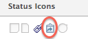

# Übersicht über das Auflösen und Auflösen von Objekten

Ein auflösbares Objekt ist ein Problem, dessen Auflösung an ein auflösendes Objekt gebunden ist. Ein auflösendes Objekt ist ein Projekt, eine Aufgabe oder ein anderes Problem.

Wenn Sie ein Problem in eine Aufgabe oder ein Projekt konvertieren, wird das Problem zum auflösbaren Objekt der Aufgabe oder des Projekts.

Sie können ein Problem auch manuell mit einem Auflösungsobjekt verknüpfen, bei dem es sich um eine Aufgabe, ein Projekt oder ein Problem handeln kann. Weitere Informationen finden Sie unter [Manuelles Verbinden der Lösung eines Problems mit anderen Problemen, Aufgaben oder Projekten](../../../manage-work/issues/convert-issues/manually-tie-resolution-of-issue-to-ptis.md).

Das ursprüngliche Problem wird in diesem Szenario zum auflösbaren Objekt der Aufgabe, des Projekts oder des Problems.

## Einrichten von Adobe Workfront für die Verarbeitung von auflösbaren Objekten {#set-up-adobe-workfront-to-handle-resolvable-objects}

Als Workfront-Administrator oder Gruppenadministrator können Sie entscheiden, wie Sie die auflösbaren Objekte in Ihrem System oder für Ihre Gruppe handhaben möchten.

Sie können auswählen, ob das auflösbare Objekt beim Konvertieren in eine Aufgabe oder ein Projekt beibehalten oder gelöscht werden soll, sobald die Aufgabe oder das Projekt erstellt wurde. Sie können festlegen, dass diese Einstellungen beim Konvertieren von Problemen geändert werden sollen. Dadurch kann der Benutzer, der die Probleme konvertiert, festlegen, ob das Problem beim Konvertieren beibehalten oder gelöscht werden soll.

>[!NOTE]
>
>Auflösbare Objekte sind immer Probleme, deren Auflösung und Status von der Auflösung und dem Status des auflösenden Objekts abhängen, mit dem sie verknüpft sind. Beim Beheben von Objekten kann es sich um Probleme, Aufgaben oder Projekte handeln.

Informationen zum Einrichten von Voreinstellungen für die Verarbeitung von auflösbaren Objekten finden Sie unter [Systemweite Aufgaben- und Problemeinstellungen konfigurieren](../../../administration-and-setup/set-up-workfront/configure-system-defaults/set-task-issue-preferences.md).

<!--WRITER

(Note: drafted and just pointed the user to the article linked above)&nbsp;

To establish the system default for what happens to the issue as it is being converted to a task or a project:

<ol>
<li value="1">Log in to Workfront as a Workfront administrator or group administrator.</li>
<li value="2"> 
  From the main menu, click <strong>Setup</strong>. 
 
  
 </li>
<li value="3">Expand <strong>Project Preferences</strong>.</li>
<li value="4">Click <strong>Tasks & Issues</strong>.</li>
<li value="5">Go to the <strong>Issues</strong> area of the setup.  Consider editing any of the following settings:
<ul>
<li>
<strong>Automatically update Resolvable Issue status when the status of the Resolving Object changes:</strong> Select this option to tie the resolution of the original issue to the resolution of its Resolving Object. In order for this setting to have any effect, the options to <strong>Keep the original issue and tie its resolution to the task</strong> or<strong>project</strong> must be selected.

<ul>
<li>When this setting is enabled, you can create custom statuses with the same key for both issues and projects or tasks. When the project or task (as a resolvable object) turns into the custom status, the change also reflects on the status of the issue. The status key must be the same for the issue and project or task statuses.</li>
<li>
When this setting is disabled, resolving object statuses are automatically set to the default status, instead of the custom ones. For more information about the default statuses, see <a href="#synchronize-the-status-of-the-resolvable-object-with-that-of-the-resolving-object" class="MCXref xref">Synchronize the Status of the Resolvable Object with that of the Resolving Object</a>.
<note type="note">
The default status of the issue is controlled by the status of the project or task, regardless of whether this option is selected or not.
</note></li>
</ul></li>
<li><strong>When converting an issue to a TASK...:</strong> The settings in this section determine what happens during the conversion process from issue to task:
<ul>
<li><strong>Keep the original issue and tie its resolution to the task:</strong> When converting the issue, it remains visible as an issue until the task is complete. The status of the issue automatically changes to Closed when the task completes.</li>
<li><strong>Allow Primary Contact to have access to the task:</strong> Gives the primary contact (issue creator) access to the task to review the task, make updates, and stay informed of its progress.</li>
<li><strong>Allow these settings to be changed during conversion:</strong> Allows the user who is converting the issue to change these options during the conversion of an issue to a task. </li>
</ul></li>
<li><strong>When converting an issue to a PROJECT...:</strong> The settings in this section determine what happens during the conversion process from issue to project:
<ul>
<li><strong>Keep the original issue and tie its resolution to the project:</strong> When converting the issue, it remains visible as an issue until the project is complete. The status of the issue automatically changes to Closed when the project completes.</li>
<li><strong>Allow Primary Contact to have access to the project:</strong> Gives the primary contact (issue creator) access to the project to review the project, make updates, and stay informed of its progress.</li>
<li><strong>Allow these settings to be changed during conversion:</strong> Allows the user who is converting the issue to change these options during the conversion of an issue to a project. </li>
</ul></li>
</ul></li>
<li value="6">Click <strong>Save</strong>.</li>
</ol>

-->

## Behandeln des auflösbaren Objekts während der Konvertierung in ein Projekt oder eine Aufgabe

Je nachdem, wie der Workfront- oder Gruppenadministrator die System- oder Gruppenebene-Problemeinstellungen konfiguriert hat, können Sie das auflösbare Objekt möglicherweise während der Konvertierung eines Problems in ein Projekt oder eine Aufgabe verarbeiten.

Die folgenden Szenarien existieren:

* Wenn der Workfront- oder Gruppenadministrator über die **Behalten Sie das ursprüngliche Problem bei und binden Sie die Lösung an die Aufgabe** und **Behalten Sie das ursprüngliche Problem bei und binden Sie die Lösung an das Projekt** und **Zulassen, dass diese Einstellungen während der Konvertierung geändert werden** deaktiviert ist, können Sie diese Einstellungen nicht ändern, da Sie Probleme in Aufgaben oder Projekte konvertieren.\
   

* Wenn der Workfront- oder Gruppenadministrator über die **Behalten Sie das ursprüngliche Problem bei und binden Sie die Lösung an die Aufgabe** und **Behalten Sie das ursprüngliche Problem bei und binden Sie die Lösung an das Projekt** entweder ausgewählt oder nicht ausgewählt und die **Zulassen, dass diese Einstellungen während der Konvertierung geändert werden** ausgewählt haben, können Sie diese Einstellungen ändern, während Sie Probleme in Aufgaben oder Projekte konvertieren.\
   

Weitere Informationen zum Konvertieren von Problemen in Aufgaben und Projekte finden Sie unter [Übersicht über Konvertierungsprobleme in Adobe Workfront](../../../manage-work/issues/convert-issues/convert-issues.md).

<!--WRITER

<h2>Tie the resolution of an issue to a project, task or </h2> 

(NOTE: created new article for this section; draft when the article is live and see if you need to make a link from this one to the new article) 

You can manually tie the resolution of an issue to the resolution of a project, task, or issue without converting the issue. The issue becomes one of the Resolvable Objects of the project, task, or issue you select. When you do this, a change in the status of the project, task, or issue triggers a change in the status of the original issue, so you cannot manually edit the status of the original issue.  For more information about how the status of the Resolving Object affects the Resolvable Object, see <a href="#synchronize-the-status-of-the-resolvable-object-with-that-of-the-resolving-object" class="MCXref xref">Synchronize the Status of the Resolvable Object with that of the Resolving Object</a>.

You must have Manage permissions on the original issue and View permissions on the project, task, or issue to do this. 

To tie the resolution of an issue to the resolution of a project, task, or issue:

<ol>
<li value="1">Navigate to an issue whose resolution you want to tie to a task or a project.</li>
<li value="2"> 
  Click the <strong>Issue Details</strong> > <strong>Overview</strong> area. 
 
  
 </li>
<li value="3"> 
Click the <strong>Edit</strong> icon  in the upper-right corner of the Issue Details section. 
 </li>
<li value="4">At the bottom of the form,  click in the <strong>Resolved By</strong> field,  and select from the following types of resolving objects:
<ul>
<li><strong>Project</strong></li>
<li><strong>Task</strong></li>
<li>
<strong>Issue</strong>
</li>
</ul>
The field for the resolving object displays. 
</li>
<li value="5">After selecting the object, start typing the name of a specific project, task, or issue in the available field and select it when it appears in the drop-down list. </li>
<li value="6">Click <strong>Save</strong>&nbsp;<strong>Changes</strong>. The original issue becomes the Resolvable Object for the project, task, or issue you selected in step 4 and 5. <note type="note">
One project, task, or issue may have multiple issues as Resolvable Objects.
</note></li>
</ol>

-->

## Synchronisieren Sie den Status des auflösbaren Objekts mit dem des auflösenden Objekts. {#synchronize-the-status-of-the-resolvable-object-with-that-of-the-resolving-object}

* [Synchronisieren von Status, wenn das Auflösungsobjekt ein Problem darstellt](#synchronize-statuses-when-the-resolving-object-is-an-issue)
* [Synchronisieren von Status, wenn das Auflösungsobjekt eine Aufgabe oder ein Projekt ist](#synchronize-statuses-when-the-resolving-object-is-a-task-or-a-project)

### Synchronisieren von Status, wenn das Auflösungsobjekt ein Problem darstellt {#synchronize-statuses-when-the-resolving-object-is-an-issue}

Wenn ein Problem manuell mit einem anderen Problem verknüpft ist, Trigger der Status des zweiten Problems (Resolving Object) eine Änderung des Status des ersten Problems (Resolvable Object). Der Status des ersten Problems entspricht dem Status, in den das zweite Problem geändert wird. Dies gilt sowohl für den standardmäßigen als auch für den benutzerdefinierten Problemstatus.

### Synchronisieren von Status, wenn das Auflösungsobjekt eine Aufgabe oder ein Projekt ist {#synchronize-statuses-when-the-resolving-object-is-a-task-or-a-project}

Wenn ein Problem das auflösbare Objekt einer Aufgabe oder eines Projekts ist, ändert sich der Status der Aufgaben und des Triggers der Projekte im Status des Problems. Standardstatus werden in diesem Fall anders als benutzerdefinierte Status ausgelöst.

* [Synchronisieren des Standardstatus des auflösenden Objekts mit dem Standardstatus des auflösbaren Objekts](#synchronize-the-default-status-of-the-resolving-object-with-the-default-status-of-the-resolvable-object)
* [Synchronisieren Sie den benutzerdefinierten Status des auflösenden Objekts mit dem benutzerdefinierten Status des auflösbaren Objekts.](#synchronize-the-custom-status-of-the-resolving-object-with-the-custom-status-of-the-resolvable-object)

#### Synchronisieren des Standardstatus des auflösenden Objekts mit dem Standardstatus des auflösbaren Objekts {#synchronize-the-default-status-of-the-resolving-object-with-the-default-status-of-the-resolvable-object}

Unabhängig davon, ob die Option &quot;Behebbares Problem automatisch aktualisieren, wenn der Status der Option &quot;Objektänderungen auflösen&quot;ausgewählt ist, ändert sich bei jeder Änderung des Standardstatus in den Auflösungsobjekten (Projekte oder Aufgaben) der Status des auflösbaren Objekts (Probleme) entsprechend. Nur Standardstatus werden dem Trigger einer solchen Änderung bereits zugeordnet.

Die folgenden Standardstatus für Aufgaben Trigger ändern die Standardstatus für Probleme, wenn das Problem als auflösendes Objekt einer Aufgabe festgelegt ist:

| **AUFGABENSTATUS** | **PROBLEM-STATUS** |
|---|---|
| Neu | Neu |
| In Arbeit | In Arbeit |
| Abgeschlossen | Geschlossen |

Die folgenden Standardstatus für Projekte ändern den Trigger der Standardstatus für Probleme, wenn das Problem als auflösbares Objekt eines Projekts festgelegt ist. In einigen Projektstatus werden Änderungen am Status der Probleme nicht Trigger. Die Probleme bleiben in dem Status, den sie vor der Umwandlung des Projekts in einen dieser Status hatten:

| **PROJEKTSTATUS** | **PROBLEM-STATUS** |
|---|---|
| In Planung | Neu |
| Aktuell | In Arbeit |
| Zurückgestellt | Zurückgestellt |
| Angefordert | Trigger keine Änderung des Problemstatus |
| Genehmigt | Trigger keine Änderung des Problemstatus |
| Abgelehnt | Trigger keine Änderung des Problemstatus |
| Idee | Trigger keine Änderung des Problemstatus |
| Eingestellt | Geschlossen |
| Abgeschlossen | Geschlossen |

>[!NOTE]
>
>Nachdem der Status des Problems geschlossen wird (als Ergebnis des Schließens der Aufgabe oder des Projekts), unabhängig davon, in welchem Status sich die Aufgabe oder das Projekt nach dem Schließen ändert, bleibt das Problem geschlossen.

#### Synchronisieren Sie den benutzerdefinierten Status des auflösenden Objekts mit dem benutzerdefinierten Status des auflösbaren Objekts. {#synchronize-the-custom-status-of-the-resolving-object-with-the-custom-status-of-the-resolvable-object}

Wenn Sie den Status der Aufgabe oder des Projekts in einen benutzerdefinierten Status ändern, ändert sich der Status des Problems nur dann in den Status eines benutzerdefinierten Problems, wenn die folgenden beiden Bedingungen erfüllt sind:

* Der Status &quot;Behebbares Problem automatisch aktualisieren, wenn der Status der Option &quot;Objektänderungen auflösen&quot;ausgewählt ist. Weitere Informationen zum Aktivieren dieser Einstellung finden Sie unter [Einrichten von Adobe Workfront für die Verarbeitung von auflösbaren Objekten](#set-up-adobe-workfront-to-handle-resolvable-objects).

* Der benutzerdefinierte Status des Projekts oder der Aufgabe hat denselben dreistelligen Code wie der benutzerdefinierte Status des Problems.

Sie können benutzerdefinierte Status mit demselben Schlüssel für Probleme und Projekte oder Aufgaben erstellen. Wenn das Projekt oder die Aufgabe (als auflösendes Objekt) in den benutzerdefinierten Status geändert wird, spiegelt die Änderung auch den Status des Problems wider. Der Statusschlüssel muss für das Problem und den Projekt- oder Aufgabenstatus identisch sein.

Erstellen Sie beispielsweise einen benutzerdefinierten Projektstatus mit dem Namen &quot;Gestartet&quot;mit dem dreistelligen Code &quot;LCD&quot;, der mit &quot;Aktuell&quot;übereinstimmt. Erstellen Sie außerdem einen benutzerspezifischen Problemstatus mit dem Namen &quot;Projekt gestartet&quot;, auch mit dem Buchstabencode &quot;LCD&quot;, der mit &quot;In Bearbeitung&quot;übereinstimmt. Wenn Sie das Projekt als &quot;Gestartet&quot;markieren, ändert sich der Status des Problems automatisch in &quot;Projekt gestartet&quot;. Wenn die Einstellung &quot;Behebbares Problem automatisch aktualisieren, wenn der Status der Auflösen von Objektänderungen nicht aktiviert ist, ändert sich der Problemstatus stattdessen in &quot;Wird ausgeführt&quot;(Standardstatus).

Weitere Informationen zum Erstellen eines benutzerdefinierten Status finden Sie unter [Erstellen oder Bearbeiten eines Status](../../../administration-and-setup/customize-workfront/creating-custom-status-and-priority-labels/create-or-edit-a-status.md).

## Synchronisieren Sie den Prozentwert der Vollständigkeit eines auflösenden Objekts mit dem des auflösbaren Objekts.

Wenn ein Problem durch eine Aufgabe oder ein Projekt behoben wird, wird der prozentuale Abschluss des Problems beim gelösten Problem aktualisiert, wenn eines der folgenden Ereignisse eintritt: 

* Wenn jemand eine Änderung an der Aufgabe oder dem Projekt speichert.
* Die Zeitleiste des Projekts wird neu berechnet.

Wenn und Problem durch ein anderes Problem behoben werden, wird der Prozentsatz der vollständigen Aktualisierung aktualisiert, wenn eines der Probleme aktualisiert wird.

## Suchen des auflösbaren Objekts für eine Aufgabe oder ein Projekt

Die Position des auflösenden Objekts ist für Aufgaben und Projekte identisch.

1. Navigieren Sie zu einem Projekt oder einer Aufgabe, die Sie erstellt haben, indem Sie ein Problem in das Projekt oder die Aufgabe konvertieren.
1. Klicken Sie auf **Projektdetails** oder **Aufgabendetails** und klicken Sie auf , um es zu erweitern.
1. Klicken **Übersicht**.
1. Suchen Sie unten auf der Registerkarte nach **Diese Lösung** -Feld: Das Problem, das das auflösbare Objekt des Projekts oder der Aufgabe ist, wird in diesem Feld aufgelistet.

   >[!NOTE]
   >
   >Probleme können nicht in andere Probleme konvertiert werden, sie können jedoch manuell einem Problem bei der Behebung zugeordnet werden. Ein Projekt, eine Aufgabe oder ein Problem kann mehrere Probleme als auflösbare Objekte haben. Wenn das Projekt, die Aufgabe oder das Problem gelöst werden, wird auch das auflösbare Objekt (Problem) behoben. Das gelöste Problem bleibt geschlossen, auch wenn das Projekt, die Aufgabe oder das Problem, durch das das Problem behoben wurde, erneut geöffnet wird.

## Identifizieren eines Problems mit einem auflösenden Objekt in einer Liste

In einer Liste von Problemen können Sie mithilfe von Statussymbolen Probleme identifizieren, die als gelöste Objekte bezeichnet werden, indem Sie dieses Symbol im **Statussymbole** oder **Flags** Spalten:

## Auflösbare und aufgelöste Objektinformationen in einem Bericht anzeigen

Sie können Informationen zu den auflösbaren oder aufgelösten Objekten in der Ansicht oder im Bericht für Projekte, Aufgaben oder Probleme anzeigen.\
Die folgende Tabelle zeigt, welche Felder angezeigt werden können und in welchen Ansichten sie angezeigt werden können:

<table style="table-layout:auto"> 
 <col> 
 <col> 
 <col> 
 <col> 
 <thead> 
  <tr> 
   <th><strong>Feld in Ansicht</strong> </th> 
   <th><strong>Problemansicht</strong> </th> 
   <th><strong>Aufgabenansicht</strong> </th> 
   <th><strong>Projektansicht</strong> </th> 
  </tr> 
 </thead> 
 <tbody> 
  <tr> 
   <td><strong>Enthält Resolvables</strong>: Zeigt eine <strong>True</strong> Wert, wenn dem Projekt oder der Aufgabe auflösbare Probleme zugeordnet sind, und eine <strong>False</strong> Wert, wenn dies nicht der Fall ist.</td> 
   <td>✓</td> 
   <td>✓</td> 
   <td>✓</td> 
  </tr> 
  <tr> 
   <td><strong>Ursprünglicher Name des Problems, Ursprüngliches Datum der Ausgabe, Name des Urhebers</strong>: Zeigt den Namen und das Einstiegsdatum des ursprünglichen Problems sowie den Namen des Benutzers an, der das Problem in einer benutzerdefinierten Textmodus-Ansicht erstellt hat. Weitere Informationen zum Erstellen einer benutzerdefinierten Ansicht für einen Textmodus für ein Projekt, einen Aufgabenbericht oder eine Liste zum Anzeigen von Informationen zum ursprünglichen Problem finden Sie unter <a href="../../../reports-and-dashboards/reports/custom-view-filter-grouping-samples/view-display-original-issue-info-task-project-list.md" class="MCXref xref">Ansicht: Originalausgabeinformationen zu Aufgaben- und Projektlisten anzeigen</a>. </td> 
   <td> </td> 
   <td> ✓</td> 
   <td> ✓</td> 
  </tr> 
  <tr> 
   <td> 
<strong>Resolvables:</strong> Zeigt eine Liste aller auflösbaren Objekte in einer benutzerdefinierten Ansicht für einen Projekt- oder Aufgabenbericht oder eine Liste im Textmodus an.
 
Weitere Informationen zum Erstellen dieser Ansicht finden Sie unter <a href="../../../reports-and-dashboards/reports/custom-view-filter-grouping-samples/view-resolvable-objects-task-project-report.md" class="MCXref xref">Ansicht: Auflösbare Objekte in einem Aufgaben- oder Projektbericht</a>
 </td> 
   <td> </td> 
   <td>✓</td> 
   <td> ✓</td> 
  </tr> 
  <tr> 
   <td><strong>Urheber einer konvertierten Ausgabe</strong>: Zeigt Informationen über den Benutzer an, der das Problem ursprünglich protokolliert hat, das später in die Aufgabe konvertiert wurde. </td> 
   <td> </td> 
   <td>✓</td> 
   <td> </td> 
  </tr> 
  <tr> 
   <td><strong>Projekt auflösen</strong>: Zeigt Informationen zum Auflösungsprojekt an, das entweder aus dem ursprünglichen Problem konvertiert oder manuell als Auflösungsobjekt eines Problems festgelegt wurde.</td> 
   <td>✓</td> 
   <td> </td> 
   <td> </td> 
  </tr> 
  <tr> 
   <td><strong>Aufgabe auflösen</strong>: Zeigt Informationen über die Aufgabe "Auflösen"an, die entweder aus dem ursprünglichen Problem konvertiert oder manuell als "Auflösungsobjekt"eines Problems bezeichnet wurde.</td> 
   <td>✓ </td> 
   <td> </td> 
   <td> </td> 
  </tr> 
  <tr> 
   <td><strong>Problem beheben</strong>: Zeigt Informationen zum Beheben eines Problems an, das manuell als Auflösungsobjekt eines Problems festgelegt wurde.</td> 
   <td> ✓</td> 
   <td> </td> 
   <td> </td> 
  </tr> 
 </tbody> 
</table>
