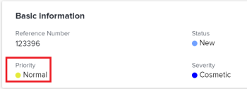

# Priorität von Problemen aktualisieren

Sie können eine Priorität für ein Problem definieren, um anzugeben, wie wichtig das Problem ist.

Sie müssen über Verwaltungsberechtigungen für das Problem verfügen, um die Priorität des Problems zu ändern.  [Aktualisieren der Priorität eines Problems](#update-the-priority-of-an-issue).

## Zugriffsanforderungen

Sie müssen über folgenden Zugriff verfügen, um die Schritte in diesem Artikel ausführen zu können:

<table style="table-layout:auto"> 
 <col> 
 <col> 
 <tbody> 
  <tr> 
   <td role="rowheader">Adobe Workfront-Plan*</td> 
   <td> 
Alle 
 </td> 
  </tr> 
  <tr> 
   <td role="rowheader">Adobe Workfront-Lizenz*</td> 
   <td> 
Anforderung oder höher
 </td> 
  </tr> 
  <tr> 
   <td role="rowheader">Konfigurationen auf Zugriffsebene*</td> 
   <td> 
Zugriff auf Probleme bearbeiten
 
Hinweis: Wenn Sie immer noch keinen Zugriff haben, fragen Sie Ihren Workfront-Administrator, ob er zusätzliche Zugriffsbeschränkungen für Ihre Zugriffsebene festlegt. Informationen dazu, wie ein Workfront-Administrator Ihre Zugriffsebene ändern kann, finden Sie unter <a href="../../../administration-and-setup/add-users/configure-and-grant-access/create-modify-access-levels.md" class="MCXref xref">Benutzerdefinierte Zugriffsebenen erstellen oder ändern</a>.
 </td> 
  </tr> 
  <tr> 
   <td role="rowheader">Objektberechtigungen</td> 
   <td> 
Berechtigungen für das Problem verwalten
 
Informationen zum Anfordern von zusätzlichem Zugriff finden Sie unter <a href="../../../workfront-basics/grant-and-request-access-to-objects/request-access.md" class="MCXref xref">Zugriff auf Objekte anfordern </a>.
 </td> 
  </tr> 
 </tbody> 
</table>

&#42;Wenden Sie sich an Ihren Workfront-Administrator, um zu erfahren, welchen Plan, welchen Lizenztyp oder welchen Zugriff Sie haben.

## Überblick über Problemprioritäten

Jeder Prioritätsbezeichnung ist eine Zahl zugeordnet, die nicht geändert werden kann.

Adobe Workfront-Administratoren können die Prioritätsbezeichnungen in Workfront ändern oder neue Prioritäten erstellen. Daher können die Optionen, die Sie möglicherweise für das Feld Priorität in Ihrer Workfront-Instanz haben, von den unten aufgeführten abweichen.

Sie sollten sich mit der Nummerierungsreihenfolge für in Ihrer Organisation verwendete Prioritäten vertraut machen.\
Ihre Organisation könnte beispielsweise die Nummer 1 verwenden, um auf dringende Aufgaben zu verweisen, wenn der Titel der Priorität geändert wurde.

Weitere Informationen zum Anpassen der Prioritätsnamen in Ihrer Instanz finden Sie unter [Erstellen und Anpassen von Prioritäten](../../../administration-and-setup/customize-workfront/creating-custom-status-and-priority-labels/create-customize-priorities.md).

In der folgenden Tabelle werden die einzelnen standardmäßigen Prioritätsbezeichnungen und die zugehörige Nummer aufgeführt:

<table style="table-layout:auto"> 
 <col> 
 <col> 
 <thead> 
  <tr> 
   <th>Prioritätsbezeichnung  (Kann geändert werden) </th> 
   <th>Prioritätsnummer  (Kann nicht geändert werden.) </th> 
  </tr> 
 </thead> 
 <tbody> 
  <tr> 
   <td> Keine </td> 
   <td> 0 </td> 
  </tr> 
  <tr> 
   <td> Niedrig </td> 
   <td> 1 </td> 
  </tr> 
  <tr> 
   <td> Normal </td> 
   <td> 2 </td> 
  </tr> 
  <tr> 
   <td> Hoch </td> 
   <td> 3 </td> 
  </tr> 
  <tr> 
   <td> Dringend </td> 
   <td> 4 </td> 
  </tr> 
 </tbody> 
</table>

## Aktualisieren der Priorität eines Problems {#update-the-priority-of-an-issue}

1. Gehen Sie zu dem Problem, dessen Priorität Sie ändern möchten.
1. Klicks **Problemdetails** im linken Bereich.

   Die **Übersicht** -Abschnitt sollte standardmäßig angezeigt werden.

1. Klicken Sie auf **Priorität** im Feld **Basisinformationen** Bereich.

   

1. Wählen Sie einen Wert für **Priorität** -Feld.

   Je nachdem, wie Ihr Workfront-Administrator Prioritäten in Ihrem System konfiguriert hat, können die Optionen variieren.

1. Klicks **Änderungen speichern**.
