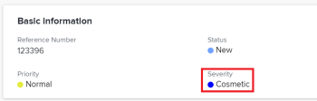

# Schweregrad des Problems aktualisieren

Sie können in Adobe Workfront Probleme mit einer Schwere verknüpfen. Aufgaben und Projekte haben keine Schwerpunkte.

Probleme sind unerwartete Ereignisse, die verhindern können, dass Ihre Projekte rechtzeitig oder innerhalb des Budgets beendet werden. Sie können Prioritätsstufen verwenden, um anzugeben, wie schwerwiegend ein Problem ist. 

Ihr Workfront-Administrator definiert die in Workfront verfügbaren Abstufungen. Nachdem sie erstellt wurden, können Sie sie mit einem Problem verbinden.\
Weitere Informationen zum Erstellen von Prioritätsstufen in Workfront finden Sie unter [Erstellen oder Anpassen von Problemschwerpunkten](../../../administration-and-setup/customize-workfront/creating-custom-status-and-priority-labels/create-customize-issue-severities.md).

Sie müssen über Beitragsberechtigungen für ein Problem verfügen, um dessen Schweregrad aktualisieren zu können. 

Sie können den Schweregrad von Problemen in den folgenden Bereichen von Workfront aktualisieren:

* Im **Problem bearbeiten** Dialogfeld
* Im **Problemdetails** Problembereich
* In einer Problemliste oder einem Bericht

## Zugriffsanforderungen

Sie müssen über folgenden Zugriff verfügen, um die Schritte in diesem Artikel ausführen zu können:

<table style="table-layout:auto"> 
 <col> 
 <col> 
 <tbody> 
  <tr> 
   <td role="rowheader">Adobe Workfront-Plan*</td> 
   <td> 
Beliebig 
 </td> 
  </tr> 
  <tr> 
   <td role="rowheader">Adobe Workfront-Lizenz*</td> 
   <td> 
Anforderung oder höher
 </td> 
  </tr> 
  <tr> 
   <td role="rowheader">Konfigurationen auf Zugriffsebene*</td> 
   <td> 
Zugriff auf Probleme bearbeiten
 
Hinweis: Wenn Sie immer noch keinen Zugriff haben, fragen Sie Ihren Workfront-Administrator, ob er zusätzliche Zugriffsbeschränkungen für Ihre Zugriffsebene festlegt. Informationen dazu, wie ein Workfront-Administrator Ihre Zugriffsebene ändern kann, finden Sie unter <a href="../../../administration-and-setup/add-users/configure-and-grant-access/create-modify-access-levels.md" class="MCXref xref">Benutzerdefinierte Zugriffsebenen erstellen oder ändern</a>.
 </td> 
  </tr> 
  <tr> 
   <td role="rowheader">Objektberechtigungen</td> 
   <td> 
Berechtigungen für das Problem verwalten
 
Informationen zum Anfordern von zusätzlichem Zugriff finden Sie unter <a href="../../../workfront-basics/grant-and-request-access-to-objects/request-access.md" class="MCXref xref">Zugriff auf Objekte anfordern </a>.
 </td> 
  </tr> 
 </tbody> 
</table>

&#42;Wenden Sie sich an Ihren Workfront-Administrator, um zu erfahren, welchen Plan, welchen Lizenztyp oder welchen Zugriff Sie haben.

## Schweregrad des Problems aktualisieren

So aktualisieren Sie den Schweregrad eines Problems im Bereich Problemdetails eines Problems:

1. Gehen Sie zu dem Problem, dessen Schweregrad Sie aktualisieren möchten.
1. Klicken **Problemdetails** im linken Bereich.

   Die **Übersicht** -Abschnitt sollte standardmäßig angezeigt werden.

1. Klicken Sie auf **Schweregrad** im Feld **Basisinformationen** Bereich.

   

1. Wählen Sie die entsprechende **Schweregrad** aus dem Dropdown-Menü.

   Je nachdem, wie Ihr Workfront-Administrator Prioritätsstufen in Ihrem System konfiguriert hat, können die Optionen variieren.

1. Klicken **Änderungen speichern**.
