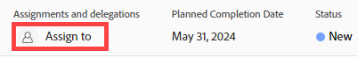
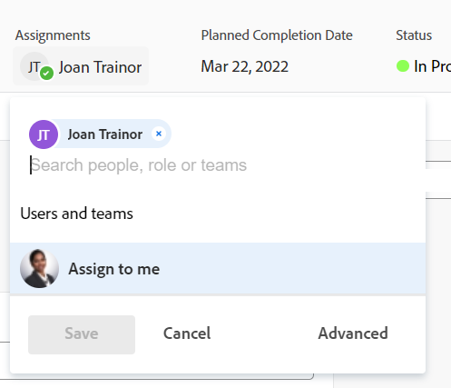

# Probleme zuweisen

<!--Audited: 10/2024-->

Die hervorgehobenen Informationen auf dieser Seite beziehen sich auf Funktionen, die noch nicht allgemein verfügbar sind. Sie ist nur in der Vorschau -Umgebung für alle Kunden verfügbar. Dieselben Funktionen sind ab einer Woche ab der Vorschau-Version auch in der Produktionsumgebung für alle Kunden verfügbar.

Weitere Informationen finden Sie unter [Schnittstellenmodernisierung](/help/quicksilver/product-announcements/product-releases/interface-modernization/interface-modernization.md).

Sie können Benutzern, Rollen und Teams Probleme zuweisen, um anzugeben, wer für die Behebung der Probleme verantwortlich ist. Allgemeine Informationen zum Zuweisen von Problemen finden Sie unter [Übersicht über das Ändern von Problemzuweisungen](../../../manage-work/issues/manage-issues/modify-issue-assignments-overview.md).

>[!TIP]
>
>Sie können mehrere Benutzer, Aufgabengebiete oder Teams zuweisen. Sie können nur aktive Benutzer, Aufgabengebiete und Teams zuweisen.
>
>Wenn ein(e) Benutzende(r), ein Aufgabengebiet oder ein Team zugewiesen wurde, bevor sie/er deaktiviert wurden, bleiben sie/sie dem Arbeitselement zugewiesen. In diesem Fall empfehlen wir Folgendes:
>
>* Weisen Sie das Arbeitselement den aktiven Ressourcen neu zu.
>* Verknüpfen Sie die Benutzer in einem deaktivierten Team mit einem aktiven Team und weisen Sie das Arbeitselement dem aktiven Team zu.

Zusätzlich zu diesem Artikel empfehlen wir, die folgenden Artikel zu lesen, um weitere Informationen zum Zuweisen von Problemen zu erhalten:

* [Übersicht über das Ändern von Problemzuweisungen](../../../manage-work/issues/manage-issues/modify-issue-assignments-overview.md)
* [Probleme bearbeiten](../../../manage-work/issues/manage-issues/edit-issues.md)
* [Ändern von Benutzerzuweisungen für mehrere Probleme in einer Liste](../../../manage-work/issues/manage-issues/edit-assignments-for-multiple-issues.md)
* [Erweiterte Zuweisungen erstellen](../../../manage-work/tasks/assign-tasks/create-advanced-assignments.md)
* [Smart-Zuweisungen vornehmen](../../../manage-work/tasks/assign-tasks/make-smart-assignments.md)
* [Smart Assignments - Übersicht](../../../manage-work/tasks/assign-tasks/smart-assignments.md)
* [Übersicht über die Zuweisung von Arbeit im Workload Balancer](../../../resource-mgmt/workload-balancer/assign-work-in-workload-balancer.md)

Sie können ein Problem einer oder mehreren Ressourcen auf individueller Anfrageebene zuweisen oder mehrere Ressourcen gleichzeitig mehreren Problemen zuweisen.

Die Zuweisung von Problemen und Aufgaben ist in Adobe Workfront ähnlich. Allgemeine Informationen zum Zuweisen von Aufgaben finden Sie unter [Übersicht über das Ändern von Aufgabenzuweisungen](../../../manage-work/tasks/assign-tasks/modify-task-assignments-overview.md).

## Zugriffsanforderungen

+++ Erweitern Sie , um die Zugriffsanforderungen für die -Funktion in diesem Artikel anzuzeigen. 

<table style="table-layout:auto"> 
 <col> 
 </col>
 <tbody> 
  <tr> 
   <td>Adobe Workfront-Paket</td> 
   <td> 
Beliebig 
 </td> 
  </tr> 
  <tr> 
   <td>Adobe Workfront-Lizenz</td> 
   <td> 
Mitwirkender oder höher

   
Überprüfen oder höher
 </td> 
  </tr> 
  <tr> 
   <td>Konfigurationen der Zugriffsebene</td> 
   <td> 
Zugriff auf Anfragen bearbeiten
 
Zugriff auf Projekte und Aufgaben anzeigen oder höher, um ein Problem zuzuweisen
 </td> 
  </tr> 
  <tr> 
   <td>Objektberechtigungen</td> 
   <td> 
Verwalten von Berechtigungen für das Problem
 
 Anzeigen von Berechtigungen oder höher für das Projekt oder die Aufgabe, in dem/der sich das Problem befindet, wenn ein Problem zugewiesen wird

Tragen Sie Berechtigungen oder mehr zu dem Projekt oder der Aufgabe bei, in dem/der sich das Problem befindet, wenn Sie mehrere Probleme zuweisen.
 </td> 
  </tr> 
 </tbody> 
</table>

Weitere Informationen finden Sie unter [Zugriffsanforderungen in der Dokumentation zu Workfront](/help/quicksilver/administration-and-setup/add-users/access-levels-and-object-permissions/access-level-requirements-in-documentation.md).

+++

## Überlegungen zu mehreren Zuweisungen an Aufgabengebiete, Teams und Benutzer

Beachten Sie Folgendes, wenn Sie einem Arbeitselement mehrere Ressourcen zuweisen:

* Benutzern kann mehr als ein Aufgabengebiet mit ihrem Profil zugeordnet sein. Informationen zum Verknüpfen von Benutzern mit Aufgabengebieten finden Sie unter [Bearbeiten des Benutzerprofils](../../../administration-and-setup/add-users/create-and-manage-users/edit-a-users-profile.md).

* Aufgaben oder Probleme werden in der Regel zuerst einem oder mehreren Aufgabengebieten oder Teams zugewiesen. Wenn Projekte startbereit sind, müssen sie möglicherweise auch Benutzern zugewiesen werden.

  Wenn eine Aufgabe oder ein Problem einer oder mehreren Rollen zugewiesen ist und Sie dann auch einen Benutzer zuweisen, entscheidet Adobe Workfront gemäß den folgenden Regeln, welches Aufgabengebiet mit dem zusätzlichen Benutzer (falls vorhanden) verknüpft werden soll:

   * Wenn nur ein Aufgabengebiet zugewiesen ist und es mit der Primären Rolle des Benutzers übereinstimmt, wird die Aufgabe oder das Problem nur dem Benutzer zugewiesen, der seine Primäre Rolle erfüllt.
   * Wenn mehrere Rollen zugewiesen sind und mindestens eine der Rollen mit den sekundären Rollen des Benutzers übereinstimmt, wird die Aufgabe oder das Problem dem Benutzer zugewiesen, der eine der anderen Rollen erfüllt (die Workfront zufällig auswählt, wenn mehrere Übereinstimmungen vorliegen), sowie allen zusätzlichen Rollen, die zugewiesen werden.
   * Wenn mindestens ein Aufgabengebiet zugewiesen ist und es keine Übereinstimmungen mit den Rollen des Benutzers gibt, wird die Aufgabe oder das Problem sowohl der Rolle bzw. den Rollen als auch dem Benutzer zugewiesen.

* Wenn eine Aufgabe oder ein Problem einem Team zugewiesen wird und Sie auch einen Benutzer zuweisen, bleibt die Aufgabe oder das Problem sowohl dem Team als auch dem Benutzer zugewiesen.

<!--

<h2> </h2>
<h2>Considerations about removing assignments from issues</h2> 

(NOTE: drafted and moved to Modify issue assignments overview article)

You can remove assignments from one issue at a time, or you can remove assignments from multiple issues in bulk.

For more information about removing assignments from issues in bulk, see <a href="../../../manage-work/issues/manage-issues/edit-assignments-for-multiple-issues.md" class="MCXref xref">Modify user assignments for multiple issues in a list</a>. 

Consider the following when removing assignments from issues: 

<ul>
<li>When you unassign a user from an issue, the issue remains assigned to the job role that the user fulfilled on the issue.</li>
<li>When you unassign a job role or a team from an issue, the issue remains unassigned if it is not assigned to any other resources. </li>
</ul>

-->

## Weisen Sie in der Anfragekopfzeile ein einzelnes Problem zu

1. Navigieren Sie zu einer Anfrage, die Sie zuweisen möchten.
1. Klicken Sie **Zuweisen zu** in der oberen rechten Ecke der Problem-Kopfzeile im Bereich **Zuweisungen**

   Oder

   Klicken Sie auf den Namen der aktuellen Zuweisungen, wenn das Problem bereits zugewiesen ist.

   

1. Führen Sie einen der folgenden Schritte aus:

   * Beginnen Sie mit der Eingabe des Namens eines Benutzers, einer Rolle oder eines Teams, den/das Sie zuweisen möchten, und klicken Sie dann darauf, wenn es in der Liste angezeigt wird.

     

   * (Bedingt) Klicken Sie auf einen Namen, eine Rolle oder ein Team in den verfügbaren Listen
   * Klicken Sie auf **Mir zuweisen**, um es sich selbst zuzuweisen
   * Klicken Sie auf **Erweitert**.

     Das Erstellen erweiterter Zuweisungen funktioniert ähnlich für Aufgaben und Probleme. Informationen zum Erstellen erweiterter Zuweisungen finden Sie unter [Erstellen erweiterter Zuweisungen](../../../manage-work/tasks/assign-tasks/create-advanced-assignments.md).

     >[!TIP]
     >
     >Beachten Sie beim Hinzufügen einer Benutzerzuweisung den Avatar, die Primäre Rolle des Benutzers oder seine E-Mail-Adresse, um zwischen Benutzern mit identischen Namen zu unterscheiden.
     >
     >Benutzende müssen mindestens einem Aufgabengebiet zugeordnet sein, damit sie es beim Hinzufügen anzeigen können.
     >
     >Die Einstellung Kontaktinformationen anzeigen muss in Ihrer Zugriffsebene aktiviert sein, damit Benutzer die E-Mails von Benutzern anzeigen können. Weitere Informationen finden Sie unter [Benutzern Zugriff gewähren](../../../administration-and-setup/add-users/configure-and-grant-access/grant-access-other-users.md)
     >

     <!-- this doesn't apply to issues; if it does, add this to the TIP above: 
      >When adding a job role assignment, you can search for the job role or location. Select a role from the Job roles list to use the default billing rate for the assignment, or select a Rate card job role to use the billing rate from the rate card. For more information on rate cards, see [Manage rate cards](/help/quicksilver/administration-and-setup/set-up-workfront/configure-system-defaults/manage-rate-cards.md).-->

1. Klicken Sie auf **Speichern**, um die Zuweisung des Problems abzuschließen.
1. (Optional) Klicken Sie auf das **X**-Symbol neben dem Namen der Zuweisungen im Bereich „Zuweisungen“ in der Kopfzeile des Problems, um eine Zuweisung zu entfernen.

## Problem zuweisen, indem es inline in einer Liste bearbeitet wird

Sie können Probleme in einer Liste oder einem Bericht zuweisen, wenn eines der Zuweisungsfelder in der Listenansicht sichtbar ist. Dies ist eine schnellere Möglichkeit, Probleme zuzuweisen.

Je nachdem, welches Feld in der Ansicht sichtbar ist, können Sie dem Problem die folgenden Entitäten zuweisen:

| Option | Zugewiesene Einheiten |
|---|---|
| **Zuweisen zu** | Einen Benutzer zuweisen |
| **Zugewiesen** | Einen Benutzer zuweisen |
| **Arbeitsaufträge** | Weisen Sie Benutzer, Aufgabengebiete oder Teams zu. |

So weisen Sie Probleme in einer Liste zu:

1. Navigieren Sie zu einer Liste von Problemen, die die Felder Zugewiesen an, Zugewiesen oder Zuweisungen in der Ansicht enthält.
1. Führen Sie einen der folgenden Schritte aus, um Probleme zuzuweisen:

   * Klicken Sie in die Felder **Zugewiesen an** oder **Zugewiesen** und geben Sie den Namen eines aktiven Benutzers ein, den Sie dem Problem zuweisen möchten. Klicken Sie dann auf den Namen, wenn er in der Liste angezeigt wird.

     

   * Klicken Sie in das **Arbeitsaufträge** und geben Sie den Namen eines aktiven Benutzers, eines Aufgabengebiets oder eines aktiven Teams ein, den/das Sie dem Problem zuweisen möchten. Klicken Sie dann auf das Problem, wenn es in der Liste angezeigt wird.

     

   >[!TIP]
   >
   >Beachten Sie beim Hinzufügen einer Benutzerzuweisung den Avatar, die Primäre Rolle des Benutzers oder seine E-Mail-Adresse, um zwischen Benutzern mit identischen Namen zu unterscheiden.
   >
   >Benutzende müssen mindestens einem Aufgabengebiet zugeordnet sein, damit sie es beim Hinzufügen anzeigen können.
   >
   >Die Einstellung Kontaktinformationen anzeigen muss in Ihrer Zugriffsebene aktiviert sein, damit Benutzer die E-Mails von Benutzern anzeigen können. Weitere Informationen finden Sie unter [Gewähren des Benutzerzugriffs](../../../administration-and-setup/add-users/configure-and-grant-access/grant-access-other-users.md).

1. (Bedingt) Klicken Sie im Feld Arbeitsaufträge **Erweitert** am unteren Rand der Liste oder auf das **Personen-Symbol**  in der oberen rechten Ecke des Arbeitsauftragsfelds, um das Feld Erweiterte Arbeitsaufträge zu öffnen und erweiterte Arbeitsaufträge zu erstellen. Weitere Informationen finden Sie unter [Erstellen erweiterter Zuweisungen](../../../manage-work/tasks/assign-tasks/create-advanced-assignments.md).

   >[!TIP]
   >
   >Erweiterte Zuweisungen können nicht über die Felder Zugewiesen an oder Zugewiesen an vorgenommen werden.

1. Nachdem Sie Ihre Bevollmächtigten zum Problem hinzugefügt haben, drücken Sie die Eingabetaste oder klicken Sie auf eine beliebige Stelle auf der Seite, um Ihre Änderungen zu speichern.

## Problem im Feld „Problem bearbeiten“ zuweisen

Ein Problem kann bei seiner Bearbeitung im Feld „Problem bearbeiten“ zugewiesen werden.

Weitere Informationen finden Sie im Abschnitt „Arbeitsaufträge“ im Artikel [Probleme bearbeiten](/help/quicksilver/manage-work/issues/manage-issues/edit-issues.md).

## Probleme stapelweise zuweisen

Die Zuweisung von Problemen in großen Mengen unterscheidet sich je nach der ausgewählten Umgebung.

### Massenzuweisung von Problemen in der Produktionsumgebung

1. Navigieren Sie zu einer Liste von Problemen, die Sie stapelweise zuweisen möchten.
1. Wählen Sie mehrere Probleme in der Liste aus.
1. Klicken Sie auf **Bearbeitungssymbol** .

   Das **„Anfragen bearbeiten** wird geöffnet.

1. Wählen Sie im Bereich **Arbeitsaufträge** das Feld **Verantwortlicher** aus und geben Sie dann den Namen eines Benutzers, eines Aufgabengebiets oder Teams ein, das Sie allen Problemen zuweisen möchten.

   >[!IMPORTANT]
   >
   >Wenn eines der Probleme bereits zugewiesen ist, werden die hier angegebenen Ressourcen zu den Problemen hinzugefügt, anstatt die vorhandenen Ressourcen in den Problemen zu ersetzen.

1. (Optional) Wählen Sie das Optionsfeld in der Spalte **Problembesitzer** aus, um anzugeben, welche Ressource der primäre Zugewiesene oder der Inhaber des Problems ist, wenn Sie dem Problem mehr als eine Ressource zuweisen. Dies ist nicht für Teams verfügbar.
1. (Optional) Wählen Sie aus dem Dropdown-Menü **Rolle auswählen** in der Spalte „Rolle des ****&quot; eine Rolle aus, die der Benutzer bei der Problemzuweisung erfüllen soll. Wenn Sie keine Rolle auswählen, wählt Workfront automatisch die Primäre Rolle des Benutzers aus.

1. (Optional) Wenn Sie vorhandene Zugewiesene aus allen Problemen entfernen möchten, führen Sie einen der folgenden Schritte aus:

   1. Beginnen Sie mit der Eingabe des Namens eines Benutzers, einer Rolle oder eines Teams, den/das Sie aus dem Problem entfernen möchten, wählen Sie es aus, wenn es in der Liste angezeigt wird, und klicken Sie auf **Verantwortlichen entfernen**, um weitere Verantwortliche zum Entfernen hinzuzufügen.
   1. Klicken Sie **Alle vorhandenen Zugewiesenen entfernen**, um alle Zugewiesenen aus allen ausgewählten Problemen zu entfernen.

1. Klicken Sie auf **Änderungen speichern**.
1. (Optional und bedingt) Wenn die Felder Zugewiesen an oder Zuweisungen in Ihrer Problemliste angezeigt werden, klicken Sie in eine dieser Spalten für ein Problem, und klicken Sie dann auf das **X-Symbol** neben dem Namen eines Verantwortlichen, um es aus dem Problem zu entfernen.

### Massenzuweisung von Problemen in der Vorschau-Umgebung

1. Navigieren Sie zu einer Liste von Problemen, die Sie stapelweise zuweisen möchten.
1. Wählen Sie mehrere Probleme in der Liste aus.
1. Klicken Sie auf **Bearbeitungssymbol** .

   Das **„Anfragen bearbeiten** wird geöffnet.

1. Klicken Sie **linken** auf „Arbeitsaufträge“ und geben Sie im Bereich **Arbeitsaufträge** zunächst den Namen eines Benutzers, einer Rolle oder eines Teams in das Feld **Personen, Rollen oder Teams suchen** ein. Klicken Sie dann auf den Namen, wenn er in der Liste angezeigt wird

   Oder

   Klicken Sie **Mir zuweisen**, um sich die Probleme zuzuweisen.

   >[!IMPORTANT]
   >
   >Wenn eines der Probleme bereits zugewiesen ist, werden die hier angegebenen Ressourcen zu den Problemen hinzugefügt, anstatt die vorhandenen Ressourcen in den Problemen zu ersetzen.

1. (Optional) Wenn Sie vorhandene Zugewiesene aus allen Problemen entfernen möchten, klicken Sie auf das **x** neben ihrem Namen.

1. (Optional) Aktualisieren Sie das Feld Geplante Stunden . Weitere Informationen finden Sie unter [Probleme bearbeiten](/help/quicksilver/manage-work/issues/manage-issues/edit-issues.md).

1. Klicken Sie auf **Speichern**.
1. (Optional und bedingt) Wenn die Felder Zugewiesen an oder Zuweisungen in Ihrer Problemliste angezeigt werden, klicken Sie in eine dieser Spalten für ein Problem, und klicken Sie dann auf das **X-Symbol** neben dem Namen eines Verantwortlichen, um es aus dem Problem zu entfernen.

