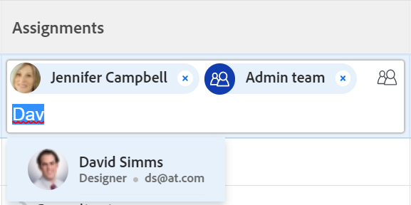

# Zuweisen von Problemen

<!--keep the rate card job role information always in yellow till it releases to production - check with Lisa - this might not apply to issues?! -->

Die hervorgehobenen Informationen auf dieser Seite beziehen sich auf Funktionen, die noch nicht allgemein verfügbar sind. Sie ist nur in der Vorschau-Umgebung für alle Kunden oder in der Produktionsumgebung für Kunden verfügbar, die schnelle Versionen aktiviert haben.

Informationen zu schnellen Versionen finden Sie unter [Schnellversionen für Ihr Unternehmen aktivieren oder deaktivieren](/help/quicksilver/administration-and-setup/set-up-workfront/configure-system-defaults/enable-fast-release-process.md).

Weitere Informationen zur aktuellen Version finden Sie unter [Übersicht über die Version 2024 im dritten Quartal 2024](/help/quicksilver/product-announcements/product-releases/24-q3-release-activity/24-q3-release-overview.md).

Sie können Benutzern, Rollen und Teams Probleme zuweisen, um anzugeben, wer für das Abschließen der Probleme verantwortlich ist. Allgemeine Informationen zum Zuweisen von Problemen finden Sie unter [Überblick über das Ändern von Problemzuweisungen](../../../manage-work/issues/manage-issues/modify-issue-assignments-overview.md).

>[!TIP]
>
>Sie können mehrere Benutzer, Auftragsrollen oder Teams zuweisen. Sie können nur aktive Benutzer, Stellenrollen und Teams zuweisen.
>
>Wenn ein Benutzer, eine Rolle oder ein Team zugewiesen wurde, bevor sie deaktiviert wurden, bleiben sie dem Arbeitselement zugewiesen. In diesem Fall empfehlen wir Folgendes:
>
>* Weisen Sie das Arbeitselement aktiven Ressourcen erneut zu.
>* Verknüpfen Sie die Benutzer in einem deaktivierten Team mit einem aktiven Team und weisen Sie das Arbeitselement dem aktiven Team erneut zu.

Zusätzlich zu diesem Artikel empfehlen wir, die folgenden Artikel zu lesen, um weitere Informationen zur Problemzuweisung zu erhalten:

* [Überblick über die Änderung von Problemzuweisungen](../../../manage-work/issues/manage-issues/modify-issue-assignments-overview.md)
* [Probleme bearbeiten](../../../manage-work/issues/manage-issues/edit-issues.md)
* [Ändern der Benutzerzuweisungen für mehrere Probleme in einer Liste](../../../manage-work/issues/manage-issues/edit-assignments-for-multiple-issues.md)
* [Erweiterte Zuweisungen erstellen](../../../manage-work/tasks/assign-tasks/create-advanced-assignments.md)
* [Smart-Zuweisungen vornehmen](../../../manage-work/tasks/assign-tasks/make-smart-assignments.md)
* [Übersicht über Smart-Zuweisungen](../../../manage-work/tasks/assign-tasks/smart-assignments.md)
* [Übersicht über die Zuweisung von Aufgaben im Arbeitslastausgleich](../../../resource-mgmt/workload-balancer/assign-work-in-workload-balancer.md)

Sie können ein Problem einer oder mehreren Ressourcen auf der Ebene einzelner Probleme zuweisen oder mehrere Ressourcen gleichzeitig mehreren Problemen zuweisen.

Das Zuweisen von Problemen und Aufgaben ist in Adobe Workfront ähnlich. Allgemeine Informationen zum Zuweisen von Aufgaben finden Sie unter [Übersicht über das Ändern von Aufgabenzuweisungen](../../../manage-work/tasks/assign-tasks/modify-task-assignments-overview.md).

## Zugriffsanforderungen

Sie müssen über folgenden Zugriff verfügen, um die Schritte in diesem Artikel ausführen zu können:

<table style="table-layout:auto"> 
 <col> 
 </col> 
 <col> 
 </col> 
 <tbody> 
  <tr> 
   <td role="rowheader">Adobe Workfront-Plan*</td> 
   <td> 
Alle 
 </td> 
  </tr> 
  <tr> 
   <td role="rowheader">Adobe Workfront-Lizenz*</td> 
   <td> 
Überprüfen oder höher
 </td> 
  </tr> 
  <tr> 
   <td role="rowheader">Zugriffsstufe*</td> 
   <td> 
Zugriff auf Probleme bearbeiten
 
Anzeigen oder höherer Zugriff auf Projekte und Aufgaben
 
Wenn Sie immer noch keinen Zugriff haben, fragen Sie Ihren Workfront-Administrator, ob er zusätzliche Zugriffsbeschränkungen für Ihre Zugriffsebene festlegt. Informationen zum Zugriff auf Probleme in Ihrer Zugriffsebene finden Sie unter <a href="../../../administration-and-setup/add-users/configure-and-grant-access/grant-access-issues.md" class="MCXref xref">Zugriff auf Probleme gewähren</a>. Informationen dazu, wie ein Workfront-Administrator Ihre Zugriffsebene ändern kann, finden Sie unter <a href="../../../administration-and-setup/add-users/configure-and-grant-access/create-modify-access-levels.md" class="MCXref xref">Benutzerdefinierte Zugriffsebenen erstellen oder ändern</a>. 
 </td> 
  </tr> 
  <tr> 
   <td role="rowheader">Objektberechtigungen</td> 
   <td> 
Berechtigungen für das Problem verwalten
 
Contribute-Berechtigungen für das Element, in das Sie das Problem kopieren und Probleme hinzufügen können.
 
 Informationen zum Gewähren von Berechtigungen für Probleme finden Sie unter <a href="../../../workfront-basics/grant-and-request-access-to-objects/share-an-issue.md" class="MCXref xref">Problem freigeben </a>
 
Informationen zum Anfordern zusätzlicher Berechtigungen finden Sie unter <a href="../../../administration-and-setup/add-users/configure-and-grant-access/grant-access-other-users.md">Gewähren des Zugriffs für Benutzer</a>.
 </td> 
  </tr> 
 </tbody> 
</table>

*Wenden Sie sich an Ihren Workfront-Administrator, um zu erfahren, welchen Plan, welchen Lizenztyp oder welchen Zugriff Sie haben.

## Überlegungen zur Mehrfachzuweisung von Stellenrollen, Teams und Benutzern

Beachten Sie beim Zuweisen mehrerer Ressourcen zu einem Arbeitselement Folgendes:

* Benutzern kann mehr als eine Auftragsrolle mit ihrem Profil zugeordnet sein. Informationen zum Zuordnen von Benutzern zu Vorgangsrollen finden Sie unter [Profil eines Benutzers bearbeiten](../../../administration-and-setup/add-users/create-and-manage-users/edit-a-users-profile.md).

* Aufgaben oder Probleme werden normalerweise zuerst einer oder mehreren Auftrags- oder Teams zugewiesen. Wenn Projekte startbereit sind, müssen sie möglicherweise auch Benutzern zugewiesen werden.

  Wenn eine Aufgabe oder ein Problem einer oder mehreren Rollen zugewiesen ist und Sie dann auch einen Benutzer zuweisen, bestimmt Adobe Workfront gemäß den folgenden Regeln, welche Vorgangsrolle dem zusätzlichen Benutzer zugeordnet werden soll (falls vorhanden):

   * Wenn nur eine Auftragsrolle zugewiesen ist und sie mit der Primären Rolle des Benutzers übereinstimmt, wird die Aufgabe bzw. das Problem nur dem Benutzer zugewiesen, der seine Primäre Rolle erfüllt.
   * Wenn mehrere Rollen zugewiesen sind und mindestens eine der Rollen mit den sekundären Rollen des Benutzers übereinstimmt, wird die Aufgabe bzw. das Problem dem Benutzer zugewiesen, der eine seiner &quot;Sonstige Rollen&quot;(die Workfront zufällig auswählt, wenn mehrere Übereinstimmungen vorliegen) erfüllt, sowie allen weiteren zugewiesenen Rollen.
   * Wenn eine oder mehrere Aufgabenrollen zugewiesen sind und die Benutzerrollen nicht übereinstimmen, wird die Aufgabe bzw. das Problem sowohl den Rollen oder Rollen als auch dem Benutzer zugewiesen.

* Wenn eine Aufgabe oder ein Problem einem Team zugewiesen ist und Sie auch einen Benutzer zuweisen, bleibt die Aufgabe bzw. das Problem sowohl dem Team als auch dem Benutzer zugewiesen.

<!--

<h2> </h2>
<h2>Considerations about removing assignments from issues</h2> 

(NOTE: drafted and moved to Modify issue assignments overview article)

You can remove assignments from one issue at a time, or you can remove assignments from multiple issues in bulk.

For more information about removing assignments from issues in bulk, see <a href="../../../manage-work/issues/manage-issues/edit-assignments-for-multiple-issues.md" class="MCXref xref">Modify user assignments for multiple issues in a list</a>. 

Consider the following when removing assignments from issues: 

<ul>
<li>When you unassign a user from an issue, the issue remains assigned to the job role that the user fulfilled on the issue.</li>
<li>When you unassign a job role or a team from an issue, the issue remains unassigned if it is not assigned to any other resources. </li>
</ul>

-->

## Zuweisen eines einzelnen Problems

1. Gehen Sie zu einem Problem, das Sie zuweisen möchten.
1. Klicken Sie oben rechts in der Kopfzeile des Problems im Bereich **Zuweisungen** auf **Zuweisen zu** .

   Oder

   Klicken Sie auf den Namen der aktuellen Zuweisungen, falls das Problem bereits zugewiesen wurde.

   

1. Führen Sie einen der folgenden Schritte aus:

   * Geben Sie den Namen eines Benutzers, einer Rolle oder eines Teams ein, den/das Sie zuweisen möchten, und klicken Sie dann auf den Namen, wenn er/sie in der Liste angezeigt wird.

     Beispielbild in der Produktionsumgebung:
     

     Beispielbild in der Vorschauumgebung:
     

   * (Bedingt) Klicken Sie auf einen der Namen, Rollen oder Teams in den verfügbaren Listen.
   * Klicken Sie auf **Zuweisen** , um es sich selbst zuzuweisen.
   * Klicken Sie auf **Erweitert**.

     Das Erstellen erweiterter Zuweisungen ähnelt dem Erstellen von Aufgaben und Problemen. Informationen zum Erstellen erweiterter Zuweisungen finden Sie unter [Erstellen erweiterter Zuweisungen](../../../manage-work/tasks/assign-tasks/create-advanced-assignments.md).

     >[!TIP]
     >
     >Beachten Sie beim Hinzufügen einer Benutzerzuweisung den Avatar, die Primäre Rolle des Benutzers oder seine E-Mail-Adresse, um zwischen Benutzern mit identischen Namen zu unterscheiden.
     >
     >Benutzer müssen mindestens einer Auftragsrolle zugeordnet sein, damit sie beim Hinzufügen angezeigt werden können.
     >
     >Sie müssen die Einstellung Kontaktinformationen anzeigen auf Ihrer Zugriffsebene aktivieren, damit Benutzer E-Mails von Benutzern anzeigen können. Weitere Informationen finden Sie unter [Gewähren des Zugriffs für Benutzer](../../../administration-and-setup/add-users/configure-and-grant-access/grant-access-other-users.md)
     >

     <!-- not sure if this applies to issues; if it does, add this to the TIP above: 
      >When adding a job role assignment, you can search for the job role or location. Select a role from the Job roles list to use the default billing rate for the assignment, or select a Rate card job role to use the billing rate from the rate card. For more information on rate cards, see [Manage rate cards](/help/quicksilver/administration-and-setup/set-up-workfront/configure-system-defaults/manage-rate-cards.md).-->

1. Klicken Sie auf **Speichern** , um die Zuweisung des Problems abzuschließen.
1. (Optional) Klicken Sie auf das Symbol **X** neben dem Namen der Zuweisungen im Bereich &quot;Zuweisungen&quot;in der Kopfzeile des Problems, um eine Zuweisung zu entfernen.

## Zuweisen eines Problems in einer Liste

Sie können Probleme in einer Liste oder einem Bericht zuweisen, wenn eines der Zuweisungsfelder in der Listenansicht sichtbar ist. Auf diese Weise können Probleme schneller zugewiesen werden.

Je nachdem, welches Feld in der Ansicht sichtbar ist, können Sie dem Problem die folgenden Entitäten zuweisen:

| Option | Zugewiesene Entitäten |
|---|---|
| **Zuweisen zu** | Benutzer zuweisen |
| **Zugeordnet** | Benutzer zuweisen |
| **Arbeitsaufträge** | Weisen Sie Benutzer, Auftragsrollen oder Teams zu. |

So weisen Sie Probleme in einer Liste zu:

1. Rufen Sie eine Liste der Probleme auf, für die in der Ansicht die Felder &quot;Zugeordnet&quot;, &quot;Zugeordnet&quot;oder &quot;Zuweisungen&quot;vorhanden sind.
1. Führen Sie einen der folgenden Schritte aus, um Probleme zuzuweisen:

   * Klicken Sie in die Felder **Zugeordneter Benutzer** oder **Zugeordneter Benutzer** und geben Sie den Namen eines aktiven Benutzers ein, den Sie dem Problem zuweisen möchten, und klicken Sie dann auf ihn, wenn er in der Liste angezeigt wird.

     

   * Klicken Sie in das Feld **Zuweisungen** und geben Sie den Namen eines aktiven Benutzers, einer aktiven Rolle oder eines aktiven Teams ein, das Sie dem Problem zuweisen möchten, und klicken Sie dann darauf, wenn es in der Liste angezeigt wird.

     Beispielbild in der Produktionsumgebung:
     

     Beispielbild in der Vorschauumgebung:
     

   >[!TIP]
   >
   >Beachten Sie beim Hinzufügen einer Benutzerzuweisung den Avatar, die Primäre Rolle des Benutzers oder seine E-Mail-Adresse, um zwischen Benutzern mit identischen Namen zu unterscheiden.
   >
   >Benutzer müssen mindestens einer Auftragsrolle zugeordnet sein, damit sie beim Hinzufügen angezeigt werden können.
   >
   >Sie müssen die Einstellung Kontaktinformationen anzeigen auf Ihrer Zugriffsebene aktivieren, damit Benutzer E-Mails von Benutzern anzeigen können. Weitere Informationen finden Sie unter [Gewähren des Zugriffs für Benutzer](../../../administration-and-setup/add-users/configure-and-grant-access/grant-access-other-users.md).

1. (Bedingt) Wenn sie im Feld Zuweisungen sichtbar sind, klicken Sie auf das Symbol **Personen**  in der oberen rechten Ecke des Zuweisungsfelds, um das Feld &quot;Erweiterte Zuweisungen&quot;zu öffnen und erweiterte Zuweisungen zu erstellen. Weitere Informationen finden Sie unter [Erweiterte Zuweisungen erstellen](../../../manage-work/tasks/assign-tasks/create-advanced-assignments.md).

   >[!TIP]
   >
   >Sie können keine erweiterten Zuweisungen aus den Feldern Zugeordnet oder Zugeordnet vornehmen.

1. Nachdem Sie Ihre Bevollmächtigten zum Problem hinzugefügt haben, drücken Sie die Eingabetaste oder klicken Sie auf eine beliebige Stelle auf der Seite, um Ihre Änderungen zu speichern.

## Zuweisen von Problemen in großen Mengen

1. Gehen Sie zu einer Liste der Probleme, die Sie stapelweise zuweisen möchten.
1. Wählen Sie mehrere Probleme in der Liste aus.
1. Klicken Sie auf das Symbol **Bearbeiten** .

   Das Dialogfeld **Probleme bearbeiten** wird geöffnet.

1. Wählen Sie im Bereich **Zuweisungen** das Feld **Bevollmächtigter** aus und geben Sie dann den Namen eines Benutzers, einer Rolle oder eines Teams ein, die bzw. das Sie allen Problemen zuweisen möchten.

   >[!IMPORTANT]
   >
   >Wenn eines der Probleme bereits zugewiesen ist, werden die hier angegebenen Ressourcen zu den Problemen hinzugefügt, anstatt die vorhandenen Ressourcen zu den Problemen zu ersetzen.

1. (Optional) Wählen Sie das Optionsfeld in der Spalte **Eigentümer des Problems** aus, um anzugeben, welche Ressource der primäre Verantwortliche oder Eigentümer des Problems ist, wenn Sie dem Problem mehr als eine Ressource zuweisen. Dies ist nicht für Teams verfügbar.
1. (Optional) Wählen Sie im Dropdownmenü **Rolle auswählen** in der Spalte **Rolle des Bevollmächtigten** eine Rolle aus, die der Benutzer für das Problem erfüllen soll, wenn Sie Benutzern Probleme zuweisen. Wenn Sie keine Rolle auswählen, wählt Workfront automatisch die Primäre Rolle des Benutzers aus.

1. (Optional) Wenn Sie vorhandene Bevollmächtigte aus allen Problemen entfernen möchten, führen Sie einen der folgenden Schritte aus:

   1. Beginnen Sie mit der Eingabe des Namens eines Benutzers, einer Rolle oder eines Teams, den Sie aus dem Problem entfernen möchten, wählen Sie ihn aus, wenn er in der Liste angezeigt wird, und klicken Sie auf **Zuweisung entfernen** , um weitere zu entfernende Bevollmächtigte hinzuzufügen.
   1. Klicken Sie auf **Alle vorhandenen Zuweisung entfernen** , um alle Bevollmächtigten aus allen ausgewählten Problemen zu entfernen.

1. Klicken Sie auf **Änderungen speichern**.
1. (Optional und bedingt) Wenn die Felder Zugeordnet oder Zuweisungen in Ihrer Liste der Probleme angezeigt werden, klicken Sie in eine dieser Spalten für ein Problem und klicken Sie dann auf das Symbol **X** neben dem Namen eines Empfängers, um es aus dem Problem zu entfernen.
