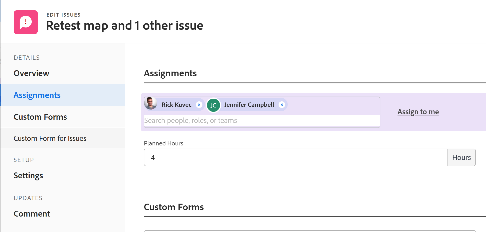

# Ändern von Benutzerzuweisungen für mehrere Probleme in einer Liste

<!--Audited: 07/2024-->
<!--

(NOTE: similar article exists for tasks)

-->

<!--
 

The highlighted information on this page refers to functionality not yet generally available. It is available only in the Preview environment for all customers. The same features will also be available in the Production environment for all customers starting with a week from the Preview release.      

For more information, see [Interface modernization](/help/quicksilver/product-announcements/product-releases/interface-modernization/interface-modernization.md).  

 -->

Sie können gleichzeitig Benutzerzuweisungen für mehrere Probleme ändern. Informationen zum Bearbeiten oder Zuweisen von Problemen einzeln finden Sie in den folgenden Artikeln:

* [Probleme bearbeiten](../../../manage-work/issues/manage-issues/edit-issues.md)
* [Probleme zuweisen](../../../manage-work/issues/manage-issues/assign-issues.md)

Allgemeine Informationen zum Zuweisen von Problemen finden Sie unter [Übersicht über das Ändern von Problemzuweisungen](../../../manage-work/issues/manage-issues/modify-issue-assignments-overview.md).

>[!NOTE]
>
>Sie müssen mindestens über die Berechtigung Beitragen für ein Problem verfügen, um Zuweisungen an das Problem vornehmen zu können.

## Zugriffsanforderungen

+++ Erweitern, um die Zugriffsanforderungen für die in diesem Artikel beschriebene Funktionalität anzuzeigen. 

<table style="table-layout:auto"> 
 <col> 
 <col> 
 <tbody> 
  <tr> 
   <td>Adobe Workfront-Paket</td> 
   <td> 
Beliebig
 </td> 
  </tr> 
  <tr> 
   <td>Adobe Workfront-Lizenz</td> 
   <td> 
Mitwirkender oder höher

   
Anfrage oder höher
 </td> 
  </tr> 
  <tr> 
   <td>Konfigurationen der Zugriffsebene</td> 
   <td> 
Zugriff auf Anfragen bearbeiten
 
Zugriff auf Projekte und Aufgaben anzeigen oder höher, um ein Problem zuzuweisen
 </td> 
  </tr> 
  <tr> 
   <td>Objektberechtigungen</td> 
   <td> 
Verwalten von Berechtigungen für das Problem
 
Tragen Sie Berechtigungen oder mehr zu dem Projekt oder der Aufgabe bei, in dem/der sich das Problem befindet, wenn Sie mehrere Probleme zuweisen.
  </td> 
  </tr> 
 </tbody> 
</table>

Weitere Informationen finden Sie unter [Zugriffsanforderungen in der Dokumentation zu Workfront](/help/quicksilver/administration-and-setup/add-users/access-levels-and-object-permissions/access-level-requirements-in-documentation.md).

+++

<!--

<h2>When to modify user assignments on issues</h2>

(NOTE:  drafted and moved to the overview article: Modify issue assignments overview)

You might want to modify the user assignments for multiple issues for a variety of  reasons, including the following:

<ul>
<li>Users join or leave  your team</li>
<li>A user takes a vacation that extends beyond the issue  due dates</li>
<li>A specific role or user is set as the assignee for multiple issues and you want to quickly modify all items to be assigned to a different user or role</li>
</ul>

-->

## Zuweisung für mehrere Anfragen ändern

1. Navigieren Sie zur Anfrageliste mit den Anfragen, deren Zuweisungen Sie ändern möchten.
1. (Optional) Erstellen Sie einen Filter, um nur Probleme anzuzeigen, die dem Verantwortlichen zugewiesen wurden, den Sie ändern möchten.

   Sie können beispielsweise einen Filter erstellen, um nur Probleme mit einer bestimmten Rolle als Verantwortlicher anzuzeigen.  Anschließend können Sie die Rolle durch einen bestimmten Benutzer ersetzen. Gehen Sie folgendermaßen vor:

   1. Klicken Sie auf **Dropdown** Liste Filter und dann auf **Neuer Filter**.

   1. Beginnen Sie im ersten Feld mit der Eingabe **Arbeitsauftragsrollen** und wählen Sie **Arbeitsauftragsrollen: Name** aus der Liste aus.
   1. Wählen Sie **Ist eines von** aus dem Dropdown-Menü des Modifikators aus, geben Sie dann den Namen einer Rolle ein und wählen Sie diese aus, wenn sie in der Liste angezeigt wird. Sie können mehrere Rollen eingeben.

      >[!TIP]
      >
      >Verwenden Sie nicht **Zugewiesen an** da sich dieses Feld nur auf den Problembesitzer und nicht auf alle Zugewiesenen bezieht.

      Die Liste der Probleme filtert automatisch nach Ihren Filterkriterien.
   1. (Optional) Klicken Sie auf **Als neu speichern** und dann auf **Speichern**.

1. Wählen Sie die Probleme aus, für die Sie Zuweisungen ändern möchten, und klicken Sie dann auf das **Bearbeiten**-Symbol .

   Die **Probleme bearbeiten** wird angezeigt. Die Anzahl der ausgewählten Elemente wird in der oberen linken Ecke der Seite angezeigt.

1. Klicken Sie **linken** auf „Arbeitsaufträge“ und dann auf das Symbol **x** neben dem Empfänger, den Sie entfernen möchten.

   >[!TIP]
   >
   >Nur Zugewiesene, die allen ausgewählten Problemen zugewiesen sind, werden im Bereich **Zuweisungen** angezeigt.

   

1. Beginnen Sie, den Namen eines Benutzers, einer Rolle oder eines Teams einzugeben, um Verantwortliche zu allen ausgewählten Problemen hinzuzufügen.

   >[!TIP]
   >
   >Sie können mehrere Benutzer, Aufgabengebiete oder Teams zuweisen. Sie können nur aktive Benutzer, Aufgabengebiete und Teams zuweisen.
   >
   >Wenn ein(e) Benutzende(r), ein Aufgabengebiet oder ein Team zugewiesen wurde, bevor sie/er deaktiviert wurden, bleiben sie/sie dem Arbeitselement zugewiesen. In diesem Fall empfehlen wir Folgendes:
   >
   >* Weisen Sie das Arbeitselement den aktiven Ressourcen neu zu.
   >* Verknüpfen Sie die Benutzer in einem deaktivierten Team mit einem aktiven Team und weisen Sie das Arbeitselement dem aktiven Team zu.

   Die hinzugefügten Bevollmächtigten werden zu den vorhandenen hinzugefügt. Sie ersetzen nicht die vorhandenen für jedes ausgewählte Problem.

1. (Optional) Klicken Sie auf **Mir zuweisen**, um alle Probleme sich selbst zuzuweisen.
1. Klicken Sie auf **Speichern**.

   <!--Old functionality for assignments for issues - before November 2025:
   1. (Conditional) In the Production environment, do the following: 
   1. Go to the **Assignments** section, then select **Assignee**.
      
   1. Do one of the following:
      1. To add a new assignee:
         1. Start typing the name of a user, role, or team, then select it when it displays in the list. The assignment is added and does not replace the current assignments on the selected issues.
         >[!TIP]
         >
         >You can assign multiple users, job roles, or teams. You can assign only active users, job roles, and teams.
         >
         >If a user, job role, or a team was assigned before they were deactivated, they remain assigned to the work item. In this case, we recommend the following:
         >
         >* Reassign the work item to active resources.
         >* Associate the users in a deactivated team with an active team and reassign the work item to the active team.
          Information that is common across all issues selected displays. For example, if the same user is assigned to all issues, that user displays in the **Assignee**  column. If information is not common across the issues selected, no information displays.
      1. To remove individual assignees:
         1. Click the **X icon** next to the name of the assignee that you want to remove if the assignee displays in the Assignments list.
            Or
            If the assignee that you want to remove does not display in the Assignments section because the assignee is assigned to only some of the issues that you have selected, click **Remove Assignee** and start typing the name of the assignee that you want to remove, then click the name when it appears in the drop-down list.
         1. Click  **Remove Assignee** again to add another assignee to remove.
      1. To remove all existing assignees:
         1. Click **Remove All Existing Assignees**, then click **Yes, Delete All Assignees**.
            This removes not only common assignees (assignees that are displayed in the edit  dialog box), but also all assignees on all the selected issues.
         1. (Optional) Modify any of the following options for the assignees you selected to associate with the issues:
          * **Issue Owner:**  Select the radio button to indicate which assignee is designated as the Issues Owner. If left unselected, Adobe Workfront designates the first assignee as the Issue Owner. This is not available for team assignments. 
            * **Assignee's Role**: Select a role from the drop-down list. If left unselected, Workfront automatically selects the Primary Role of the user.
      1. Click **Save Changes**.-->

