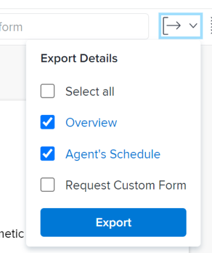
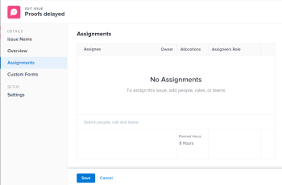

# Probleme bearbeiten

Sie können Informationen zu Problemen bearbeiten, die Sie erstellt haben oder die andere Benutzer erstellt haben, wenn sie die Probleme für Sie freigegeben haben.

Sie können ein einzelnes Problem bearbeiten oder Probleme in einer Liste bearbeiten. Weitere Informationen zum Bearbeiten von Problemen in einer Liste finden Sie unter [Probleme in einer Liste bearbeiten](../../../manage-work/issues/manage-issues/edit-issues-in-a-list.md).

## Zugriffsanforderungen

Sie müssen über folgenden Zugriff verfügen, um die Schritte in diesem Artikel ausführen zu können:

<table style="table-layout:auto"> 
 <col> 
 <col> 
 <tbody> 
  <tr> 
   <td role="rowheader">Adobe Workfront-Plan*</td> 
   <td> 
Alle 
 </td> 
  </tr> 
  <tr> 
   <td role="rowheader">Adobe Workfront-Lizenz*</td> 
   <td> 
Anforderung oder höher
 
Überprüfen Sie die oder eine höhere Lizenz, um Probleme im Abschnitt Probleme einer Aufgabe oder eines Projekts zu bearbeiten.
 </td> 
  </tr> 
  <tr> 
   <td role="rowheader">Zugriffsstufe*</td> 
   <td> 
Zugriff auf Probleme bearbeiten
 
<b>NOTIZ</b>

Wenn Sie immer noch keinen Zugriff haben, fragen Sie Ihren Workfront-Administrator, ob er zusätzliche Zugriffsbeschränkungen für Ihre Zugriffsebene festlegt. Informationen zum Zugriff auf Probleme in Ihrer Zugriffsebene finden Sie unter <a href="../../../administration-and-setup/add-users/configure-and-grant-access/grant-access-issues.md" class="MCXref xref">Zugriff auf Probleme gewähren</a>. Informationen dazu, wie ein Workfront-Administrator Ihre Zugriffsstufe ändern kann, finden Sie unter <a href="../../../administration-and-setup/add-users/configure-and-grant-access/create-modify-access-levels.md" class="MCXref xref">Benutzerdefinierte Zugriffsebenen erstellen oder ändern</a>. 
 </td>
</tr> 
  <tr> 
   <td role="rowheader">Objektberechtigungen</td> 
   <td> 
Beitragen Sie Berechtigungen zu einem Problem, um die folgenden Felder im Bereich Details zu bearbeiten: 

   <ul>
   <li>Beschreibung</li>
   <li>Status</li>
   <li>Schweregrad</li>
   </ul>
   
Berechtigungen für ein Problem verwalten, um alle Felder im Bereich Details oder im Feld Problem bearbeiten zu bearbeiten
 
 Informationen zum Gewähren von Berechtigungen für Probleme finden Sie unter <a href="../../../workfront-basics/grant-and-request-access-to-objects/share-an-issue.md" class="MCXref xref">Problem freigeben </a>
 
Informationen zum Anfordern zusätzlicher Berechtigungen finden Sie unter <a href="../../../workfront-basics/grant-and-request-access-to-objects/request-access.md" class="MCXref xref">Zugriff auf Objekte anfordern </a>.
 </td> 
  </tr> 
 </tbody> 
</table>

&#42;Wenden Sie sich an Ihren Workfront-Administrator, um zu erfahren, welchen Plan, welchen Lizenztyp oder welchen Zugriff Sie haben.

## Einschränkungen beim Bearbeiten von Problemen

Es gibt einige Einschränkungen, die Sie daran hindern können, Probleme zu bearbeiten.

* Probleme, die sich in einem Genehmigungsprozess befinden, können nicht bearbeitet werden. Sie können nur die Zeit protokollieren oder den Status eines Problems aktualisieren, das sich in Ausstehende Genehmigung befindet.
* Sie können Dokumente nur dann bearbeiten und zu Problemen in einem Projekt hinzufügen, deren Status &quot;Abgeschlossen&quot;, &quot;Dead&quot;oder &quot;Ausstehende Genehmigung&quot;lautet, wenn Ihr Workfront-Administrator oder ein Gruppenadministrator diese Funktion im Bereich &quot;Projekteinstellungen&quot;aktiviert haben. Weitere Informationen zum Festlegen von Projektvoreinstellungen finden Sie unter [Systemweite Projektvoreinstellungen konfigurieren](../../../administration-and-setup/set-up-workfront/configure-system-defaults/set-project-preferences.md).

## Einzelnes Problem bearbeiten

Sie können ein Problem in den Bereichen Problem bearbeiten oder Problemdetails bearbeiten. Die folgenden Schritte beschreiben die Bearbeitung eines Problems im Feld Problem bearbeiten .

1. Navigieren Sie zu **Hauptmenü**.
1. Klicks **Projekte** und klicken Sie dann auf den Namen eines Projekts, um das Projekt zu öffnen.
1. (Optional) Klicken Sie auf **Aufgaben** und klicken Sie dann auf den Namen einer Aufgabe, um die Aufgabe zu öffnen.
1. Klicks **Probleme** im linken Bereich.

   

1. (Optional) Um beschränkte Informationen zu einem Problem zu bearbeiten, klicken Sie auf **Problemdetails** im linken Bereich.

   >[!NOTE]
   >
   >Je nachdem, wie Ihr Workfront-Administrator oder Gruppenadministrator Ihre Layout-Vorlage geändert hat, werden die Felder im Bereich &quot;Problemdetails&quot;möglicherweise neu angeordnet oder nicht angezeigt. Weitere Informationen finden Sie unter [Detailansicht mithilfe einer Layoutvorlage anpassen](../../../administration-and-setup/customize-workfront/use-layout-templates/customize-details-view-layout-template.md).

   Gehen Sie wie folgt vor, um Informationen im Abschnitt Details zu bearbeiten:

   1. (Optional) Klicken Sie auf die **Alle reduzieren** in der oberen rechten Ecke, um alle Bereiche zu reduzieren.
   1. (Optional und bedingt) Wenn ein Bereich ausgeblendet wird, klicken Sie auf die Schaltfläche **Rechtspfeil**  neben jedem Bereich, um den Bereich zu erweitern, den Sie bearbeiten möchten.
   1. (Optional) Um ein benutzerdefiniertes Formular anzuhängen, geben Sie den Namen eines Formulars in die **Benutzerdefiniertes Formular hinzufügen** und wählen Sie es aus, wenn es in der Liste angezeigt wird, und klicken Sie dann auf **Änderungen speichern**.
   1. (Optional) Klicken Sie auf die **Export** icon  , um die Übersicht und die benutzerdefinierten Formulardaten in eine PDF-Datei zu exportieren, und klicken Sie dann auf **Export**. Wählen Sie aus den folgenden Optionen aus:

      * Alle auswählen (wird nur angezeigt, wenn mindestens ein benutzerdefiniertes Formular angehängt ist)
      * Übersicht
      * Der Name eines oder mehrerer benutzerdefinierter Formulare

      Die PDF-Datei wird auf Ihren Computer heruntergeladen.

      

      Weitere Informationen finden Sie unter [Exportieren benutzerdefinierter Formulare und Objektdetails](../../../workfront-basics/work-with-custom-forms/export-custom-forms-details.md).

   Informationen zu den Feldern, die im Abschnitt Problemdetails angezeigt werden, erhalten Sie, wenn Sie das Problem im Feld Problem bearbeiten weiter bearbeiten, wie unten beschrieben.

1. Um alle Informationen zu einem Problem zu bearbeiten, wählen Sie ein Problem in einer Liste aus und klicken Sie auf **Bearbeiten** oben in der Liste

   Oder

   Klicken Sie auf den Namen eines Problems in einer Liste und dann auf die Schaltfläche **Mehr** Menü neben dem Problemnamen und **Bearbeiten.**

   Die **Problem bearbeiten** angezeigt.

   >[!IMPORTANT]
   >
   >Sie müssen über Verwaltungsberechtigungen für das Problem verfügen, damit der Link Bearbeiten angezeigt wird.

   Alle Problemfelder sind im Feld Problem bearbeiten verfügbar und werden nach den im linken Bereich aufgelisteten Bereichen gruppiert.

1. Ziehen Sie in Erwägung, Informationen in einem der folgenden Abschnitte anzugeben:

   * [Name des Problems](#issue-name)
   * [Übersicht](#overview)
   * [Arbeitsaufträge](#assignments)
   * [Benutzerdefinierte Formulare](#Custom%C2%A0F)
   * [Einstellungen](#settings)

   >[!NOTE]
   >
   >Je nachdem, wie Ihr Workfront-Administrator unsere Layoutvorlage eingerichtet hat, unterscheiden sich die Felder im Feld &quot;Problem bearbeiten&quot;möglicherweise in Ihrer Umgebung. Weitere Informationen finden Sie unter [Detailansicht mithilfe einer Layoutvorlage anpassen](../../../administration-and-setup/customize-workfront/use-layout-templates/customize-details-view-layout-template.md).
   >
   >Die meisten in den folgenden Abschnitten aufgelisteten Felder sind auch über das Feld Neues Problem verfügbar, wenn Sie ein Problem erstellen. Die Abschnitte, unter denen sich die Felder befinden, stimmen nicht mit dem Feld Neues Problem überein. Informationen zum Erstellen von Problemen finden Sie unter [Erstellen von Problemen](../../issues/manage-issues/create-issues.md).

### Name des Problems {#issue-name}

1. Beginnen Sie mit der Bearbeitung eines Problems wie oben beschrieben.
1. Klicks **Problemname**.

   

1. Aktualisieren Sie die **Problemname** -Feld.
1. Klicks **Speichern** oder fahren Sie mit der Bearbeitung der folgenden Abschnitte fort.

### Übersicht {#overview}

1. Beginnen Sie mit der Bearbeitung eines Problems wie oben beschrieben.
1. Klicks **Übersicht**.

   

1. Aktualisieren oder überprüfen Sie eines der Felder in der folgenden Tabelle:

   <table style="table-layout:auto"> 
    <col> 
    <col> 
    <tbody> 
     <tr> 
      <td role="rowheader">Beschreibung</td> 
      <td> 
Fügen Sie zusätzliche Informationen zum Problem hinzu.
 </td> 
     </tr> 
     <tr> 
      <td colspan="2" role="rowheader">Abschnitt mit grundlegenden Informationen</td> 
     </tr> 
     <tr> 
      <td role="rowheader">Status</td> 
      <td> 
Wählen Sie den Status des Problems aus. Weitere Informationen zum Status von Problemen finden Sie unter <a href="../../../administration-and-setup/customize-workfront/creating-custom-status-and-priority-labels/issue-statuses.md" class="MCXref xref">Zugriff auf die Liste der Systemfehlerstatus</a>. 
 </td> 
     </tr> 
     <tr> 
      <td role="rowheader">Priorität</td> 
      <td> 
Dies ist eine visuelle Kennzeichnung, mit der Sie Probleme priorisieren können.
 
Wählen Sie aus den folgenden Optionen aus:
 
       <ul> 
        <li> 
<strong>Keines</strong> 
 </li> 
        <li> 
<strong>Niedrig</strong> 
 </li> 
        <li> 
<strong>Normal</strong> 
 </li> 
        <li> 
<strong>Hoch</strong> 
 </li> 
        <li> 
<strong>Dringend</strong> 
 </li> 
       </ul> 
Je nach den von Ihrem Workfront-Administrator ausgewählten Projekteinstellungen können die Prioritätsnamen für Sie unterschiedlich sein. Weitere Informationen zu Bearbeitungsprioritäten finden Sie unter <a href="../../../administration-and-setup/customize-workfront/creating-custom-status-and-priority-labels/create-customize-priorities.md" class="MCXref xref">Erstellen und Anpassen von Prioritäten</a>.
 </td> 
     </tr> 
     <tr> 
      <td role="rowheader">Schweregrad</td> 
      <td> 
Dies ist eine visuelle Markierung, die anzeigt, wie schwerwiegend das im Problem beschriebene Problem ist. Schweregrad ist spezifisch für Probleme. Wählen Sie aus den folgenden Optionen aus:
 
       <ul> 
        <li> 
Kosmetisch
 </li> 
        <li> 
Verwirrend
 </li> 
        <li> 
Programmfehler mit Umgehungslösung
 </li> 
        <li> 
Programmfehler ohne Umgehungslösung
 </li> 
        <li> 
Schwerer Fehler
 </li> 
       </ul> 
Je nach den von Ihrem Workfront-Administrator ausgewählten Projekteinstellungen können die Schweregrade für Sie unterschiedlich sein. Weitere Informationen zu Bearbeitungsschwerpunkten finden Sie unter <a href="../../../administration-and-setup/customize-workfront/creating-custom-status-and-priority-labels/create-customize-issue-severities.md" class="MCXref xref">Erstellen oder Anpassen von Problemschwerpunkten</a>.
 </td> 
     </tr> 
     <tr> 
      <td role="rowheader">URL</td> 
      <td> 
Geben Sie einen Web-Link ein, der sich auf die Informationen zum Problem bezieht.
 </td> 
     </tr> 
     <tr> 
      <td role="rowheader">Typ</td> 
      <td> 
Je nach den Eigenschaften der Warteschlange, die Ihr Projektmanager im Bereich Warteschlangendetails des Projekts ausgewählt hat, können Sie möglicherweise den Typ des Problems angeben. Wählen Sie aus den folgenden Optionen in <b>Typ</b> Dropdown-Menü: 
 
       <ul> 
        <li> 
<strong>Fehlerbericht</strong> 
 </li> 
        <li> 
<strong>Reihenfolge ändern</strong> 
 </li> 
        <li> 
<strong>Problem</strong> 
 </li> 
        <li> 
<strong>Anfrage</strong> 
 </li> 
       </ul> 
Je nach den von Ihrem Workfront-Administrator ausgewählten Projekteinstellungen können die Namen der Probleme für Sie unterschiedlich sein.
 </td> 
     </tr> 
     <tr> 
      <td role="rowheader">Hauptansprechpartner</td> 
      <td>Standardmäßig ist der Primäre Kontakt der Ersteller des Problems. Um dies zu ändern, geben Sie den Namen eines aktiven Benutzers in Workfront ein und wählen Sie ihn dann aus der Liste aus. Ein Problem kann nur einen Primären Kontakt haben.  Wenn Sie den Primären Kontakt ändern, hat der ursprüngliche Hauptkontakt weiterhin Zugriff auf das Problem verwalten . Sie müssen diesen Zugriff beim Freigeben eines Problems manuell aus dem Feld "Problemzugriff"entfernen.

   <b>TIPP</b>

   
Beachten Sie beim Hinzufügen eines Primären Kontaktbenutzers den Avatar, die Primäre Rolle des Benutzers und seine E-Mail-Adresse, um zwischen Benutzern mit identischen Namen zu unterscheiden. Benutzer müssen mindestens einer Auftragsrolle zugeordnet sein, damit sie beim Hinzufügen angezeigt werden können.

      
 Sie müssen die Einstellung Kontaktinformationen anzeigen auf Ihrer Zugriffsebene aktivieren, damit Benutzer E-Mails von Benutzern anzeigen können. Weitere Informationen finden Sie unter <a href="../../../administration-and-setup/add-users/configure-and-grant-access/grant-access-other-users.md">Benutzern Zugriff gewähren</a>.

   </td> 
     </tr> 
     <tr> 
      <td role="rowheader">Datum und Uhrzeit der Veröffentlichung</td> 
      <td> 
Dies ist das Datum, an dem der Bevollmächtigte der Ausgabe schätzt, dass das Problem abgeschlossen sein wird. Nur Beauftragte können dieses Feld bearbeiten.
 </td> 
     </tr> 
     <tr> 
      <td role="rowheader">Geplantes Startdatum</td> 
      <td>Standardmäßig ist das geplante Startdatum das Datum und die Uhrzeit der Erstellung des Problems. Sie können die <strong>Geplantes Startdatum</strong> des Problems. </td> 
     </tr> 
     <tr> 
      <td role="rowheader">Geplantes Abschlussdatum und -zeit</td> 
      <td> Standardmäßig beträgt das geplante Abschlussdatum 24 Stunden ab dem standardmäßigen geplanten Startdatum. Standardmäßig haben Probleme eine Dauer von 1 Tag. Sie können die <strong>Geplantes Abschlussdatum</strong> des Problems.</td> 
     </tr> 
     <tr> 
      <td role="rowheader">Tatsächliches Startdatum und -zeit</td> 
      <td>Das tatsächliche Startdatum wird automatisch ausgefüllt, wenn Sie den Status des Problems in <strong>In Bearbeitung</strong>. Sie können die <strong>Tatsächliches Startdatum</strong> des Problems. Sie können das Datum bei Bedarf manuell aktualisieren. </td> 
     </tr> 
     <tr> 
      <td role="rowheader">Datum und Uhrzeit des tatsächlichen Abschlusses</td> 
      <td>Das tatsächliche Abschlussdatum wird automatisch ausgefüllt, wenn Sie den Status des Problems in <strong>Geschlossen</strong> oder<strong>Gelöst</strong>. Sie können die <strong>Tatsächliches Abschlussdatum</strong> für das Problem. Sie können das Datum bei Bedarf manuell aktualisieren.</td> 
     </tr> 
     <tr> 
      <td role="rowheader">Gelöst von</td> 
      <td> 
Dies zeigt, ob das Problem durch ein anderes Objekt gelöst wurde. Sie können aus dem Dropdown-Menü auswählen, ob dieses Problem durch eine Aufgabe, ein Projekt oder ein anderes Problem behoben wird, und dann mit der Eingabe des Namens der Aufgabe, des Projekts oder des Problems beginnen, das das Problem beheben wird. Wählen Sie sie aus, wenn sie in der Liste angezeigt wird.

   <b>NOTE</b>

   Wenn Sie ein Objekt auswählen, um ein Problem zu beheben, wird der Problemstatus mit dem Status des auflösenden Objekts verknüpft und kann in Bezug auf das Problem nicht geändert werden. Weitere Informationen zum Auflösen von Objekten finden Sie unter <a href="../../../manage-work/issues/convert-issues/resolving-and-resolvable-objects.md" class="MCXref xref">Übersicht über das Auflösen und Auflösen von Objekten </a>.

   <b>TIPP</b>

   Wenn Ihr System- oder Gruppenadministrator das Feld &quot;Gelöst von&quot;zu einer benutzerdefinierten Problemkopfzeile hinzufügt, ändert sich das Feld in &quot;Beheben eines Problems&quot;, &quot;Auflösen von Aufgaben&quot;oder &quot;Lösen eines Projekts&quot;, wenn mit dem Problem ein aufgelöstes Objekt verknüpft ist.

   Sie können dieses Feld nicht bearbeiten, wenn es in der Kopfzeile des Problems angezeigt wird. Weitere Informationen zum Anpassen von Problemkopfzeilen finden Sie unter <a href="../../../administration-and-setup/customize-workfront/use-layout-templates/customize-object-headers.md">Objektüberschriften mithilfe einer Layoutvorlage anpassen </a>
   </td> 
     </tr>

   <tr> 
      <td role="rowheader">Beheben von Problemen, Auflösen von Aufgaben oder Auflösen von Projekten</td> 
      <td>Der verknüpfte Name des Problems, der Aufgabe oder des Problems, das das Problem behebt.  </td> 
     </tr> 
      <tr> 
      <td role="rowheader">Dies löst</td> 
      <td>Der verknüpfte Name des Problems, das abgeschlossen wird, wenn das Problem, auf das Sie zugreifen, behoben wurde.  </td> 
     </tr>

   </tbody> 
   </table>

1. Klicks **Speichern** oder fahren Sie mit der Bearbeitung der folgenden Abschnitte fort.

#### Arbeitsaufträge {#assignments}

1. Beginnen Sie mit der Bearbeitung des Problems wie oben beschrieben.
1. Klicks **Zuweisungen** im linken Bereich.

   

1. Klicks **Suchen nach Personen, Rollen und Teams** und geben Sie den Namen eines Benutzers, einer Rolle oder eines Teams ein, den/das Sie der Aufgabe zuweisen möchten, und klicken Sie dann auf die Aufgabe oder drücken Sie die Eingabetaste , wenn sie in der Liste angezeigt wird.

   <!--
   
(NOTE: ensure this is still called this; asked Anna to change it to "roles" and add a comma)

   -->

   >[!NOTE]
   >
   >Wenn der Name des Benutzers ein Sonderzeichen enthält, müssen Sie das Sonderzeichen in das Suchfeld einfügen.

   >[!TIP]
   >
   >Sie können mehrere Benutzer, Auftragsrollen oder Teams zuweisen. Sie können nur aktive Benutzer, Stellenrollen und Teams zuweisen.
   >
   >
   >Wenn ein Benutzer, eine Rolle oder ein Team zugewiesen wurde, bevor sie deaktiviert wurden, bleiben sie dem Arbeitselement zugewiesen. In diesem Fall empfehlen wir Folgendes:
   >
   >* Weisen Sie das Arbeitselement aktiven Ressourcen erneut zu.
   >* Verknüpfen Sie die Benutzer in einem deaktivierten Team mit einem aktiven Team und weisen Sie das Arbeitselement dem aktiven Team erneut zu.

1. (Optional) Geben Sie an, ob ein Bevollmächtigter der Hauptverantwortliche für das Problem ist, indem Sie den Mauszeiger über den Namen des Bevollmächtigten bewegen und auf **Primär machen**. Ein Team kann nicht der Hauptverantwortliche eines Problems sein.
1. Aktualisieren Sie die folgenden Felder:

   <table style="table-layout:auto"> 
    <col> 
    </col> 
    <col> 
    </col> 
    <tbody> 
     <tr> 
      <td role="rowheader">Geplante Stunden</td> 
      <td> 
Dies ist die tatsächliche Zeit, die die Bevollmächtigten des Problems benötigen würden, um es abzuschließen. Geben Sie die Anzahl der geplanten Stunden für das Problem ein. 
 
Hinweis: Wenn Sie die geplanten Stunden des Problems ändern, ändert sich das geplante Abschlussdatum nicht. 
 </td> 
     </tr> 
     <tr data-mc-conditions=""> 
      <td role="rowheader">Rolle des Zugewiesenen</td> 
      <td> 
Wählen Sie eine Rolle aus dem <strong>Rolle des Bevollmächtigten</strong> Dropdown-Menü, wenn Sie eine Person als Bevollmächtigten ausgewählt haben. Dies ist die Rolle, die der Bevollmächtigte in dieser Frage erfüllen kann. 
 
<b>TIPP</b>

   Im Dropdown-Menü werden nur die mit jedem Bevollmächtigten in seinem Profil verknüpften Vorgangsrollen angezeigt.
 </td>
   </tr> 
    </tbody> 
   </table>

1. Klicks **Speichern** oder fahren Sie mit der Bearbeitung der folgenden Abschnitte fort.

### Benutzerdefinierte Forms

1. Beginnen Sie mit der Bearbeitung eines Problems wie oben beschrieben.
1. Klicks **Benutzerdefinierte Forms**.

   

1. Im **Benutzerdefiniertes Formular hinzufügen** ein, wählen Sie das benutzerdefinierte Formular oder die Formulare aus, die Sie mit dem Problem verknüpfen möchten. Sie müssen die benutzerdefinierten Formulare erstellen, bevor sie in diesem Feld ausgewählt werden können. In der Liste werden nur aktive benutzerdefinierte Formulare angezeigt. Weitere Informationen zum Erstellen benutzerdefinierter Formulare finden Sie unter [Benutzerdefiniertes Formular erstellen oder bearbeiten](../../../administration-and-setup/customize-workfront/create-manage-custom-forms/create-or-edit-a-custom-form.md). Sie können einem Problem bis zu zehn benutzerdefinierte Formulare hinzufügen.

1. (Bedingt) Wenn Sie ein benutzerdefiniertes Formular an das Problem angehängt haben, bearbeiten Sie alle Felder im Formular. Sie müssen alle erforderlichen Felder angeben, bevor Sie das Problem speichern können.

   >[!NOTE]
   >
   >Je nachdem, wie Ihr Workfront-Administrator die Berechtigungen für die Abschnitte in Ihrem benutzerdefinierten Formular festgelegt hat, können nicht alle die gleichen Felder in einem bestimmten benutzerdefinierten Formular anzeigen oder bearbeiten. Die Berechtigungen zum Bearbeiten von Feldern in einem Abschnitt eines benutzerdefinierten Formulars hängen von den Berechtigungen ab, die Sie für das Problem selbst haben. Informationen zum Festlegen von Berechtigungen für Abschnitte eines benutzerdefinierten Formulars finden Sie unter [Benutzerdefiniertes Formular erstellen oder bearbeiten](../../../administration-and-setup/customize-workfront/create-manage-custom-forms/create-or-edit-a-custom-form.md). Informationen zum Festlegen von Berechtigungen für Probleme finden Sie unter [Problem freigeben](../../../workfront-basics/grant-and-request-access-to-objects/share-an-issue.md).

1. Klicks **Speichern** oder fahren Sie mit der Bearbeitung des folgenden Abschnitts fort.

### Einstellungen {#settings}

1. Beginnen Sie mit der Bearbeitung eines Problems wie oben beschrieben.
1. Klicks **Einstellungen**.

   

   Aktualisieren Sie die folgenden Informationen:

   <table style="table-layout:auto"> 
    <col> 
    </col> 
    <col> 
    </col> 
    <tbody> 
     <tr> 
      <td role="rowheader">Genehmigungsprozess</td> 
      <td> 
       
 
       
Wählen Sie einen Genehmigungsprozess aus, den Sie mit dem Problem verknüpfen möchten. Ihr Workfront-Administrator muss Genehmigungsprozesse auf Systemebene definieren, bevor Sie sie mit Problemen verknüpfen können. Benutzer mit Administratorzugriff auf Genehmigungsprozesse  Sie können auch gruppenspezifische Validierungsprozesse erstellen.Weitere Informationen zum Erstellen von Genehmigungsprozessen finden Sie unter <a href="../../../administration-and-setup/customize-workfront/configure-approval-milestone-processes/create-approval-processes.md" class="MCXref xref">Erstellen eines Genehmigungsprozesses für Arbeitselemente</a>. 
 
       
Beachten Sie beim Hinzufügen von Validierungsprozessen Folgendes: 
 
       <ul> 
       <li>In der Liste werden nur aktive Validierungsprozesse angezeigt. </li> 
       <li> 
Systemweite und gruppenspezifische Validierungsprozesse werden in der Liste angezeigt. Ein Genehmigungsprozess, der mit einer anderen Gruppe als der des Projekts verknüpft ist, wird nicht in der Liste angezeigt.
 
Wichtig: Wenn sich die Gruppe des Projekts ändert, wird der gruppenspezifische Validierungsprozess zu einem Validierungsprozess für die einmalige Verwendung. Weitere Informationen dazu, wie sich Änderungen an der Projektgruppe oder Änderungen im Genehmigungsprozess auf die Validierungseinstellungen auswirken, finden Sie unter <a href="../../../administration-and-setup/customize-workfront/configure-approval-milestone-processes/how-changes-affect-group-approvals.md" class="MCXref xref">Auswirkungen von Änderungen am Gruppen- und Genehmigungsprozess auf zugewiesene Genehmigungsprozesse</a>. 
 </li> 
       <li> 
Sie können Standardgenehmigungsverfahren definieren, die automatisch an Probleme angehängt werden, wenn Anforderungswarteschlangen oder Warteschlangenthemen erstellt werden. Informationen zum Aktualisieren von Warteschlangendetails finden Sie unter <a href="../../../manage-work/requests/create-and-manage-request-queues/create-request-queue.md" class="MCXref xref">Erstellen einer Anforderungswarteschlange</a>. Informationen zum Erstellen von Warteschlangenthemen finden Sie unter <a href="../../../manage-work/requests/create-and-manage-request-queues/create-queue-topics.md" class="MCXref xref">Erstellen von Warteschlangenthemen</a>. 
 </li> 
       <li>Bei Problemen mit der Massenbearbeitung gibt es die folgenden Szenarien: 
       <ul> 
       <li>
Wenn Sie mehrere Probleme aus derselben Gruppe auswählen, werden in diesem Feld sowohl systemspezifische als auch gruppenspezifische Validierungsprozesse angezeigt.
</li> 
       <li>
Wenn Sie mehrere Probleme aus verschiedenen Gruppen auswählen, werden in diesem Feld nur Validierungsprozesse auf Systemebene angezeigt.
</li> 
       <li>
Wenn an eines der Probleme ein Validierungsprozess für die einmalige Verwendung angehängt ist, wird dieser durch den von Ihnen ausgewählten Validierungsprozess auf Systemebene oder Gruppenebene ersetzt. 
</li> 
       </ul></li> 
       </ul> 
       
 </td> 
     </tr> 
     <tr> 
      <td role="rowheader">Erinnerungsnachrichten</td> 
      <td> 
Aktivieren Sie das Kontrollkästchen, für das Sie diesem Problem Erinnerungsbenachrichtigungen hinzufügen möchten. Alle Erinnerungsbenachrichtigungen für Probleme werden angezeigt. Ihr Workfront-Administrator muss Erinnerungsbenachrichtigungen konfigurieren, bevor Sie sie zu einem Problem auswählen können. Weitere Informationen zum Konfigurieren von Erinnerungsbenachrichtigungen finden Sie unter <a href="../../../administration-and-setup/manage-workfront/emails/set-up-reminder-notifications.md" class="MCXref xref">Einrichten von Erinnerungsbenachrichtigungen</a>
 </td> 
     </tr> 
    </tbody> 
   </table>

1. Klicks **Speichern Sie.**

## Ein Problem in der Kopfzeile des Problems bearbeiten (begrenzt)

Sie können eine begrenzte Anzahl von Informationen in der Kopfzeile des Problems bearbeiten.

Ihr System- oder Gruppenadministrator kann die Felder anpassen, die in der Kopfzeile des Problems angezeigt werden. Weitere Informationen finden Sie unter [Objektüberschriften mithilfe einer Layoutvorlage anpassen](../../../administration-and-setup/customize-workfront/use-layout-templates/customize-object-headers.md).

Die folgenden Felder sind standardmäßig in der Kopfzeile des Problems enthalten:

* Name des Problems
* Prozent abgeschlossen
* Arbeitsaufträge
* Geplantes Abschlussdatum und -zeit
* Status
* Entscheidungsfindung bei Genehmigungseinstellungen, wenn Sie in einem aktuellen Genehmigungsprozess als Genehmiger festgelegt sind
