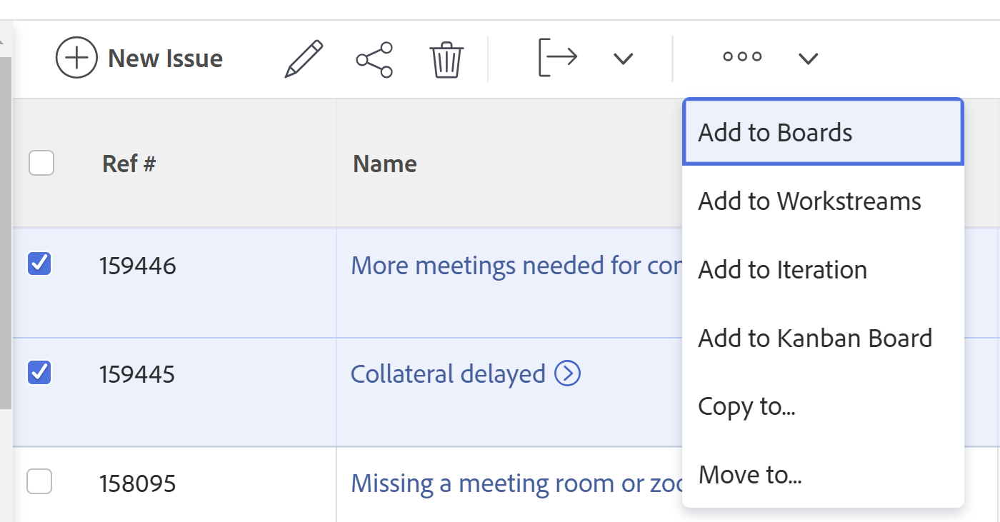
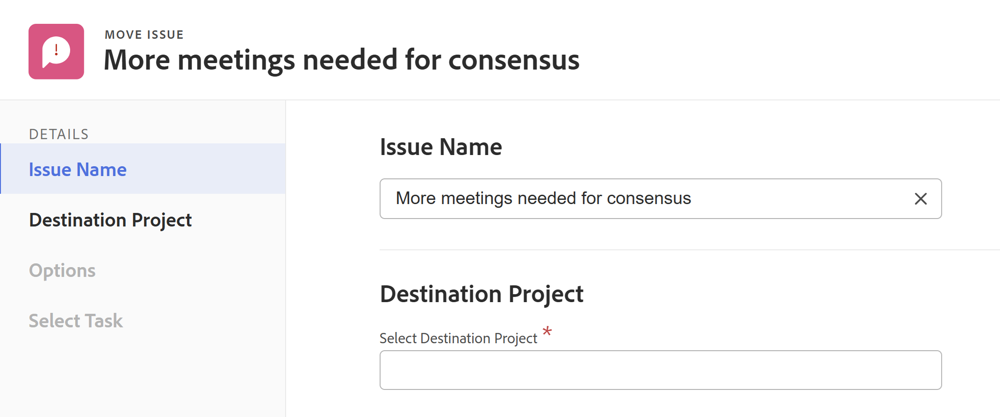

# Probleme verschieben

<!--Audited: 12/2024-->

<!--
The highlighted information on this page refers to functionality not yet generally available. It is available only in the Preview environment for all customers. After the release to Preview, the same features are also available monthly in the Production environment for customers who enabled fast releases.    

For information about fast releases, see [Enable or disable fast releases for your organization](/help/quicksilver/administration-and-setup/set-up-workfront/configure-system-defaults/enable-fast-release-process.md). 
-->

Sie können Probleme zwischen den folgenden Objekten verschieben:

* Von einem Projekt zu einem anderen Projekt
* Von einer Aufgabe zu einer anderen Aufgabe im selben Projekt oder in einem anderen Projekt
* Von einer Aufgabe zum Projekt oder zu einem anderen Projekt
* Von einem Projekt zu einer Aufgabe im selben Projekt oder einer Aufgabe in einem anderen Projekt

## Zugriffsanforderungen

+++ Erweitern, um die Zugriffsanforderungen für die in diesem Artikel beschriebene Funktionalität anzuzeigen. 

<table style="table-layout:auto"> 
 <col> 
 <col> 
 <tbody> 
  <tr> 
   <td role="rowheader">Adobe Workfront-Paket</td> 
   <td> 
Beliebig
 </td> 
  </tr> 
  <tr> 
   <td role="rowheader">Adobe Workfront-Lizenz</td> 
   <td> 
   <ul><li>Mitwirkende oder höher</li>
   <li>Leicht oder höher, um Probleme im Abschnitt Probleme eines Projekts zu verschieben</li></ul>
   Oder:
   <ul>   <li>
Anfragende oder höher
</li>
   <li>
Überprüfen Sie die Lizenz oder eine höhere Lizenz zum Verschieben von Problemen im Abschnitt „Probleme“ eines Projekts.
</li></ul>   
     </td> 
  </tr> 
  <tr> 
   <td role="rowheader">Konfigurationen der Zugriffsebene</td> 
   <td> 
Zugriff auf Anfragen bearbeiten
 
Anzeigen oder Hochladen des Zugriffs auf Projekte und Aufgaben
 </td> 
  </tr> 
  <tr> 
   <td role="rowheader">Objektberechtigungen</td> 
   <td> 
Verwalten von Berechtigungen für das Problem
 
Sie können Berechtigungen mit der Möglichkeit, Probleme hinzuzufügen, an das Element beitragen, in das Sie das Problem verschieben.</td> 
  </tr> 
 </tbody> 
</table>

*Weitere Informationen finden Sie unter [Zugriffsanforderungen in der Dokumentation zu Workfront](/help/quicksilver/administration-and-setup/add-users/access-levels-and-object-permissions/access-level-requirements-in-documentation.md).

+++

<!--
Old:

<table style="table-layout:auto"> 
 <col> 
 <col> 
 <tbody> 
  <tr> 
   <td role="rowheader">Adobe Workfront plan</td> 
   <td> 
Any
 </td> 
  </tr> 
  <tr> 
   <td role="rowheader">Adobe Workfront license*</td> 
   <td> 
New:
 
   <ul><li>Contributor or higher</li>
   <li>Light or higher to move issues in the Issues section of a project</li></ul>
   
Current:

   <ul>
   <li>
Request or higher
</li>
   <li>
Review or higher license to move issues in the Issues section of a project.
</li></ul>   
     </td> 
  </tr> 
  <tr> 
   <td role="rowheader">Access level configurations</td> 
   <td> 
Edit access to Issues
 
View or higher access to Projects and Tasks
 </td> 
  </tr> 
  <tr> 
   <td role="rowheader">Object permissions</td> 
   <td> 
Manage permissions to the issue
 
Contribute permissions to the item where you are moving the issue with the ability to Add Issues.</td> 
  </tr> 
 </tbody> 
</table>
-->

## Überlegungen zum Verschieben von Problemen

Beachten Sie beim Verschieben von Problemen, die Dokumente enthalten oder mit einer Anfrage-Warteschlange verbunden sind, Folgendes:

* Ihr System- oder Gruppenadministrator kann verhindern, dass Probleme, bei denen Stunden protokolliert wurden, verschoben werden, je nachdem, wie er die Voreinstellung Benutzer dürfen Aufgaben verschieben konfiguriert hat, und Probleme mit protokollierten Stunden im Bereich Setup . Weitere Informationen finden Sie [Konfigurieren von systemweiten Aufgaben- und Problemvoreinstellungen](/help/quicksilver/administration-and-setup/set-up-workfront/configure-system-defaults/set-task-issue-preferences.md).

* **Wenn ein Problem mit einer Anfrage-Warteschlange verknüpft ist:** Wenn Sie ein Problem in ein anderes Objekt verschieben und das Problem mit einer Anfrage-Warteschlange verknüpft ist, ist das verschobene Problem nicht mehr mit der ursprünglichen Warteschlange verknüpft, von der das erste Problem stammt.
* **Wenn ein Dokument an das Problem angehängt wird:** Wenn Sie ein Problem in ein anderes Objekt verschieben und dem Problem ein Dokument angehängt ist, werden das Dokument, seine Versionen und Korrekturabzüge auch an das neue Problem angehängt. Genehmigungen, die mit dem Dokument verknüpft sind, werden nicht verschoben.
* **Wenn ein Problem mit einem Dokument oder Ordner verknüpft ist:** Wenn Sie ein Problem verschieben, das Dokumente oder Ordner mit einem Drittanbieterdienst wie Google Drive verknüpft hat, werden die Links zu den Dokumenten mit dem Problem verschoben.
* **Wenn Sie Probleme zwischen Projekten mit verschiedenen Speichertypen verschieben**: Sie können ein Problem nicht aus einem alten Workfront-Speicherprojekt in ein Adobe-Cloud-Speicherprojekt kopieren. Auch das Gegenteil ist wahr. Ihre Workfront-Instanz verfügt möglicherweise nicht über beide Arten von Dokumentspeicher.

  Weitere Informationen finden Sie unter [Übersicht über das Dokumentenmanagement für Projekte und zugehörige Objekte](/help/quicksilver/manage-work/projects/manage-projects/manage-documents-on-projects.md).

## Probleme in einer Liste verschieben

Sie können ein oder mehrere Probleme aus einer Problemliste oder einem Problembericht verschieben.

1. Wechseln Sie zu dem Projekt, das das Problem oder die Probleme enthält, das/die Sie verschieben möchten.

   ODER

   Zu einem Problembericht gehen.

1. Wenn Sie sich für ein Projekt entschieden haben, klicken Sie im **Bereich auf** Probleme“.
1. Wählen Sie das zu verschiebende Problem bzw. die zu verschiebenden Probleme aus und klicken Sie oben in der Problemliste auf **Mehr** und dann auf **Verschieben nach**.

   

1. Fahren Sie mit dem Verschieben der Probleme fort, wie im Abschnitt [Verschieben eines einzelnen Problems](#move-a-single-issue) beschrieben, beginnend mit Schritt 2.

## Einzelnes Problem verschieben {#move-a-single-issue}

Sie können ein Problem beim Anzeigen verschieben.

### Einzelnes Problem verschieben

1. Gehen Sie zu einem Problem, das Sie verschieben möchten, und klicken Sie auf das Menü **Mehr**  rechts neben dem Problemnamen und dann auf **Verschieben nach**.

   

   Das **Problem verschieben** wird angezeigt.

   

1. Geben **im Abschnitt „Zielprojekt auswählen** den Namen des Projekts an, in das Sie die Probleme verschieben möchten. Der Name des aktuellen Projekts wird standardmäßig angezeigt.

   >[!TIP]
   >
   >In der Liste werden nur 100 Projekte angezeigt.

1. (Bedingt) Klicken Sie auf **Zugriff anfordern** wenn Sie keinen Zugriff haben, um Probleme in das Projekt zu verschieben.
1. (Bedingt) Das Problem wird weiterhin in das ausgewählte Zielprojekt verschoben, ohne Zugriff anzufordern, wenn Sie Zugriff zum Hinzufügen von Problemen zu einer der Aufgaben im Zielprojekt haben.

   

   >[!TIP]
   >
   >Ähnliche Meldungen werden angezeigt, wenn das ausgewählte Projekt ausstehend, genehmigt, abgeschlossen oder eingestellt ist und der Workfront-Administrator das Hinzufügen von Problemen zu diesen Projekten verhindert. Weitere Informationen finden Sie unter [Systemweite Projektvoreinstellungen konfigurieren](../../../administration-and-setup/set-up-workfront/configure-system-defaults/set-project-preferences.md).

1. (Optional) Heben Sie im **Optionen** die Auswahl eines der in der folgenden Tabelle aufgelisteten Elemente auf, um sie aus dem verschobenen Problem zu entfernen. Alle Optionen sind standardmäßig ausgewählt.

   >[!IMPORTANT]
   >
   >Wenn Sie Elemente in der Optionsliste deaktivieren, gehen Daten verloren. Informationen aus dem vorhandenen Problem werden entfernt und können nicht wiederhergestellt werden.

   <table style="table-layout:auto"> 
    <col> 
    <col> 
    <tbody> 
     <tr> 
      <td role="rowheader">Alle auswählen</td> 
      <td>Deaktivieren Sie diese Option, um alle Informationen aus dem Problem zu entfernen, wenn es an die neue Position verschoben wird. </td> 
     </tr> 
     <tr> 
      <td role="rowheader">Arbeitsaufträge</td> 
      <td>Entfernt Benutzende, Aufgabengebiete oder Teams, die dem Problem zugewiesen sind.</td> 
     </tr> 
     <tr> 
      <td role="rowheader">Fortschritt</td> 
      <td>Entfernt den Prozentwert der Fertigstellung (falls vorhanden) des Problems. </td> 
     </tr> 
     <tr> 
      <td role="rowheader">
Dokumente
</td> 
      <td> 
Entfernt alle Elemente auf der Registerkarte „Dokumente“, einschließlich Dokumentversionen, verknüpfter Dokumente und Ordner.

   <b>HINWEIS</b>

   Wenn Sie sich dafür entscheiden, die Dokumente nicht mit dem Problem verschieben zu lassen, werden die Dokumente gelöscht und für 30 Tage in den Papierkorb gelegt. Ein Administrator kann sie wiederherstellen und sie werden bei dem verschobenen Problem wiederhergestellt.

   Wenn das Problem nach dem Verschieben gelöscht wird, werden die wiederhergestellten Dokumente im Bereich Dokumente der Benutzerseite des Administrators platziert, der sie wiederherstellt.
     
 </td>
   </tr> 
     <tr> 
      <td role="rowheader">Berechtigungen</td> 
      <td>Entfernt die Entitäten, für die das Problem freigegeben ist. </td> 
     </tr> 
     <tr> 
      <td role="rowheader">Updates</td> 
      <td>Entfernt Kommentare aus dem Abschnitt „Aktualisierungen“ des Problems.</td> 
     </tr> 
    </tbody> 
   </table>

1. (Optional) Wählen Sie im **Aufgabe auswählen** die Aufgabe aus, in die Sie das Problem verschieben möchten.
1. Klicken Sie auf **Problem verschieben** oder **Probleme verschieben**, wenn Sie mehrere Probleme in einer Liste ausgewählt haben.

   Die verschobenen Probleme werden dem angegebenen Projekt hinzugefügt.

