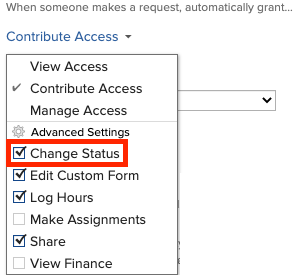

# Automatische Aktualisierung des Problemstatus von &quot;Warten auf Feedback&quot;auf &quot;In Bearbeitung&quot;

Wenn der Primäre Kontakt eines Problems das Problem aktualisiert, indem entweder ein Feld (einschließlich eines benutzerdefinierten Felds) aktualisiert oder ein Kommentar hinzugefügt wird, wird der Problemstatus automatisch in In Bearbeitung aktualisiert.

Damit diese automatische Statusänderung eintritt, ist Folgendes erforderlich:

* Das Problem muss über eine Anforderungswarteschlange eingegeben werden.

  Informationen zum Erstellen von Anforderungswarteschlangen finden Sie im Abschnitt [Erstellen und Verwalten von Anforderungswarteschlangen](../../../manage-work/requests/create-and-manage-request-queues/create-manage-request-queues.md) . Informationen zum Erstellen von Anforderungen finden Sie unter [Erstellen und Senden von Adobe Workfront-Anforderungen](../../../manage-work/requests/create-requests/create-submit-requests.md).

* Die Warteschlangendetails in der Anforderungswarteschlange müssen die folgenden Einstellungen aufweisen:
   * **Wenn jemand eine Anfrage sendet, wird automatisch &quot;grant**&quot;auf **Contribute Access** gesetzt
   * **Status ändern** ist unter Erweiterte Einstellungen ausgewählt.

  

  >[!IMPORTANT]
  >
  >  Beim Einrichten einer Anforderungswarteschlange können Sie festlegen, welche Hauptkontakte Zugriff auf die von ihnen gesendeten Probleme haben.
  >
  >Wenn Sie beim Einrichten der Anforderungswarteschlange die Option Status ändern deaktivieren, müssen Systemadministratoren immer Zugriff darauf haben, den Status von Problemen zu ändern, auch wenn die Option Status ändern in den Einstellungen der Anforderungswarteschlange deaktiviert ist.

  Weitere Informationen zu Warteschlangendetails finden Sie unter [Erstellen einer Anforderungswarteschlange](../../../manage-work/requests/create-and-manage-request-queues/create-request-queue.md).

* Das Problem muss sich im Status Auf Feedback warten befinden.
* Für Probleme auf Systemebene muss der Status Await Feedback (AWF) verfügbar sein.

  Weitere Informationen zu den Status auf Systemebene finden Sie unter [Erstellen oder Bearbeiten eines Status](../../../administration-and-setup/customize-workfront/creating-custom-status-and-priority-labels/create-or-edit-a-status.md).
