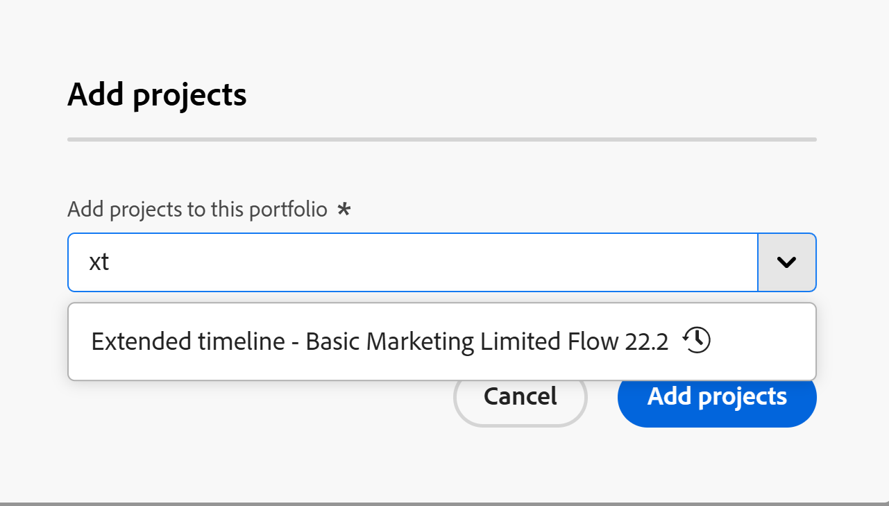

# Hinzufügen von Projekten zu einem Portfolio

<!--Audited: 08/2025-->

<!--
The highlighted information on this page refers to functionality not yet generally available. It is available only in the Preview environment for all customers. The same features will also be available in the Production environment for all customers after a week from the Preview release.    

For more information, see [Interface modernization](/help/quicksilver/product-announcements/product-releases/interface-modernization/interface-modernization.md). 
-->

Es wird empfohlen, Projekte zu Portfolios hinzuzufügen, wenn Sie sie initiieren. Sie können sie jedoch jederzeit während ihres Lebenszyklus zu einem Portfolio hinzufügen.

Beachten Sie beim Hinzufügen von Projekten zu Portfolios Folgendes:

* Sie können nur ein Portfolio mit einem Projekt verknüpfen.
* Ein Projekt verbleibt in einem Portfolio, bis es entfernt oder mit einem anderen Portfolio verknüpft wird.
* Ein Portfolio kann eine unbegrenzte Anzahl von Projekten enthalten.

>[!CAUTION]
>
>Vererbte Berechtigungen werden möglicherweise nicht korrekt angewendet, wenn sie für eine große Anzahl untergeordneter Objekte verwendet werden.
>   
>Um Probleme mit geerbten Berechtigungen zu vermeiden, empfehlen wir Folgendes:
>
>* Begrenzen Sie die Anzahl der untergeordneten Objekte (Projekte) unter einem einzelnen übergeordneten Element (Portfolio oder Programm). Pro Portfolio oder Programm empfehlen wir nicht mehr als 10.000 Projekte.
>
>* Verringern der Vererbungstiefe durch Anwenden von Berechtigungen auf ein Objekt auf niedrigerer Ebene.
>
>  Wenden Sie beispielsweise Berechtigungen direkt auf Projektebene an, anstatt sich auf die vom Portfolio geerbten Berechtigungen für das Programm und dann für das Projekt zu verlassen.
>
>* Teilen Sie Programme auf, um weniger Projekte zu enthalten, was die Komplexität der Berechtigungen verringert.
>

## Zugriffsanforderungen

+++ Erweitern, um die Zugriffsanforderungen für die in diesem Artikel beschriebene Funktionalität anzuzeigen. 

<table style="table-layout:auto"> 
 <col> 
 <col> 
 <tbody> 
  <tr> 
   <td role="rowheader">[!DNL Adobe Workfront] Packstück</td> 
   <td> 
Beliebig

   </td> 
  </tr> 
  <tr> 
   <td role="rowheader">[!DNL Adobe Workfront] Lizenz</td> 
   <td>
Standard
 
   
[!UICONTROL Plan] 
 </td> 
  </tr> 
  <tr> 
   <td role="rowheader">Konfiguration der Zugriffsebene</td> 
   <td> 
[!UICONTROL Bearbeiten] Zugriff auf Portfolios
 
[!UICONTROL Bearbeiten] Zugriff auf Projekte
 </td> 
  </tr> 
  <tr> 
   <td role="rowheader">Objektberechtigungen</td> 
   <td> 
[!UICONTROL Manage]-Berechtigungen für das Portfolio
 
[!UICONTROL Manage]-Berechtigungen für die Projekte
  </td> 
  </tr> 
 </tbody> 
</table>

*Weitere Informationen finden Sie unter [Zugriffsanforderungen in der Dokumentation zu Workfront](/help/quicksilver/administration-and-setup/add-users/access-levels-and-object-permissions/access-level-requirements-in-documentation.md).

+++

<!--
Old:

<table style="table-layout:auto"> 
 <col> 
 <col> 
 <tbody> 
  <tr> 
   <td role="rowheader">[!DNL Adobe Workfront] plan</td> 
   <td> 
Any

   </td> 
  </tr> 
  <tr> 
   <td role="rowheader">[!DNL Adobe Workfront] license*</td> 
   <td>
New: Standard
 
   
Current: [!UICONTROL Plan] 
 </td> 
  </tr> 
  <tr> 
   <td role="rowheader">Access level</td> 
   <td> 
[!UICONTROL Edit] access Portfolios
 
[!UICONTROL Edit] access to Projects
 </td> 
  </tr> 
  <tr> 
   <td role="rowheader">Object permissions</td> 
   <td> 
[!UICONTROL Manage] permissions to the portfolio
 
[!UICONTROL Manage] permissions to the projects
  </td> 
  </tr> 
 </tbody> 
</table>
-->

## Hinzufügen eines Projekts zu einem Portfolio

1. Gehen Sie zu einem Portfolio und klicken Sie **[!UICONTROL linken Bereich]** Projekte“.

   

1. Klicken Sie **[!UICONTROL Neues Projekt]** und wählen Sie eine Methode zum Hinzufügen eines Projekts aus.

   >[!TIP]
   >
   >Sie können kein Projekt hinzufügen, wenn Sie die Liste der Projekte in der Ansicht &quot;[!UICONTROL &quot; &#x200B;].

   Wählen Sie aus den folgenden Optionen aus:

   <table style="table-layout:auto"> 
    <col> 
    <col> 
    <tbody>

   <tr> 
      <td role="rowheader">[!UICONTROL Neues Projekt]</td> 
      <td> 
Ein neues Projekt hinzufügen. 
 
Weitere Informationen zum Erstellen eines Projekts finden Sie unter <a href="../../../manage-work/projects/create-projects/create-project.md" class="MCXref xref">Erstellen eines Projekts</a>. 
 </td> 
     </tr> 
     <tr> 
      <td role="rowheader">[!UICONTROL Neues Projekt (Legacy-Speicher)]</td> 
      <td> 
Fügen Sie ein neues Workfront-Speicherprojekt hinzu. 

      
Die Option wird nur angezeigt, wenn Ihr Unternehmen sowohl Workfront als auch Adobe Cloud Document Storage verwendet. Ihre Workfront-Instanz verfügt möglicherweise nicht über beide Speichertypen.

       
Weitere Informationen zum Erstellen eines Projekts finden Sie unter <a href="../../../manage-work/projects/create-projects/create-project.md" class="MCXref xref">Erstellen eines Projekts</a>. 
 </td> 
     </tr> 
     <tr> 
      <td role="rowheader">[!UICONTROL Neues Projekt aus Vorlage]</td> 
      <td> 
Ein neues Projekt mithilfe einer vorhandenen Vorlage hinzufügen. 
 
Weitere Informationen zum Erstellen eines Projekts über eine Vorlage finden Sie unter <a href="../../../manage-work/projects/create-projects/create-project-from-template.md" class="MCXref xref">Erstellen eines Projekts über eine Vorlage</a>.
 </td> 
     </tr> 
     <tr> 
      <td role="rowheader">[!UICONTROL Import [!DNL MS Project]] </td> 
      <td> 
Fügen Sie ein Projekt hinzu, das Sie zuvor aus [!DNL MS Project] exportiert und auf Ihrem Computer gespeichert haben. 
 
Weitere Informationen zum Erstellen eines neuen Projekts durch Importieren aus [!DNL Microsoft Project] finden Sie unter <a href="../../../manage-work/projects/create-projects/import-project-from-ms-project.md" class="MCXref xref">Projekt aus [!DNL Microsoft Project]</a> importieren.
 </td> 
     </tr> 
     <tr> 
      <td role="rowheader">[!UICONTROL -Anforderungsprojekt]</td> 
      <td> 
Fordern Sie die Genehmigung eines Projekts an.
 
Informationen zum Anfordern von Projekten finden Sie unter <a href="../../../manage-work/projects/create-projects/request-project.md">Anfordern eines Projekts</a>. 
 </td> 
     </tr> 
          <tr> 
      <td role="rowheader">[!UICONTROL Vorhandenes Projekt]</td> 
      <td> 
Ein bereits erstelltes Projekt hinzufügen.
 </td> 
     </tr>
    </tbody> 
   </table>

   <!-- update screen shot for both kinds of storages??-->

   

1. (Bedingt) Wenn Sie ein vorhandenes Projekt hinzufügen möchten, wird das Feld **Projekte hinzufügen** geöffnet. <!--check this after UI changes-->

    <!--check this after UI changes-->

1. Geben Sie den Namen eines Projekts in das Feld **[!UICONTROL Projekte zu diesem Portfolio hinzufügen]** ein und klicken Sie darauf, wenn sie in der Liste angezeigt werden.  <!--check this after UI changes-->

   Sie können mehr als ein Projekt hinzufügen.

   >[!NOTE]
   >
   >Wenn Ihr Unternehmen sowohl den veralteten Workfront- als auch den Adobe-Cloud-Speicher für Dokumente verwendet, gibt es die folgenden Szenarien:
   >
   >
   >* Sie können kein Legacy-Speicherprojekt zu einem Adobe Cloud-Speicherportfolio hinzufügen oder ein Adobe Cloud-Speicherprojekt zu einem Legacy-Speicherportfolio hinzufügen.
   >* Sie können kein Projekt aus einer Adobe Cloud-Speichervorlage in einem Legacy-Speicherportfolio erstellen.
   >* Sie können ein Projekt aus einer Legacy-Speichervorlage in einem Adobe Cloud-Speicherportfolio erstellen, die Dokumente und Ordner in der Vorlage werden jedoch nicht zum neuen Projekt hinzugefügt. Das Projekt erhält Adobe Cloud-Speicher.
   >
   >Weitere Informationen finden Sie unter [Übersicht über das Dokumentenmanagement für Projekte und verwandte Objekte](/help/quicksilver/manage-work/projects/manage-projects/manage-documents-on-projects.md).
   >
   >Nicht alle Workfront-Instanzen verfügen über beide Arten von Dokumentspeichern.

1. (Optional) Klicken Sie auf das **X**-Symbol rechts neben dem Projektnamen, um es aus der Liste zu entfernen, wenn Sie es nicht zum Portfolio hinzufügen möchten.

   <!--replace last step with this, for unshim: 1. (Optional) Click the **Delete** icon  next to the name of a project if you decide not to add it to the portfolio.-->

1. Klicken Sie **[!UICONTROL Projekte hinzufügen]**. <!--check this after UI changes-->

   Das bzw. die ausgewählte(n) Projekt(e) sind nun mit dem Portfolio verknüpft.
