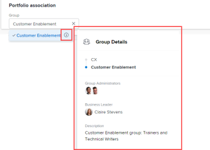

# Erstellen eines Portfolios

Ein Portfolio ist eine Sammlung von Projekten, die für dieselben Ressourcen, Budgets und Zeitpläne konkurrieren. Die Projekte in einem Portfolio sind so ähnlich, dass sie denselben Ressourcenpool verwenden und mit derselben Scorecard gemessen werden.

Sie können Portfolios verwenden, um Projekte zu gruppieren, die zu denselben Produktlinien, Geschäftsbereichen, Abteilungen, Unternehmen oder anderen Geschäftsbereichen gehören.

## Zugriffsanforderungen

Sie müssen über folgenden Zugriff verfügen, um die Schritte in diesem Artikel ausführen zu können:

<table style="table-layout:auto"> 
 <col> 
 <col> 
 <tbody> 
  <tr> 
   <td role="rowheader">[!DNL Adobe Workfront] Plan*</td> 
   <td> 
[!UICONTROL Business] oder höher
 </td> 
  </tr> 
  <tr> 
   <td role="rowheader">[!DNL Adobe Workfront] license*</td> 
   <td> 
[!UICONTROL Plan] 
 </td> 
  </tr> 
  <tr> 
   <td role="rowheader">Konfigurationen auf Zugriffsebene*</td> 
   <td> 
[!UICONTROL Zugriff auf Portfolios bearbeiten
 
Hinweis: Wenn Sie noch keinen Zugriff haben, fragen Sie Ihren [!DNL Workfront] Administrator , wenn sie zusätzliche Einschränkungen für Ihre Zugriffsebene festlegen. Für Informationen zur [!DNL Workfront] Administratoren können die Zugriffsebene ändern, siehe <a href="../../../administration-and-setup/add-users/configure-and-grant-access/create-modify-access-levels.md" class="MCXref xref">Benutzerdefinierte Zugriffsebenen erstellen oder ändern</a>.
 </td> 
  </tr> 
  <tr> 
   <td role="rowheader">Objektberechtigungen</td> 
   <td> 
Nachdem Sie ein Portfolio erstellt haben, verfügen Sie standardmäßig über Verwaltungsberechtigungen
 
Informationen zum Anfordern von zusätzlichem Zugriff finden Sie unter <a href="../../../workfront-basics/grant-and-request-access-to-objects/request-access.md" class="MCXref xref">Zugriff auf Objekte anfordern </a>.
 </td> 
  </tr> 
 </tbody> 
</table>

&#42;Wenden Sie sich an Ihren [!DNL Workfront] Administrator.

## Erstellen eines Portfolios

1. Klicken Sie auf **[!UICONTROL Hauptmenü]** icon  in der rechten oberen Ecke von Adobe Workfront.

1. Klicken **[!UICONTROL Portfolios]**.
1. Klicken **[!UICONTROL Neues Portfolio]**.
1. Ersetzen **[!UICONTROL Unbenanntes Portfolio]** mit dem Namen, den Sie für das Portfolio benötigen.

   Der Name kann bis zu 255 Zeichen enthalten.

1. (Optional) Klicken Sie auf den Namen unter **[!UICONTROL Portfolio Manager]** in der Kopfzeile am oberen Seitenrand, um einen anderen Manager für das Portfolio zuzuweisen.

   

   Als Ersteller des Portfolios werden Sie standardmäßig als Portfolioverwalter zugewiesen.

1. Klicken **[!UICONTROL Portfolio-Details]** im linken Bereich.
1. Im **[!UICONTROL Übersicht]** ändern Sie eine der folgenden Informationen:

   <table style="table-layout:auto"> 
    <col> 
    <col> 
    <tbody> 
     <tr> 
      <td role="rowheader">[!UICONTROL Beschreibung]</td> 
      <td> 
Geben Sie eine Beschreibung für das Portfolio ein, um anzugeben, was eindeutig ist. 
 </td> 
     </tr> 
     <tr> 
      <td role="rowheader">[!UICONTROL Portfolio Manager]</td> 
      <td> 
Beginnen Sie mit der Eingabe des Namens eines Benutzers, den Sie als Portfolio-Manager angeben möchten, und wählen Sie ihn aus, wenn er in der Liste angezeigt wird. Dies entspricht dem [!UICONTROL Portfolio Owner]. Diese Person kann die in den Projekten des Portfolios definierten Arbeiten überwachen und den Geschäftsfall genehmigen.
 
Wichtig: Wenn Sie jemanden als [!UICONTROL Portfolio Manager] festlegen, erhält er automatisch [!UICONTROL Manager]-Berechtigungen für das Portfolio, die Programme und die  im Portfolio. 
 
Tipp: Sie können auch den [!UICONTROL Portfolio Manager] in der Kopfzeile oben auf der Seite aktualisieren.
 </td> 
     </tr> 
     <tr data-mc-conditions=""> 
      <td role="rowheader">Gruppe </td> 
      <td> 
Fügen Sie den Namen einer einzelnen Gruppe hinzu, wenn die Gruppe Eigentümer des Portfolios ist oder für dessen Abschluss verantwortlich ist. 
 
Sie können sicherstellen, dass Sie die richtige Gruppe auswählen, indem Sie den Mauszeiger darüber bewegen und auf das Symbol [!UICONTROL Information] klicken  , das daneben angezeigt wird. Dadurch wird eine QuickInfo mit Informationen zur Gruppe angezeigt, z. B. die Hierarchie der Gruppen darüber und deren Administratoren.
 
  
 </td> 
     </tr> 
    </tbody> 
   </table>

1. (Optional) Klicken Sie in die **[!UICONTROL Benutzerdefiniertes Formular hinzufügen]** in der oberen rechten Ecke des [!UICONTROL Portfolio-Details] Seite, um ein benutzerdefiniertes Formular für das Portfolio auszuwählen und die benutzerdefinierten Felder zu aktualisieren.

   >[!TIP]
   >
   >Sie müssen bereits benutzerdefinierte Portfolio-Formulare erstellt haben, bevor Sie sie an Portfolios anhängen können.

1. Klicken **[!UICONTROL Änderungen speichern]**.
1. (Optional) Klicken Sie auf **[!UICONTROL Programme]** im linken Bereich, dann **[!UICONTROL Programme hinzufügen]** , um dem Portfolio Programme hinzuzufügen.

   Weitere Informationen zum Erstellen von Programmen finden Sie unter [Programm erstellen](../../../manage-work/portfolios/create-and-manage-programs/create-program.md).

1. (Optional) Klicken Sie auf **[!UICONTROL Projekte]** im linken Bereich, dann **[!UICONTROL Projekte hinzufügen]** , um Projekte zum Portfolio hinzuzufügen.

   Weitere Informationen zum Hinzufügen von Projekten zu einem Portfolio finden Sie unter [Hinzufügen von Projekten zu einem Portfolio](../../../manage-work/portfolios/create-and-manage-portfolios/add-projects-to-portfolios.md).

<!--

<h2>Deactivate a portfolio</h2>

(NOTE: drafted this and moved it to their own article: delete-deactivate-portfolios)

When you deactivate a portfolio, you can still access it from the Portfolios area, but it no longer displays in the list of portfolios when users try to add it to a project.

<ol>
<li value="1">Click the <strong>Main Menu</strong> icon  in the upper-right corner of Adobe Workfront.</li>
<li value="2">Click <strong>Portfolios</strong> .</li>
<li value="3"> 
Click the name of the portfolio.
 </li>
<li value="4" data-mc-conditions="QuicksilverOrClassic.Quicksilver">Click the More menu  to the right of the portfolio name, then click <strong>Deactivate Portfolio</strong>.</li>
</ol>
<h2>Delete a portfolio</h2>
<ol>
<li value="1">Click the <strong>Main Menu</strong> icon  in the upper-right corner of Adobe Workfront.</li>
<li value="2"> 
Click <strong>Portfolios</strong> .
 </li>
<li value="3"> 
Select the portfolio, then click the Delete icon .
 </li>
<li value="4"> 
In the box that appears, click <strong>Yes, Delete It</strong> to confirm.
 </li>
</ol>

-->
