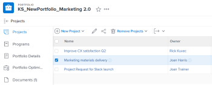

# Entfernen eines Projekts aus einem Portfolio

<!--Audited: 7/2024-->

Sie können ein Projekt aus einem Portfolio entfernen und es mit einem anderen Portfolio verknüpfen oder die Verknüpfung zwischen einem Projekt und einem Portfolio vollständig entfernen.

Sie können auch Projekte aus einem Portfolio löschen, wodurch sie auch aus [!DNL Adobe Workfront] entfernt werden.

## Zugriffsanforderungen

+++ Erweitern Sie , um die Zugriffsanforderungen für die -Funktion in diesem Artikel anzuzeigen.

<table style="table-layout:auto"> 
 <col> 
 <col> 
 <tbody> 
  <tr> 
   <td role="rowheader">[!DNL Adobe Workfront] Plan</td> 
   <td> 
Beliebig
 </td> 
  </tr> 
  <tr> 
   <td role="rowheader">[!DNL Adobe Workfront] Lizenz*</td> 
   <td> 
Neu: Standard

   
Aktuell: [!UICONTROL Plan] 
 </td> 
  </tr> 
  <tr> 
   <td role="rowheader">Zugriffsebene</td> 
   <td> 
[!UICONTROL Bearbeiten] Zugriff auf Projekte
 
[!UICONTROL Bearbeiten] Zugriff auf Portfolios
  </td> 
  </tr> 
  <tr> 
   <td role="rowheader">Objektberechtigungen</td> 
   <td> 
[!UICONTROL Manage]-Berechtigungen für das Portfolio und die zu entfernenden Projekte

   
[!UICONTROL Manage]-Berechtigungen mit [!UICONTROL Delete]-Zugriff auf die Projekte, um sie aus dem Portfolio zu löschen
 </td> 
  </tr> 
 </tbody> 
</table>

*Weitere Informationen finden Sie unter [Zugriffsanforderungen in der Dokumentation zu Workfront](/help/quicksilver/administration-and-setup/add-users/access-levels-and-object-permissions/access-level-requirements-in-documentation.md).

+++

## Entfernen eines Projekts aus einem Portfolio

1. Wechseln Sie zu einem Portfolio und klicken **[!UICONTROL im]** Bereich auf „Projekte“.
1. Wählen Sie das zu entfernende Projekt. 

   

1. Klicken Sie **[!UICONTROL Projekte entfernen]**.
1. Klicken Sie entweder **[!UICONTROL Löschen]**, um das Projekt aus [!DNL Workfront] zu löschen, oder **[!UICONTROL Entfernen]****[!UICONTROL aus dem Portfolio]**, um es aus dem ausgewählten Portfolio zu entfernen.

1. (Optional und bedingt) Suchen Sie das Projekt, das Sie aus dem Portfolio entfernt haben, und verknüpfen Sie es mit einem anderen Portfolio. Informationen zum Verknüpfen von Projekten mit Portfolios finden Sie [Hinzufügen von Projekten zu einem Portfolio](../../../manage-work/portfolios/create-and-manage-portfolios/add-projects-to-portfolios.md).
