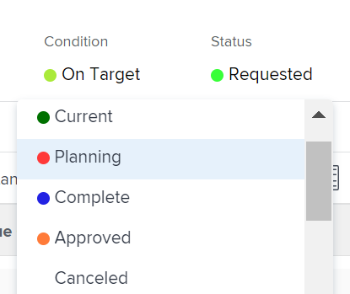

# Überprüfen angeforderter Projekte

Wenn mehrere Projektanforderungen zur Überprüfung eingereicht werden, kann das Projekt-Management-Büro oder der Portfolio-Ausschuss zusammentreten, um die eingereichten Anfragen zu überprüfen und die Projektanforderungsgenehmigungen zu bestimmen. Projektanforderungen werden als Projekte mit dem Status [!UICONTROL Angefordert] in [!DNL Adobe Workfront] angezeigt.

Sie können eine Projektanforderung zur Überprüfung senden, indem Sie einen der folgenden Schritte ausführen:

* Ändern Sie den Projektstatus in &quot;**[!UICONTROL Angefordert]**&quot;.
* Vervollständigen Sie den [!UICONTROL Geschäftsfall] des Projekts und senden Sie ihn zur Genehmigung.\
   Weitere Informationen zum Abschließen eines Geschäftsszenarios für ein Projekt finden Sie unter [Erstellen eines Geschäftsszenarios für ein Projekt](../../../manage-work/projects/define-a-business-case/create-business-case.md).

Sie können die angeforderten Projekte in den folgenden Bereichen von [!DNL Adobe Workfront] überprüfen:

* In einem Projektbericht
* Innerhalb eines Portfolios

## Zugriffsanforderungen

+++ Erweitern Sie , um die Zugriffsanforderungen für die Funktionalität in diesem Artikel anzuzeigen.

Sie müssen über folgenden Zugriff verfügen, um die Schritte in diesem Artikel ausführen zu können:

<table style="table-layout:auto"> 
 <col> 
 <col> 
 <tbody> 
  <tr> 
   <td role="rowheader">[!DNL Adobe Workfront] Plan</td> 
   <td>
Alle
 </td> 
  </tr> 
  <tr> 
   <td role="rowheader">[!DNL Adobe Workfront] license*</td> 
   <td> 
[!UICONTROL Plan] 
 </td> 
  </tr> 
  <tr> 
   <td role="rowheader">Konfigurationen auf Zugriffsebene</td> 
   <td> 
Zugriff auf Portfolios in der [!UICONTROL Ansicht] oder höher
 
[!UICONTROL Zugriff auf Projekte bearbeiten
  </td> 
  </tr> 
  <tr> 
   <td role="rowheader">Objektberechtigungen</td> 
   <td> 
[!UICONTROL View] Berechtigungen oder höher für das Portfolio
 
[!UICONTROL Verwalten] Berechtigungen für Projekte zum Aktualisieren ihres Status
  </td> 
  </tr> 
 </tbody> 
</table>

*Weitere Informationen finden Sie unter [Zugriffsanforderungen in der Workfront-Dokumentation](/help/quicksilver/administration-and-setup/add-users/access-levels-and-object-permissions/access-level-requirements-in-documentation.md).

+++

## Überprüfen angeforderter Projekte in einem Projektbericht

Sie können einen Bericht für Projekte erstellen, um zu sehen, welche Projekte den Status &quot;[!UICONTROL Angefordert]&quot;haben.

Weitere Informationen zum Genehmigen von Projektanforderungen durch Erstellen eines Projektberichts finden Sie im Abschnitt [[!UICONTROL Genehmigen des Geschäftsfalls durch Erstellen eines Projektberichts]](../../../manage-work/projects/define-a-business-case/approve-business-case.md#build-a-report) in [Geschäftsszenario genehmigen](../../../manage-work/projects/define-a-business-case/approve-business-case.md). 

## Überprüfen angeforderter Projekte in einem Portfolio

1. Gehen Sie zum Portfolio, dessen angeforderte Projekte Sie überprüfen möchten.
1. Klicken Sie im linken Bereich auf &#x200B;**[!UICONTROL Projekte]**
1. Wählen Sie aus dem Dropdownmenü **[!UICONTROL Filter]** die Option **[!UICONTROL Angefordert]** aus.

   In der Liste werden nur Projekte mit dem Status &quot;**[!UICONTROL Angefordert]**&quot;angezeigt.

   >[!TIP]
   >
   > Zusätzlich zum Status &quot;**[!UICONTROL Angefordert]**&quot; müssen Projekte mit dem ausgewählten Portfolio verknüpft sein, das in dieser Liste angezeigt werden soll.

1. Klicken Sie in der Liste auf den Namen eines Projekts, um es zu öffnen.
1. Klicken Sie im linken Bereich auf **[!UICONTROL Projektdetails]** .
1. Führen Sie einen der folgenden Schritte aus:

   * Klicken Sie auf **[!UICONTROL Geschäftsszenario]** und dann auf **[!UICONTROL Genehmigen]** oder **[!UICONTROL Ablehnen]** im Bereich [!UICONTROL Zusammenfassung der Geschäftsszenarios] , um den Geschäftsszenario zu genehmigen oder abzulehnen.

     

     Der Projektstatus wird in &quot;**[!UICONTROL Genehmigt]**&quot; geändert, wenn der Geschäftsfall genehmigt wurde.

     Der Projektstatus wird in **[!UICONTROL Abgelehnt]** geändert, wenn der Geschäftsfall abgelehnt wird.

     >[!NOTE]
     >
     >Es gibt keine Benachrichtigungen, die den Benutzer, der die Genehmigung des Geschäftsfalls eingereicht hat, darauf hinweisen, ob seine Projektanfrage genehmigt oder abgelehnt wurde. 

     Oder

   * Ändern Sie den Status des Projekts in einen anderen Status im Dropdown-Menü **[!UICONTROL Status]** .

     
 

 
