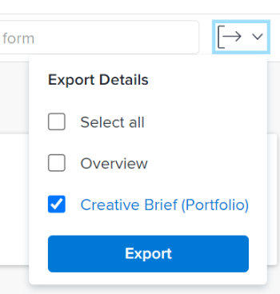

# Bearbeiten von Programmen

Sie können Informationen zu Programmen bearbeiten, die Sie erstellt haben oder die andere Benutzer erstellt haben, wenn sie sie für Sie freigegeben haben.

Sie können ein Programm auf der Programmseite bearbeiten oder Programme in einer Liste bearbeiten.

## Zugriffsanforderungen

Sie müssen über folgenden Zugriff verfügen, um die Schritte in diesem Artikel ausführen zu können:

<table style="table-layout:auto"> 
 <col> 
 <col> 
 <tbody> 
  <tr> 
   <td role="rowheader">[!DNL Adobe Workfront] plan*</td> 
   <td> 
Alle
 </td> 
  </tr> 
  <tr> 
   <td role="rowheader">[!DNL Adobe Workfront] license*</td> 
   <td> 
[!UICONTROL Plan] 
 </td> 
  </tr> 
  <tr> 
   <td role="rowheader">Zugriffsstufe*</td> 
   <td> 
[!UICONTROL Zugriff auf Programme bearbeiten
 
Hinweis: Wenn Sie immer noch keinen Zugriff haben, fragen Sie Ihren [!DNL Workfront] -Administrator, ob er zusätzliche Zugriffsbeschränkungen für Ihre Zugriffsebene festlegt. Informationen zum Zugriff auf Programme in Ihrer Zugriffsebene finden Sie unter <a href="../../../administration-and-setup/add-users/configure-and-grant-access/grant-access-programs.md" class="MCXref xref">Zugriff auf Programme gewähren</a>. Informationen dazu, wie ein [!DNL Workfront] -Administrator Ihre Zugriffsebene ändern kann, finden Sie unter <a href="../../../administration-and-setup/add-users/configure-and-grant-access/create-modify-access-levels.md" class="MCXref xref">Benutzerdefinierte Zugriffsebenen erstellen oder ändern</a>. 
 </td> 
  </tr> 
  <tr> 
   <td role="rowheader">Objektberechtigungen</td> 
   <td> 
[!UICONTROL Berechtigungen für ein Programm verwalten
 
 Informationen zum Gewähren von Berechtigungen für Programme finden Sie unter <a href="../../../workfront-basics/grant-and-request-access-to-objects/share-a-program.md" class="MCXref xref">Programm freigeben </a>. 
 
Informationen zum Anfordern zusätzlicher Berechtigungen finden Sie unter <a href="../../../workfront-basics/grant-and-request-access-to-objects/request-access.md" class="MCXref xref">Anfordern des Zugriffs auf Objekte </a>.
 </td> 
  </tr> 
 </tbody> 
</table>

&#42;Wenden Sie sich an Ihren [!DNL Workfront] -Administrator, um zu erfahren, welchen Plan, welchen Lizenztyp oder welchen Zugriff Sie haben.

## Bearbeiten von Programmen

1. Wechseln Sie zum **[!UICONTROL Hauptmenü]**.
1. Klicken Sie auf **[!UICONTROL Programme]** und dann auf den Namen eines Programms, um es zu öffnen.

   >[!TIP]
   >
   >Sie können auf ein Programm aus dem Portfolio zugreifen, mit dem es verknüpft ist, indem Sie zuerst zum Portfolio gehen und dann im linken Bereich auf **[!UICONTROL Programme]** klicken. Weitere Informationen finden Sie unter [Programm erstellen](../../../manage-work/portfolios/create-and-manage-programs/create-program.md).

1. (Optional) Um eingeschränkte Informationen zum Programm zu bearbeiten, klicken Sie im linken Bereich auf **[!UICONTROL Programmdetails]** .

   >[!TIP]
   >
   >Wenn Sie alle Informationen zum Programm bearbeiten möchten, gehen Sie zu Schritt 4.

   

   >[!NOTE]
   >
   >Je nachdem, wie Ihr [!DNL Workfront] -Administrator oder Gruppenadministrator Ihre Layout-Vorlage geändert hat, werden die Felder im Bereich [!UICONTROL Programmdetails] möglicherweise neu angeordnet oder nicht angezeigt. Weitere Informationen finden Sie unter [Anpassen der Ansicht [!UICONTROL Details] mithilfe einer Layoutvorlage](../../../administration-and-setup/customize-workfront/use-layout-templates/customize-details-view-layout-template.md).

   <!--
   
(NOTE: the above note will also come to the Edit Program box)

   -->

   Gehen Sie wie folgt vor, um Informationen im Abschnitt [!UICONTROL Details] zu bearbeiten:

   1. (Optional) Klicken Sie oben rechts auf das Symbol **[!UICONTROL Alle reduzieren]** , um alle Bereiche zu reduzieren.
   1. (Optional und bedingt) Wenn ein Bereich ausgeblendet wird, klicken Sie neben jedem Bereich auf den Pfeil **rechts zeigen**  , um den zu bearbeitenden Bereich zu erweitern.
   1. Informationen zu den im Abschnitt [!UICONTROL Programmdetails] sichtbaren Feldern erhalten Sie, wenn Sie das Programm im Feld [!UICONTROL Programm bearbeiten] bearbeiten, wie unten beschrieben.
   1. (Optional) Wenn dem Programm keine benutzerdefinierten Formulare angehängt sind, geben Sie den Namen eines Formulars in das Feld **[!UICONTROL Benutzerdefiniertes Formular hinzufügen]** ein, wählen Sie es aus, wenn es in der Liste angezeigt wird, und klicken Sie dann auf **[!UICONTROL Änderungen speichern]**.
   1. (Optional) Klicken Sie auf das Symbol **[!UICONTROL Exportieren]** , um die [!UICONTROL Übersicht] und die benutzerdefinierten Formulardaten in eine PDF-Datei zu exportieren, und klicken Sie dann auf **[!UICONTROL Exportieren]**. Wählen Sie aus den folgenden Optionen aus:

      * Alle auswählen (wird nur angezeigt, wenn mindestens ein benutzerdefiniertes Formular angehängt ist)
      * [!UICONTROL Überblick]
      * Der Name eines oder mehrerer benutzerdefinierter Formulare

      Die PDF-Datei wird auf Ihren Computer heruntergeladen.

      

      Weitere Informationen finden Sie unter [Exportieren benutzerdefinierter Formulare und Objektdetails](../../../workfront-basics/work-with-custom-forms/export-custom-forms-details.md).

1. Um alle Informationen über ein oder mehrere Programme zu bearbeiten, führen Sie einen der folgenden Schritte aus:

   * Klicken Sie auf das Menü **[!UICONTROL Mehr]** neben dem Programmnamen und dann &#x200B;**[!UICONTROL Bearbeiten].**
   * Markieren Sie eine Programmliste und wählen Sie ein oder mehrere Programme aus, die Sie bearbeiten möchten. Klicken Sie dann oben in der Liste auf das Symbol **[!UICONTROL Bearbeiten]**  .

   Das Dialogfeld **[!UICONTROL Programm bearbeiten]** wird angezeigt.

   

   Alle Programmfelder sind im Feld [!UICONTROL Programm bearbeiten] verfügbar und werden nach den im linken Bereich aufgelisteten Bereichen gruppiert.

1. Ziehen Sie in Erwägung, Informationen in einem der folgenden Abschnitte anzugeben:

   * [[!UICONTROL Überblick]](#overview)
   * [[!UICONTROL Benutzerdefinierte Formulare]](#Custom%C2%A0F)
   * [[!UICONTROL Kommentar]](#comment)

### [!UICONTROL Überblick] {#overview}

1. Beginnen Sie mit der Bearbeitung eines Programms wie oben beschrieben.
1. Klicken Sie auf **[!UICONTROL Überblick]** und geben Sie die folgenden Felder an:

   <!--
   
(NOTE:&nbsp;note below drafted for now)

   -->

   <!--
   <note type="note">
   Depending on how your Workfront administrator or Group administrator sets up our Layout Template, the fields in the Edit Program box might be rearranged or not display. For information, see
   <a href="../../../administration-and-setup/customize-workfront/use-layout-templates/customize-details-view-layout-template.md" class="MCXref xref">Customize the Details view using a layout template</a>.
   </note>
   -->

   <table style="table-layout:auto"> 
    <col> 
    <col> 
    <tbody> 
     <tr> 
      <td role="rowheader">[!UICONTROL Name]</td> 
      <td> 
Aktualisieren Sie den Programmnamen. 
 
Tipp: Diese Option ist nicht verfügbar, wenn Sie mehrere Programme ausgewählt haben. 
 </td> 
     </tr> 
     <tr> 
      <td role="rowheader">[!UICONTROL Beschreibung]</td> 
      <td> 
Geben Sie eine Beschreibung für das Portfolio ein, um anzugeben, was eindeutig ist. 
 </td> 
     </tr> 
     <tr> 
      <td role="rowheader">[!UICONTROL Programm-Manager]</td> 
      <td> 
Geben Sie den Namen eines Benutzers ein, den Sie als Programmmanager angeben möchten, und wählen Sie ihn dann aus, wenn er in der Liste angezeigt wird. Diese Person kann die in den Projekten des Programms definierten Arbeiten überwachen. 
 
Wichtig: Wenn Sie jemanden zum Programm-Manager bestimmen, erhält er automatisch [!UICONTROL Manager]-Berechtigungen für das Programm und die Projekte im Programm. 
 
Tipp: Sie können den Programm-Manager schnell in der Programmkopfzeile aktualisieren. 
 </td> 
     </tr> 
     <tr> 
      <td role="rowheader">[!UICONTROL Group]</td> 
      <td> 
Fügen Sie den Namen einer einzelnen Gruppe hinzu, wenn die Gruppe mit dem Programm verknüpft ist oder für dessen Abschluss verantwortlich ist. 
 
Tipp:  
Gehen Sie beim Zugriff auf das Feld [!UICONTROL Group] über die Seite [!UICONTROL Programmdetails] wie folgt vor: 
 
Sie können sicherstellen, dass Sie die richtige Gruppe auswählen, indem Sie den Mauszeiger darüber bewegen und auf das [!UICONTROL Informationssymbol]  klicken, das daneben angezeigt wird. Dadurch wird eine QuickInfo mit Informationen zur Gruppe angezeigt, z. B. die Hierarchie der Gruppen darüber und deren Administratoren.
 
  
 
Diese Option ist nicht im Feld [!UICONTROL Programm bearbeiten] verfügbar. 
 
 </td> 
     </tr> 
     <tr> 
      <td role="rowheader">[!UICONTROL ist aktiv]</td> 
      <td> 
 Aktivieren Sie dieses Kontrollkästchen, wenn das Programm aktiv sein soll. Andere Benutzer können aktive Programme finden und an Projekte anhängen oder sie zu Portfolios hinzufügen. Inaktive Programme können nicht an Projekte oder Portfolios angehängt werden. Dies ist standardmäßig aktiviert.
 </td> 
     </tr> 
    </tbody> 
   </table>

1. Klicken Sie auf **[!UICONTROL Änderungen speichern]** oder fahren Sie mit der Bearbeitung der folgenden Abschnitte fort.

### [!UICONTROL Benutzerdefinierte Formulare]

1. Beginnen Sie mit der Bearbeitung des Programms wie oben beschrieben.
1. Klicken Sie auf das Dropdown-Menü **[!UICONTROL Forms hinzufügen]** , um ein benutzerdefiniertes Formular auszuwählen und es zum Programm hinzuzufügen.

   Sie müssen benutzerdefinierte Programmformulare erstellen, bevor sie hinzugefügt werden können.

   >[!NOTE]
   >
   >Je nachdem, wie Ihr [!DNL Workfront] -Administrator die Berechtigungen für die Abschnitte in Ihrem benutzerdefinierten Formular festlegt, können nicht alle die gleichen Felder in einem bestimmten benutzerdefinierten Formular anzeigen oder bearbeiten. Die Berechtigungen zum Bearbeiten von Feldern in einem Abschnitt eines benutzerdefinierten Formulars hängen von den Berechtigungen ab, die Sie für das Programm selbst haben. Informationen zum Festlegen von Berechtigungen für Abschnitte eines benutzerdefinierten Formulars finden Sie unter [Erstellen oder Bearbeiten eines benutzerdefinierten Formulars](../../../administration-and-setup/customize-workfront/create-manage-custom-forms/create-or-edit-a-custom-form.md).

1. Aktualisieren Sie alle Felder in den benutzerdefinierten Formularen und klicken Sie dann auf **[!UICONTROL Änderungen speichern]** oder fahren Sie mit dem folgenden Abschnitt fort.

### [!UICONTROL Kommentar] {#comment}

1. Beginnen Sie mit der Bearbeitung eines Programms wie oben beschrieben.
1. Klicken Sie auf **[!UICONTROL Kommentar]**.

   

1. Fügen Sie im Feld **[!UICONTROL Post einen Kommentar hinzu und aktualisieren Sie das Programmfeld]**.
1. (Optional) Klicken Sie auf das Symbol **[!UICONTROL Personen]** , um dem Kommentar einen Benutzer oder ein Team hinzuzufügen.
1. (Optional) Klicken Sie auf das Symbol **[!UICONTROL Sperren]** , um den Kommentar zu sperren und ihn nur für Benutzer in Ihrem Unternehmen privat zu machen.

   Nachdem Sie Ihre Änderungen gespeichert haben, wird der hinzugefügte Kommentar auf der Registerkarte [!UICONTROL Aktualisierungen] des Programms angezeigt und eine E-Mail an die darin enthaltenen Benutzer gesendet.
